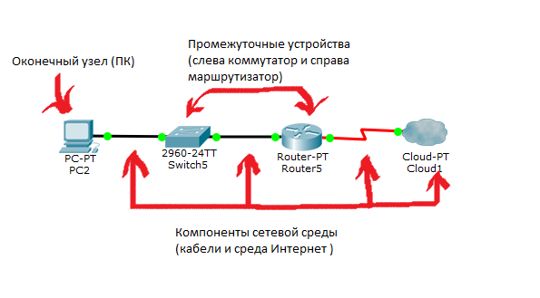
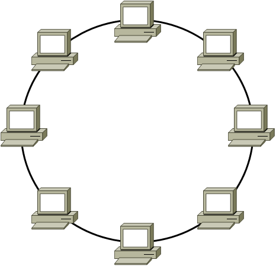
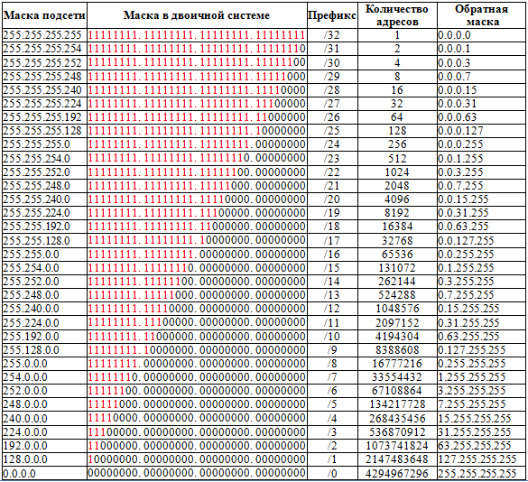

# Компьютерные сети


## Введение в специальность
- **Эникей** — начинающий системный администратор, который выполняет базовые функции по настройке оборудования и программного обеспечения. Обычно помощник старшего сисадмина или админ в небольшой неайтишной компании, который закрывает текущие инциденты.
- **Системный администратор** — специалист широкого профиля, который отвечает за стабильное и безотказное функционирование ИТ-инфраструктуры, осуществляет мониторинг, проводит инвентаризацию, отвечает за безопасность пользователей, занимается сетями и т.д. Это многорукий и многоголовый бог ИТ-инфраструктуры, который берёт на себя обязанности по обеспечению всей ИТ-жизнедеятельности компании. Встречается практически в любых компаниях.
- **Системный архитектор-инженер** — специалист, проектирующий ИТ-инфраструктуру и архитектуру сети в крупных корпорациях.
- **Сетевой администратор** — специалист, который занимается настройкой и развитием физических и логических сетей в компании, а также управлением системами биллинга, учёта и контроля трафика. Востребован в ЦОДах, телекоме, банках, корпорациях.
Инженер информационной безопасности — специалист, который обеспечивает безопасность ИТ-инфраструктуры на всех уровнях. Востребован в компаниях, чувствительных к атакам и проникновению в сеть (а это и финтех, и банки, и промышленность, и проч.).

***
Требования к системному администратору отличаются от компании к компании (кому-то нужно владение 1С, 1С-Битрикс, Kubernetes, определённой СУБД и т.д.), но есть несколько базовых требований, которые, скорее всего, понадобятся в любой компании. 

- Знание и понимание сетевой модели OSI, основных протоколов.
- Администрирование операционной системы Windows и/или Unix, включая групповые политики, управление - безопасностью, создание пользователей, удалённый доступ, работу с командной строкой и многое другое.
- Скриптинг bash, PowerShell, который позволяет автоматизировать и оптимизировать рутинные задачи - системного администрирования. 
- Ремонт и обслуживание ПК, серверного оборудования и периферии.
- Работа с настройкой и маршрутизацией компьютерных сетей.
- Работа с почтовыми серверами и серверами телефонии.
- Установка офисных программ и приложений.
- Сетевой и инфраструктурный мониторинг.
- Необходимость знания инстранных языков.
***
###Будущее сисадмина


<!--  -->
- DevOps или DevSecOps — специализация на стыке разработки, администрирования и безопасности. На данный момент внимание к DevOps только растёт и этот тренд продолжится, развиваясь в сторону контейнеризации, нагруженных приложений и систем, микросервисной архитектуры и т.д. Изучайте всё это, пока это выглядит как наиболее приоритетное будущее. 
- Информационная безопасность — ещё одно направление развития. Если раньше инфобезопасники были только в телекоме и банках, то сегодня они нужны практически в любой ИТ-компании. Сфера непростая, потребует знаний в разработке, системах взлома и защиты, — это гораздо глубже, чем установить антивирус и настроить файервол. И, кстати, для инфобеза есть отдельные специальности в вузах, поэтому если вы в начале пути, можно сразу поступать по профилю, а если «старичок», то можно рассмотреть магистратуру для углубления знаний и наличия диплома.
- CTO, CIO — руководящие должности в ИТ-сфере или ИТ-подразделениях компаний. Отличный путь для тех, кто кроме системного мышления и любви к технологиям имеет управленческие и финансовые способности. Вы будете руководить всей ИТ-инфраструктурой, проводить сложные внедрения, выстраивать архитектуры для бизнеса, и это, само собой, очень неплохо оплачивается. Однако, как показывает практика, CTO/CIO в крупной компании — это ещё и умение договариваться, объяснять, обосновывать и пробивать бюджеты, это колоссальные нервы и ответственность.
- Открыть своё дело. Например, заняться системным администрированием и поддержкой компаний как аутсорсер. Тогда вы сможете выстраивать свой график, планировать доходность и занятость, предоставлять те услуги, которые у вас выходят особенно круто. Но это непростой путь как с точки зрения набора и удержания клиентской базы, так и с точки зрения управления, финансов и права. 

## Понятия компьютерной сети и сетевой топологии
**Сеть** - Это совокупность устройств и систем, которые подключены друг к другу (логически или физически) и общающихся между собой. Сюда можно отнести сервера, компьютеры, телефоны, маршрутизаторы и так далее. Размер этой сети может достигать размера Интернета, а может состоять всего из двух устройств, соединенных между собой кабелем. 
Разделим компоненты сети на группы:

1) Оконечные узлы: Устройства, которые передают и/или принимают какие-либо данные. Это могут быть компьютеры, телефоны, сервера, какие-то терминалы или тонкие клиенты, телевизоры.
2) Промежуточные устройства: Это устройства, которые соединяют оконечные узлы между собой. Сюда можно отнести коммутаторы, концентраторы, модемы, маршрутизаторы, точки доступа Wi-Fi.
3) Сетевые среды: Это те среды, в которых происходит непосредственная передача данных. Сюда относятся кабели, сетевые карточки, различного рода коннекторы, воздушная среда передачи. Если это медный кабель, то передача данных осуществляется при помощи электрических сигналов. У оптоволоконных кабелей, при помощи световых импульсов. Ну и у беспроводных устройств, при помощи радиоволн.
***
**Использование сетей:**
1) Приложения: При помощи приложений отправляем разные данные между устройствами, открываем доступ к общим ресурсам. Это могут быть как консольные приложения, так и приложения с графическим интерфейсом.
2) Сетевые ресурсы: Это сетевые принтеры, которыми, к примеру, пользуются в офисе или сетевые камеры, которые просматривает охрана, находясь в удаленной местности.
3) Хранилище: Используя сервер или рабочую станцию, подключенную к сети, создается хранилище доступное для других. Многие люди выкладывают туда свои файлы, видео, картинки и открывают общий доступ к ним для других пользователей. Пример, который на ходу приходит в голову, — это google диск, яндекс диск и тому подобные сервисы.
4) Резервное копирование: Часто, в крупных компаниях, используют центральный сервер, куда все компьютеры копируют важные файлы для резервной копии. Это нужно для последующего восстановления данных, если оригинал удалился или повредился. Методов копирования огромное количество: с предварительным сжатием, кодированием и так далее.
5) VoIP: Телефония, работающая по протоколу IP. Применяется она сейчас повсеместно, так как проще, дешевле традиционной телефонии и с каждым годом вытесняет ее.

### Топология
* Физическая топология — это как наша сеть выглядит. Где находятся узлы, какие сетевые промежуточные устройства используются и где они стоят, какие сетевые кабели используются, как они протянуты и в какой порт воткнуты. 
* Логическая топология — это каким путем будут идти пакеты в нашей физической топологии. То есть физическая — это как мы расположили устройства, а логическая — это через какие устройства будут проходить пакеты.
**1 ) Топология с общей шиной**


***

**2 ) Кольцевая топология**


***

**3 ) Топология звезда**


***

**4 ) Полносвязная топология**


***
**5 ) Неполносвязная топология**


***

**6 ) Смешанная топология**


***

## Эталонная модель OSI


- Уровень 1: физический уровень
- Уровень 2: канальный уровень
- Уровень 3: сетевой уровень
- Уровень 4: транспортный уровень
- Уровень 5: сеансовый уровень
- Уровень 6: уровень представления
- Уровень 7: прикладной уровень

## Стэк протоколов TCP/IP


**Канальный уровень**
Канальный уровень (Link layer) описывает, каким образом передаются пакеты данных через физический уровень, и определит, как информация будет передаваться от одного устройства к другому. Информация здесь кодируется, делится на пакеты и отправляется по нужному каналу, т.е. среде передачи.
Канальный уровень иногда разделяют на 2 подуровня — LLC и MAC. Кроме того, канальный уровень описывает среду передачи данных (будь то коаксиальный кабель, витая пара, оптическое волокно или радиоканал), физические характеристики такой среды и принцип передачи данных (разделение каналов, модуляцию, амплитуду сигналов, частоту сигналов, способ синхронизации передачи, время ожидания ответа и максимальное расстояние).
***
**Сетевой уровень**
Сетевой уровень отвечает за объединение локальных сетей в глобальную. И сетевой уровень также отвечает за адресацию хостов, упаковку и функции маршрутизации. Основными протоколами сетевого уровня являются IP, протокол разрешения адресов (ARP), протокол управляющих сообщений Интернета (ICMP) и протокол управления группами Интернета (IGMP). IP - это маршрутизируемый протокол, отвечающий за IP-адресацию, маршрутизацию и фрагментацию и повторную сборку пакетов. ARP отвечает за обнаружение адреса уровня сетевого доступа, такого как адрес аппаратных средств, связанный с данным доступом к Интернет-уровню. ICMP отвечает за предоставление диагностических функций и отчетов об ошибках из-за неудачной доставки IP-пакетов. IGMP отвечает за управление многоадресными группами IP. На этом уровне IP добавляет заголовок к пакетам, который известен как IP-адрес. 

Сейчас есть IPv4 (32-битный) адрес и IPv6 (128-битный) адрес

***
**Транспортный уровень**


- Протокол TCP обеспечивает один-на-один, ориентированную на соединение, надежную службу связи. Он отвечает за последовательность и подтверждение отправленных пакетов, а также восстановление пакетов, потерянных при передаче.
- Протокол UDP предоставляет один-к-одному или один-ко-многим, без подключения, ненадежную службу связи. UDP не гарантирует, что всех датаграммы дойдут до получателя. UDP обычно не используется, если требуется надежная передача информации, а используется, когда объем передаваемых данных невелик (например, данные помещаются в один пакет).

**Прикладной уровень**
В многоуровневой системе, устройства уровня обмениваются данными в другом формате, который известен как protocol data unit (PDU)


**Значение TCP/IP и OSI для устранения неполадок**
Со знанием разделения уровней, мы можем диагностировать, где находится проблема, когда соединение пропадает. Принцип состоит в том, чтобы проверить с самого низкого уровня, а не с самого высокого уровня. Потому что каждый уровень служит для уровня выше, и будет легче справиться с проблемами нижнего слоя. Например, если ваш компьютер не может подключиться к Интернету, во-первых вы должны проверить, подключен ли сетевой кабель к вашему компьютеру, или если к коммутатору подключена точка беспроводного доступа (WAP), или если штыри разъемов RJ45 находятся в хорошем состоянии.

## IP-адресация в сетях


В стеке TCP/IP используетсяиспользуетсятри типа адресовадресов:

**Локальные**(аппаратные) адресаадреса

**Сетевые адреса** (IP -адреса) адреса

**Символьные** (доменные)имена имена;
эти типы адресов присваиваются узлами составной сети независимо друг от друга.
***
**IP-адрес** — уникальный сетевой адрес узла в компьютерной сети, построенной на основе стека протоколов TCP/IP ( IP-адрес представляет собой серию из 32 двоичных бит (единиц и нулей).


IP-адрес состоит из 4 байт данных. Байт состоит из 8 бит 


IP-адреса делятся на 5 классов (A, B, C, D, E). A, B и C — это классы коммерческой адресации. D – для многоадресных рассылок, а класс E – для экспериментов.

- Класс А: 1.0.0.0 — 126.0.0.0, маска 255.0.0.0
- Класс В: 128.0.0.0 — 191.255.0.0, маска 255.255.0.0
- Класс С: 192.0.0.0 — 223.255.255.0, маска 255.255.255.0
- Класс D: 224.0.0.0 — 239.255.255.255, маска 255.255.255.255
- Класс Е: 240.0.0.0 — 247.255.255.255, маска 255.255.255.255

 Публичным IP адресом называется IP адрес, который используется для выхода в Интернет. Адреса, используемые в локальных сетях, относят к частным.

Поскольку мы занимаемся созданием локальных вычислительных сетей (LAN — Local Area Network), мы будем пользоваться именно частными IP адресами


***
### Маска сети


Маску принято записывать двумя способами: префиксным и десятичным. Например, маска частной подсети A выглядит в десятичной записи как 255.0.0.0, но не всегда удобно пользоваться десятичной записью при составлении схемы сети. Легче записать маску как префикс, то есть /8.

Так как маска формируется добавлением слева единицы с первого октета и никак иначе, но для распознания маски нам достаточно знать количество выставленных единиц.


Таблица масок сети и перфиксов


Широковещательный домен — область сети, в которой происходит обмен широковещательными сообщениями, и устройства могут отправлять друг другу сообщения непосредственно, без участия маршрутизатора.


## Службы DNS, DHCP

### DNS
DNS расшифровывается как Domain Name System. Это глобальное распределенное хранилище ключей и значений. Сервера по всему миру могут предоставить вам значение по ключу, а если им неизвестен ключ, то они попросят помощи у другого сервера.


Пространство имен, которое сопоставляет адреса и уникальные имена, может быть организовано двумя путями: плоско и иерархически. 

В **плоском** пространстве имен имя назначается каждому адресу и является последовательностью символов без структуры, закрепленной какими-либо правилами. Главный недостаток плоского пространства имен – оно не может быть использовано в больших системах, таких как интернет, из-за своей хаотичности, поскольку в этом случае достаточно сложно провести проверку неоднозначности и дублирования.

В **иерархическом** же пространстве имен каждое имя составлено из нескольких частей: например, домена первого уровня .ru, домена второго уровня 1cloud.ru, домена третьего уровня panel.1cloud.ru и т. д. Этот тип пространства имен позволяет легко проводить проверки на дубликаты, и при этом организациям не нужно беспокоиться, что префикс, выбранный для хоста, занят кем-то другим – полный адрес будет отличаться.


Установим инструментарий

```bash
yum install bind-utils
```
Узнаем адрес корневого сервера
```bash
dig -x google.com
```
***
### DHCP (Dynamic Host Configuration Protocol) 

Сетевой протокол, позволяющий сетевым устройствам автоматически получать IP-адрес и другие параметры, необходимые для работы в сети TCP/IP. Данный протокол работает по модели «клиент-сервер». Для автоматической конфигурации компьютер-клиент на этапе конфигурации сетевого устройства обращается к так называемому серверу DHCP и получает от него нужные параметры.

- Ручное распределение
- Автоматическое распределение
- Динамическое распределение


**Discover (Обнаружение)**
Клиент DHCP подключается к сети и приступает к инициализации (состояние INIT). Первым делом он ищет в сети подходящий DHCP-сервер, для чего отправляет запрос DHCPDISCOVER на широковещательный адрес 255.255.255.255. В качестве своего адреса клиент указывает 0.0.0.0, поскольку своего адреса у него еще нет. Также в запросе клиент указывает свой MAC-адрес. Запрос доставляется всем компьютерам, находящимся в данном сегменте сети, но отвечают на него только DHCP-сервера.

**Offer (Предложение)**
DHCP-сервер, получивший запрос DHCPDISCOVER, анализирует его содержимое, выбирает подходящую конфигурацию сети и отправляют ее в сообщении DHCPOFFER. Обычно DHCPOFFER отправляется на MAC-адрес клиента, указанный в DHCPDISCOVER, хотя иногда может использоваться широковещание. Если в сети находятся несколько DHCP-серверов, то клиент получает несколько ответов DHCPOFFER и выбирает из них один, как правило полученный первым.

**Request (Запрос)**
Получив ответ сервера, клиент отвечает сообщением DHCPREQUEST, в котором ″официально″ запрашивает у сервера предоставленные настройки. В сообщении DHCPREQUEST содержится та же информация, что и в DHCPDISCOVER, а также IP-адрес выбранного DHCP-сервера. DHCPREQUEST отправляется на широковещательный адрес и те DHCP-сервера, чей адрес отсутствует в сообщении, понимают что их предложение отвергнуто.

**Acknowledge (Подтверждение)**
DHCP-сервер, адрес которого указан в DHCPREQUEST, получает сообщение и понимает, что его выбрали. Он фиксирует привязку для клиента и отвечает сообщением DHCPACK, подтверждая выданные клиенту настройки. DHCPACK отправляется на MAC-адрес клиента, указанный в DHCPREQUEST. Клиент получает сообщение DHCPACK, проверяет настройки и применяет конфигурацию (состояние BOUND), которая была получена в сообщении DHCPOFFER.

## Домашнее задание

- Установить git
- Установить Cisco Packet Tracer
- Зарегистрироваться в GitHub
- Отправить GitHub логин преподавателю

***
**дополнительно**

Задача:
Построить и сеть для небольшой компании.

Условия:
- Компания имеет 4 отдела: отдел продаж, отдел маркетинга, отдел разработки, отдел поддержки.
- Все отделы подключены к одной локальной сети, имеют небольшое количество устройств (каждая сеть должна поддерживать минимум 4 устройства).
- Необходимо предусмотреть возможность будущего расширения сети.

Задание:
1. Составить список подсетей, которые нужно разместить в диапазоне адресов 192.168.10.ххх:
   - Отдел продаж - /27
   - Отдел маркетинга - /27
   - Отдел разработки - /28
   - Отдел поддержки - /29
   - Серверная сеть - /29

2. Назначить диапазоны IP-адресов для каждой подсети, для обеспечения достаточного числа IP-адресов, и назначить адреса для 4 устройств каждой сети

3. Отправить результат преподавателю в личным сообщением в телеграм файлом lesson_1_1.txt

