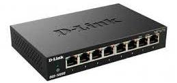

# Основы маршрутизации и коммутации

## Понятия маршрутизации и коммутации

Принцип работы сети заключается в соединении компьютеров и периферии с помощью двух компонентов оборудования: коммутаторов и маршрутизаторов. Эти два компонента позволяют устройствам, подключенным к вашей сети, взаимодействовать друг с другом и с другими сетями.

**Коммутаторы** используются для соединения группы устройств в одной сети в рамках здания или территории. Например, коммутатор может соединить компьютеры, принтеры и серверы, создавая сеть общих ресурсов. Коммутатор может работать в качестве контроллера, позволяя различным устройства предоставлять общий доступ к информации и взаимодействовать с другими устройствами. Благодаря предоставлению общего доступа к информации и распределению ресурсов коммутаторы экономят ваши средства и повышают производительность.

**Маршрутизацию** часто путают с коммутацией второго уровня, которая, как может показаться при поверхностном рассмотрении, выполняет те же функции. Принципиальное различие состоит в том, что коммутация реализована на втором уровне модели OSI, а маршрутизация - на третьем. Такое принципиальное отличие означает, что маршрутизация и коммутация используют разную информацию для организации передачи данных от отправителя получателю.

**Сравнение функций маршрутизатора и коммутатора**

Функция	 | Маршрутизатор | Коммутатор
---------|----------|---------
 Скорость | Медленнее | Быстрее
 Уровень OSI | Уровень 3 | Уровень 2
 Используемая адресация | IP | MAC
 Широковещательные рассылки | Блокируются | Пропускаются
 Безопасность | Выше | Ниже
 Сегментация сетей | Сегментирует сеть на широковещательные домены | Сегментирует сеть на домены коллизий

### Концентратор
сетевое устройство, предназначенное для объединения нескольких устройств Ethernet в общий сегмент сети. Устройства подключаются при помощи витой пары, коаксиального кабеля или оптоволокна. 

Концентратор работает на физическом уровне сетевой модели OSI, повторяет приходящий на один порт сигнал на все активные порты. В случае поступления сигнала на два и более порта одновременно возникает коллизия, и передаваемые кадры данных теряются. Таким образом, все подключённые к концентратору устройства находятся в одном домене коллизий.

### Коммутаторы

**Для чего нужен коммутатор?**
Предназначение  заключается в том, чтобы выполнять ряд функций, основными из которых являются:
- объединять компьютеры в одну структуру, позволяя им обмениваться информацией и ресурсами без необходимости подключения к серверу или интернету;
- делить трафик между подключенными устройствами, улучшать производительность за счет обработки данных только для нужного адреса;
- управлять и контролировать систему – дают возможность администраторам ее настраивать, мониторить и обслуживать, обнаруживать неисправности.

**Для чего нужна коммутация?**
Предназначение коммутации заключается в следующем:
- обеспечивает эффективный и защищенный обмен информацией между ПК и серверами сети;
- делит локальную систему на более мелкие сегменты, что позволяет улучшить ее производительность;
- поддерживает безопасное подключение внешних сетей;
- оптимизирует работу путем пересылки трафика только тем устройствам, которые являются его получателями.
Существенным фактором является поддержка различных протоколов и стандартов, что позволяет устройствам с отличающимися характеристиками и требованиями работать в рамках единой конфигурации.

**Как работает коммутатор?**
Коммутатор получает данные через свои порты и анализирует их адресацию, определяет, куда их необходимо переслать.
Для этого устройство:
- создает таблицу переключения, в которой указывает соответствие между MAC-адресами устройств и их портами;
- сравнивает MAC-адрес получателя с записями в таблице и пересылает пакет;
- при отсутствии информации свитч делает отправку данных всем подключенным компьютерам.
Свитч существенно повышает эффективность и работоспособность локальной сети. Это позволяет администратору ее настраивать и контролировать, используя имеющийся функционал.

**Чем отличается коммутатор от концентратора**
Между устройствами имеется ряд существенных отличий, которые связаны с параметрами:
_Аппаратное соединение_. Коммутатор объединяет компьютеры в сеть по отдельности. Концентратор задействует общую линию связи для подключения всех устройств.
_Трафик_. Свитч обрабатывает и посылает информацию по конкретному адресу. Концентратор передает данные всем сетевым компьютерам.
_Производительность и скорость._ Коммутатор обрабатывает несколько подключений одновременно. Концентратор перегружает линию.
Свитч является более усовершенствованным узлом с повышенным функционалом.

**Неуправляемые коммутаторы** работают по стандартной схеме и не позволяют вам вносить изменения в эту схему. В оборудовании для домашних сетей зачастую используются неуправляемые коммутаторы.

**Настраиваемые коммутаторы** представляют более усовершенствованный вариант, способный отслеживать топологию, задавать определенные параметры;

**Управляемый коммутатор** предоставляет доступ для его программирования. Это обеспечивает более высокую гибкость, поскольку коммутатор можно контролировать и настраивать локально или удаленно для управления передачей трафика по сети и доступом к вашей сети.

**Коммутаторы как основа сети передачи данных**
Свитчи являются центральными устройствами архитектуры локальной сети и играют ключевую роль в выполнении ряда функций:

- создают эффективную сетевую инфраструктуру;
- поддерживают прямое соединение между устройствами;
- осуществляют передачу данных в порты, определяют нахождение MAC-адресов каждого компонента;
- обеспечивают высокую пропускную способность, что особенно важно для приложений с быстрым обменом информацией – видеоконференций, онлайн-игр.
Использование свитчей снижает загрузку, повышает скорость работы путем устранения препятствий при передаче пакетов по адресам.

**Возможности и разновидности коммутаторов**
Выделяется несколько видов устройств, которые наделены дополнительными функциями:
- Layer 2 – пересылают данные на основе заявленных адресов и используются для сегментации сетей;
- Layer 3 – имеют функциональность маршрутизатора, перенаправляют данные по IP-адресам, создают масштабируемую архитектуру;
- поддержка Power over Ethernet (PoE) – передает энергию с помощью основного кабеля, подключает устройства без отдельных источников питания.
Наиболее функциональны управляемые коммутаторы – настраивают VLAN, задают правила фильтрации и контроля доступа, мониторят трафик.

**Типы и плотность портов**
Существует несколько типов портов, которые отличаются своими стандартами и плотностью:
- RJ-45 – наиболее распространенные порты, обеспечивают подключение по стандарту Ethernet.
- SFP – позволяют работать с оптоволоконными сетями, отличаются повышенной скоростью и дальностью при пересылке пакетов, плотность зависит от - модели;
- USB – предусматривают подключение съемных устройства к свитчу;
- консольные – подключаются к компьютеру или серверу через соответствующий кабель.
Консольные порты обеспечивают доступ к командной строке коммутатора для введения параметров и контроля.

**Питание по сети**
Для обеспечения питанием используется несколько распространенных технологий:
PoE – обеспечивает возможность устройствам получать питание через Ethernet-кабель, что упрощает развертывание сети, позволяет подключать дополнительное оборудование к свитчу;

### Маршрутизаторы
Маршрутизаторы используются для связывания нескольких сетей вместе. Например, можно использовать маршрутизатор для подключения сетевых компьютеров к Интернету, предоставляя таким образом общий доступ в Интернет для множества пользователей. Маршрутизатор может работать в качестве диспетчера, выбирая оптимальный маршрут для передачи вашей информации и обеспечивая ее быстрое получение.

Маршрутизаторы анализируют данные, отправляемые по сети, изменяют метод упаковки данных и отправляют их в другую сеть или в другой тип сети. Они соединяют ваше предприятие с внешним миром, защищают вашу информацию от угроз безопасности и способны даже определять, какие компьютеры получают приоритет над другими

**Виды маршрутизаторов**
- Внутренний, представляет собой устройство, у которого все интерфейсы относятся исключительно к одной зоне, а потому база данных, отвечающая за состояние каналов одна;
- Пограничный тип маршрутизатора может одновременно соединять сразу несколько различных зон с магистралью, и при этом служить шлюзом для передачи трафика между всеми зонами. Стоит отметить, что как минимум один интерфейс пограничных маршрутизаторов относится непосредственно к магистральной зоне, а потому под каждую присоединенную зону в таком маршрутизаторе выделяется отдельная база данных, которая регулирует состояние каналов передачи информации;
- Магистральные маршрутизаторы это устройства, которые обладают несколькими интерфейсами, при этом как минимум один из них стабильно и постоянно относится к магистральной зоне. По большому счету, данный тип маршрутизатора очень схож с пограничным, однако существуют между ними несколько весомых различий. Данный тип устройства является внутренним маршрутизатором с интерфейсами нулевой зоны, кроме стабильного вида магистральной;

Также существуют **аппаратные** и **программные** маршрутизаторы, которые различаются типом приема и передачи данных.

**Программные** маршрутизаторы представляют собой компьютеры, на которых установлено специальное маршрутизирующее программное обеспечение. Это программное обеспечение позволяет не только сохранять аппаратную базу, которая уже имеется в наличии, но и осуществлять различного вида работы с сетевыми топологиями, допуская при этом расширение. Для того чтобы добавить на такой компьютер новый сегмент либо глобальной, либо локальной сети необходимо просто добавить еще один адаптер, что делает такое подключение максимально простым.

**Аппаратный** маршрутизатор представляет собой специализированное устройство, использование которого дает пользователю большое количество преимуществ. Первым и самым основным является возможность объединять в одну группу большое количество локальных сетей, не используя при этом специальный отдельный сервер высокой мощности, что в свою очередь делает этот способ значительно дешевле, чем использование программного маршрутизатора. Кроме этого, если аппаратный маршрутизатор используется для объединения небольшого количества локальных сетей, это также дополнительно позволяет разгрузить используемый сервер от лишней нагрузки, и тем самым позволит дополнительно выполнять параллельные задачи. Не стоит забывать и том. Что у аппаратного маршрутизатора значительно больше вариантов интерфейсов, которые он без проблем может поддерживать.

***
В зависимости от коммерческих и сетевых планов можно выбирать маршрутизаторы, поддерживающие различные функции. В число этих функций могут входить следующие:

- Сеть IP-телефонов: объедините корпоративную компьютерную и телефонную сеть, используя технологии голосовой связи и конференций, чтобы упростить и унифицировать ваши коммуникации
- Межсетевой экран: специализированное программное обеспечение, которое анализирует входящие данные и защищает вашу бизнес-сеть от атак
- Виртуальная частная сеть(VPN): метод предоставления удаленным сотрудникам безопасного удаленного доступа к сети.

Принцип работы маршрутизатора

## Особенности настройки различных вендоров: Cisco, Juniper, D-Link

### Cisco:
1. Cisco IOS (Internetwork Operating System): Cisco использует свою операционную систему Cisco IOS для настройки сетевого оборудования. IOS предлагает широкий спектр функций и возможностей для настройки сетей.
2. CLI (Command Line Interface): Настройка устройств Cisco обычно происходит через командную строку, используя CLI. Cisco CLI - мощный инструмент для настройки сетевого оборудования, где администратор может выполнять различные команды для настройки интерфейсов, маршрутизации, брандмауэра и других функций.
3. Cisco Networking Academy: Для тех, кто хочет изучить настройку сетевого оборудования Cisco, доступны курсы Cisco Networking Academy, которые предоставляют обучение и сертификацию.
4. Официальная документация и мануалы: Cisco предлагает обширные материалы и документацию для настройки своего оборудования.
***
Интерфейс инструмента моделирования и визуализации сети Cisco Packet Tracer

### Juniper:
1. Junos OS (Juniper Operating System): Juniper использует операционную систему Junos для своего оборудования. Junos обеспечивает высокую производительность, масштабируемость и надежность.
2. CLI (Command Line Interface): Juniper также использует CLI для настройки оборудования. CLI Juniper отличается от Cisco, но обе системы предлагают похожие функциональные возможности.
3. Программное обеспечение Juniper Education Services: Juniper предлагает обучающие курсы и сертификации через Juniper Education Services для тех, кто хочет углубить знания в области сетевых технологий Juniper.
4. Juniper TechLibrary: Juniper предоставляет онлайн-документацию и руководства для настройки и использования своего оборудования.

### D-Link:
1. Web-интерфейс: Оборудование D-Link обычно имеет удобный web-интерфейс для настройки, что дает возможность настраивать устройства через веб-браузер.
2. Wizard-настройки: D-Link предлагает простые Wizard-настройки для быстрой установки и настройки сетевого оборудования для домашнего использования.
3. D-Link support: D-Link предоставляет техническую поддержку и ресурсы для пользователей, включая руководства по настройке, инструкции и FAQ.
4. Ограниченный функционал по сравнению с Cisco и Juniper: Оборудование D-Link обычно предназначено для домашних сетей и малых офисов, поэтому функциональность и возможности регулирования намного меньше, чем у оборудования Cisco и Juniper.

## Изучение сетевых устройств Cisco

Изучение сетевых устройств Cisco имеет несколько преимуществ и ценностей, даже несмотря на наличие санкций или других ограничений. Вот несколько причин, по которым стоит изучать технологии Cisco:

1. Популярность и широкое распространение: Cisco является одним из самых крупных и влиятельных производителей сетевого оборудования в мире, и их технологии широко используются в сетях различных масштабов и отраслей. Знание и навыки в области Cisco могут значительно расширить круг возможностей для трудоустройства и профессионального роста.

2. Качество и надежность: Cisco известен своим высоким качеством оборудования и надежностью продуктов. Получение навыков в работе с оборудованием Cisco может увеличить профессиональную компетенцию и доверие со стороны работодателей.

3. Поддержка и документация: У Cisco обширное сообщество пользователей, обучающие ресурсы, документация и специалисты по поддержке. Это поможет быстро и эффективно решать проблемы и узнавать новые функции и возможности продуктов Cisco.

4. Развитие навыков и опыта: Изучение технологий Cisco может помочь в расширении навыков и опыта в области сетевых технологий, что полезно не только в текущей работе, но и для будущих возможностей и проектов.

### Обзор операционной системы Cisco IOS:
Операционная система Cisco IOS (Internetwork Operating System) является ключевым компонентом сетевого оборудования Cisco и обеспечивает управление и контроль устройством. Рассмотрение операционной системы Cisco IOS и ее ключевых функций важно для понимания принципов работы устройств Cisco и их настройки. Вот некоторые из основных особенностей и функций Cisco IOS:

1. Интерфейсы и консольная оболочка:
   - Cisco IOS предоставляет различные интерфейсы для взаимодействия с устройством, включая консольный порт, telnet, SSH и веб-интерфейс.
      
   - Консольная оболочка (CLI) является основным средством управления и настройки устройства через команды.
   

2. Конфигурационная база данных (конфигурационные файлы):
   - Cisco IOS хранит конфигурацию устройства в виде конфигурационных файлов, которые определяют параметры работы устройства, такие как интерфейсы, маршруты, ACL и другие настройки.
   - Пользователи могут просматривать, изменять и сохранять конфигурационные файлы с помощью CLI или других инструментов управления.

3. Маршрутизация и коммутация:
   - Операционная система Cisco IOS обеспечивает функциональность маршрутизации и коммутации, позволяя устройствам Cisco пересылать пакеты данных между различными сегментами сети.
   - Cisco IOS поддерживает различные протоколы маршрутизации, такие как RIP, OSPF, EIGRP и BGP.

4. Безопасность:
   - Cisco IOS обеспечивает механизмы безопасности для защиты устройств и сетей от угроз и несанкционированного доступа.
   - Функциональность безопасности включает в себя настройку ACL, VPN, шифрование, аутентификацию и другие механизмы защиты.

5. Управление сетью и мониторинг:
   - Cisco IOS предоставляет инструменты для управления и мониторинга сетевых устройств, такие как SNMP (Simple Network Management Protocol), syslog и утилиты мониторинга.
   - Администраторы могут использовать эти инструменты для мониторинга состояния устройств, отслеживания событий и диагностики проблем.

### Основы конфигурации сетевых устройств Cisco:
   - Настройка интерфейсов устройств Cisco.
   - Настройка маршрутизации и VLAN.

## Знакомство с системами эмуляции сетей. Работа с Cisco packet tracer

**Cisco Packet Tracer** - это учебный симулятор сетевых устройств и программное обеспечение для моделирования сетей, разработанное компанией Cisco Systems. Он используется для обучения и практической работы с сетевыми технологиями, протоколами, маршрутизацией, коммутацией и другими аспектами сетевой инфраструктуры.

Основные особенности и возможности Cisco Packet Tracer:

1. Моделирование сетевых устройств: Packet Tracer позволяет создавать виртуальные сети, включая коммутаторы, маршрутизаторы, ПК, серверы, IP телефоны и другие устройства, которые используются в сетевой инфраструктуре.

2. Настройка сети и протоколов: Пользователи могут настраивать сетевые устройства, устанавливать различные параметры, настраивать маршрутизацию, маршруты, VLAN, безопасность и многое другое.

3. Симуляция сетевых технологий и протоколов: Packet Tracer позволяет моделировать работу различных сетевых технологий и протоколов, таких как TCP/IP, OSPF, EIGRP, VLAN, DHCP, NAT, ACL и другие.

4. Консольный доступ к устройствам: Пользователи могут взаимодействовать с сетевыми устройствами через консольное соединение, подобно тому, как это делается в реальной сети.

5. Симуляция сетевых событий: Packet Tracer позволяет создавать сетевые события и сценарии для тестирования и отладки, такие как сбои устройств, изменение конфигурации и другие.
***
**Работа в CLI**

`enable`: Переход в режим привилегированного пользователя (enable mode) для получения доступа к расширенным функциям настройки.

`configure terminal` (или просто "conf t"): Переход в режим глобальной конфигурации для внесения изменений в конфигурацию устройства.

`interface [тип и номер интерфейса]`: Переход в режим настройки конкретного интерфейса (например, "interface GigabitEthernet0/1").

`ip address [IP-адрес] [маска подсети]`: Настройка IP-адреса на сетевом интерфейсе.

`no shutdown`: Включение интерфейса.

`show interfaces [тип и номер интерфейса]`: Просмотр информации о состоянии конкретного интерфейса.

`show ip interface brief`: Отображение краткой информации о IP-адресах и состоянии сетевых интерфейсов.

`show running-config`: Отображение текущей рабочей конфигурации устройства.

`write memory` (или "wr" или "copy running-config startup-config"): Сохранение текущей конфигурации в постоянной памяти устройства.

`exit`: Выйти из текущего режима конфигурации или вернуться на один уровень выше.

`ping [IP-адрес]`: Отправка ICMP-запроса на указанный IP-адрес для проверки соединения.

`traceroute [IP-адрес]`: Определение маршрута пакета к указанному IP-адресу.

`reload`: Перезагрузка устройства.

`show version`: Отображает информацию о версии оборудования и программного обеспечения.

`show interface status`: Показывает текущее состояние всех интерфейсов на устройстве.

`show vlan`: Отображает созданные VLANы и соответствующую им информацию.

`show running-config interface [тип и номер интерфейса]`: Показывает текущую конфигурацию указанного сетевого интерфейса.

`show spanning-tree`: Отображает информацию о состоянии протокола Spanning Tree на коммутаторе.

`show ip route`: Показывает таблицу маршрутизации IP на устройстве.

## Домашнее задание

1. разместить оборудование согласно схеме
2. присвоить IP-адреса компьютерам
3. подключить консольный компьютер
4. Сохраните полученный стенд в файле lesson_1_2.pkt
***
**дополнительно**
1. настроить оборудование через CLI, список команд записать в файле lesson_1_2.txt

***
**Для отчета:**
- создать в личном репозитории организаци github ветку lesson_1_2
- создать директорию lesson_1_2 и разместить там отчет домашнего задания
- сделать push и pull request на сайте, в качестве рецензента добавить пользователя AndreyChuyan

