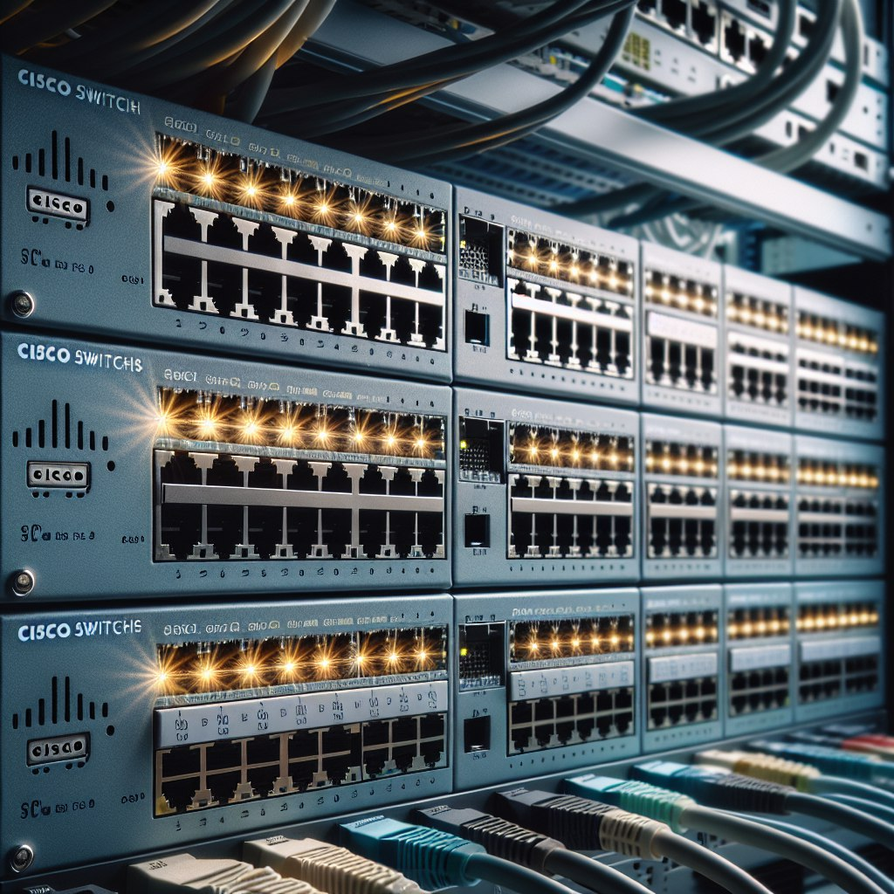

# Коммутаторы Cisco




## Стандарт  802.1P

**Стандарт IEEE 802.1P** относится к уровню канала (Data Link Layer) модели OSI и представляет собой набор стандартов для обеспечения качества обслуживания (Quality of Service, QoS) в сети. Он определяет механизмы управления приоритетом трафика в Ethernet-сетях, позволяя оптимизировать передачу данных и предоставлять приоритет доступа к сетевым ресурсам.

Основные характеристики и принципы работы стандарта IEEE 802.1P:

1. Приоритизация трафика: Стандарт 802.1P использует 3-битовое поле в заголовке Ethernet-кадра для определения приоритета трафика. Каждый кадр может быть помечен определенным уровнем приоритета (от 0 до 7), что позволяет оптимизировать обработку и передачу данных.

2. Обеспечение QoS: Помеченный приоритетом трафик имеет преимущество при обработке в сети, что позволяет гарантировать надежную и стабильную передачу данных для приложений, требующих высокой скорости и минимальной задержки.

3. Контроль загрузки сети: Приоритизация трафика с помощью стандарта 802.1P позволяет эффективно управлять пропускной способностью сети, предотвращая перегрузки и обеспечивая равномерную передачу данных.

4. Интеграция с другими стандартами QoS: IEEE 802.1P может быть использован в сочетании с другими технологиями для обеспечения более сложных сценариев QoS, таких как DiffServ или MPLS.

Стандарт IEEE 802.1P играет важную роль в современных сетях, обеспечивая оптимизацию передачи данных, улучшение производительности приложений и повышение удовлетворенности пользователей. Он используется для реализации различных механизмов QoS и управления трафиком, что способствует эффективной работе сетевой инфраструктуры.
***
Помимо информации о VLAN, в этом же кадре передается информация о приоритете передаваемого трафика. Это записано в стандарте IEEE 802.1p - CoS.
Можно сказать, что IEEE 802.1p как бы является частью IEEE 802.1Q.


Восемь различных классов для 3-битового поля PCP в заголовке IEEE 802.1Q:


Включение QoS на коммутаторе:

**CLI**
```bash
# Включите QoS на коммутаторе:
mls qos

# Назначьте приоритет (CoS) для порта:
Switch(config)# interface FastEthernet0/1
Switch(config-if)# switchport mode access
Switch(config-if)# mls qos cos 5

# Проверьте настройки QoS:
Switch# show mls qos interface FastEthernet0/1
Switch# show mls qos interface FastEthernet0/1 statistics
```

Команда "`mls qos cos 5`" используется для назначения приоритета Class of Service (CoS) для порта на коммутаторе Cisco. В данном случае, значение "5" указывает на конкретный уровень приоритета CoS, который будет применяться к трафику, проходящему через данный порт.

***
## Стандарт  802.1Q

**Стандарт IEEE 802.1Q** (или VLAN Tagging) является частью набора стандартов IEEE 802.1, который определяет механизм маркировки кадров Ethernet для создания виртуальных локальных сетей (VLAN). Основной целью стандарта 802.1Q является разделение сети на логические сегменты (VLAN), которые обеспечивают изоляцию трафика между ними.


Основные характеристики стандарта 802.1Q:

1. Тегирование кадров: В стандарте 802.1Q каждый кадр Ethernet дополняется 4-байтным тегом, содержащим информацию о VLAN. Этот тег позволяет коммутаторам передавать и связывать кадры с конкретными VLAN.

2. Идентификация VLAN: Тег VLAN содержит идентификатор VLAN (VLAN ID), который используется для отнесения кадра к определенной виртуальной локальной сети.

3. Расширение существующего кадра: Тег VLAN добавляется перед полем данных кадра без изменения его общей структуры, что позволяет использовать существующее оборудование Ethernet.

4. Прозрачность для устройств без поддержки VLAN: Устройства, не поддерживающие стандарт 802.1Q, могут передавать и принимать кадры с тегами VLAN, не обращая на них внимания.

5. Использование в сетях с разными уровнями безопасности: VLAN позволяют разделять сеть на отдельные группы с различными уровнями безопасности, что обеспечивает дополнительный уровень защиты.
***

Так как 802.1Q не изменяет заголовки кадра (фрейма), то сетевые устройства, которые не поддерживают этот стандарт, могут передавать трафик без учёта его принадлежности к VLAN. Поскольку данный стандарт является открытым, он используется для построения «транковых» портов между оборудованием различных производителей.

802.1Q помещает внутрь фрейма тег, который передает информацию о принадлежности трафика к VLAN.


Тег состоит он из 4-х частей:

1) TPID (англ. Tag Protocol ID) или Идентификатор тегированного протокола — состоит из 2-х байт и для VLAN всегда равен 0x8100.
2) PCP (англ. Priority Code Point) или значение приоритета — состоит из 3-х бит. Используется для приоритезации трафика. Крутые и бородатые сисадмины знают, как правильно им управлять и оперирует им, когда в сети гуляет разный трафик (голос, видео, данные и т.д.)
3) CFI (англ. Canonical Format Indicator) или индикатор каноничного формата — простое поле, состоящее из одного бита. Если стоит 0, то это стандартный формат MAC-адреса.
4) VID (англ. VLAN ID) или идентификатор VLAN — состоит из 12 бит и показывает, в каком VLAN находится кадр.

Тегирование кадров осуществляется между сетевыми устройствами (коммутаторы, маршрутизаторы и т.д.), а между конечным узлом (компьютер, ноутбук) и сетевым устройством кадры **не тегируются**. Поэтому порт сетевого устройства может находиться в 2-х состояниях: access или trunk.

**Access port** или порт доступа — порт, находящийся в определенном VLAN и передающий не тегированные кадры. Как правило, это порт, смотрящий на пользовательское устройство.
**Trunk port** или магистральный порт — порт, передающий тегированный трафик. Как правило, этот порт поднимается между сетевыми устройствами.

***

Анализатор трафика wireshark и vlan


***


**CLI**
```bash
   # Но нам нужно запустить роутер с правами администратора, чтобы вместо стрелочки стояла решетка (#). Для этого вводим команду:
enable
   # удаляем старый конфиг, перезагружаем:
write erase
reload
   # роутер загрузится и выведет сообщение – использовать стандартную конфигурацию? – отвечаем:
no

   # включите интерфейс
enable
configure terminal
interface fastEthernet 0/5
no shutdown


enable
show vlan

configure terminal
hostname lup-commutator

vlan 2
name buh
exit

configure terminal
vlan 3
name ruk
exit

   # Теперь подключим интерфейсы Fa0/1  и Fa0/3 к которым подключены компьютеры бухгалтерии к vlan2

configure terminal
interface fastEthernet 0/1
switchport mode access
switchport access vlan 3
exit

interface fastEthernet 0/2
switchport mode access
switchport access vlan 3
end
write

   # Теперь подключим интерфейсы Fa0/2  и Fa0/4 к которым подключены компьютеры бухгалтерии к vlan3
configure terminal
interface fastEthernet 0/3
switchport mode access
switchport access vlan 2
exit

interface fastEthernet 0/4
switchport mode access
switchport access vlan 2
end
write

show vlan

   # Для обеспечения доступа из одного интерфейса к всем VLAN на коммутаторе Cisco необходимо сконфигурировать интерфейс в режиме транка (trunk mode) и настроить его для передачи трафика для всех VLAN
configure terminal
interface fastEthernet 0/5
switchport mode trunk
switchport trunk allowed vlan all
   #просмотрим настройки транка
show interfaces trunk
write
reload

show interfaces FastEthernet0/5 switchport

# просмотреть все vlan
show vlan 
```


```

### Команды show на коммутаторах Cisco позволяют просматривать различную информацию о конфигурации устройства, сетевом трафике, статусе интерфейсов и других параметрах:

1. show version: Отображает информацию о версии операционной системы и оборудования коммутатора.

2. show running-config: Показывает текущую рабочую конфигурацию коммутатора.

3. show interfaces: Позволяет просматривать информацию о статусе и параметрах всех интерфейсов коммутатора.

4. show ip interface brief: Отображает краткую информацию о настроенных IP-интерфейсах коммутатора.

5. show vlan: Показывает список всех настроенных VLAN на коммутаторе.

6. show mac address-table: Просматривает таблицу MAC-адресов коммутатора.

7. show arp: Отображает текущую таблицу ARP (адресов протокола) коммутатора.

8. show spanning-tree: Позволяет просмотреть информацию о протоколе Spanning Tree и его состоянии.

9. show log: Отображает журнал сообщений и системных событий коммутатора.

10. show flash: Показывает информацию о флеш-памяти коммутатора.

11. show cdp neighbors: Позволяет увидеть информацию о соседних устройствах, обнаруженных с помощью протокола CDP.


***
## Домашнее задание
1. Создайте 4 виртуальных локальных сегмента (VLAN) на 2 коммутаторах, находящихся в разных зданиях.
   - logistic
   - manager
   - product
   - it
2. Назначьте порты коммутатора в принадлежащие к каждой из VLAN.
3. Настройте транк-порт между двумя коммутаторами для передачи трафика VLAN.
4. Создайте в разных зданиях 4 отдела, имеющие широковещательный домен только с одноименным отделом в другом здании.
Сохраните файлы lesson_1_3_1.pkt,  lesson_1_3_1.txt
***
## дополнительно
1. Добавить во втором здании 3 коммутатор для отдела it и разрешим передачу по нему трафика только отдела it, настройте на нем vlan только для доступа к сети отдела it
2. Выделите каждой сети подсеть с маской \27 в сети 192.168.10.
Сохраните файлы lesson_1_3_2.pkt,  lesson_1_3_2.txt

***
**Для отчета:**
- создать в личном репозитории организации github ветку lesson_1_3
- создать директорию lesson_1_3 и разместить там файл домашнего задания
- сделать push и pull request на сайте, в качестве рецензента добавить пользователя AndreyChuyan