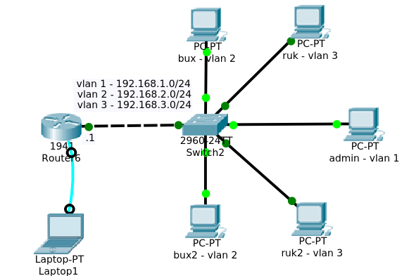

# Маршрутизаторы Cisco


Основные задачи, для которых используются маршрутизаторы Cisco, включают следующее:

- Маршрутизация: Передача данных между различными сетями и определение наиболее эффективного маршрута для передачи пакетов данных.
- Безопасность: Фильтрация трафика, настройка VPN-туннелей, межсетевой экран (firewall), IPSec и SSL VPN и другие механизмы безопасности.
- Управление качеством обслуживания (QoS): Поддержка приоритизации трафика и обеспечение качества обслуживания для определенных приложений или услуг.
- Масштабируемость: Обработка высоких объемов трафика и поддержка большого количества сетевых устройств и пользователей.
- Отказоустойчивость: Обеспечение непрерывности работы сети и минимизация времени простоя при отказах оборудования или сетевых соединений.


## Настройка маршрутизаторов Cisco
**создадим стенд по схеме**



```bash
   # переведем порт роутера в режим транка
configure terminal
interface FastEthernet 0/6
switchport mode trunk
switchport trunk allowed vlan all
   #просмотрим настройки транка
show interfaces trunk
end
write
   # настроим интерфейсы маршрутизатора:
enable
configure terminal
hostname Lap-router
interface GigabitEthernet0/1
ip address 192.168.1.1 255.255.255.0
no shutdown
end
write
```

### Авторизация пользователей и удаленное подключение
Настраиваем авторизацию для доступа к устройству. Для этого задаем пароль доступа к привилегированному режиму (знак # рядом с названием устройства), а также создаем учетную запись пользователя и пароль для удаленного подключения.
```bash
configure terminal
enable secret 1234
   # Создаем учетную запись для удаленного управления и пароль для нее
username admin secret 1234
   # Включение авторизации, с использованием локальной базы данных пользователей и паролей
line vty 0 4
login local
   # пробуем с компьютера
ping 192.168.1.1
telnet 192.168.1.1
```
доступ по SSH
```bash
configure terminal
ip domain name lup
crypto key generate rsa
1024
   # Выбираем длину ключа – по умолчанию значение стоит равным 512 битам, для SSH версии 2 минимальная длина составляет 1024 бит. 
ip ssh version 2
line vty 0 15
transport input ssh
   # Попробуйте зайти по ssh, используя логин по умолчанию – admin. 
username admin secret 1234
line vty 0 15
login local
do wr

telnet 192.168.1.1
ssh -l admin 192.168.1.1

   # сменим пароль и логин
configure terminal
username ladmin secret 1234
do wr
exit
```

## Подключение к провайдеру, создание локальных сетей. Dhcp сервер

**Активация DHCP-сервера на коммутаторе**
```bush
configure terminal
interface GigabitEthernet0/1

ip dhcp pool POOL-DHCP
network 192.168.1.0 255.255.255.0
default-router 192.168.1.1
dns-server 200.150.100.1

посмотрим список DHCP клиентов 
show ip dhcp binding
```

**транк порт для доступа ко всем vlan на роутере**
```bash
configure terminal
interface GigabitEthernet0/1
switchport mode trunk
switchport trunk allowed vlan 1,2,3

   # посмотреть arp таблицу
show arp
```

**Настройка сабинтерфейса для доступа it отдела на маршрутизаторе**
```bash
   # Настройка сабинтерфейса для сети руководства
configure terminal
interface GigabitEthernet0/1.2
encapsulation dot1q 2
ip address 192.168.2.1 255.255.255.0
description bux

   # Настройка сабинтерфейса для сети руководства
interface GigabitEthernet0/1.3
encapsulation dot1q 3
ip address 192.168.3.1 255.255.255.0
description ruk

   # настроим DHCP для конкретных VLAN
interface GigabitEthernet0/1.2
ip dhcp pool vlan2-DHCP
network 192.168.2.0 255.255.255.0
default-router 192.168.2.1
dns-server 200.150.100.1

interface GigabitEthernet0/1.3
ip dhcp pool vlan3-DHCP
network 192.168.3.0 255.255.255.0
default-router 192.168.3.1
dns-server 200.150.100.1
   # проверим адресацию
ipconfig
```
   теперь it отдел и роутер имеет доступ ко всем хостам во всех vlan

## Создание списков доступа (ACL)

**ACL (Access Control List)** — это набор текстовых выражений, которые что-то разрешают, либо что-то запрещают. Обычно ACL разрешает или запрещает IP-пакеты, но помимо всего прочего он может заглядывать внутрь IP-пакета, просматривать тип пакета, TCP и UDP порты. Также ACL существует для различных сетевых протоколов (IP, IPX, AppleTalk и так далее). В основном применение списков доступа рассматривают с точки зрения пакетной фильтрации, то есть пакетная фильтрация необходима в тех ситуациях, когда у вас стоит оборудование на границе Интернет и вашей частной сети и нужно отфильтровать ненужный трафик.
Вы размещаете ACL на входящем направлении и блокируете избыточные виды трафика.

### Список управления доступом (ACL - Access Control List)
Список управления доступом (ACL - Access Control List) - это механизм, используемый в сетевых устройствах, таких как маршрутизаторы, коммутаторы или брандмауэры, для контроля и фильтрации трафика, проходящего через устройство. ACL позволяет определять, какие пакеты данных могут проходить через устройство и какие должны быть отклонены или дропнуты.

ACL состоит из серии правил, которые определяют условия и действия для обработки пакетов данных. Каждое правило в ACL описывает, какие типы пакетов и откуда они могут проходить через устройство сети. При срабатывании ACL, устройство применяет правила в порядке их следования и решает, что делать с пакетом на основе условий, указанных в ACL.

С помощью ACL можно реализовывать различные сценарии безопасности и управления сетью, такие как:

1. Фильтрация доступа к ресурсам сети по IP-адресам и портам.
2. Блокирование определенных сервисов или протоколов для повышения безопасности.
3. Разделение трафика на разные VLAN или сегменты сети.
4. Управление и приоритизация трафика с использованием QoS.
5. Ограничение исходящего трафика для предотвращения DDoS атак.

Правила доступа

   - deny - это правило используется для отказа в доступе к определенным ресурсам или сервисам

   - permit - это правило разрешает прохождение пакетов, соответствующих критериям, указанным в списке доступа. Трафик, удовлетворяющий этому правилу, будет разрешен пройти через маршрутизатор.

   - remark - это правило позволяет добавить комментарий или описание к списку доступа. Он не влияет на прохождение пакетов, а служит только для документации и понимания структуры списка доступа.

   - log - это правило позволяет записывать информацию о пакетах, которые соответствуют данному правилу, в системный журнал маршрутизатора. Это помогает отслеживать и анализировать прохождение трафика через список доступа.

   - deny any - это специальное правило, которое запрещает прохождение всех пакетов, которые не соответствуют ни одному из других правил в списке доступа. Это полезно для явного запрета всех остальных пакетов, которые не были явно разрешены ранее.

   - permit any - в списке доступа (Access List) в Cisco IOS является самым широким и разрешает прохождение любого трафика между любыми источниками и назначением.

Правила доступа доступа к направлениям (ACL) в Cisco IOS позволяют ограничивать трафик, проходящий через определенный интерфейс в зависимости от его источника или назначения. В ACL можно указать как исходящее, так и входящее направление трафика. Возможно указание следующих направлении в ACL:

   - in - Входящее направление это направление трафика, восходящего к устройству и проходящего через указанный интерфейс. Правила ACL, указанные для входящего направления, применяются к пакетам до их обработки маршрутизатором или коммутатором.

   - out - Исходящее направление это направление трафика, исходящего от устройства и проходящего через указанный интерфейс. Правила ACL, указанные для исходящего направления, применяются к пакетам после их обработки маршрутизатором или коммутатором.


**Cтандартные списки доступа (Standard Access Lists)** в Cisco IOS позволяют фильтровать трафик на основе исходного IP-адреса. Вот несколько примеров использования стандартных списков доступа:

1. Разрешить трафик из определенной сети:
```
ip access-list standard ALLOW_NETWORK
permit 192.168.1.0 0.0.0.255

```
Этот простой стандартный список доступа разрешает весь трафик от подсети 192.168.1.0/24.

2. Заблокировать конкретный хост:
```
ip access-list standard DENY_HOST
deny host 10.1.1.1

```
Этот список доступа блокирует весь трафик от хоста с IP-адресом 10.1.1.1.

3. Разрешить рабочие станции в определенной сети:
```
ip access-list standard ALLOW_WORKSTATIONS
permit 10.0.0.0 0.255.255.255

```
Этот список доступа разрешает трафик от всех рабочих станций в сети 10.0.0.0/8.

4. Заблокировать SSH-доступ к определенным хостам:
```
ip access-list standard DENY_SSH
deny 192.168.1.10
deny 192.168.1.20

```
Этот список доступа блокирует SSH-трафик к хостам с IP-адресами 192.168.1.10 и 192.168.1.20.

5. Разрешить только определенный хост:
```
ip access-list standard ALLOW_SINGLE_HOST
permit host 172.16.1.100
deny any

```

**Расширенные списки доступа (Extended Access Lists)** в Cisco IOS для настройки фильтрации трафика на основе источника, назначения, портов и протоколов:

1. Разрешить HTTP трафик из определенной сети в другую сеть:
```
ip access-list extended ALLOW_HTTP
permit tcp 192.168.1.0 0.0.0.255 any eq 80

```
Это правило позволяет HTTP трафику из подсети 192.168.1.0/24 проходить в любом направлении через интерфейс.

2. Заблокировать Telnet трафик на интерфейсе:
```
ip access-list extended DENY_TELNET
deny tcp any any eq 23

```
Это правило блокирует Telnet трафик в любом направлении через интерфейс.

3. Разрешить SSH доступ из определенной сети:
```
ip access-list extended ALLOW_SSH
permit tcp 10.0.0.0 0.255.255.255 any eq 22

```
Это правило разрешает SSH трафику из сети 10.0.0.0/8 проходить в любом направлении через интерфейс.

4. Блокировать ICMP Echo (ping) запросы в сеть:
```
ip access-list extended DENY_ICMP
deny icmp any any echo

```
Это правило блокирует Echo (ping) ICMP запросы в любом направлении через интерфейс.

5. Разрешить HTTPS трафик из любого источника в определенную сеть:
```
ip access-list extended ALLOW_HTTPS
permit tcp any 192.168.2.0 0.0.0.255 eq 443

```
Это правило разрешает HTTPS трафику из любого источника в подсеть 192.168.2.0/24 проходить в любом направлении через интерфейс.


```bash
# Создание стандартного списка доступа:
# Критерии записываются последовательно в следующем формате:
access-list access-list-number {deny | permit} source [source-wildcard]

# Пример:
access-list 1 deny 192.168.1.0 0.0.0.255
access-list 1 permit 192.168.0.0 0.0.255.255

# Часто используемое описание фильтра, которому удовлетворяет любой
# адрес 0.0.0.0 255.255.255.255 имеет специальное обозначение "any".
access-list access-list-number {deny | permit} any
```
**пример**
создадим списки для запрета прохождения трафика через сеть 192.168.2.0

```bash
# Создайте список доступа (ACL):
ip access-list extended block_192-168-2-0

# Добавьте правило, которое блокирует все пакеты с источником или назначением в сети 192.168.2.0/24:
deny ip any 192.168.2.0 0.0.0.255

# Добавьте правило разрешающего трафика для остальных сетей:
permit ip any any

# списки доступа читаются сверху вниз
ip access-group block_192-168-2-0 in

# Проверьте ACL:
Switch# show access-lists
# получаем вывод
`Standard IP access list no_bux
    10 deny 192.168.2.0 0.0.0.255
    20 permit any
Extended IP access list no_buh
Standard IP access list block
    10 deny 192.168.2.0 0.0.0.255`

# удалим правило 20 permit any
ip access-list standard no_bux
no 20 prmit any

# удалим ACL
no ip access-list standard no_bux
```


Вернемся к стенду
***
Сейчас между vlan есть доступ, его нужно закрыть

**Настроим маршруты в сети с помощью access-list на роутере**
```bash
configure terminal
ip access-list extended SecRoute
deny ip 192.168.2.0 0.0.0.255 192.168.3.0 0.0.0.255
deny ip 192.168.3.0 0.0.0.255 192.168.2.0 0.0.0.255
permit ip any any
exit 

   # Access-list на роутере (Router) Cisco 911 создан. Теперь подключим его к виртуальным интерфейсам.
configure terminal
interface gigabitEthernet0/1.2
ip access-group SecRoute in
exit 
 
interface gigabitEthernet0/1.3
ip access-group SecRoute in
exit
end
show access-lists

write
```


***
## Домашнее задание модуля
Исходные данные:

1. Работаем со стендом из предыдущего задания

2. Настроить 2 роутера

   -  роутер организации для подключения к провайдеру

3. Настроить dhcp в этих 3 сетях

4. Настроить парольную аутентификацию на роутерах

   - Сохраните макет в файле lesson_1_4.pkt

   - Опишите все команды через CLI в файле lesson_1_4.txt

**дополнительно**

   - Настроить удаленное подключение по ssh для роутеров организации

   - Настроим маршруты в сети с помощью access-list на роутере для изоляции vlan-ов

***
**Для отчета:**
- создать в личном репозитории организаци github ветку lesson_1_4
- создать директорию lesson_1_4 и разместить там файл домашнего задания
- сделать push и pull request на сайте, в качестве рецензента добавить пользователя AndreyChuyan