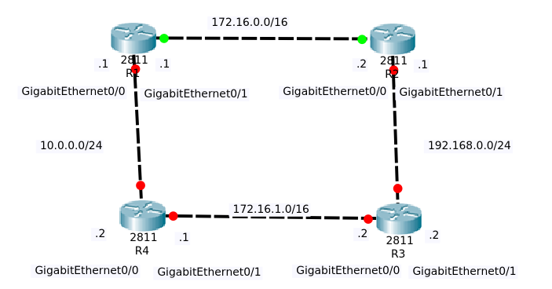

# Протоколы динамической маршрутизации


## Доступ в Интернет - настройка NAT

**NAT (от англ. Network Address Translation — «преобразование сетевых адресов»)** — это механизм в сетях TCP/IP, позволяющий преобразовывать IP-адреса транзитных пакетов. Также имеет названия IP Masquerading, Network Masquerading и Native Address Translation.

Сети обычно проектируются с использованием частных IP адресов. Это адреса 10.0.0.0/8, 172.16.0.0/12 и 192.168.0.0/16. Эти частные адреса используются внутри организации или площадки, чтобы позволить устройствам общаться локально, и они не маршрутизируются в интернете. Чтобы позволить устройству с приватным IPv4-адресом обращаться к устройствам и ресурсам за пределами локальной сети, приватный адрес сначала должен быть переведен на общедоступный публичный адрес.
И вот как раз NAT переводит приватные адреса, в общедоступные. Это позволяет устройству с частным адресом IPv4 обращаться к ресурсам за пределами его частной сети. NAT в сочетании с частными адресами IPv4 оказался полезным методом сохранения общедоступных IPv4-адресов. Один общедоступный IPv4-адрес может быть использован сотнями, даже тысячами устройств, каждый из которых имеет частный IPv4-адрес. NAT имеет дополнительное преимущество, заключающееся в добавлении степени конфиденциальности и безопасности в сеть, поскольку он скрывает внутренние IPv4-адреса из внешних сетей.
Маршрутизаторы с поддержкой NAT могут быть настроены с одним или несколькими действительными общедоступными IPv4-адресами. Эти общедоступные адреса называются пулом NAT. Когда устройство из внутренней сети отправляет трафик из сети наружу, то маршрутизатор с поддержкой NAT переводит внутренний IPv4-адрес устройства на общедоступный адрес из пула NAT. Для внешних устройств весь трафик, входящий и выходящий из сети, выглядит имеющим общедоступный IPv4 адрес.
Маршрутизатор NAT обычно работает на границе Stub-сети. Stub-сеть – это тупиковая сеть, которая имеет одно соединение с соседней сетью, один вход и выход из сети.


**пример**
Например, внутренний веб-сервер может быть сопоставлен с определенным внутренним глобальным адресом, чтобы он был доступен из внешних сетей.


На схеме показана внутренняя сеть, содержащая веб-сервер с частным адресом IPv4. Маршрутизатор сконфигурирован со статическим NAT, чтобы позволить устройствам из внешней сети обращаться к веб-серверу. Клиент из внешней сети обращается к веб-серверу с использованием общедоступного IPv4-адреса. Статический NAT переводит общедоступный IPv4-адрес в частный.

При настройке статических трансляций NAT выполняются две основные задачи:
- Создание сопоставления между внутренним локальным (inside local) адресом и внутренними глобальными (inside global) адресами. Например, внутренний локальный адрес 192.168.1.5 и внутренний глобальный адрес 208.165.100.5 на схеме настроены как статическая NAT трансляция.
- После того как сопоставление настроено, интерфейсы, участвующие в трансляции должны быть настроены как внутренние (inside) и наружные (outside) относительно NAT. На схеме интерфейс маршрутизатора Serial 0/0/0 является внутренним, а Serial 0/1/0 – внешним.
Пакеты, поступающие на внутренний интерфейс маршрутизатора Serial 0/0/0 из настроенного внутреннего локального адреса IPv4 (192.168.1.5), транслируются и затем перенаправляются во внешнюю сеть. Пакеты, поступающие на внешний интерфейс Serial 0/1/0, адресованные настроенному внутреннему глобальному адресу IPv4 (208.165.100.5), переводятся на внутренний локальный адрес (192.168.1.5) и затем перенаправляются внутрь сети.
Настройка проходит в несколько шагов:
1. Создать статическую трансляцию между внутренним локальным и внешним глобальным адресами. Для этого используем команду ip nat inside source static [локальный _IP глобальный_IP]. Чтобы удалить трансляцию нужно ввести команду no ip nat inside source static. Если нам нужно сделать трансляцию не адреса в адрес, а адреса в адрес интерфейса, то используется команда ip nat inside source static [локальный _IP тип_интерфейса номер_интерфейса].
2. Определим внутренний интерфейс. Сначала зайти в режим конфигурации интерфейса, используя команду interface[тип номер] и ввести команду ip nat inside
3. Таким же образом определить внешний интерфейс, используя команду ip nat outside


**Настроим внешний интерфейс маршрутизатора**
```bash
configure terminal
interface GigabitEthernet0/0
ip address 200.150.100.2 255.255.255.240
no shutdown
end
write
```

**Настроим интерфейсs маршрутизатора провайдера**
```bash
configure terminal
interface GigabitEthernet0/1
ip address 200.150.100.1 255.255.255.240
no shutdown
exit
interface GigabitEthernet0/0
ip address 8.100.100.100 255.0.0.0
no shutdown
end
write
```
**Настроим маршруты в сети с помощью access-list на роутере**
```bash
configure terminal
ip nat inside source static 192.168.1.2 200.150.100.3
interface GigabitEthernet0/1
ip nat inside
exit
interface GigabitEthernet0/0
ip nat outside
```

! очистка таблицы нат
```bash
clear ip nat translation *
```

**Проверка статического NAT**
```bash
show ip nat translations 
```

**проверка доступности адресов**
```bash
   # с внутреннего сервера
ping 200.150.100.1
   # с роутера провайдера
ping 200.150.100.3
```

! удаление статического NAT-отображения
```bash
configure terminal
no ip nat inside source static 192.168.1.2 200.150.100.3
```


**Статическая маршрутизация в Cisco** - это метод установки и настройки статических маршрутов вручную на маршрутизаторе. Эти статические маршруты используются для указания маршрутизатору, как доставлять пакеты к определенным сетям или узлам. Статическая маршрутизация подходит для небольших сетей или для создания основных маршрутов для особых случаев.

Для настройки статической маршрутизации на устройствах Cisco IOS используется следующий синтаксис команд:
1. Для указания маршрута к конкретной сети:
ip route <назначение сети> <маска подсети> <следующий хоп офиса>
Пример:
```
ip route 192.168.2.0 255.255.255.0 10.1.1.1
```
Эта команда указывает маршрутизатору, что для доставки пакетов к сети 192.168.2.0/24 следующим хопом является узел с IP-адресом 10.1.1.1.

2. Для указания маршрута к конкретному узлу:
ip route <IP-адрес узла> <маска подсети> <следующий хоп офиса>
Пример:
```
ip route 192.168.1.10 255.255.255.255 10.1.1.2
```
Эта команда указывает маршрутизатору, что для доставки пакетов к узлу с IP-адресом 192.168.1.10 следующим хопом является узел с IP-адресом 10.1.1.2.


**Для примера пропишем статические маршруты**
```bash
   # для Router
configure terminal
ip route 8.0.0.0 255.0.0.0 200.150.100.1
end
write
reload
   # для Provider
configure terminal
ip route 192.168.1.0 255.255.255.0 200.150.100.2
end
write
reload
```
! просмотр статическим маршрутов
```bash
show ip route static
```


**Динамическая маршрутизация в Cisco** - это метод автоматического обмена маршрутной информацией между соседними маршрутизаторами, чтобы они могли определять оптимальные пути для доставки пакетов к конечным узлам в сети. В отличие от статической маршрутизации, при динамической маршрутизации маршруты обновляются автоматически в ответ на изменения в топологии сети.

Для настройки динамической маршрутизации в Cisco обычно используют протоколы динамической маршрутизации, такие как OSPF (Open Shortest Path First), EIGRP (Enhanced Interior Gateway Routing Protocol), или RIP (Routing Information Protocol). 

## P2P GRE туннели

**P2P GRE (Point-to-Point Generic Routing Encapsulation)** туннели представляют собой технологию виртуальных частных сетевых соединений, которая используется для создания приватных сетей связи между двумя удаленными сетями или устройствами. 

P2P GRE туннель работает путем упаковки сетевых пакетов в GRE-оболочку (Generic Routing Encapsulation) и передачи их через существующую сеть. GRE-оболочка создает виртуальный канал между двумя удаленными точками, позволяя передавать данные между ними, как если бы они находились в одной локальной сети.

Преимущества P2P GRE туннелей включают:
- Безопасность: обеспечивает шифрование данных и защиту трафика.
- Универсальность: позволяет передавать любой вид сетевого трафика.
- Гибкость: легко настраивается и масштабируется для соединения различных устройств и сетей.

P2P GRE туннели широко используются для создания VPN-соединений между офисами, подключения удаленных филиалов к центральному офису, обеспечения безопасной передачи данных через ненадежные сети и других целей, где требуется создание виртуального приватного канала связи между удаленными точками.


**Создаем туннельный интерфейс Router**
```bash
configure terminal
interface Tunnel0
ip address 172.16.0.2 255.255.255.0
tunnel source GigabitEthernet0/0
tunnel destination 200.150.100.1
do wr
end
```

Все туннельные интерфейсы участвующих маршрутизаторов всегда должны быть настроены с IP-адресом, который не используется где-либо еще в сети. Каждому туннельному интерфейсу назначается IP-адрес в той же сети, что и другим туннельным интерфейсам.
В нашем примере оба туннельных интерфейса являются частью сети 172.16.0.0/24.
Поскольку GRE является протоколом инкапсуляции, мы устанавливаем максимальную единицу передачи (MTU - Maximum Transfer Unit) до 1400 байт, а максимальный размер сегмента (MSS - Maximum Segment Size) - до 1360 байт. Поскольку большинство транспортных MTU имеют размер 1500 байт и у нас есть дополнительные издержки из-за GRE, мы должны уменьшить MTU для учета дополнительных служебных данных. Установка 1400 является обычной практикой и гарантирует, что ненужная фрагментация пакетов будет сведена к минимуму.
В заключение мы определяем туннельный источник, который является публичным IP-адресом R1, и пункт назначения - публичный IP-адрес R2.
Как только мы завершим настройку R1, маршрутизатор подтвердит создание туннеля и сообщит о его состоянии:
R1#
*May 21 16:33:27.321: %LINEPROTO-5-UPDOWN: Line protocol on Interface Tunnel0, changed state to up
Поскольку интерфейс Tunnel 0 является логическим интерфейсом, он останется включенным, даже если туннель GRE не настроен или не подключен на другом конце.

**Создаем туннельный интерфейс Provider**
```bash
configure terminal
interface Tunnel0
ip address 172.16.0.1 255.255.255.0
tunnel source GigabitEthernet0/1
tunnel destination 200.150.100.2
do wr
end
```

Интерфейс туннеля R2 настроен с соответствующим IP-адресом источника и назначения туннеля. Как и в случае с R1, маршрутизатор R2 сообщит нам, что интерфейс Tunnel0 работает:
R2#
*Line protocol on Interface Tunnel0, changed state to up

**проверяем работу туннелей**
```bash
show ip interface brief
```


Маршрутизация сетей через туннель GRE
На этом этапе обе конечные точки туннеля готовы и могут «видеть» друг друга. Echo icmp от одного конца подтвердит это:
```bash
   #проверка с сервера интернет
ping 172.16.0.2
```


## Протоколы динамической мршрутизации. RIP, EIGRP, OSPF, BGP

**OSPF (Open Shortest Path First)** - это протокол маршрутизации внутри одной автономной системы (Interior Gateway Protocol, IGP), который используется для обмена информацией о сетевых маршрутах между маршрутизаторами. OSPF является одним из наиболее широко используемых протоколов маршрутизации в современных корпоративных и провайдерских сетях.

Некоторые ключевые особенности протокола OSPF включают:

1. Открытость и прозрачность: OSPF является открытым стандартом, что означает, что его спецификации доступны всем и могут быть использованы различными поставщиками оборудования.

2. Многоуровневая архитектура: OSPF основан на разделении сети на различные области (area), что упрощает сегментацию сети, снижает нагрузку на маршрутизаторы и улучшает производительность.

3. Использование cost-based расчета маршрутов: OSPF вычисляет кратчайший путь (shortest path) от источника до назначения, используя cost (стоимость) соединений между маршрутизаторами.

4. Быстрая сходимость: OSPF быстро обнаруживает изменения топологии сети и обновляет таблицы маршрутизации, что обеспечивает быструю сходимость сети.

5. Поддержка различных типов сетей: OSPF поддерживает работу как в IPv4, так и в IPv6 сетях и имеет возможность работать на различных типах сетевых интерфейсов.

**Настройка маршрутизации по протоколу OSPF для области 0 по туннелю для Router**
```bash
configure terminal
router ospf 1
network 192.168.1.0 0.0.0.255 area 0
network 172.16.0.0 0.0.0.255 area 0
do wr
end
```
**Настройка маршрутизации по протоколу OSPF для области 0 по туннелю для Provider**
```bash
configure terminal
router ospf 1
network 8.0.0.0 0.255.255.255 area 0
network 172.16.0.0 0.0.0.255 area 0
do wr
end
```
если мы удалим статические маршруты то общение между роутерами продолжиться по протоколу GRE
**Provider**
```bash
show ip route
no ip route 192.168.1.0 255.255.255.0 200.150.100.2
```
**Router**
```bash
show ip route
no ip route 8.0.0.0 255.0.0.0 200.150.100.1
```


**RIPv2 Протокол маршрутной информации** (англ.  Routing Information Protocol[1]) — один из самых простых протоколов маршрутизации. Применяется в небольших компьютерных сетях, позволяет маршрутизаторам динамически обновлять маршрутную информацию (направление и дальность в хопах), получая ее от соседних маршрутизаторов.


Сначала давайте настроим все интерфейсы:
```bash
   # R1
enable
configure terminal
interface GigabitEthernet0/0
no shutdown
ip address 10.0.0.1 255.255.255.0
exit
interface GigabitEthernet0/1
ip address 172.16.0.1 255.255.0.0
no shutdown
end

   # R2
enable
configure terminal
interface GigabitEthernet0/0
no shutdown
ip address 172.16.0.2 255.255.0.0
exit
interface GigabitEthernet0/1
ip address 192.168.0.1 255.255.255.0
no shutdown
end

   # проверим таблицы маршрутизации:
show ip route
```
Наши маршрутизаторы знают только одну вещь – их напрямую подключенные интерфейсы.

```bash
   # R1
enable
configure terminal
router rip
version 2
network 10.0.0.0
network 172.16.0.0
end
write

   # R2
enable
configure terminal
router rip
version 2
network 172.16.0.0
network 192.168.0.0
end
write

   # проверим таблицы маршрутизации:
show ip route

show ip protocols
```

**EIGRP**
Есть большое количество крупных компании с сетью, содержащих более 500 маршрутизаторов Cisco (и тысячи коммутаторов Cisco Catalyst). Какой используется протокол маршрутизации, поддерживающий все эти маршрутизаторы в согласии о доступных маршрутах? Это усовершенствованный протокол маршрутизации внутреннего шлюза (EIGRP).

Протокол EIGRP (Enhanced Interior Gateway Routing Protocol) имеет несколько преимуществ, которые делают его популярным среди администраторов сетей. Вот некоторые из них:

1. Быстрая сходимость: EIGRP быстро адаптируется к изменениям в сети, благодаря использованию алгоритма Diffusing Update Algorithm (DUAL). Это позволяет маршрутизаторам быстро перестраивать маршруты, когда происходят изменения в топологии сети.

2. Эффективное использование пропускной способности: EIGRP использует алгоритмы для оптимизации использования пропускной способности сети. Например, EIGRP может динамически настраивать пропускную способность для каждой ссылки на основе их текущего состояния. Это позволяет протоколу эффективно использовать доступную пропускную способность.

3. Поддержка класса обслуживания (Quality of Service, QoS): EIGRP поддерживает QoS, позволяя администраторам задавать приоритетность определенным типам данных. Это полезно для обеспечения нужного уровня обслуживания для более важного трафика в сети.

4. Поддержка VLSM и CIDR: EIGRP поддерживает переменную длину префиксов (Variable Length Subnet Masking, VLSM) и совместное использование адресов (Classless Inter-Domain Routing, CIDR). Это позволяет более гибко использовать доступные IP-адреса и уменьшить избыточность адресов.

5. Поддержка различных типов сетей: EIGRP поддерживает разные типы сетей, включая Ethernet, Frame Relay, ATM и другие. Это позволяет использовать EIGRP в разнообразных сетевых средах.

6. Масштабируемость: EIGRP может масштабироваться до больших сетей, поскольку он поддерживает суммаризацию маршрутов и возможность создания иерархических доменов маршрутизации.

7. Легкость в настройке и управлении: EIGRP обладает простым и интуитивно понятным интерфейсом настройки, что упрощает его управление и поддержку.

8. Обратная совместимость с протоколом IGRP: EIGRP является эволюционным улучшением протокола IGRP, поэтому маршрутизаторы, работающие с IGRP, могут легко перейти на EIGRP без значительных изменений в конфигурации.


Обзор настройки
Базовая конфигурация EIGRP очень проста в настройке. На самом деле, для этого требуется только две команды:
```
router eigrp asn
network net-id wildcard-mask
```

Команда router eigrp asn запускает процесс маршрутизации EIGRP на маршрутизаторе для автономной системы (AS), заданной переменной asn. Эта команда также переводит вас в режим настройки маршрутизатора.

```bash
   # Очистить конфигурацию
enable
erase startup-config
y
reload


   # R1
enable
configure terminal
interface GigabitEthernet0/0
no shutdown
ip address 10.0.0.1 255.255.255.0
exit
interface GigabitEthernet0/1
ip address 172.16.0.1 255.255.0.0
no shutdown
end

   # R2
enable
configure terminal
interface GigabitEthernet0/0
no shutdown
ip address 172.16.0.2 255.255.0.0
exit
interface GigabitEthernet0/1
ip address 192.168.0.1 255.255.255.0
no shutdown
end

   # Настроим EIGRP
   # R1
enable
configure terminal
router eigrp 1
network 10.0.0.0
network 172.16.0.0
end
write

   # R2
enable
configure terminal
router eigrp 1
network 172.16.0.0
network 192.168.0.0
end
write

show ip route
```
**BGP**
BGP — это протокол динамической маршрутизации, являющийся единственным EGP( External Gateway Protocol) протоколом. Данный протокол используется для построения маршрутизации в интернете. Рассмотрим как строится соседство между двумя маршрутизаторами BGP.

1. Масштабируемость: BGP может масштабироваться до очень больших сетей, включая множество автономных систем (AS). Это делает его идеальным для использования в сетях провайдеров или крупных организациях, которые имеют сложные и большие топологии сети.

2. Поддержка внешней маршрутизации: BGP специально предназначен для обмена информацией о маршрутизации между разными автономными системами в интернете. Он позволяет провайдерам обмениваться маршрутной информацией и выбирать оптимальные пути для доставки трафика.

3. Высокая гибкость: BGP предлагает широкий набор возможностей для настройки и контроля маршрутизации. Администраторы могут применять различные критерии для выбора маршрутов, устанавливать приоритеты для определенных маршрутов и управлять трафиком в сети.

4. Поддержка политик маршрутизации: BGP позволяет автономным системам принимать решения о маршрутизации на основе политик и требований организации. Операторы могут контролировать потоки трафика, устанавливать предпочтения для определенных маршрутов или манипулировать путями путем настройки маршрутов.

5. Резервирование и отказоустойчивость: BGP поддерживает механизмы резервирования и отказоустойчивости, такие как настройка различных пути и альтернативных маршрутов. Это позволяет обеспечить непрерывность работы в сети, даже при отказе соединений или оборудования.

6. Безопасность: BGP имеет механизмы безопасности, такие как аутентификация и фильтрация маршрутов, которые помогают предотвратить внедрение нежелательных маршрутов или атак на маршрутизацию.

7. Маршрутное объявление с агрегацией: BGP поддерживает возможность агрегации маршрутов, что позволяет объединить несколько маршрутов в один более короткий маршрут. Это помогает оптимизировать таблицы маршрутизации и упростить обмен маршрутной информацией.



```bash
   # Очистить конфигурацию
enable
erase startup-config
y
reload


   # R1
enable
configure terminal
interface FGigabitEthernett0/0
no shutdown
ip address 10.0.0.1 255.255.255.0
exit
interface GigabitEthernet0/1
ip address 172.16.0.1 255.255.0.0
no shutdown
end

   # R2
enable
configure terminal
interface GigabitEthernet0/0
no shutdown
ip address 172.16.0.2 255.255.0.0
exit
interface GigabitEthernet0/1
ip address 192.168.0.1 255.255.255.0
no shutdown
end

   # R3
enable
configure terminal
interface GigabitEthernet0/0
no shutdown
ip address 172.16.1.2 255.255.0.0
exit
interface GigabitEthernet0/1
ip address 192.168.0.2 255.255.255.0
no shutdown
end


   # R4
enable
configure terminal
interface GigabitEthernet0/0
no shutdown
ip address 10.0.0.2 255.255.255.0
exit
interface GigabitEthernet0/1
ip address 172.16.1.1 255.255.0.0
no shutdown
end

```
Имя роутера | Номер автономной системы
---------|----------
R1 | 10 
R2 | 20
R3 | 30
R4 | 40

```bash
   # Настроим BGP
   # R1
enable
configure terminal
router bgp 10
network 10.0.0.0
network 172.16.0.0
neighbor 10.0.0.2 remote-as 40
neighbor 172.16.0.2 remote-as 20
end
write


   # R2
enable
configure terminal
router bgp 20
network 192.168.0.0
network 172.16.0.0
neighbor 192.168.0.2 remote-as 30
neighbor 172.16.0.1 remote-as 10
end
write


   # R3
enable
configure terminal
router bgp 30
network 192.168.0.0
network 172.16.1.0
neighbor 192.168.0.1 remote-as 20
neighbor 172.16.1.1 remote-as 40
end
write


   # R4
enable
configure terminal
router bgp 40
network 10.0.0.0
network 172.16.1.0
neighbor 10.0.0.1 remote-as 10
neighbor 172.16.1.2 remote-as 30
end
write


show ip route
```

***
## Домашнее задание модуля
Исходные данные:
1. Работаем с ранее созданной вами сетью
2. Добавить роутер провайдера, настроить NAT на роутере организации
3. Настроить протокол динамической маршрутизации (любой на выбор) между роутерами организации и провайдера

- Сохраните макет в файле lesson_1_5_1.pkt
- Опишите все команды через CLI в файле lesson_1_5_1.txt
- 
***
**дополнительно**
1. Настроить P2P GRE туннель между роутерами организации и провайдера
2. Обеспечить соединение с удаленным сервером, выполняющим роль интернет хоста, который должен быть доступе для всех рабочих мест организации

- Сохраните макет в файле lesson_1_5_2.pkt
- Опишите все команды через CLI в файле lesson_1_5_2.txt
***
**Для отчета:**
- создать в личном репозитории организаци github ветку lesson_1_5
- создать директорию lesson_1_5 и разместить там файл домашнего задания
- сделать push и pull request на сайте, в качестве рецензента добавить пользователя AndreyChuyan