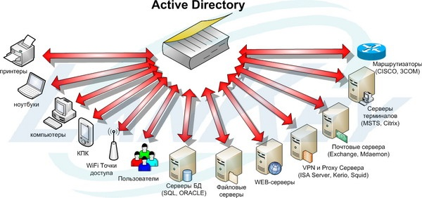

# Знакомство с Windows server


## Знакомство с Windows server 2019

#### Введение
**Windows Server 2019** — серверная операционная система от Microsoft, являющаяся частью семейства Windows NT. Операционная система была анонсирована 20 марта 2018 года, и в тот же день была выпущена первая сборка по программе Windows Insider. Выход финальной версии состоялся 2 октября 2018 года. Изначально систему планировали выпустить под названием Windows Server 2016 R2. Следующая система стала Windows Server 2022, она вышла 18 августа 2021.

Microsoft анонсировала опции для пользователя при инсталляции: Desktop (c GUI) и Server Core (для удалённой поддержки). Среди ключевых новых функций: более глубокая поддержка виртуальных машин, включая виртуальные машины на Linux, интерфейс от Windows 10 (сборка 1809) и улучшенный Windows Defender.

#### Особенности Windows Server 2019

1. Подсистема Windows для Linux: Обеспечивает возможность установки и запуска Linux-приложений непосредственно на операционной системе Windows, повышая совместимость и удобство разработки.

2. Поддержка Kubernetes: Позволяет развертывать, управлять и оркестрировать контейнеры с использованием Kubernetes на системах Windows Server, обеспечивая масштабируемость и надежность в разработке приложений.

3. Функции графического интерфейса пользователя из Windows 10 1809 сборки: Включает в себя улучшенный интерфейс Windows 10 с новыми функциональными возможностями и оптимизированным пользовательским опытом.

4. Storage Spaces Direct: Позволяет создавать высокодоступные и масштабируемые хранилища данных, используя встроенные возможности кластеризации и управления хранилищем в Windows Server.

5. Storage Migration Service: Служит для миграции данных с устаревших серверов и хранилищ на более современные платформы с минимальным временем простоя и потерей информации.

6. Storage Replica: Предоставляет возможность репликации данных между различными хранилищами на разных уровнях Windows Server для обеспечения отказоустойчивости и защиты информации.

7. System Insights: Обеспечивает анализ и прогнозирование работы серверов, предоставляя администраторам информацию о состоянии и производительности системы для оптимизации ресурсов.

8. Обновленный Защитник Windows: Предоставляет улучшенную защиту от вредоносного программного обеспечения и интернет-угроз, обеспечивая безопасность операционной системы и данных.

9. Вложенная виртуализация в Hyper-V(КАМ): Позволяет запускать виртуализированные среды внутри виртуализированных сред, что полезно для тестирования, разработки и виртуального обучения.

10. Windows Admin Center (WAC): Централизованный инструмент для управления серверами и средами Windows, предоставляющий удобный веб-интерфейс для администрирования.

11. Гибридное облако: Обеспечивает интеграцию и совместимость между локальными серверами и облачными службами, обеспечивая гибкость и масштабируемость в управлении данными и приложениями.

#### Установка и конфигурация Windows Server 2019

**Минимальные требования:**

- 64-разрядный процессор с тактовой частотой 1,4 ГГц;
- ОЗУ 512 МБ (2 ГБ для варианта установки "Сервер с рабочим столом");
- диск 32 ГБ;
- доступ к Интернет.
- Первоначальные настройки Windows Server 2019 можно разделить на несколько пунктов:

**Порядок настройки Windows Server**

1. Создание новой учетной записи Администратора.
```bash
compmgmt.msc
```
`на вкладке “Локальные пользователи и группы” переходим в “Пользователи” и по клику правой кнопки мыши в основном окне выбираем пункт “Новый пользователь”. После создаем пользователя, задаем ему пароль и выдаем права Администратора. Затем выходим из учетной записи “Администратор” и заходим в свою новую учетную запись.`
***
2. Настройка статического IP-адреса сервера.
```bash
ncpa.cpl
```
`В окне “Состояние” выберите Свойства -> IP версии 4(TCP/IP) -> Использовать следующий IP-адрес -> Введите данные статического адреса -> Нажмите “Ок”`
***
3. Проверка правильности настройки времени и часового пояса.
`Для настройки времени и часового пояса нажмите на: Пуск -> Параметры -> Время и язык`
***
4. Задать понятное имя для сервера и, при необходимости, ввести его в домен
```bash
control
```
***
5. Настроить основные параметры безопасности.
```bash
secpol.msc
```

***

6. Настройка ролей сервера


## Службы AD, домен Windows

**Службы Active Directory (AD)** в Windows Server предназначены для управления объектами в сети, такими как пользователи, группы, компьютеры и ресурсы. Они предоставляют централизованную систему управления доступом к ресурсам, аутентификации пользователей, авторизации и политикам безопасности. Службы AD также обеспечивают единую точку управления и администрирования всех сетевых объектов, упрощая процесс управления и поддержки сетевой инфраструктуры.



#### Компоненты Службы Active Directory (AD):

1. Домен: Группа компьютеров, пользователей, устройств и других объектов, объединенных общим именем домена. Домен обеспечивает централизованное управление и аутентификацию пользователей и ресурсов.

2. Каталог: Структурированное хранилище информации об объектах в сети, таких как пользователи, группы, компьютеры, ресурсы и политики безопасности. Каталог Active Directory (обычно используется служба LDAP) обеспечивает поиск и доступ к информации.

3. Форест: Группа доменов Active Directory, связанных между собой и образующих единую иерархическую структуру совместного управления и ресурсами. Форест обеспечивает масштабируемость, гибкость и единое управление объектами и данными в различных доменах.

4. Дерево: Группа доменов Active Directory, объединенных в единую иерархическую структуру. Каждый домен в дереве имеет общее глобальное дерево именования, что упрощает управление и взаимодействие между доменами.

5. Глобальный каталог: Специальный каталог Active Directory, содержащий краткую информацию об объектах всех доменов в лесу. Глобальный каталог упрощает поиск и доступ к информации о пользователях, группах и ресурсах в много-доменной среде.

6. Организационная единица (OU): Логическая группировка объектов AD внутри домена, позволяющая управлять ими через централизованные политики, настройки и разрешения доступа. Организационные единицы облегчают управление объектами и упрощают дополнительные настройки.

## Серверные службы и роли

#### Роли и функции Windows Server 2019
1. Роль "Активный каталог и службы домена" в Windows Server отвечает за управление пользователями, компьютерами, группами и другими объектами сети, а также обеспечивает аутентификацию, авторизацию и управление доступом к ресурсам.


2. Роль "Файловые и хранилища" обеспечивает централизованный доступ к файлам и папкам, позволяет сохранять и организовывать данные, а также управлять общим доступом к файловым ресурсам в сети.

3. Роль "Сетевые службы" обеспечивает функциональность сети, включая настройку сетевых параметров, маршрутизацию, механизмы безопасности, управление сетевым трафиком и соединениями.

4. Роль "Виртуализация" предоставляет возможность создания, управления и развёртывания виртуальных машин на сервере, оптимизируя использование аппаратных ресурсов и обеспечивая легкость масштабирования.


5. Роль "Безопасность и службы аудита" отвечает за обеспечение безопасности системы, включая защиту от вредоносных программ, контроль доступа к ресурсам, аудит и мониторинг безопасности.

6. Роль "Мониторинг и управление ресурсами" предоставляет инструменты для мониторинга и управления ресурсами сервера, включая контроль производительности, нагрузки системы, использования ресурсов и оптимизацию работы сервера.

***

## Дополнительные средства управления и мониторинга домена

1. Group Policy Management Console (GPMC): Инструмент для создания, редактирования и управления групповыми политиками в домене Active Directory. GPMC позволяет централизованно назначать и применять политики безопасности, настроек компьютеров и пользователей.


2. Active Directory Users and Computers (ADUC): Утилита для управления пользователями, группами, компьютерами и другими объектами домена Active Directory. ADUC позволяет создавать, изменять и удалять объекты, управлять их свойствами, назначать разрешения и многое другое.


3. Active Directory Administrative Center: Инструмент с более удобным и интуитивным интерфейсом для управления объектами и сервисами домена Active Directory. Предоставляет расширенные возможности по поиску, фильтрации и выполнению операций с объектами AD.


4. Windows PowerShell: Мощный сценарный язык и среда командной строки для автоматизации управления и конфигурации домена и других служб Windows Server. PowerShell позволяет создавать скрипты, выполнение команд и сценарии для автоматизации административных задач.


5. Remote Server Administration Tools (RSAT): Набор инструментов, предоставляющий возможность управлять удаленными серверами и ролями Windows Server с локального компьютера. RSAT включает в себя утилиты для управления Active Directory, DNS, DHCP, Hyper-V, файловыми службами и другими компонентами.


6. Диспетчер серверов:  является центральным инструментом управления для администрирования ролей, служб и функций на сервере Windows. Он предназначен для упрощения управления сервером, установки и настройки ролей и служб, мониторинга состояния сервера и выполнения других административных задач.


7. Консоль управления (MMC) используется для создания, сохранения и открытия средств администрирования, называемых консолями, которые управляют оборудованием, программным обеспечением и сетевыми компонентами операционной системы Microsoft Windows. MMC работает во всех клиентских операционных системах, которые в настоящее время поддерживаются.
`выполнить > mmc`


***
## Домашнее задание
1. Настроить на виртуальном сервере контроллер домена AD, 
2. Cоздать домен
3. Подклюить к нему рабочую станцию 
4. Создать локального пользователя с правами администратора

**Исходные данные**

### настройка VPN в Windows для работы с сетью levelUP
    параметры сети и интернет
        VPN
            добавить VPN подключение
                поставщик услуг VPN - Windows
    имя подключения
        lap
    имя или адрес сервера
        79.175.2.26
    тип VPN
        протокол PPTP
    имя
        vpn-lup
    пароль
        99h3367a!kQ|Ed
    сетевые подключения
        адаптер VPN
            свойства
                сеть
                    свойства IP версии 4
                        дополнительные параметры TCP/IP
                            убрать отметку - использовать основной шлюз в удаленной сети


**Подключение к виртуальной машине, настройка VPN**

Для подключения к виртуальной машине скачиваем VNC-клиент на компьютер администратора, например, TightVNC и устанавливаем его [ссылка для загрузки](http://www.tightvnc.com/download.php1)

Virtual Network Computing (виртуальное сетевое обеспечение)- это технология, которая позволяет удаленно управлять компьютером или устройством через интернет. 

Запускаем установленный TightVNC Viewer, в открывшемся окне вводим IP-адрес сервера KVM и VNS порт, на котором слушает наша ВМ

***

*|                  Андрей Чуян   | Павел Нефедов | Иван Чулков   | Александр Токаревич  | Тамерлан Бачаев   | Алексей Ханько
---------         |----------     |---------      |----------     |---------      |----------     |---------
 Номер записи     | 0             | 1             | 2             | 3             | 4             | 5             
 VNS порт сервера | 5900          | 5910          | 5920          | 5930          | 5940          | 5950          
 Адрес сервера    | 192.168.2.100 | 192.168.2.110 | 192.168.2.120 | 192.168.2.130 | 192.168.2.140 | 192.168.2.150 
 Имя сервера      | WS19-0        | WS19-1        | WS19-2        | WS19-3        | WS19-4        | WS19-5        
 Имя домена       | WS19-0.local  | WS19-1.local  | WS19-2.local  | WS19-3.local  | WS19-4.local  | WS19-5.local  
 Рабочая станция                                                              
 VNS порт станции | 5901          | 5911          | 5921          | 5931          | 5941          | 5951          
 Имя станции      | W10-0         | W10-1         | W10-2         | W10-3         | W10-4         | W10-5         

***
## Домашнее задание
1. Подключится к рабочей станции через VPN подключение
2. Настроить RDP доступ для сервера и рабочей станции
3. Создать домен AD
4. Настроить mmc консоль

(отчеты заданий - скриншот)
***
**дополнительно**
1. Создать подразделения и пользователей:
    - it c учетной записью администратора
    - bux с учетной записью пользователя
    - bibl с гостевой учетной записью
2. Настроить гостевую запись на работу днем и только на станции (из талицы выше, например: W10-<ваш номер>), запретить смену пароля, дать доступ пользователю до конца года
3. Создать компьютер в подразделении bibl (из талицы выше, например: W10-<ваш номер>)

(отчеты заданий - скриншот)
***
**Для отчета:**
- Cоздать в личном репозитории организаци github ветку lesson_2_1
- Cоздать директорию lesson_2_1 и разместить отчет о проделанной работе
- Cделать push и pull request на сайте, в качестве рецензента добавить пользователя AndreyChuyan