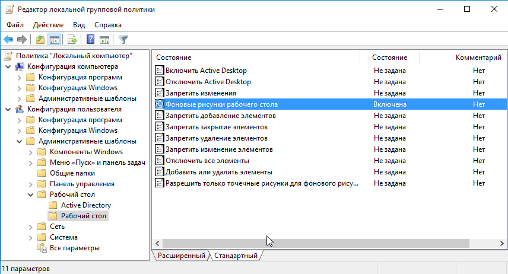

# Возможности домена AD 

## DNS, DHCP

**DNS (Domain Name System)** в Windows Server 2019 является службой, отвечающей за преобразование доменных имен в IP-адреса и наоборот. Он является ключевым элементом инфраструктуры сети и обеспечивает корректную маршрутизацию и связность в сети. Вот краткий обзор основных характеристик DNS в Windows Server 2019:

1. Зона DNS: В Windows Server 2019 вы можете настроить различные зоны DNS, такие как зоны прямого и обратного поиска, которые содержат записи о доменных именах и соответствующих IP-адресах.
   - Зоны прямого поиска (Forward Lookup Zone): Здесь содержатся записи, позволяющие преобразовывать доменные имена в IP-адреса. Они осуществляются сопоставление доменного имени (например, example.com) с соответствующим IP-адресом.
   - Зоны обратного поиска (Reverse Lookup Zone): Здесь содержатся записи, позволяющие преобразовывать IP-адреса в доменные имена. Это позволяет определить, какому доменному имени соответствует определенный IP-адрес.

2. Роли DNS-сервера: Windows Server 2019 поддерживает различные роли DNS-сервера, такие как основной DNS-сервер, дополнительный DNS-сервер и кэширующий DNS-сервер, предоставляющие определенные функции и возможности для обработки запросов.
   - Основной DNS-сервер (Primary DNS Server): Хранит основные записи зоны DNS и может обновлять их.
   - Дополнительный DNS-сервер (Secondary DNS Server): Получает копию зон из основного DNS-сервера и обеспечивает отказоустойчивость и распределение нагрузки.
   - Кэширующий DNS-сервер (Caching DNS Server): Хранит информацию о запросах DNS в кэше для ускорения последующих запросов.   

3. Защита DNS: Windows Server 2019 включает в себя механизмы защиты DNS, такие как DNSSEC (DNS Security Extensions) и DNS ресурсы для защиты сетевых ресурсов от атак и вредоносных действий.
   - DNSSEC (DNS Security Extensions): Криптографический механизм защиты, который обеспечивает подпись DNS-зон и обнаружение изменений.
   - DNS ресурсы для защиты: Защита от различных типов атак, таких как DNS-отравление (DNS poisoning), перехват, транспонирование запросов и других.

DNSSEC основана на криптографии с открытым ключом, сертификатах и цифровых подписях.

Процесс сертификации в основном основан на цифровой подписи. Каждая запись дополняется подписанной версией хэша, которая может быть использована клиентом или рекурсивным DNS-сервером для проверки записи. Открытые ключи публикуются в записях, позволяющих запрашивающему лицу проверять подписи с использованием принципа цифровой подписи: закрытый ключ используется для создания подписи, которая может быть проверена с помощью открытого ключа.

4. Инструменты администрирования: Windows Server 2019 предлагает инструменты администрирования DNS, такие как утилита PowerShell и Диспетчер серверов, позволяющие управлять настройками и конфигурацией DNS-сервера.

## Групповые политики, удаленная установка программ

**Групповые политики (Group Policies)** в Windows Server 2019 - это мощное средство управления средой и безопасностью в корпоративных сетях. Групповые политики позволяют администраторам централизованно управлять настройками компьютеров и пользователей в сети. Вот основные характеристики и возможности Групповых политик в Windows Server 2019:

1. Централизованное управление: Групповые политики позволяют администраторам создавать и применять настройки безопасности, настроек рабочего стола, программ и других компонентов для всех компьютеров и пользователей в домене.

2. Применение настроек: С помощью Групповых политик можно назначить определенные настройки каждому компьютеру или пользователю в домене. Применение настроек происходит автоматически при входе в систему.

3. Безопасность: Групповые политики позволяют установить правила безопасности для компьютеров и пользователей, такие как ограничения доступа к ресурсам и функциям, настройки паролей и шифрования.

4. Автоматизация административных задач: С помощью Групповых политик можно автоматизировать основные административные задачи, такие как установка программ, настройка сетевых параметров, обновление систем и другие.

5. Отчетность и аудит: Групповые политики позволяют вести отчетность и аудит использования ресурсов, действий пользователей и конфигурации компьютеров.

6. Гибкие настройки: В Windows Server 2019 представлено большое количество встроенных шаблонов групповых политик для различных установок, а также возможность создавать собственные шаблоны под конкретные потребности среды.

## Безопасность домена

Безопасность домена в Windows Server 2019 обеспечивается такими механизмами, как:

1. Active Directory:
   - Управление учетными записями: Active Directory предоставляет возможность создавать учетные записи пользователей и управлять ими, назначая им права доступа к ресурсам в сети.
   - Групповые политики (Group Policies): Групповые политики позволяют централизованно настраивать безопасность, режимы работы и интерфейс всех компьютеров и пользователей в домене.

2. Контроль доступа:
   - Модель наименьших привилегий: Реализована концепция наименьших привилегий, при которой пользователи получают только необходимые права доступа для выполнения своих задач.
   - Управление доступом: С помощью Active Directory можно устанавливать ограничения на доступ пользователей к определенным файлам, папкам или другим ресурсам.

3. Шифрование данных:
   - BitLocker: Встроенный инструмент для шифрования дискового пространства, который обеспечивает защиту данных на диске в случае утери или кражи устройства.

4. Многофакторная аутентификация:
   - Windows Hello: Позволяет устанавливать многофакторную аутентификацию с использованием биометрических данных или других методов, кроме пароля, для повышения уровня безопасности.

5. Антивирусное программное обеспечение:
   - Регулярное использование и обновление антивирусного программного обеспечения помогает защитить сервер от вредоносных программ и атак.

6. Брандмауэр:
   - Включение и настройка брандмауэра помогает контролировать трафик в сети и предотвращать несанкционированный доступ к серверу и ресурсам.

7. Обновления системы:
   - Регулярные установки обновлений для операционной системы и установленного программного обеспечения помогают закрывать известные уязвимости и обеспечивать актуальный уровень безопасности.

8. Автоматическое паролирование локальной учетной записи админситратора
   
**Какие шаги принять в первую очередь:**

- Установка и обновление антивирусного ПО: Установка надежного антивирусного программного обеспечения на сервера и рабочие станции поможет защитить систему от вредоносных программ и вирусов. Важно регулярно обновлять базы данных вирусов для обеспечения защиты от новых угроз.

- Включение брандмауэра: Активация брандмауэра на сервере Windows Server 2019 поможет контролировать трафик в сети и защитить сервер от несанкционированного доступа.

   1. Откройте настройки брандмауэра:
      - Зайдите в "Control Panel" -> "System and Security" -> "Windows Defender Firewall".

   

   2. Настройте правила брандмауэра:
      - В левой панели выберите "Advanced settings".
      - В разделах "Inbound Rules" (Входящие правила) и "Outbound Rules" (Исходящие правила) вы можете создавать и настраивать правила брандмауэра для управления трафиком сервера.

         

   3. Создание нового правила брандмауэра:
      - Для создания нового правила выберите "New Rule...".
      - Выберите тип правила (например, программное правило, портовое правило, правило протокола и т.д.) и следуйте мастеру создания правила, указывая необходимые параметры.

    
   
   
   
      

   4. Настройка общих правил брандмауэра:
      - Проверьте и настройте общие правила брандмауэра, такие как блокирование определенных портов, программ или протоколов, доступ для определенных приложений и т.д.

      

   5. Проверка журналов брандмауэра:
      - В разделе "Monitoring" (Мониторинг) вы можете просматривать и анализировать журналы действий брандмауэра для отслеживания событий и возможных нарушений безопасности

Например дляразрешения ping на Windows Server 2019 через брандмауэр:
   Откройте порт ICMP:
      - Нажмите Win + R и введите "wf.msc", чтобы открыть Windows Defender Firewall с расширенными защитными настройками.
      - В левой панели выберите "Inbound Rules" (Входящие правила).
      - Нажмите "New Rule" (Создать правило) в правой панели.
      - Выберите "Custom" (Пользовательские) и нажмите "Next".
      - Выберите "All programs" (Все программы) и нажмите "Next".
      - В качестве протокола выберите "ICMPv4" (или "ICMPv6" для IPv6) и нажмите "Next".
      - Выберите "Any IP address" (Любой IP-адрес) и нажмите "Next".
      - Выберите "Allow the connection" (Разрешить подключение) и нажмите "Next".
      - Укажите имя правила и описание (например, "Allow ICMP Ping") и нажмите "Finish".
      - Повторите те же шаги, но вместо входящего правила создайте исходящее правило для протокола ICMP.
      

***
- Использование сложных паролей: Установите политику сложности паролей для пользователей домена, требуя использование длинных, уникальных и сложных паролей. Регулярно меняйте пароли.
   
   В групповой политике перейдите к разделу "Computer Configuration" -> "Policies" -> "Windows Settings" -> "Security Settings" -> "Account Policies" -> "Password Policy"
     

   Эффективным программным среством по контрлю системных учетных записей администратора в домене является **LAPS** (Local Administrator Password Solution)
   [Статья по установке LAPS](https://habr.com/ru/articles/440624/)
     
   
   ***
- Ограничение доступа сессии по RDP. Доступ должен быть для конкретных пользователей.
   1. Добавить пользователя в группу "Remote Desktop Users":
      - Найдите группу "Remote Desktop Users" и дважды кликните на нее.
      - Нажмите "Add" и добавьте нужного пользователя в эту группу.
   2. Настройка прав доступа для RDP:
      - Нажмите правой кнопкой мыши на "Start" и выберите "System".
      - В левой части окна выберите "Remote settings".
      - Установите флажок "Allow remote connections to this computer".
      - Нажмите "Select Users" и добавьте пользователей, которым разрешен доступ по RDP.
   3. Настройка доступа через RDP с помощью Group Policy:
      - Откройте Group Policy Management Console (GPMC) (см. описание в предыдущем ответе).
      - Создайте новую групповую политику или выберите существующую в нужной OU.
      - Перейдите к разделу "Computer Configuration" -> "Policies" -> "Administrative Templates" -> "Windows Components" -> "Remote Desktop Services" -> "Remote Desktop Session Host" -> "Connections".
      - Настройте параметры "Restrict Remote Desktop Services users to a single Remote Desktop Services session" (Ограничить пользователей службы удаленного рабочего стола на одну сеанс службы удаленного рабочего стола) и "Limit number of connections" (Ограничить количество подключений).

         
       

- Ограничение прав доступа: Назначайте права доступа к ресурсам и данным в соответствии с принципом наименьших привилегий. Это означает, что пользователи получают только необходимые права для выполнения своих задач.

   1. Настройка доступа к файлам и папкам:
      - Выберите файл или папку, к которой вы хотите ограничить доступ.
      - Щелкните правой кнопкой мыши на этом элементе, выберите "Properties" (Свойства) -> "Security" (Безопасность) -> "Edit" (Изменить).
      - Укажите разрешенные и запрещенные права доступа для конкретных пользователей или групп.

   2. Управление учетными записями пользователей:
      - Используйте "Local Users and Groups" (Локальные пользователи и группы) для создания и управления учетными записями пользователей на сервере.
      - Добавляйте пользователей в группы, чтобы управлять ими централизованно и устанавливать права доступа в зависимости от группы.

   3. Использование групповых политик:
      - Создайте и настройте групповые политики через Group Policy Management Console (GPMC), чтобы ограничить права доступа для определенных групп пользователей.
      - Настройте политики безопасности, аудита и другие параметры для контроля прав доступа к различным ресурсам.

   4. Установка прав доступа на уровне служб и приложений:
      - Некоторые службы и приложения имеют собственные механизмы контроля доступа, которые позволяют ограничивать права пользователей на уровне приложения.

- Резервное копирование: Регулярно создавайте резервные копии данных, включая активы домена, на отдельные носители для защиты от потерь данных в случае сбоя или атаки.

   1. Установка роли "Windows Server Backup":
      - Зайдите в "Server Manager" -> "Add Roles and Features" -> выберите "Windows Server Backup" в списке ролей для установки.

       

   2. Запуск и настройка Windows Server Backup:
      - Зайдите в "Server Manager", выберите "Tools" -> "Windows Server Backup".
      - Выберите "Local Backup", затем "Backup Schedule" для запуска мастера настройки регулярного резервного копирования.

   3. Выбор типа резервного копирования:
      - Выберите, хотите ли вы создать полный резервный копирование или инкрементное резервное копирование.

   4. Выбор включаемых элементов:
      - Выберите, какие элементы (файлы, папки, системные разделы и т. д.) вы хотите резервно копировать.

       

   5. Выбор места хранения резервной копии:
      - Укажите место, где будет храниться резервная копия, например, на локальном диске, сетевом диске или удаленном сервере.

   6. Настройка расписания резервного копирования:
      - Укажите расписание резервного копирования (ежедневно, еженедельно и т. д.) и время запуска копирования.

   7. Сохранение и проверка настроек:
      - После завершения настройки, сохраните параметры резервного копирования и выполните проверку работоспособности путем запуска тестового копирования.

       

   8. Также возможно использование сторонних сервисов резервного копирования, например:
      - Veeam Backup & Replication (есть бесплатные версии)
      - Acronis Backup & Recovery Advanced Server (платное) 

- Мониторинг и аудит безопасности: Ведите постоянный мониторинг событий в системе с помощью инструментов аудита безопасности Windows Server 2019 для быстрого обнаружения и реагирования на потенциальные угрозы.

   1. Включение аудита в Windows Server 2019:
      - Установите опцию "Auditing" в разделе "Security" во время установки операционной системы или через "Group Policy" для включения функций аудита.

   2. Настройка групповых политик аудита:
      - Зайдите в "Group Policy Management Console" (GPMC) и создайте новую групповую политику для аудита безопасности.
      - Укажите параметры аудита, такие как успешные и неудачные попытки входа, обновления файлов и т. д.

       

   3. Настройка службы журнала аудита событий:
      - Зайдите в "Event Viewer" -> "Windows Logs" -> "Security".
      - Щелкните правой кнопкой мыши на "Security" и выберите "Properties" -> включите опцию "Define These Policy Settings".

   4. Просмотр журналов событий:
      - Используйте "Event Viewer" для просмотра журналов аудита безопасности.
      - Фильтруйте события аудита по типам событий (успешные или неудачные), пользователям, объектам и т. д.

***
## Домашнее задание
1. Настроить на виртуальном сервере DHCP для **внутренней сети** аналогично примеру (с учетом своих адресов)
 
   - Настроить автоматическое получение адресов рабочей станцией во внутренней сети 
   - подклюить к DHCP рабочую станцию
   - отправить вывод ipconfig станции 
   
2. Создать групповые политики для:
   - ограничения сложности пароля (не менее 8 символов, высокой сложности)
   - фонового изображения рабочего стола (ваш произвольный рисунок)
   - установка браузера firefox для подразделения bux
   - настройте политики аудита 

3. Создать правило брандмауэра для разрешения протокола icmp для всех станций, кроме контрллера домена

4. Создать на диске C: папку с правами изменения только для админстратора домена и чтения для всех остальных 

(отчеты заданий - скриншот)
***
**дополнительно**
1. Создать новую зону DNS на DNS-сервере Windows Server 2019.
   - Добавить новую A-запись для хоста "test" с IP-адресом 192.168.2.200 в созданной зоне DNS.
   - Убедиться, что A-запись "test" правильно прописана и доступна для разрешения по имени.
   - Убедиться, что nslookup вернул правильный IP-адрес для хоста "test"
   - отправить вывод в отчет

2. Настроить резервное копирование папки из задания 4 по расписанию каждый день в 18.00 (отчет - скриншот)

(отчеты заданий - скриншот)
***
**Для отчета:**
- Cоздать в личном репозитории организаци github ветку lesson_2_2
- Cоздать директорию lesson_2_2 и разместить отчет о проделанной работе
- Cделать push и pull request на сайте, в качестве рецензента добавить пользователя AndreyChuyan