# Серверное применение Windows


## Серверное применение Windows

Основные плюсы серверов под управлением Windows — относительная простота администрирования, достаточно большой пласт информации, мануалов и ПО. Кроме того, вы не сможете обойтись без сервера на Windows, если в экосистеме компании есть программное обеспечения или решения, использующие библиотеки и части ядра систем Microsoft. Также сюда можно добавить технологию RDP для доступа пользователя к серверным приложениям и общую универсальность системы. Кроме того, Windows Server обладает облегченной версией без GUI с ресурсопотреблением на уровне Linux-дистрибутива — Windows Server Core, о которой мы писали ранее. Все серверы под управлением Windows мы поставляем с активированной лицензией (для новых пользователей она бесплатная).

В минусы Winserver можно записать сразу два параметра: стоимость лицензии и потребление ресурсов. Среди всех серверных ОС Windows Server наиболее прожорлива и требует минимум одно ядро процессора и от полутора до трех гигабайт оперативной памяти просто для работы ядра и стандартных служб. Эта система не подходит для маломощных конфигураций, а также имеет ряд уязвимостей, связанных с RDP и политиками групп и пользователей.

Чаще всего Windows Server предназначена для администрирования интранетов компаний и обеспечения работоспособности специфического ПО, работы баз данных MSSQL, или другого созданного специально для Windows ПО. При этом это все еще полноценная ОС, на которой можно развернуть маршрутизацию, поднять DNS или любую другую службу.

## Файловый сервер

Настройка файлового сервера на Windows Server 2019 включает в себя установку и настройку роли службы файлового сервера, создание и настройку распределенных файловых систем (DFS), управление разрешениями доступа и многое другое:

1. Установите роль службы файлового сервера:
   - Откройте "Server Manager".
   - Нажмите "Add roles and features".
   - Выберите "Role-based or feature-based installation".
   - Выберите сервер и добавьте роль "File and Storage Services".
   - Выберите необходимые фичи (например, File Server, Data Deduplication).
   - Установите роль.
   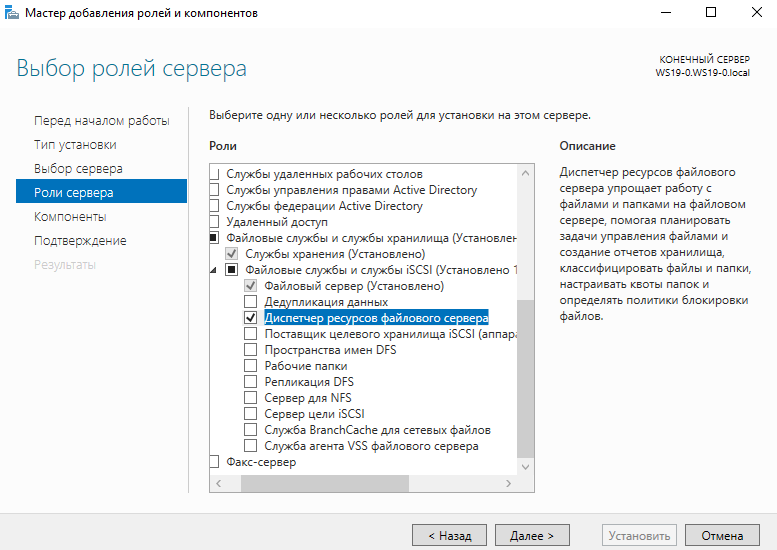
   
2. Создайте новый объем для хранения файлов:
   - Откройте "Server Manager".
   - Перейдите в "File and Storage Services".
   - Выберите "Disks" и создайте новый том для файлов.

3. Создайте папки для файлов:
   - Откройте "Server Manager" и перейдите в "File and Storage Services".
   - Выберите "Shares" и создайте новую общую папку.
   - Настройте разрешения доступа к папкам.
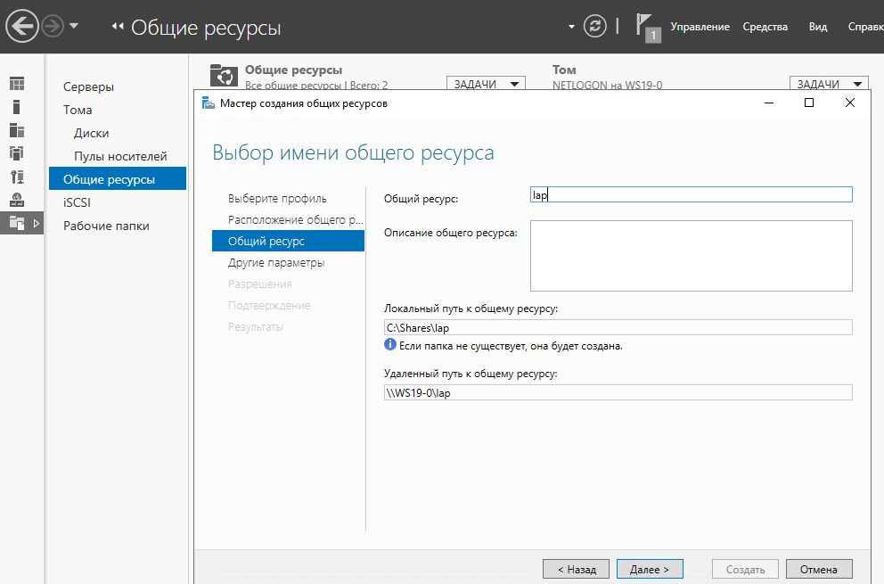

4. Настройте DFS (опционально) (это технология в операционных системах Windows, которая позволяет организовать распределенную файловую систему для управления и репликации файлов на сети. DFS позволяет пользователям и администраторам обращаться к группам файлов, размещенных на различных серверах, как к одному целому, предоставляя централизованный доступ к данным):
   - Создайте домены и пространства имен DFS.
   - Настройте папки для репликации. 

5. Настройте разрешения доступа к файлам:
   - Используйте группы для управления доступом к файлам.
   - Настройте права доступа на уровне папок и файлов.

6. Настройте аудит доступа к файлам (опционально):
   - Включите аудиторское отслеживание в политиках безопасности.
   - Настройте параметры аудита для файлов и папок.

7. Важно обеспечить регулярное резервное копирование данных, чтобы предотвратить потерю информации в случае сбоя.

## Web-сервер: IIS

Настройка веб-сервера IIS (Internet Information Services) на Windows Server 2019 позволит вам развернуть веб-приложения, хранить веб-сайты и обслуживать HTTP-запросы:

1. Установите роль службы веб-сервера (IIS):
   - Откройте "Server Manager".
   - Нажмите "Add roles and features".
   - Выберите "Role-based or feature-based installation".
   - Выберите сервер и добавьте роль "Web Server (IIS)".
   - Выберите необходимые компоненты и зависимости (например, Common HTTP Features, ASP.NET).
   - Установите роль.
   - Чтобы убедиться, что службы IIS успешно установлены, введите в веб-браузер следующее:
   `http://localhost`

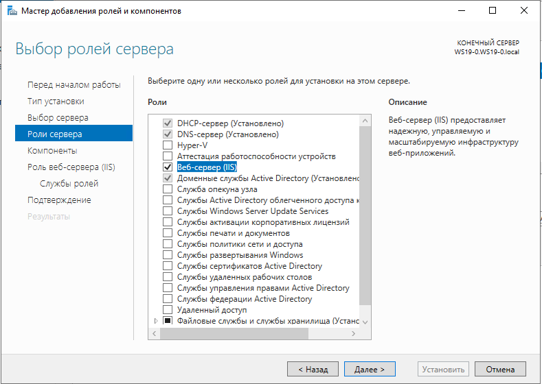

2. После установки IIS откройте IIS Manager для управления вашим веб-сайтом:
   - Нажмите "Start" и введите "inetmgr" в поиске или запустите "Internet Information Services (IIS) Manager".

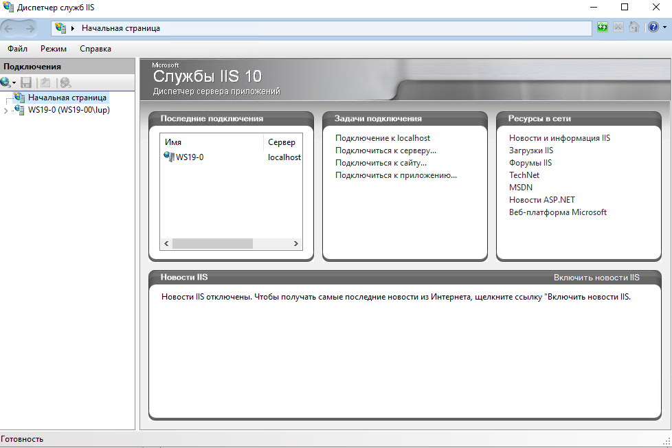

3. Создайте сайт или веб-приложение:
   - В IIS Manager выберите ваш сервер.
   - Щелкните правой кнопкой мыши на "Sites" и выберите "Add Website" для создания нового сайта.
   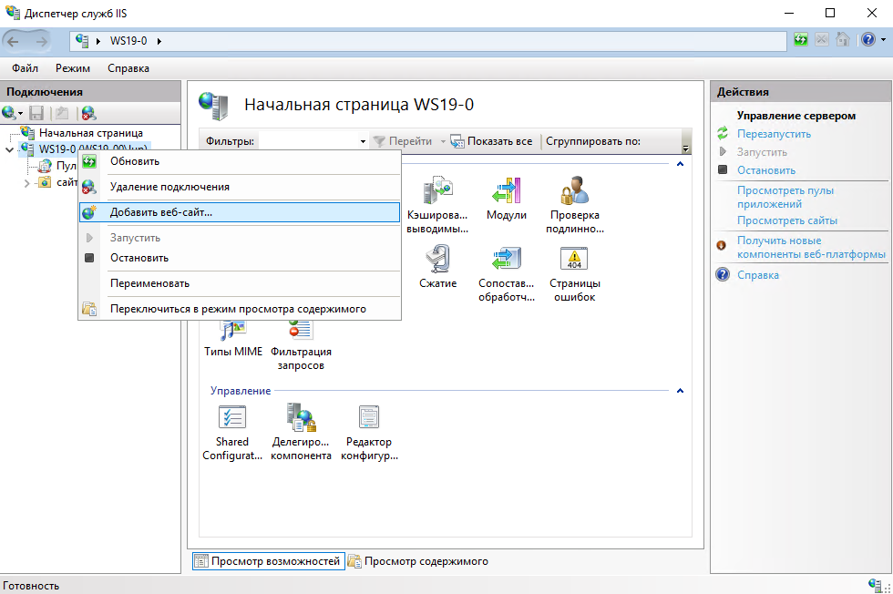
   - Укажите имя сайта, путь к содержимому и порт.
   например [тестовый шаблон](https://html-free-templates.ru/)
   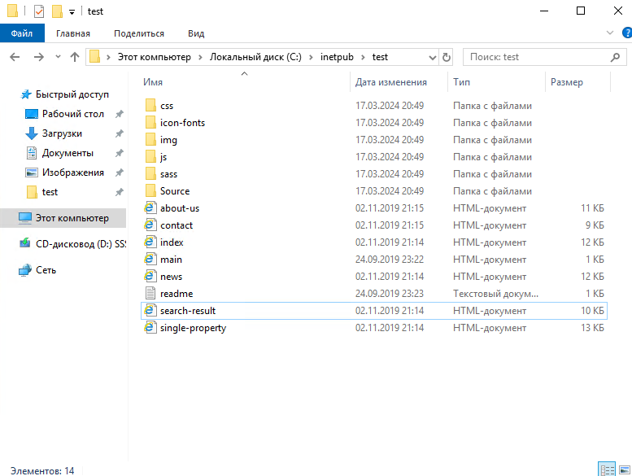
   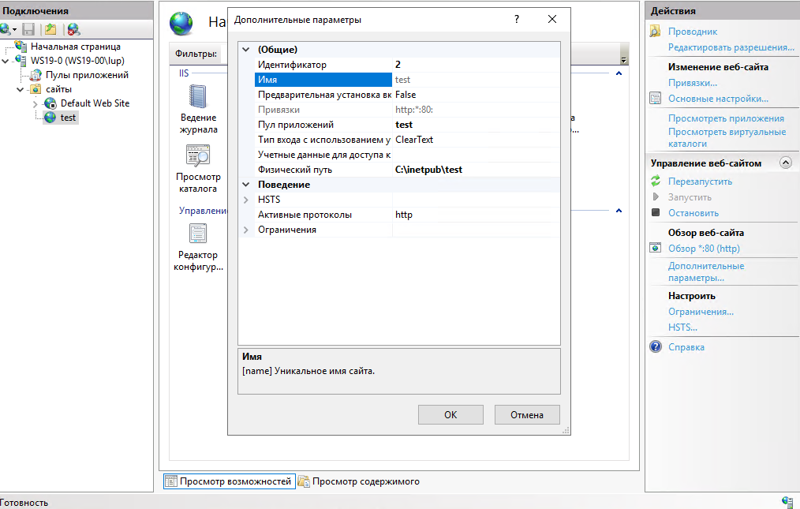
   
   - Настройте прочие параметры по необходимости (SSL, авторизация и т.д.).
   - Сохраните изменения.

4. Настройте привязки (bindings) сайта:
   - Чтобы указать, какими протоколами и портами будет обслуживаться сайт, настройте привязки.
   - В IIS Manager выберите ваш сайт и щелкните "Bindings" в правой панели.
   - Добавьте и настройте необходимые привязки.

5. Настройте разрешения доступа:
   - Откройте "Content" для вашего сайта и убедитесь, что права доступа настроены правильно для содержимого сайта (файлы, папки и т.д.).

6. Проверьте работу веб-сайта, обратившись к его URL в веб-браузере.
  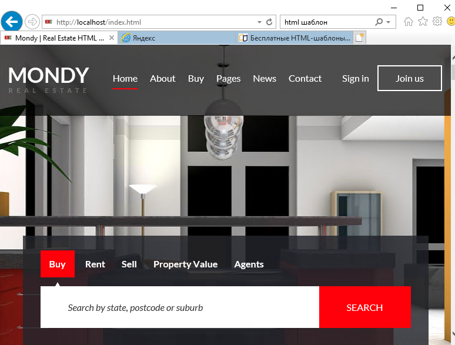

7. Не забывайте обеспечить безопасность вашего веб-сервера: настройте брандмауэр, используйте SSL-сертификаты, обновляйте IIS.

## Сервер баз данных: Ms sql server

Настройка сервера баз данных Microsoft SQL Server на Windows Server 2019 включает установку SQL Server, настройку экземпляра, создание базы данных, настройку аутентификации и другие конфигурационные шаги. Вот как это можно сделать:

1. Установите Microsoft SQL Server на сервер с Windows Server 2019:
   - Загрузите установочные файлы SQL Server с официального сайта Microsoft.
   [инструкция по установке](https://learn.microsoft.com/ru-ru/sql/database-engine/install-windows/install-sql-server?view=sql-server-ver16)
   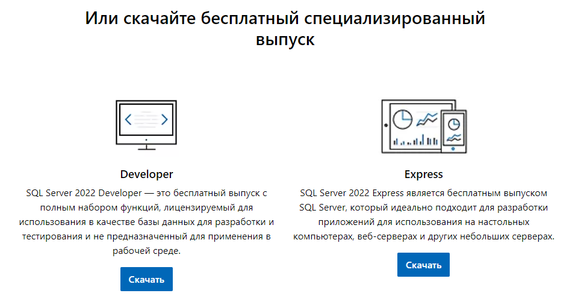

   - Запустите установщик SQL Server.
   - Следуйте инструкциям мастера установки для выбора компонентов, настройки параметров экземпляра, установки распространенных правил конфигурации и других параметров.
   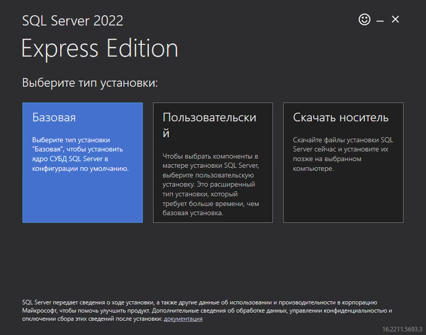
   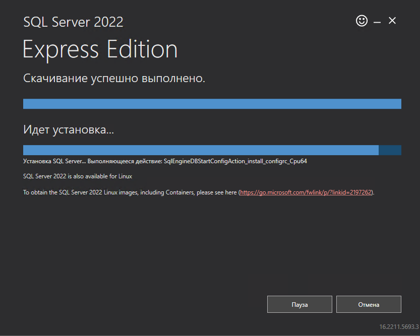
   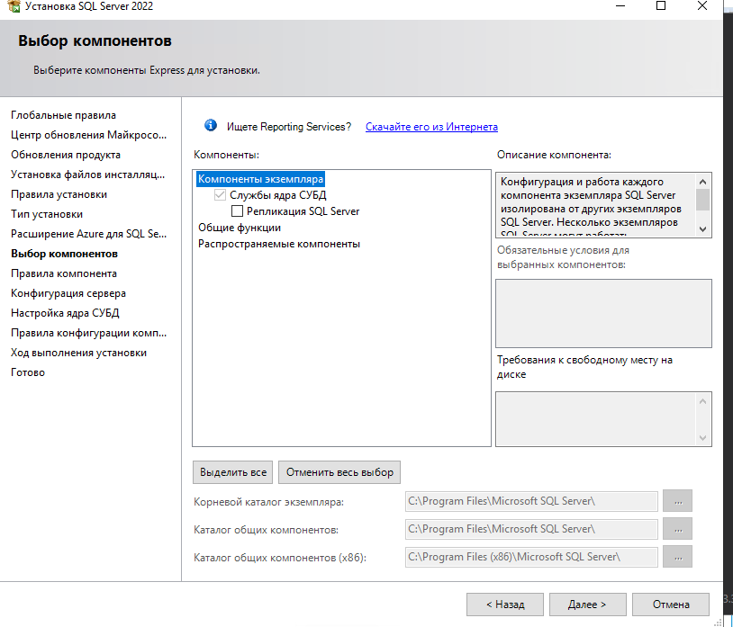
   - Убедитесь, что службы SQL Server запущены и работают.

2. Создайте базу данных в SQL Server:
   - Подключитесь к SQL Server Management Studio (SSMS).
   - Используйте язык SQL для создания новой базы данных. Например:

```sql
     CREATE DATABASE MyDatabase;
```

3. Настройте аутентификацию для сервера и базы данных:
   - В SSMS откройте свойства сервера и настройте безопасность и аутентификацию, например, выбор варианта аутентификации, добавление новых логинов и настройка разрешений.
   - Настройте разрешения доступа к базе данных для различных пользователей и ролей.

4. Настройте резервное копирование базы данных:
   - Создайте задачу резервного копирования для базы данных SQL Server, чтобы обеспечить безопасность данных и возможность восстановления в случае сбоев.

5. Проверьте стабильность и работоспособность базы данных:
   - Выполните тестирование и мониторинг работоспособности баз данных для обеспечения их надежной работы.

## Почтовый сервер: MS Exchange server

Настройка почтового сервера Microsoft Exchange Server на Windows Server 2019 является сложным и масштабным процессом, который включает в себя установку Exchange Server, настройку почтовых ящиков, конфигурацию отправки и приема почты, настройку безопасности и многое другое. Вот общий шаговый план для настройки почтового сервера Microsoft Exchange Server на Windows Server 2019:
[требования по установке](https://learn.microsoft.com/ru-ru/exchange/plan-and-deploy/system-requirements?view=exchserver-2019)

[инструкция по установке](https://habr.com/ru/companies/ultravds/articles/479850/)

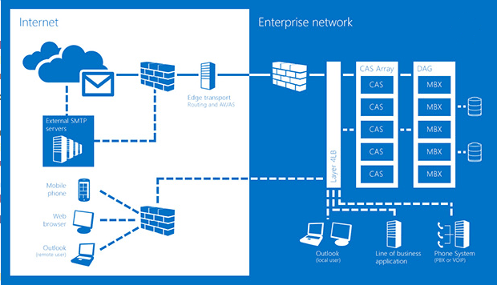
1. Установите Microsoft Exchange Server на сервер с Windows Server 2019:
   - Загрузите установочные файлы Exchange Server с официального сайта Microsoft.
   - Запустите установщик Exchange Server.
   - Следуйте инструкциям мастера установки для выбора компонентов, настройки параметров сервера, установки правил конфигурации и других параметров.
   - Убедитесь, что все требуемые компоненты установлены и службы Exchange Server работают.


2. Создайте почтовые ящики и настройте пользователей:
   - Используйте Exchange Admin Center или Exchange Management Shell для создания новых почтовых ящиков и настройки пользователей.
   - Настройте параметры почтовых ящиков, включая емкость ящика, права доступа и другие настройки.

3. Настройте отправку и прием почты:
   - Настройте подключение к вашему провайдеру услуг почтового обмена (ISP) для отправки и приема почты.
   - Настройте коннекторы для отправки и приема почты через внешние почтовые службы.

4. Настройте безопасность:
   - Обеспечьте безопасность сервера Exchange с помощью настройки аутентификации, защиты от вредоносных программ, шифрования и других мер безопасности.
   - Настройте защиту почтовых ящиков и конфиденциальную информацию.

5. Настройте резервное копирование данных:
   - Создайте регулярные резервные копии данных Exchange Server для обеспечения безопасности и возможности восстановления данных в случае сбоя.

6. Выполните тестирование и мониторинг работоспособности Exchange Server для обеспечения стабильной работы почтовой инфраструктуры.

## Служба виртуализации Hyper-V
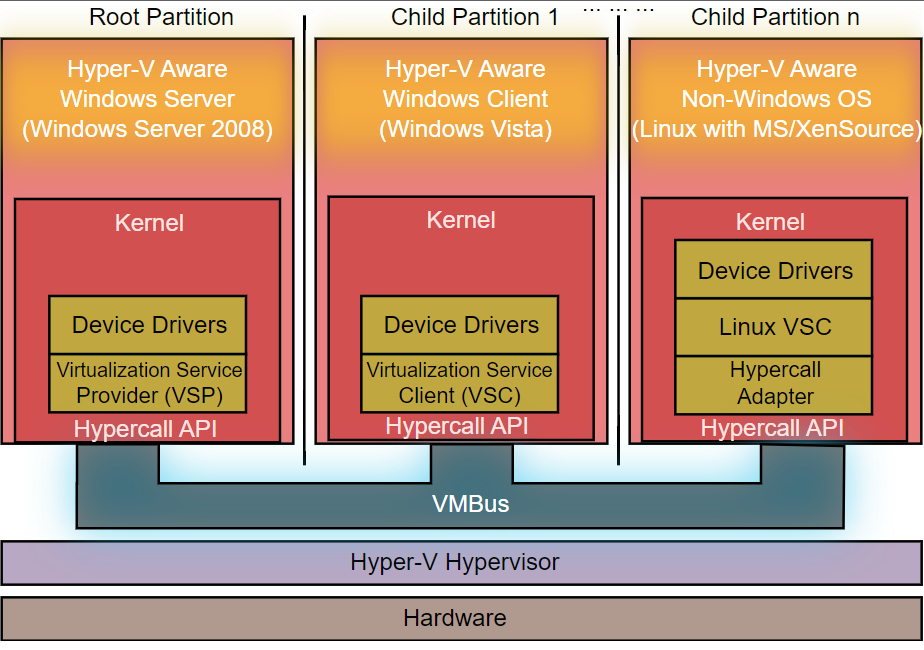

**Служба виртуализации Hyper-V** (Hyper-V Virtualization Service) - это гипервизорная ролевая служба, предоставляемая Microsoft в операционных системах Windows Server, которая позволяет создавать и управлять виртуальными машинами. Hyper-V обеспечивает возможность запуска нескольких виртуальных операционных систем на одном физическом сервере, что позволяет максимально эффективно использовать ресурсы оборудования.

Основные особенности и возможности службы виртуализации Hyper-V:

1. Виртуализация уровня сервера: Hyper-V предоставляет гипервизорный слой, который позволяет создавать и управлять виртуальными машинами на уровне сервера.

2. Изоляция и безопасность: Каждая виртуальная машина работает изолированно друг от друга, что повышает безопасность и защиту от воздействия одной виртуальной машины на другие.

3. Возможность запуска различных операционных систем: Hyper-V поддерживает запуск различных операционных систем, включая Windows Server, различные дистрибутивы Linux, и другие.

4. Оптимизация ресурсов: Hyper-V обеспечивает динамическое распределение ресурсов между виртуальными машинами в зависимости от их нагрузки и потребностей, что позволяет эффективно использовать оборудование.

5. Сетевая виртуализация: Hyper-V позволяет настраивать виртуальные сети и соединения между виртуальными машинами и физическими сетями, обеспечивая возможность виртуальной сегментации и маршрутизации.

6. Управление и мониторинг: Hyper-V обеспечивает множество инструментов и интерфейсов для управления виртуализированными средами, включая Hyper-V Manager, PowerShell cmdlets и System Center Virtual Machine Manager.

Служба виртуализации Hyper-V широко используется организациями для создания виртуализированных инфраструктур, тестирования приложений, обеспечения отказоустойчивости и резервирования данных, а также многих других целей, связанных с виртуализацией серверов.

## Терминальный сервер и службы удаленных рабочих столов

Настройка терминального сервера и служб удаленных рабочих столов (Remote Desktop Services) на Windows Server 2019 включает установку роли служб терминалов, настройку удаленных рабочих столов, настройку пользователей для удаленного доступа и другие конфигурационные действия:
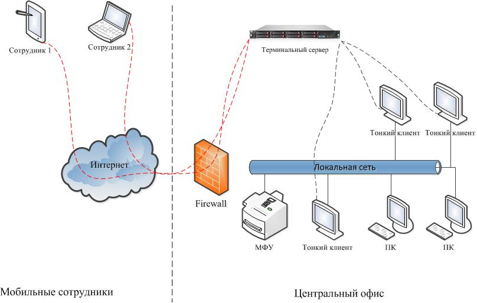

1. Установите роль 'Remote Desktop Services' на сервере с Windows Server 2019:
   - Откройте 'Server Manager' и выберите 'Add Roles and Features'.
   - Выберите роль 'Remote Desktop Services' и установите необходимые компоненты (Remote Desktop Session Host, Remote Desktop Web Access, Remote Desktop Connection Broker, Remote Desktop Gateway и т.д.).
   - Следуйте инструкциям мастера установки для завершения установки роли.
   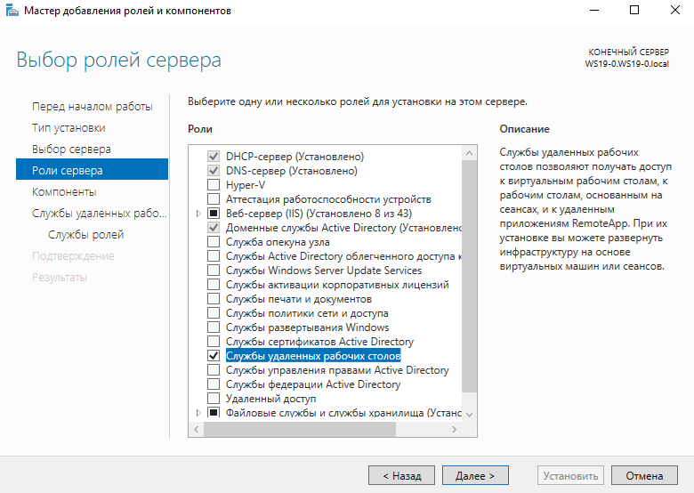
2. Настройте удаленные рабочие столы и сеансы:
   - Откройте 'Remote Desktop Session Host Configuration' и настройте параметры сеанса (количество пользователей, тип соединения, время ожидания и т.д.).
   - Установите параметры отключения пользователей, если они оставляют сеанс открытым.
   - Настройте политики безопасности для удаленных рабочих столов.

3. Настройте пользователей для удаленного доступа:
   - Добавьте пользователей или группы пользователей к группе 'Remote Desktop Users' для предоставления им доступа к удаленным рабочим столам.
   - Укажите разрешения для доступа к удаленным рабочим столам и приложениям.

4. Настройте SSL-сертификат для безопасного доступа:
   - Установите SSL-сертификат для защиты обмена данными между клиентом и терминальным сервером.
   - Настройте 'Remote Desktop Gateway' для использования SSL-сертификата.

5. Настройте механизм аутентификации и авторизации:
   - Настройте механизмы аутентификации и авторизации для обеспечения безопасного доступа к удаленным рабочим столам.
   - Используйте механизмы двухфакторной аутентификации для дополнительной защиты.

6. Проведите тестирование и мониторинг работоспособности удаленных рабочих столов для обеспечения их стабильной и надежной работы.

***
## Домашнее задание
1. Настроить файловый сервер, подготовить общую папку для пользователей подразделения bux, запретить доступ к этой папке другим пользователям домена.
2. Развернуть веб сервер контроллера домена и разместить в нем Html документ
3. Подключать общую папку для 1 задания с помошью групповых политик как ярлык на рабочем столе и как сетевой диск. 
(отчеты заданий - скриншот)

***
**дополнительно**
1. Развернуть LAPS на все рабочие станции домена через GPO
(отчеты заданий - скриншот)
***
**Для отчета:**
- Cоздать в личном репозитории организаци github ветку lesson_2_3
- Cоздать директорию lesson_2_3 и разместить отчет о проделанной работе
- Cделать push и pull request на сайте, в качестве рецензента добавить пользователя AndreyChuyan