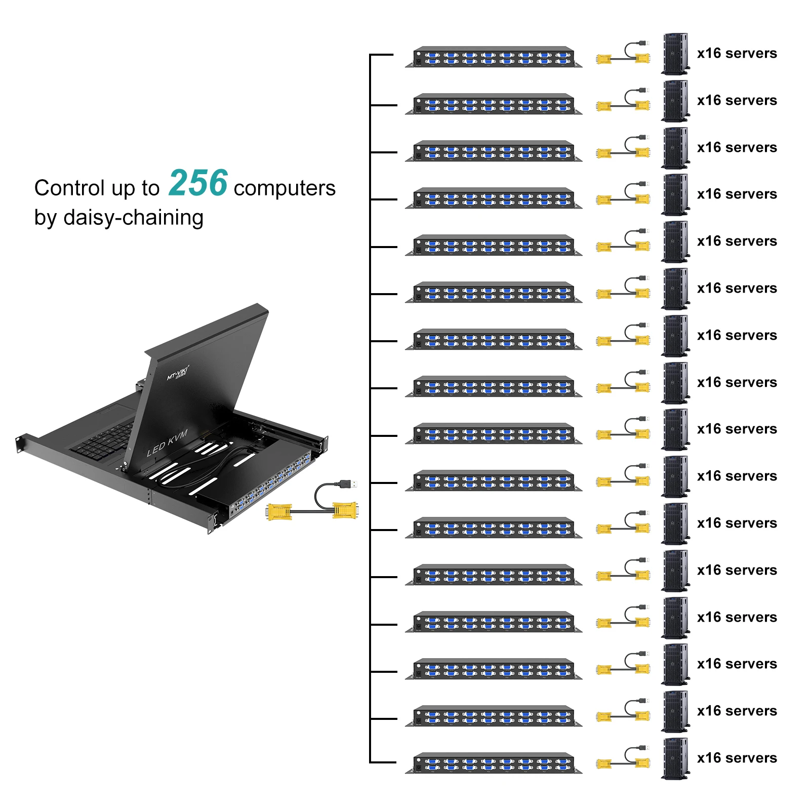
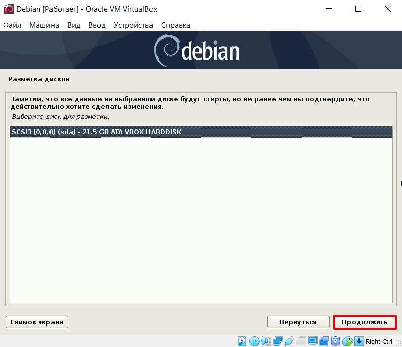

# Знакомство с Linux. Debian 12

## Основные сведения об аппаратном устройстве серверов

**Сервер** (от англ. server — обслуживающий) — сетевой компьютер, обрабатывающий запросы от других компьютеров в локальной или глобальной сети. Как правило, сервер выделен из всей группы компьютеров, подключенных к единой сети, работает автономно, без участия человека, за исключением первичной настройки. Также под этим термином подразумевается программное обеспечение, обрабатывающее пользовательские запросы.

**Устройство и функции сервера**
Любой сервер представляет собой компьютер, обладающий собственным процессором, оперативной и долговременной памятью. В этом он не отличается от обычного пользовательского ПК. Ключевая разница между ними — в том, что архитектура сервера должна быть адаптирована к обработке пользовательских запросов и большого количества данных.

**Выделенный сервер**
Внешне они представляют собой плоские системные блоки, которые устанавливаются в специальные стойки, напоминающие шкафы. Это позволяет компактно разместить большое количество серверов, удобно организовать электропитание, охлаждение, защиту.

Выделенный в сети сервер работает под управлением специализированных операционных систем и другого ПО в автономном режиме. Участие человека предполагается только на этапе запуска/наладки, а также замены, ремонта или расширения оборудования. Устройство сервера включает специализированный процессор с большим (до 64) количеством ядер для параллельных вычислений, а также значительные объемы оперативной и долговременной памяти. К каждому такому компьютеру можно подключить клавиатуру и монитор, но обычно он просто подсоединяется к сети и настраивается через общую консоль.

**Невыделенный сервер**
Это сервер, созданный на базе обычного ПК путем расширения памяти за счет установки нескольких жестких дисков (RAID-массива), покупки постоянного IP-адреса у провайдера и настройки ПО на обработку пользовательских запросов, обеспечение безопасности и резервного копирования данных.

**Одноплатный сервер**
Это микросервер, реализованный на одной плате со встроенным или подсоединяемым модулем памяти, собственным процессором и сетевым разъемом. Типичным примером может служить популярный одноплатный компьютер Raspberry Pi. Преимущество таких серверов заключается в их низком энергопотреблении и отсутствии шума. Из-за малой вычислительной мощности они используются для сбора информации с датчиков домашних систем безопасности, «умного дома».

**Виртуальный сервер**
Это программная эмуляция физического (аппаратного). Виртуальная машина, которая обладает теми же функциями, что и аппаратный сервер. Например, позволяет работать с памятью и файлами, настраивать права доступа пользователей, устанавливать и использовать различное программное обеспечение, взаимодействовать с другими виртуальными или физическими серверами. На одной физической платформе бывает установлено несколько виртуальных серверов, при этом их можно полностью разграничить. Это позволяет рационально использовать имеющиеся в распоряжении реальные ресурсы аппаратной платформы, хотя и накладывает ограничения на производительность каждой виртуальной машины.

**Типы серверных архитектур**

   **Классическая архитектура** для построения локальной или глобальной (интернет) сети — «клиент — сервер». Она подразумевает четкое разделение входящих в сеть устройств на серверные и пользовательские (клиентские). Последние работают под управлением первых. В такой архитектуре сервер выполняет роль информационного центра, к которому обращаются пользователи. Он же устанавливает правила взаимодействия с пользовательскими устройствами. Клиент-серверную модель используют в работе веб-сайтов и служб связи.

   Альтернатива этой модели — **децентрализованная архитектура** «peer-to-peer» (отсюда другое название — пиринговая). В ней взаимодействие происходит между равноценными устройствами, каждое из которых может играть роль как сервера, так и клиента. Благодаря этому в пиринговой сети нет информационных центров, а количество подключенных устройств потенциально безгранично. Эту модель используют в организации файлообменных сетей (торрентов), торговых интернет-площадок, платежных систем.

## Удаленное управление серверами, IPMI
**IPMI** (Intelligent Platform Management Interface) — интеллектуальный интерфейс для управления и администрирования серверов. Он реализован с помощью отдельного контроллера управления на материнской плате. Вы сможете удаленно выполнять действия с сервером, как если бы физически находились около него, а именно: подключаться напрямую к серверу для его управления, изменять настройки в bios, просматривать и контролировать состояние температуры компонентов сервера и т.д

**Возможности IPMI**
- удаленное включение, выключение и перезагрузка сервера;
- мониторинг температуры, напряжения и системы охлаждения;
- удаленное подключение к серверу носителя информации (например, для установки ОС и ПО);
- управление аккаунтами и правами пользователей (имеется поддержка LDAP и Active Directory);
- управление портами доступа и защита доступа SSL-сертификатом;
- настройка уведомлений о работе сервера.

**Пароль по умолчанию на IPMI**
Стандартным логином и паролем для IPMI будет ADMIN / ADMIN, именно большими буквами.

На серверах Supermicro в BIOS можно попасть, нажав кнопку “Del” при загрузке сервера, я не буду заострять на этом внимание и сразу перейду к интерфейсу самого BIOS.

**Мониторинг сервера SuperMicro через IPMI**
Через IPMI мониторить температуру и работу железа сервера SuperMicro довольно просто. Полная информация о железе сервера содержится в пункте System -> Hardware Information.

Информацию по состоянию процессора, оперативной памяти и вентиляторах, можно посмотреть перейдя во вкладку Server Health -> Sensor Readings.

**Управление сервером через утилиту IPMICFG от SuperMicro**
Для управления серверами через IPMI компания SuperMicro разрабатывает собственную утилиту IPMICFG.

Если выполнить команду `ipmicfg -help` мы получим список всех возможных параметров утилиты.
Разберем основные команды:

 `ipmicfg -help` – полная справка по утилите;
 `ipmicfg -m` – просмотр текущего IP и mac-адреса для IPMI;
 `ipmicfg -k` — просмотр маски подсети;
 `ipmicfg -g` – просмотр заданного шлюза;
 `ipmicfg -fd` — сброс IPMI к заводским настройкам;
 `ipmicfg -user list` – просмотр созданных пользователей и их привилегий.
Вы можете изменить IP адрес, маску и шлюз интерфейса IPMI:
   `ipmicfg -m 192.168.1.200`
   `ipmicfg -k 255.255.255.0`
   `ipmicfg -g 192.168.1.1`
Создать нового пользователя IPMI и его пароль:
`ipmicfg -user add <user id> <name> <password> <privilege>`

## Устройство серверных, серверные стойки

Устройство серверных и серверных стоек представляет собой комплекс аппаратных и структурных элементов, предназначенных для размещения, хранения и обеспечения работы серверного оборудования

1. Серверные стойки (rack):
   - Размеры: Серверные стойки обычно имеют стандартные размеры - 19 дюймов в ширину и высоту в большинстве случаев начинается с 42U (уровней).
   - Каркас: Каркас стойки обычно сделан из металлических вертикальных стоек (стоек) и горизонтальных крепежных элементов для установки оборудования.
   - Двери и панели: Некоторые стойки могут иметь двери и съемные панели для обеспечения доступа и безопасности серверному оборудованию.
   - Вентиляция и охлаждение: Серверные стойки обычно оборудованы системой вентиляции и охлаждения для обеспечения оптимальной температуры для работы серверного оборудования.

2. Серверное оборудование:
   - Серверы: Физические или виртуальные серверы, работающие под управлением операционных систем, например, Windows Server, Linux и т.д.
   - Хранение данных: Системы хранения данных, такие как дисковые массивы (RAID), сетевые хранилища (NAS, SAN), облачные хранилища.
   - Сетевое оборудование: Маршрутизаторы, коммутаторы, файрволы и другие сетевые устройства для организации сетевой инфраструктуры.
   
3. Управление и мониторинг:
   - Консоль управления: Консоль управления серверами и сетевым оборудованием, включая мониторинг состояния и настройку конфигурации.
   - Инструменты мониторинга: Программное обеспечение для мониторинга состояния серверов, сети, нагрузки и других параметров для обеспечения надежной работы серверного оборудования.
   
4. Системы безопасности и защиты:
   - Блокировка и доступ: Механизмы блокировки и контроля доступа к серверам и серверным стойкам для обеспечения безопасности оборудования и данных.
   - Резервное питание: Использование резервных источников питания, UPS (непрерывное питание) для защиты от сбоев сети и непредвиденных отключений.

### КВМ-панель
**КВМ-панель** (KVM-switch) - это устройство, которое позволяет администратору удаленно управлять несколькими компьютерами (серверами) с помощью одного набора клавиатуры, видеомонитора и мыши. 

Термин KVM является аббревиатурой и означает Keyboard (клавиатура), Video (видео) и Mouse (мышь). Таким образом, КВМ-панель предоставляет возможность коммутации (переключения) между различными серверами, перенаправляя ввод с клавиатуры, видеосигнал и управление мышью на нужный сервер.

В серверной комнате КВМ-панель позволяет администратору эффективно управлять и мониторить работу нескольких серверов без необходимости физического перемещения между ними. Это особенно удобно при настройке, обслуживании, устранении неполадок или перезагрузке серверов.

Основные преимущества использования КВМ-панели в серверной комнате:
1. Экономия места: Необходимость только в одном наборе клавиатуры, видеомонитора и мыши для управления несколькими серверами.
2. Экономия времени: Удобное переключение между серверами, не требуется физическое подключение к каждому серверу.
3. Удаленное управление: Возможность управления серверами из любой точки, что особенно полезно при удаленной работе.
4. Безопасность: Обеспечивает защиту серверов от несанкционированного доступа и контроль к системам и данным.

## Обзор архитектуры Дата-центров

**Центр обработки данных** — это физическое сооружение, поддерживающее вычислительную деятельность предприятия, реализующее централизованную обработку, хранение, передачу, обмен и управление информацией. Архитектура центра обработки данных как архитектурный проект, который устанавливает соединения между коммутаторами и серверами, обычно создается на этапах проектирования и строительства центра обработки данных. Кроме того, он определяет способ размещения серверов, сетей хранения данных, стоек и других ресурсов центра обработки данных, а также определяет взаимосвязь этих устройств.
Типы архитектуры ЦОД
Как правило, существует четыре типа архитектуры центра обработки данных: **работа с сеткой**, **трехуровневая или многоуровневая модель**, **сетка с точкой доставки (PoD)** и **сетка с суперпозвоночником**

**Ячеистая сеть**
 Благодаря предсказуемой емкости и меньшей задержке он может поддерживать распространенные облачные сервисы. Кроме того, благодаря конструкции распределенной сети ячеистая сеть может легко реализовать любое соединение и быть более рентабельной с точки зрения развертывания сети.

**Трехуровневая или многоуровневая модель**
Многоуровневая архитектура была наиболее часто развертываемой моделью архитектуры центра обработки данных, используемой в корпоративном центре обработки данных, состоящей из ядра, уровня агрегации и уровня доступа.

- Уровень ядра ЦОД: он обеспечивает структуру для высокоскоростной коммутации пакетов между несколькими модулями агрегации и подключения к нескольким модулям агрегации.

- Уровень агрегации ЦОД: он поддерживает такие функции, как интеграция сервисных модулей, определения доменов уровня 2, обработка связующего дерева и избыточность шлюза по умолчанию.

- Уровень доступа ЦОД: обеспечивает подключение физического уровня к ресурсам сервера и работает в режимах уровня 2 или уровня 3. Более того, он играет важную роль в удовлетворении конкретных требований к серверу, таких как объединение сетевых карт, кластеризация и сдерживание широковещательной рассылки.

**Сетка точки доставки**
Архитектура Mesh Point of Delivery (PoD) содержит несколько листовых коммутаторов, соединенных между собой в PoD. Это повторяемый шаблон проектирования, и его компоненты обеспечивают максимальную модульность, масштабируемость и управляемость ЦОД. Кроме того, эта архитектура может реализовать эффективное соединение между несколькими PoD и уровнем super-spine. Таким образом, менеджеры ЦОД могут легко добавить новую архитектуру ЦОД к своей существующей трехуровневой топологии для потока данных с малой задержкой новых облачных приложений.

**Супер сетка для позвоночника**
Как следует из названия, архитектура Super Spine подходит для крупномасштабных ЦОД или обычных ЦОД типа кампуса. Этот тип архитектуры ЦОД обслуживает огромные объемы данных, проходящих с востока на запад через залы данных.

**Сетевая архитектура ЦОД**
Сеть ЦОД (DCN) представляет собой набор сетевых устройств, которые соединяют все ресурсы ЦОД вместе, что всегда было ключевой областью исследований для интернет-компаний и крупных компаний, занимающихся облачными вычислениями. Таким образом, сетевая архитектура ЦОД играет жизненно важную роль в архитектуре ЦОД.

Обычно он состоит из коммутаторов и маршрутизаторов в двух- или трехуровневой иерархии. Например, трехуровневая DCN, DCN с толстым деревом, DCell и другие типы. Кроме того, масштаб, масштабируемость, устойчивость и надежность сетевой архитектуры ЦОД всегда были в центре внимания.

**Архитектура безопасности ЦОД**
Безопасность ЦОД относится к физическим методам и виртуальным технологиям для защиты центров обработки данных от угроз, атак и несанкционированного доступа. Отсутствие эффективной защиты ЦОД может привести к утечке данных, когда хакеры могут атаковать информацию компании.

Архитектура безопасности ЦОД в основном включает два аспекта: физическую безопасность и программную безопасность. Предприятия могут защитить центры обработки данных от атак, установив надежный брандмауэр между внешним трафиком и внутренней сетью.

**Вычислительная архитектура ЦОД**
В вычислительной модели ЦОД компьютерные ресурсы могут быть перемещены на периферию, где находятся данные, тем самым уменьшая задержки и проблемы с пропускной способностью при передаче.

Вычислительная архитектура ЦОД — одна из наиболее важных частей архитектуры ЦОД, которая играет огромную роль в высокоэффективном использовании ресурсов, снижении капитальных затрат (CAPEX), а также в быстром развертывании и масштабируемости.

## Подключение к виртуальной машине, настройка VPN
1. **Подключение черз powershell**
   1. Чтобы подключиться к серверу по SSH, используйте команду ssh с указанием имени пользователя и IP-адреса сервера:
      `ssh username@server_IP_address`
   2. Введите пароль пользователя (или использовать SSH-ключ), когда будет запрошено.
2. **Подключение через putty**
   1. Скачайте и установите PuTTY:
      - Скачайте PuTTY с официального сайта: [PuTTY Download Page](https://www.chiark.greenend.org.uk/~sgtatham/putty/latest.html)
      - Запустите установочный файл и следуйте инструкциям по установке.
   2. Откройте PuTTY:
      - Запустите PuTTY после установки.
   3. Настройте соединение:
      - В окне PuTTY введите IP-адрес вашего сервера в поле "Host Name (or IP address)".
      - Убедитесь, что порт установлен как 22 (стандартный SSH-порт).
      - Выберите протокол "SSH".
   4. Соединение с сервером:
      - Нажмите на кнопку "Open".
      - При первом подключении к серверу вы можете увидеть предупреждение о ключе хоста. Просто нажмите "Yes" или "Да", чтобы добавить ключ хоста в список доверенных ключей.
   5. Аутентификация:
      - После успешного подключения к серверу по SSH, вам будет предложено ввести имя пользователя и пароль (или использовать SSH-ключ, если у вас есть).  
3. **Подключение через Visual Studio Code**
   1. Установите расширение Remote - SSH:
      - Откройте Visual Studio Code.
      - Перейдите во вкладку Extensions (или нажмите Ctrl+Shift+X).
      - В поисковой строке введите "Remote - SSH" и установите расширение от Microsoft.

   2. Подключение к серверу по SSH:
      - Нажмите на иконку "Remote Explorer" в левой нижней части Visual Studio Code (в виде четырех квадратов).
      - Нажмите на "+" и выберите "Add New SSH Host...".
      - Введите адрес сервера в формате username@hostname и нажмите Enter.
      - Введите пароль (или SSH-ключ, если используете) для подключения к серверу.

   3. Работа с проектом на удаленном сервере:
      - Когда подключение будет установлено, откроется новое окно с Visual Studio Code, где вы будете работать с файлами проекта на удаленном сервере.
      - Вы сможете редактировать, создавать и удалять файлы на сервере, запускать терминал и выполнять команды командной строки.

   4. Отключение от сервера:
      - Чтобы отключиться от сервера, нажмите на иконку "Remote Explorer", найдите открытое подключение и выберите опцию "Disconnect".

## Знакомство с ОС Linux. Виды Linux. Установка на ВМ
Корни Linux прослеживаются ещё с 70-х годов 20-го века. Точкой отсчёта можно считать появление операционной системы Unix в 1969-м году в США в фирме Bell Laboratories, дочернем подразделении компании AT&T. Unix стала основной для большого количества операционных систем промышленного класса. 

Linux же больше всего обязан своей жизнью двум проектам — GNU и Minix.
[Интерактивная карта по дистрибутивам linux](https://upload.wikimedia.org/wikipedia/commons/1/1b/Linux_Distribution_Timeline.svg)

В 1991-м году, Линус Торвальдс, финский студент, чрезвычайно увлёкся идеей написать совместимое с Unix ядро операционной системы для своего персонального компьютера с процессором Intel. Прототипом для будущего ядра стала операционная система Minix: совместимая с Unix операционная система для персональных компьютеров, которая загружалась с дискет и умещалась в очень ограниченной в те времена памяти персонального компьютера.

Тот факт, что Линус выложил код своей ОС в интернет, был решающим в дальнейшей судьбе Linux. Хотя в 1991-м году интернет ещё не был так широко распространён, как в наши дни, зато пользовались им в основном люди, имеющие достаточную техническую подготовку. И уже с самого начала Торвальдс получил несколько заинтересованных откликов.

Примерно в феврале 1992-го года Линус высказал просьбу ко всем, кто уже пользовался или тестировал Linux, прислать ему открытку. Таких открыток было получено несколько сотен со всех концов света — из Новой Зеландии, Японии, Нидерландов, США. Это говорило о том, что Linux начала приобретать некоторую известность.

Вначале к разработке присоединились сотни, потом тысячи, потом сотни тысяч добровольных помощников. Система уже не была просто игрушкой для хакеров. Дополненная массой программ, разработанных в рамках проекта GNU, ОС Linux стала пригодна для практического использования. А то, что ядро системы распространялось под лицензией GNU General Public License, гарантировало, что исходные коды системы останутся свободными, то есть смогут копироваться, изучаться и модифицироваться без опасения нарваться на какое-либо преследование со стороны разработчика или какой-то коммерческой фирмы. Этот факт привлекал в ряды пользователей и сторонников Linux всё новых последователей, в первую очередь из числа студентов и программистов.

### Дополненная схема виртальной сетевой инфрастуктуры

### Установка
При установке у вас возникнет выбор, имет доступ к серверу черз терминал в целях экономия мощностей  или установить графическую оболочку GNOME (GNU Network Object Model Environment). 
GNOME одна из популярных сред рабочего стола в мире Linux. Она постоянно поддерживается и довольно легко интегрируется с аппаратным и программным обеспечением. Стоит отметить тот факт, что Canonical даже приняла GNOME для ОС Ubuntu в качестве среды рабочего стола по умолчанию. Однако надо помнить, что GNOME — не самый простой инструмент. Дизайн довольно сильно отличается от привычного windows интерфейса, и для начального взаимодействия и простоты использования, вам придётся изучить с существующие расширения. Например, если вам необходима панель задач, как в windows, для приложений или переключения окон, то вы можете попробовать для себя Dash to Panel. Помните, что с большим набором расширений оболочка начинает заметно подъедать системные ресурсы слабомощных машин.

Выберите нужный язык и нажмите Continue:

Выберите местоположение (оно необходимо для определения часового пояса) и нажмите Продолжить. Используйте кнопку «Продолжить» для перехода к каждому следующему шагу инструкции.

Выберите нужную раскладку клавиатуры:

Выберите предпочитаемый способ переключения между раскладками:

Подождите пока закончится установка компонентов. Для идентификации в сети задайте имя виртуального компьютера:

Если вы планируете настроить доступ в глобальную сеть, укажите имя домена. Если вы настраиваете локальную сеть, укажите произвольное название:

Введите root-пароль учетной записи и повторите его в строке ниже:

Укажите имя пользователя виртуального компьютера. Оно будет фигурировать в операциях, не связанных с администрированием:

Выберите учетную запись, под которой вы будете известны в системе:

Введите пароль пользовательской учетной записи:

Выберите нужный часовой пояс:

Подождите пока закончится установка компонентов. Затем выберите способ разметки диска Авто — использовать весь диск:

Мастер установки предупредит, что информация на выбранном диске будет удалена. Если вы устанавливаете ОС Дебиан на виртуальную машину, нажмите Продолжить. Если вы делаете «чистую» установку Debian на компьютер, сначала перенесите все данные с жесткого диска и только после этого переходите к следующему шагу.

Выберите вариант разметки диска Все файлы в одном разделе (рекомендуется новичкам). Если вы являетесь продвинутым пользователем, выберите другой вариант.

Подтвердите окончание разметки и запись изменений на диск:

Чтобы окончательно подтвердить внесение изменений, отметьте галочкой пункт Да:

Подождите, пока закончится разметка диска и установка компонентов. Если вы хотите просканировать дополнительные CD/DVD, отметьте галочкой пункт Да:

Выберите зеркало архива, ориентируясь на ближайшую к вам сеть:

Дождитесь установки. Затем выберите набор программного обеспечения. Для этого отметьте галочкой нужные пункты:

Дождитесь окончания установки. После этого разрешите установить системный загрузчик GRUB в основную загрузочную запись первого жёсткого диска. Для этого отметьте галочкой пункт Да:

Определите, куда будет установлен системный загрузчик GRUB. Для этого выберите предлагаемый диск. Если вы являетесь продвинутым пользователем, укажите устройство вручную.

Дождитесь установки системного загрузчика и нажмите Продолжить, чтобы запустить ОС:

Кликните по названию пользователя, которого вы создавали

## Ядро Linux, загрузчик GRUB
**Ядро Linux** (или просто ядро) - это основная часть операционной системы Linux, которая управляет аппаратными ресурсами компьютера (например, процессором, памятью, устройствами ввода-вывода) и обеспечивает интерфейс для взаимодействия между аппаратными ресурсами и прикладными программами.

Основные функции ядра Linux включают в себя:
- Управление памятью: управление доступом к памяти и управление памятью процессов.
- Планирование процессов: распределение процессорного времени между запущенными процессами.
- Управление устройствами: обеспечение взаимодействия с аппаратными устройствами, такими как жесткие диски, сетевые карты, USB-устройства и другие.
- Управление файловой системой: обеспечение доступа к файлам и каталогам на дисках.
- Поддержка сети: обеспечение сетевого стека для взаимодействия по сети и протоколов сетевого обмена.

Одной из ключевых особенностей Linux ядра является его открытый исходный код. Это означает, что любой может просмотреть, изменить и распространять его в соответствии с лицензией GNU General Public License (GPL). Это способствует развитию и усовершенствованию ядра Linux за счет участия широкого сообщества разработчиков.

Для того чтобы посмотреть версию ядра в Debian, вы можете воспользоваться командной строкой следующим образом:
1. Используя команду uname:
   Откройте терминал и выполните команду uname -r. Она покажет текущую версию ядра.
`uname -r`

2. Используя команду cat /proc/version:
   Выполните команду cat /proc/version, чтобы увидеть информацию о системе, включая версию ядра.
`cat /proc/version`

3. Используя команду dpkg:
   Другой способ узнать версию ядра в Debian – это использовать утилиту dpkg:
`dpkg -l | grep linux-image`
   Это покажет список установленных пакетов ядра, включая их версии.

***
**GRUB** (Grand Unified Boot Loader) - это популярный загрузчик операционных систем, используемый во многих дистрибутивах Linux. Он представляет собой программное обеспечение, которое управляет процессом загрузки операционной системы при включении компьютера.

Основные функции загрузчика GRUB включают:
- Показ меню выбора операционной системы: GRUB позволяет выбирать операционную систему или ядро Linux для загрузки, если на компьютере установлено несколько операционных систем.
- Загрузка ядра Linux: после выбора операционной системы, GRUB загружает соответствующее ядро Linux, которое начинает работу и запускает операционную систему.
- Управление параметрами загрузки: GRUB поддерживает конфигурационные файлы, в которых можно задать параметры загрузки операционной системы, такие как уровень отладки, режим консоли, параметры ядра и другие.
- Обнаружение и автоматическая конфигурация операционных систем: GRUB может автоматически обнаруживать установленные операционные системы на жестком диске и добавлять их в меню загрузки.

GRUB обладает расширенными возможностями, такими как поддержка различных файловых систем, загрузка с различных устройств (жестких дисков, Flash-накопителей, сети), поддержка загрузки операционных систем с зашифрованных разделов и другие.

GRUB является стандартным загрузчиком для многих дистрибутивов Linux, таких как Ubuntu, Fedora, Debian и других. Он обеспечивает удобный и гибкий способ управления загрузкой компьютера и выбора операционной системы при загрузке.

Чтобы посмотреть информацию о GRUB (Grand Unified Boot Loader) в Debian, вы можете воспользоваться командами в терминале. Вот несколько способов:

1. Просмотр конфигурационных файлов GRUB:
   Вы можете посмотреть содержимое файла конфигурации GRUB по пути /etc/default/grub:
`cat /etc/default/grub`

2. Просмотр текущих настроек GRUB:
   Для того чтобы увидеть текущие настройки GRUB, в том числе опции загрузки и другие параметры, выполните команду:
`grub-mkconfig -o /boot/grub/grub.cfg`

3. Проверка версии GRUB:
   Для проверки версии установленного GRUB используйте команду:
`grub-install --version`

## Файловая система Linux

В операционной системе Linux файловая система отличается организованной структурой. Если вы только перешли с Windows, вы можете столкнуться с некоторыми затруднениями, во многом из-за отсутствия чёткого понимания о принадлежности каждой директории.

**/ — корень**
Главный каталог в системе. Здесь нет дисков, как в Виндовс. По большему счёту, это и есть файловая система Линукс. Адреса всех существующих файлов начинаются с корневой директории Linux, а дополнительные разделы подключаются к папкам корневого каталога.

Читать или менять содержимое в данном каталоге может лишь root-пользователь (user). Домашний каталог пользователя root — /root.

**/bin — бинарные файлы пользователя**
Содержит файлы исполняемого типа. Программы, с которыми можно работать в однопользовательском режиме и прочие утилиты, которые применяются, пока не подключён каталог /usr/. 

**/sbin — системные исполняемые файлы**
Во-первых, как и в случае с /bin, содержатся исполняемые файлы, доступные на ранних этапах загрузки. Во-вторых, тут располагаются программы, выполняемые с правами суперпользователя, те же утилиты обслуживания и пр. 

**/etc**
В этой папке Linux расположены конфигурационные файлы всех программ, которые установлены в системе. Также есть скрипты для запуска демонов, автозагрузки программ и т. п. Главное, что следует запомнить, — речь идёт о файлах по настройке и конфигурации. 

**/dev — файлы устройств**
Как вы знаете, в операционной системе Linux «всё есть файл». И различные внешние устройства тоже. В результате, любые подключённые микрофоны, клавиатуры, флешки и т. п. — это лишь файлы, которые находятся в каталоге /dev. 

**/proc — информация о процессах**
Подсистема, которая динамически создаётся ядром. Содержит всю информацию о процессах, которые запущены в реальном времени. Тут можно найти данные об использовании системных ресурсов и получить другую информацию о системе. 

**/var — переменные файлы**
Речь идёт о файлах, которые часто меняются — это базы данных, кеши, системные журналы и пр. Следует подробнее рассмотреть каталог Linux из папки /var/:
• /var/log — файлы логов;
• /var/lib — базы данных;
• /var/lock — файлы блокировок;
• /var/mail — почта;
• /var/spool — принтер, печать;
• /var/run — pid процессов.

**/tmp**
В данном каталоге располагаются временные файлы, которые созданы пользователями (users), программами или системой. Любой пользователь имеет права записи в данную директорию. При перезагрузке компьютера они удаляются. 

**/usr — программы пользователя**
Этот каталог является самым большим и имеет много функций. Вкратце рассмотрим его структуру:
• /usr/bin/ — исполняемые файлы (графические редакторы, браузеры, плееры — не используются при загрузке системы);
• /usr/sbin/ — бинарные файлы программ, предназначенных для системного администрирования (выполняются с правами суперпользователя);
• /usr/lib/ — библиотеки для программ из /usr/sbin либо /usr/bin;
• /usr/local — файлы пользователя (программы, библиотеки и настройки, созданные пользователем).

**/home — домашняя папка**
Linux директория пользователей, где содержатся домашние каталоги всех пользователей. В данных каталогах пользователи хранят личные файлы, программные настройки и пр. Аналогия с Windows — папка на диске C. Но тут есть разница: home располагается на отдельном разделе, в результате чего при переустановке системы все данные и настройки сохраняются.

**/boot — файлы загрузчика**
Linux директория, где содержатся файлы, связанных с загрузчиком системы (ядро vmlinuz, образ initrd и пр.).

**/lib — системные библиотеки**
Тут располагаются файлы системных библиотек.

**/opt — дополнительные программы**
Эта папка Linux включает в себя установленные проприетарные программы, драйвера либо игры, то есть софт, созданный производителем в качестве отдельных исполняемых файлов.

**/mnt — монтирование**
Сюда сисадмины монтируют внешние либо дополнительные файловые системы Linux.

**/media — съемные носители**
Монтируются подключаемые внешние накопители — оптические диски, USB-устройства.

**/srv — сервер**
Файлы сервисов и серверов. Как пример — web-сервер Apache.

**/run — процессы**
Каталог включает в себя PID-файлы процессов, однако в отличие от /var/run, он располагается в TMPFS, в результате чего всё удаляется после перезагрузки.

**/sys — информация о системе**
Каталоги Linux в этой папке предназначены для получения информации от ядра о системе. По сути, речь идёт о файловой системе, организованной ядром и позволяющей просматривать и менять множество параметров системной работы, ту же работу swap и много чего ещё.

***
## Домашнее задание
1. Установить ОС Debian 12 на виртуальных машинах с графическим интерфейсом
2. Настроить статический адрес
3. Установить пакет htop
   (отчет - скриншоты выполненных действий)

***
**дополнительно**
1. Установить редактор vim и создать с помощью него файл в терминале
2. Обновить систему
   (отчет - скриншоты выполненных действий)
   
***
**Для отчета:**
- Cоздать в личном репозитории организаци github ветку lesson_3_1
- Cоздать директорию lesson_3_1 и разместить отчет о проделанной работе
- Cделать push и pull request на сайте, в качестве рецензента добавить пользователя AndreyChuyan