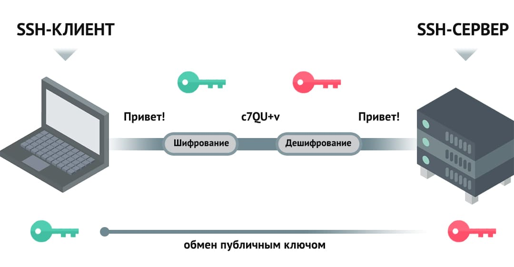

# Работа в ОС Linux, основные команды и действия


## Установка виртуальной машины в режиме минимальной конфигурации
Установка Debian в режиме минимальной конфигурации имеет ряд преимуществ и подходит для определенных случаев использования. Вот несколько причин, почему можно выбрать установку Debian в минимальной конфигурации:

1. Легковесная операционная система: Установка Debian в минимальной конфигурации поможет создать легковесную операционную систему, которая потребляет меньше ресурсов системы. Это полезно для серверов, виртуальных машин, встроенных систем или устройств с ограниченными ресурсами.
2. Безопасность: Меньше установленных программ означает меньше поверхности атаки, что может повысить безопасность системы. Минимальная конфигурация Debian уменьшает количество потенциально уязвимого программного обеспечения.
3. Гибкость и настраиваемость: При установке минимальной конфигурации Debian вы имеете полный контроль над установленными компонентами и программами. Это позволяет настроить систему точно под ваши потребности и избежать установки ненужных программ.
4. Минимизация лицензионных затрат: Установка только необходимых компонентов позволит избежать установки платных или лицензионных компонентов, что может быть важно для экономии затрат.
5. Уменьшение объема сохраняемых данных: При использовании минимальной конфигурации объем занимаемого дискового пространства будет меньше, так как установлено меньше программ и компонентов.
6. Особенности производительности: Легковесная операционная система может обеспечить более высокую производительность и быструю загрузку, что важно для определенных типов систем и задач.

## Подключение по SSH, XRDP, X11.
**SSH** (Secure Shell) - это криптографический сетевой протокол, который обеспечивает защищенное соединение для удаленного доступа к компьютерам или другим устройствам через интернет. SSH позволяет пользователям аутентифицироваться и обмениваться данными в зашифрованном виде между клиентом и сервером.

Ниже приведены некоторые основные особенности и предназначения SSH:
1. Аутентификация: SSH обеспечивает механизм аутентификации пользователей, который позволяет убедиться в том, что пользователь имеет право доступа к удаленному серверу.
2. Шифрование: Все данные, передаваемые между клиентом и сервером по протоколу SSH, шифруются, что защищает их от перехвата и прослушивания третьими лицами.
3. Удаленный доступ: Пользователи могут использовать SSH для удаленного управления компьютерами или серверами с помощью командной строки (обычно через терминал).
4. Передача файлов: SSH также поддерживает протокол SCP (Secure Copy), который позволяет безопасно копировать файлы и директории между компьютерами.
5. Туннелирование: SSH позволяет создавать защищенные сетевые туннели, которые может использоваться для защиты передаваемого трафика, включая проксирование сетевого трафика через шифрованное соединение.

Для шифрования SSH использует специальные ключи, с помощью которых кодируются все передаваемые между клиентом и хостом данные.
В протоколе SSH используются три различных метода шифрования - симметричное, асимметричное, технология хэширования.
При **симметричном кодировании** один и тот же секретный ключ используется для шифрования и дешифрования пакетов данных и клиента, и хоста. Установка соединения таким способом предполагает специальный алгоритм обмена ключами с предварительным согласованием ключа шифрования и с последующим использованием его на протяжении всей сессии.


**Асимметричное шифрование** связано с использованием при авторизации вместо пароля пару «приватный+публичный ключ». Оно применяется в SSH на этапе установки соединения. Публичный ключ используется для шифрования данных (и его можно свободно распространять), а приватный (который нельзя никому показывать и передавать) - для их расшифровки. Алгоритм подключения с асимметричными ключами выглядит так:

- хост и клиент используют свои публичные ключи для генерации общего секретного ключа шифрования сессии;
- затем хост шифрует данные публичным ключом и предлагает клиенту расшифровать их своим приватным ключом;
- если операция успешна, то клиент авторизуется на хосте с соответствующим именем пользователя.
Затем сессия продолжается уже с использованием симметричного шифрования.


**Хеширование**
Одностороннее хеширование — это еще одна форма криптографии, которая используется в SSH. Такого рода хеширование отличается от двух упомянутых выше тем, что оно не предназначено для дешифровки. Оно создает уникальное значение фиксированной длины для каждого ввода, которое не показывает никакого общего поведения для его раскрытия. Это делает его практически невозможным для обратного преобразования.


Протокол SSH по умолчанию работает по порту 22.
Команда для работы по ssh: `ssh user@host`
, где 
**user** – это имя пользователя на удаленном сервере;
**host** – адрес самого сервера.

В Debian, ssh **fingerprint** (отпечаток SSH) представляет собой уникальный идентификатор, который можно использовать для проверки подлинности сервера SSH перед подключением к нему. Хранение и проверка fingerprint'а в целях безопасности играет важную роль в обеспечении защищенного соединения SSH и предотвращении атак типа "Man-in-the-middle".
Файл, содержащий fingerprint, находится на сервере в следующем пути:
   - `/etc/ssh/ssh_host_rsa_key.pub`- для RSA ключей.
   - `/etc/ssh/ssh_host_ecdsa_key.pub` - для ECDSA ключей.
   - `/etc/ssh/ssh_host_ed25519_key.pub` - для Ed25519 ключей.
   Вы можете просмотреть fingerprint, используя команду:
   `ssh-keygen -lf /etc/ssh/ssh_host_rsa_key.pub`
***
**XRDP** (X Remote Desktop Protocol) - это открытый протокол удаленного рабочего стола, который позволяет пользователю подключаться к удаленному компьютеру и управлять им через графический интерфейс. XRDP основан на стандартном протоколе RDP (Remote Desktop Protocol), используемом в операционных системах Windows.

Ниже приведены некоторые особенности и преимущества XRDP:
1. Удаленный доступ к рабочему столу: XRDP позволяет пользователям получить доступ к рабочему столу удаленного компьютера с помощью графического интерфейса, подобного тому, которое они видят непосредственно на компьютере.
2. Поддержка множества платформ: XRDP поддерживает различные операционные системы, включая Linux, Windows и macOS, что позволяет пользователям подключаться к удаленным рабочим столам с разных устройств.
3. Шифрование данных: XRDP обеспечивает защищенное соединение между клиентом и сервером с помощью шифрования данных, что обеспечивает безопасность передаваемой информации.
4. Простота настройки и использования: XRDP обычно легко настраивается и использование. Пользователь может просто подключиться к удаленному рабочему столу, вводя IP-адрес или имя хоста удаленного компьютера и учетные данные.
5. Поддержка различных клиентских приложений: XRDP может использоваться с различными клиентскими приложениями, такими как Remote Desktop Connection в Windows или клиенты RDP для Linux и macOS.

**X11** (X Window System) - это стандартный протокол и программное обеспечение для работы с графическим интерфейсом в UNIX-подобных операционных системах. X11 предоставляет клиент-серверную архитектуру для отображения графических элементов на экране компьютера и взаимодействия пользователя с графическими приложениями.

Некоторые особенности и преимущества X11:
1. Графический интерфейс: X11 обеспечивает графический интерфейс пользователя, что позволяет отображать окна, иконки, кнопки и другие элементы интерфейса.
2. Многопользовательский доступ: X11 поддерживает множество пользователей, работающих на одном компьютере одновременно, каждый из которых может иметь свой собственный графический рабочий стол.
3. Сетевая поддержка: X11 может работать через сеть, позволяя клиентам (пользовательские приложения) подключаться к удаленному серверу X11 и отображать графические элементы на удаленном экране.
4. Открытый исходный код: X11 является свободно распространяемым программным обеспечением с открытым исходным кодом, что позволяет разработчикам создавать собственные расширения и модификации.
5. Мультиплатформенность: X11 доступен на различных операционных системах, включая Linux, BSD, macOS и др., что обеспечивает совместимость с различными платформами.


Для подключения к серверу Debian с использованием ключа SSH в **Visual Studio Code** (VS Code), вам потребуется установить расширение SSH в VS Code и настроить подключение. Вот как можно это сделать:

1. Установите расширение SSH: Откройте Visual Studio Code, перейдите во вкладку "Extensions" (иконка кубиков слева на панели) и введите "Remote - SSH" в поисковой строке. Установите расширение "Remote - SSH" от Microsoft.

2. В файл config (.ssh/config), которые находится в вашей домашней директории (~/.ssh/config), можно добавить параметры для управления подключениями SSH, в том числе настройки для подключения к конкретным серверам. Вот пример того, что вы можете вписать в файл config:

```
Host myserver
    HostName <IP-адрес или доменное имя>
    User <имя пользователя>
    Port <порт, по умолчанию 22>
    IdentityFile </путь/к/ключу/id_rsa>
```
Где:
- myserver - это псевдоним (alias) для сервера, который будет использоваться при подключении.
- HostName - IP-адрес или доменное имя вашего сервера.
- User - имя пользователя для подключения к серверу.
- Port - порт SSH, который используется для подключения (обычно 22).
- IdentityFile - путь к вашему приватному ключу SSH.

## Обзор текстовых редакторов (vim, nano, mcedit). Mc

**Nano** - это простой текстовый редактор командной строки, который доступен во многих UNIX-подобных операционных системах, таких как Linux и macOS. Nano предназначен для простого и удобного редактирования текстовых файлов без необходимости изучения сложных команд и сочетаний клавиш.
`nano`

**MCedit** является удобным и функциональным текстовым редактором, который обеспечивает простоту использования, интеграцию с файловым менеджером и основные функции редактирования. Он часто используется системными администраторами, разработчиками программного обеспечения и другими пользователями UNIX-подобных операционных систем для работы с текстовыми файлами и скриптами.
`mc`

**Vim** - это улучшенная версия классического текстового редактора vi, который является стандартным редактором для многих UNIX-подобных операционных систем. Vim (Vi IMproved) предоставляет мощные возможности редактирования текста, расширенную функциональность и гибкие параметры настройки, что делает его популярным среди разработчиков ПО и системных администраторов.
`vim`

Важные особенности Vim:
1. Режимы работы: Vim имеет несколько режимов работы, включая командный режим, в котором пользователь может выполнять команды, режим вставки, для ввода текста, и режим визуализации, для выделения текста.
2. Удобство использования: Vim предоставляет множество команд и сокращений клавиш для удобного и быстрого редактирования текста, таких как поиск и замена, копирование и вставка, перемещение курсора и другие.
3. Подсветка синтаксиса: Vim поддерживает подсветку синтаксиса для различных языков программирования, что делает код более читаемым и понятным.
4. Расширяемость: Vim поддерживает множество плагинов и расширений, которые позволяют расширить его функциональность и настроить под определенные потребности пользователя.
5. Кроссплатформенность: Vim доступен на различных операционных системах, включая Linux, macOS и Windows, что делает его популярным выбором для разработчиков на различных платформах.

Как правило vim не является утилитой, установленной по умолчанию, поэтому необходимо ее установить:
`sudo apt install vim`

### Команды VIM
1. Режимы Vim:
   - Нормальный режим (Normal Mode): Используется для навигации, поиска, копирования и вставки текста. Нажмите Esc, чтобы войти в нормальный режим.
   - Режим вставки (Insert Mode): Используется для редактирования текста. Нажмите i (или другие команды) для входа в режим вставки.
   - Командный режим (Command Mode): Используется для сохранения, выхода и других команд. Введите : для входа в командный режим.

2. Основные действия:
   - Сохранить и выйти: `:wq или ZZ`
   - Выйти без сохранения: `:q!`
   - Копировать: В нормальном режиме нажмите `y` (для копирования строки) или `yy` (для копирования всего файла).
   - Вставить: Нажмите `p` для вставки содержимого буфера обмена
   - Отменить: В нормальном режиме нажмите `u`

3. Навигация:
   - Вверх, вниз, влево, вправо: `k, j, h, l` соответственно.
   - Перемещение к началу строки: `0`.
   - Перемещение к концу строки: $``.
   - Перейти на строку `N: N + G`.

4. Поиск и замена:
   - Поиск: В нормальном режиме нажмите `/` и введите текст для поиска. Нажмите `n` для поиска следующего вхождения.
   - Замена: В командном режиме введите `:%s/old_text/new_text/g` для замены всех вхождений old_text на new_text.

5. Выделения
    1. Выделение одной строки:
    - Перемещайтесь на нужную строку с помощью клавиш `k` (вверх) и `j` (вниз).
    - Нажмите `V` (большая латинская V) для выбора строки целиком.

    2. Выделение нескольких строк:
    - Переместитесь на начало интервала строк.
    - Нажмите `Shift + v` для входа в режим выделения.
    - Используйте клавиши `k` (вверх) и `j` (вниз), чтобы выделить необходимое количество строк.

    3. Выделение блока текста:
    - Перейдите в начальную позицию блока текста.
    - Нажмите `Ctrl + v` (или `Ctrl + q` в некоторых терминалах) для входа в режим выделения блока.
    - Используйте клавиши стрелок для выбора блока текста.

    4. Выделение по заданному количеству строк:
    - Нажмите : для входа в командный режим.
    - Введите `N (количество строк) + Shift + v` для выделения N строк.

6. Копировать файл
    `Esc`
    `gg`             для перемещения в начало файла (первая строчка).
    `Shift + g `       для перемещения в конец файла (последний символ).
    `ggVG`            для выделения всего содержимого файла.
    `"+y`
                    Разберем эту команду более подробно:
                    - gg перемещает курсор в начало файла.
                    - V входит в режим линейного выделения.
                    - G перемещает курсор в конец файла.

## Настройка сети, обновление, основные команды для работы
### Настройка сети в Debian:
1. Настройка сетевого интерфейса:
   Проверка настроек сети
   `ip a`
   Для настройки сетевого интерфейса в Debian, вы можете редактировать файл конфигурации сети /etc/network/interfaces с помощью текстового редактора:
   `sudo vim /etc/network/interfaces`
   Пример настройки сетевого интерфейса в файле /etc/network/interfaces:

**Для адресации по dhcp:**
```bash
source /etc/network/interfaces.d/*

# The loopback network interface
auto lo
iface lo inet loopback

# The primary network interface
allow-hotplug eth0
iface eth0 inet dhcp
```   
   Где eth0 - имя сетевого интерфейса

**Для статического адреса:**
```bash
source /etc/network/interfaces.d/*

# The loopback network interface
auto lo
iface lo inet loopback

# The primary network interface
allow-hotplug eth0
iface eth0 inet static
   address 192.168.1.10
   netmask 255.255.255.0
   gateway 192.168.1.1
   dns-nameservers 8.8.8.8 8.8.4.4
```   
   Где eth0 - имя сетевого интерфейса, 192.168.1.10 - IP-адрес, 255.255.255.0 - маска подсети, 192.168.1.1 - IP-адрес шлюза.

2. Перезапуск сетевых служб (после настройки):
```bash
sudo systemctl restart networking
```

В случае наскольких интерфейсов код будет выглядеть так:
```bash
source /etc/network/interfaces.d/*

auto lo
iface lo inet loopback

allow-hotplug ens3
iface ens3 inet static
    address 192.168.2.101
    netmask 255.255.255.0
    gateway 192.168.2.1

allow-hotplug ens4
iface ens4 inet static
    address 192.168.100.6
    netmask 255.255.255.0
```


### Обновление системы в Debian:
Обновление системы Debian происходит на основе репозиториев пакетов, которые содержат последние версии программного обеспечения для Debian. Репозитории представляют собой централизованные хранилища, в которых содержатся бинарные пакеты программного обеспечения, а также информация о зависимостях и версиях пакетов.

Чтобы просмотреть список репозиториев Debian, вам следует посмотреть файл /etc/apt/sources.list, который содержит информацию о репозиториях пакетов в вашей системе. Вы можете также иметь дополнительные файлы в директории /etc/apt/sources.list.d/, которые также содержат дополнительные источники пакетов. Вот как вы можете просмотреть репозитории в Debian:
   `cat /etc/apt/sources.list`
Также просмотрите содержимое директории /etc/apt/sources.list.d/, где могут находиться дополнительные файлы с репозиториями:
   `ls /etc/apt/sources.list.d/`
Вы также можете просмотреть содержимое конкретного файла с репозиторием с помощью команды cat или другого текстового редактора:
   `cat /etc/apt/sources.list.d/nazvanie_fajla`
Когда вы запускаете команду `apt update`, ваш система Debian обновляет локальные списки пакетов, сравнивая их с информацией из репозиториев. Это позволяет узнать о доступных обновлениях пакетов и их версиях.

#### Изменение источников обновлений
`vim /etc/apt/sources.list`
комменируем те источники, что нам не нужны

При выполнении команды `apt upgrade` или apt `dist-upgrade`, ваша система обновляет установленные пакеты до последних версий, которые находятся в репозиториях. Если новая версия пакета доступна в репозитории, она будет загружена и установлена на вашем сервере.

1. Обновление пакетов:
- `sudo apt update`   # Обновление списков пакетов
- `sudo apt upgrade`  # Обновление установленных пакетов до последних версий
2. Обновление ядра (при необходимости):
В некоторых случаях может потребоваться обновить ядро системы. Для этого используйте команду:
- `sudo apt dist-upgrade`
3. Установка утилит
- `apt install название_пакета` - устанавливает пакет
4. Удаление утилит
- `apt remove название_пакета` - удаляет только пакет, оставляя конфигурационные файлы.
- `apt purge название_пакета` - удаляет пакет вместе с конфигурационными файлами.
5. Очистка кэша пакетов (по желанию):
После обновления можно также очистить кэш загруженных пакетов, чтобы освободить место на диске `sudo apt autoclean`

#### Доступ по ssh для root

1. Откройте файл конфигурации SSH, выполнив команду:

`sudo vim /etc/ssh/sshd_config`

2. Найдите строку "PermitRootLogin" и установите ее значение в "yes":

`PermitRootLogin yes`

3. Сохраните изменения, нажав Ctrl + X, затем Y для подтверждения и Enter.

4. Перезапустите службу SSH, чтобы применить изменения:

`sudo systemctl restart sshd`


### Настройка ключа SSH на клиентской машине:

Чтобы настроить использование ключей SSH для безопасного подключения к хосту Debian, вам нужно сгенерировать ключ SSH на вашем компьютере и добавить открытый ключ на сервер Debian.

1. Сгенерируйте ключ SSH на вашем компьютере (если у вас его еще нет):
`ssh-keygen -t rsa -f .\.ssh\id_rsa`

1. Во время генерации ключа вас могут попросить указать расположение для сохранения ключа и/или установить пароль для ключа. Можно оставить пустым, если не требуется.
2. После генерации ключа, отобразите содержимое открытого ключа:
`cat .\.ssh\id_rsa.pub`
1. Скопируйте содержимое открытого ключа (обычно начинается с ssh-rsa ...).

#### Добавление открытого ключа на сервер Debian:

1. Зайдите в систему Debian через SSH, используя свои учетные данные.
2. Создайте каталог .ssh в вашей домашней директории (если его еще нет) и файл authorized_keys:
```bash
mkdir ~/.ssh
touch ~/.ssh/authorized_keys
```
3. Отредактируйте файл authorized_keys и вставьте скопированный открытый ключ в новую строку:
```bash
vim ~/.ssh/authorized_keys
```
4. Сохраните и закройте файл authorized_keys.
5. Установите правильные разрешения для файлов и директорий:
```bash
chmod 700 ~/.ssh
chmod 600 ~/.ssh/authorized_keys
```
6. Перезапустите службу SSH на сервере Debian:
```bash
sudo systemctl restart ssh
```
#### Подключение к серверу Debian с использованием ключа SSH:

Теперь, когда ключ добавлен на сервер Debian, вы можете подключиться к нему без использования пароля, указав свой ключ SSH:
```bash
cd ~
ssh -i /.ssh/id_rsa username@hostname
# например
ssh -i .\.ssh\id_rsa root@192.168.2.101
```
Где:
- /путь/к/ключу/id_rsa - путь к вашему приватному ключу (обычно располагается в ~/.ssh/id_rsa).
- username - имя пользователя на сервере Debian.
- hostname - IP-адрес или доменное имя сервера Debian.

Для visual code
```bash
Host d12-0
  HostName 192.168.2.101
  User root
  IdentityFile ~/.ssh/id_rsa
```

 Для увеличения безопасности рекомендуется отключить доступ по паролю и разрешить доступ только по ключу. Отредактируйте файл настроек SSH /etc/ssh/sshd_config на Debian сервере и установите следующие значения:
     
```bash
PasswordAuthentication no
PubkeyAuthentication yes
```


### основные команды для работы в Linux
1. Управление файлами и каталогами:
- `ls` - отобразить содержимое текущего каталога
- `cd [путь к каталогу]` - изменить текущий каталог
- `cd ..` - переход на уровень выше в иерархии каталогов
- `mkdir [название каталога]` - создать новый каталог
- `cp [исходный файл] [целевой путь]` - скопировать файл
- `mv [исходный файл] [целевой путь]` - переместить или переименовать файл 
- `rm [название файла]` - удалить файл
- `touch [название файла]` - создание файла
- `pwd` - текущее положение пользователя

   ***
2. Работа с текстом и файлами:
- `cat [название файла]` - отобразить содержимое файла
- `less [название файла]` - просмотр текстового файла постранично
- `nano [название файла]`* - открыть файл в текстовом редакторе nano
- `vim [название файла]` - открыть файл в текстовом редакторе vim (требуется предварительная установка)

   ***
3. Работа с процессами:
- `ps` - отобразить запущенные процессы
- `kill [PID_процесса]` - завершить процесс по его идентификатору

   ***
## Аутентификация пользователей, гостевой доступ к ресурсам
**Аутентификация** - это процесс проверки подлинности личности пользователя или устройства. В контексте информационной безопасности, аутентификация используется для проверки, что пользователь действительно тот, за кого он себя выдает. Это важный шаг для обеспечения защиты конфиденциальной информации и предотвращения несанкционированного доступа к системам и данным.
Способы аутентификации:
1. Имя пользователя и пароль:
   - При стандартной аутентификации с использованием пароля, пользователь вводит свое имя пользователя (логин) и пароль для входа в систему.
   - Информация об учетной записи пользователей, включая хэши паролей, находится в файле `/etc/passwd` и `/etc/shadow`.

2. PAM (Pluggable Authentication Modules):
   - В Debian используется PAM, модульная система аутентификации, которая позволяет настраивать различные способы аутентификации, включая проверку пароля, использование двухфакторной аутентификации и другие методы.
   - Конфигурационные файлы PAM находятся в директории `/etc/pam.d/`.

3. SSH ключи:
   - Для аутентификации по SSH на сервере Debian можно использовать пароль или SSH-ключи. SSH-ключи представляют собой криптографические ключи, используемые в паре с публичным и приватным ключом.
   - Публичный ключ пользователя обычно добавляется на сервер в файл `/home/user/.ssh/authorized_keys`.

4. LDAP (Lightweight Directory Access Protocol):
   - В комплексных сетях может быть использован LDAP для централизованного хранения учетных записей пользователей и их аутентификации на серверах Debian.

5. Kerberos:
   - Kerberos - это сетевая аутентификационная протокольная система, которая обеспечивает безопасный метод аутентификации в сети.
   - В Debian можно настроить аутентификацию через Kerberos для сетевой аутентификации пользователей.   

Гостевой доступ к ресурсам на Debian (или другой операционной системе) обычно предполагает предоставление доступа к определенным ресурсам (файлам, папкам, принтерам и т. д.) без необходимости предварительной аутентификации или предоставления учетных данных (логина и пароля). Это может быть полезно для общего доступа к общим данным или ресурсам в сети без необходимости создания учетных записей для каждого пользователя. В Linux часто гостевой доступ используется для доступа к общим папкам для протокола Samba

Основные команды:
1. Создание нового пользователя:
- `sudo adduser <username>`
При выполнении этой команды вам будет предложено ввести пароль для нового пользователя и заполнить другие необходимые сведения.
2. Просмотр свойств пользователя (замените <username> на имя созданного пользователя):
- `id <username>`
Эта команда покажет вам UID (идентификатор пользователя), GID (идентификатор группы пользователя) и другие свойства нового пользователя.
3. Для просмотра других свойств пользователя, таких как информация о домашнем каталоге, тип оболочки и прочее, выполните следующую команду (замените <username> на имя созданного пользователя):
- `cat /etc/passwd | grep <username>`
Эта команда покажет вам все свойства пользователя, включая его UID, GID, домашний каталог, оболочку и т.д.
4. Для того чтобы увидеть список групп, в которых находится определенный пользователь в Debian, выполните следующую команду в терминале:
- `groups <username>`
Добавление пользователя в группу:
- `sudo usermod -a -G <groupname> <username>`
Удаление пользователя из группы:
- `sudo deluser <username> <groupname>`
5. Работа с пользователями и правами доступа:
- `su [имя пользователя]` - сменить пользователя
- `adduser [имя пользователя]` - добавить нового пользователя
- `passwd [имя пользователя]` - изменить пароль пользователя
- `chmod [права] [имя файла]` - изменить права доступа к файлу или папке

## Инструкции, права доступа chmod, архиватор tar, поиск find

Для просмотра инструкции (man-страницы) для команд в Debian вы можете использовать команду `man`. Просто введите man и название команды, для которой вы хотите просмотреть инструкцию. Например:
- `man ls`
Если вы хотите быстро найти команду, связанную с определенной темой, вы можете воспользоваться командой apropos. Например, чтобы найти команды, связанные с темой "файлы", выполните следующую команду:
- `apropos files`
Если вы хотите узнать краткое описание команды, вы также можете использовать опцию --help, которая доступна для многих команд. Например:
- `ls --help`

***
**chmod** - это команда в Unix-подобных операционных системах, включая Debian, которая используется для управления правами доступа к файлам и каталогам. При помощи chmod вы можете изменять права доступа для пользователей (владельца файла, группы и всех остальных пользователей) на чтение (r), запись (w) и выполнение (x) файлов. 


Формат команды chmod выглядит следующим образом:
- `chmod [опции] режим файл (или каталог)`

Где:
- **[опции]** - это дополнительные опции для команды chmod.
- **режим** - это специальный код, который определяет, какие права доступа следует применить (например, u для пользователя, g для группы, o для остальных пользователей, + для добавления прав, - для удаления прав, = для установки точного набора прав).
- **файл** (или каталог) - это файл или каталог, для которого вы хотите изменить права доступа.

опции `chmod` включают:
- -r 	(или `--recursive`): рекурсивно изменяет права доступа для всех файлов и директорий в указанной директории и ее поддиректориях.
- -v	 (или `--verbose`): выводит подробную информацию о каждом изменении прав доступа.
- -c 	(или `--changes`): выводит информацию только о тех файлах, права которых были изменены.
- -f	 (или `--silent`): подавляет вывод сообщений об ошибках.

права доступа, `chmod`, включают:
- r 	(чтение): разрешает чтение файла или просмотр содержимого директории.
- w	 (запись): разрешает запись в файл или создание и удаление файлов в директории.
- x	 (выполнение): разрешает выполнение файла или переход в директорию.
- s	 (сетевой бит) и `t` (бит «sticky»): используются для установки особых прав доступа.

можете использовать эту команду в двух режимах: относительный режим и абсолютный режим
в абсолютном режиме три цифры используются для установки основных разрешений
- r	4
- w	2
- x	1

```
для -rwxr-xr--  rwx      r-x      r--
тип_объекта     владелец группа   пользователи
                (4+2+1)  (4+0+1)  (4+0+0)
                 7        5        4

```

Используйте команду `ls -l`, указав путь к файлу или каталогу, права доступа которого вы хотите просмотреть. Например, для просмотра прав доступа файла example.txt, выполните следующую команду:
- `ls -l example.txt`

***
**tar** - это утилита архивации и распаковки файлов в Debian и других Unix-подобных операционных системах. С помощью tar вы можете создавать архивы файлов или каталогов, а также извлекать файлы из существующих архивов. В Debian утилита tar является частью стандартного набора утилит командной строки.

основные команды tar для работы с архивами:

##### Создание архива:
`tar -cvf archive.tar file1 file2 file3`
- -c - создать архив
- -v - вывести информацию о процессе создания архива
- -f - указать имя архива

##### Распаковка архива:
`tar -xvf archive.tar`

- -x - извлечь файлы
- -v - вывести информацию о процессе распаковки архива
- -f - указать имя архива

##### Добавление файлов в архив:
`tar -rvf archive.tar newfile1 newfile2`

- -r - добавить файлы в архив

##### Извлечение файлов из архива в конкретный каталог:
`tar -xvf archive.tar -C /path/to/directory`

- -C - указать каталог для извлечения файлов

##### Просмотр содержимого архива:
`tar -tvf archive.tar`

- -t - показать содержимое архива

tar может быть также использован с различными опциями для более сложных задач по работе с архивами. Используйте man tar для получения более подробной информации о доступных опциях и использовании tar в Debian.

***
**Утилита find**  используется для поиска файлов и каталогов на основе различных критериев, таких как имя файла, время последнего изменения, владелец и т.д. find является мощным инструментом командной строки для поиска и обработки файлов.

примеры использования утилиты find:
##### Поиск файлов по имени:
`find /path/to/search -name "filename"`

- /path/to/search - путь, по которому будет проводиться поиск файлов
- -name "filename" - имя файла (или шаблон имени файла) для поиска

##### Поиск файлов по типу:
`find /path/to/search -type f`

- -type f - поиск только файлов (для каталогов используйте -type d)

##### Поиск файлов, измененных за определенное количество дней:
`find /path/to/search -mtime -5`

- -mtime -5 - поиск файлов, измененных за последние 5 дней (для более, чем 5 дней, используйте +5)

##### Поиск файлов и выполнение команды над ними:
`find /path/to/search -name "filename" -exec command {} ;`

- -exec command {} ; - выполнить команду над найденными файлами (замените command на нужную вам команду)

##### Поиск файлов по владельцу:
`find /path/to/search -user username`

- -user username - поиск файлов, принадлежащих определенному пользователю


## Команда rsync

**Команда rsync** в Debian (и других Linux-системах) представляет собой мощный инструмент для синхронизации и копирования файлов и папок между локальными системами или между локальной и удаленной системами через сеть. rsync позволяет выполнять копирование файлов эффективно, с учетом только измененных или добавленных файлов, что значительно ускоряет процесс передачи данных.

1. Копирование локальных файлов:
   `rsync -avh /source/directory/ /destination/directory/`
   Эта команда скопирует содержимое /source/directory/ в /destination/directory/, сохраняя структуру каталогов.

2. Синхронизация локальных каталогов:
   `rsync -avh --delete /source/directory/ /destination/directory/`
   Эта команда синхронизирует содержимое /destination/directory/ с содержимым /source/directory/, удаляя лишние файлы в /destination/directory/.

3. Копирование файлов на удаленный сервер:
   `rsync -avh /source/directory/ user@remote_host:/destination/directory/`
   Эта команда скопирует содержимое /source/directory/ на удаленный сервер remote_host в /destination/directory/.

***
### Передача файлов через ssh

Для передачи файлов между двумя Linux машинами по SSH, можно воспользоваться утилитой scp (secure copy). Это удобная команда, которая позволяет копировать файлы с одного сервера на другой по SSH.

**Linux -> Linux**

`scp /путь/к/исходному_файлу username@remote_host:/путь/к/целевой_директории`
Где:
- username - ваше имя пользователя на Linux сервере
- remote_host - IP-адрес или доменное имя целевого хоста

***
Для копирования файлов с Windows на удаленный сервер через SSH, обычно используются сторонние программы или инструменты, такие как PuTTY
- Загрузите и установите PuTTY и PSCP на вашем компьютере Windows.

**Windows -> Linux**

`pscp C:\localfile.txt username@linux_server:/path/to/destination/`
Где:
- username - ваше имя пользователя на Linux сервере
- linux_server - IP-адрес или доменное имя Linux сервера
- /path/to/destination/ - путь для сохранения файла
- C:\localfile.txt - путь к файлу на Windows

***
**Linux -> Windows**

`pscp username@linux_server:/path/to/file/filename.txt C:\localfile.txt`
Где:
- username - ваше имя пользователя на Linux сервере
- linux_server - IP-адрес или доменное имя Linux сервера
- /path/to/file/filename.txt - путь к файлу на Linux сервере
- C:\localfile.txt - путь для сохранения файла на Windows


***
## Домашнее задание

1. Установить станцию d12c-x (x - номер учащегося) в режиме минимальной конфигурации, настроить сеть 

2. Учетные записи
   - Создайте нового пользователя с именем "student" 
   - Добавьте пользователя "student" в группу "sudo" 
   - Проверьте текущих пользователей и их права доступа.
   - выведите а каких группах находится student
   - Переключитесь на пользователя "student" 
   (отчет - список команд)

3. Архивы
   - Создайте файловый архив (tar) содержимого папки "test".
   - Разархивируйте созданный архив в новую папку 
   - Сжимайте полученную папку архивом в формате tar.gz.
   - сделайте файл с правами полного доступа только для владельца, остальным доступ запретите
   - Распакуйте сжатый архив и проверьте содержимое новой папки.
   (отчет - список команд)

**дополнительно**

4. Установите авторизацию ssh на сервере с использованием открытого и закрытого ключа
   (отчет - список команд)
5. Перенесите файл с расширением .txt с компьютера на удаленный сервер, откройте его через vim, отредактируйте и отправьте обратно на компьютер windows.
   (отчет - список команд и скриншот vim)


***
**Для отчета:**
- Cоздать в личном репозитории организаци github ветку lesson_3_2
- Cоздать директорию lesson_3_2 и разместить отчет о проделанной работе
- Cделать push и pull request на сайте, в качестве рецензента добавить пользователя AndreyChuyan