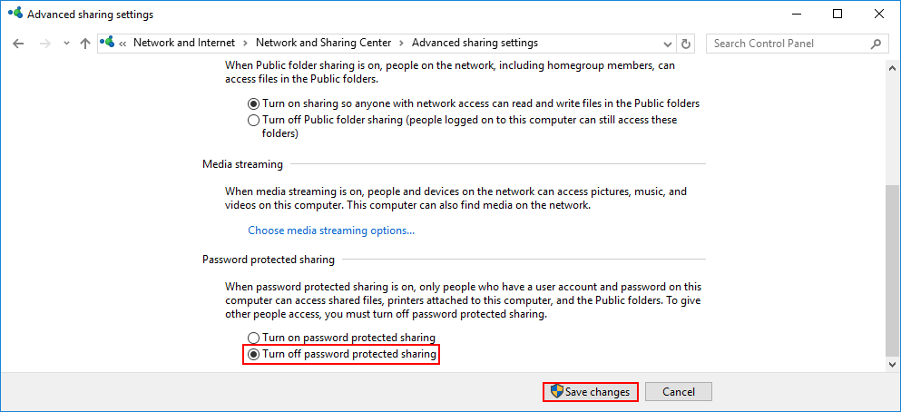

# Файловые сервера. Настройка и управление


## Файловый сервер Samba 

**Samba Server **- это программное обеспечение с открытым исходным кодом, которое позволяет установить сервер для обмена файлами и принтерами между устройствами в сети. Samba позволяет устройствам с различными операционными системами, такими как Windows, Linux, macOS и другими, обмениваться файлами и ресурсами через протоколы SMB/CIFS (Server Message Block / Common Internet File System).

Основные возможности Samba Server включают в себя:

1. Обмен файлами: Samba позволяет создавать общие папки (shares) на сервере, к которым пользователи могут получить доступ из клиентских устройств для чтения и записи файлов.

2. Обмен принтерами: Samba поддерживает общий доступ к принтерам в сети, что позволяет устройствам обмениваться общими принтерами и печатать документы.

3. Интеграция с Active Directory: Samba позволяет взаимодействовать с сетевыми службами Active Directory для централизованного управления пользователями, группами и правами доступа.

4. Аутентификация и авторизация: Samba обеспечивает механизмы аутентификации и авторизации пользователей, что позволяет контролировать доступ к ресурсам с помощью различных методов авторизации.

5. Интеграция в среду сети: Samba упрощает обмен файлами и принтерами в различных сетевых средах, обеспечивая совместимость с различными операционными системами.


## Настройка Samba сервера. Гостевой и приватный доступ
### Гостевой доступ

Гостевой доступ в Samba позволяет пользователям получить доступ к общим ресурсам без необходимости предоставления учетных данных (имени пользователя и пароля). Это удобно для создания открытых общих папок, к которым можно легко получить доступ без аутентификации.

Когда гостевой доступ включен в настройках Samba для конкретного общего ресурса, любой пользователь, пытающийся получить к нему доступ, будет рассматриваться как гость. Гостевой доступ позволяет пользователям читать и записывать файлы в общей папке без необходимости ввода учетных данных.

Например, при использовании гостевого доступа к общей папке с настройками Samba [guest_share] в файле smb.conf, пользователи смогут получить доступ к этой общей папке, просматривать содержимое, создавать и удалять файлы без ввода имени пользователя и пароля.

Важно помнить, что гостевой доступ может быть удобным для общих папок с общедоступным содержимым или для временного обмена файлами, но он также не является безопасным методом доступа. Поэтому не следует использовать гостевой доступ для общих папок, содержащих конфиденциальную информацию

#### Настройка Windows Server 2019 и Windows 10 для работы с гостевым доступом
Windows 10 версии 1709 и Windows Server 2019 клиенты SMB2 и SMB3 не имеют гостевого доступа по умолчанию. Для его включения:

- Откройте локальный групповая политика Редактор (gpedit.msc) на устройстве с Windows.
- В дереве консоли последовательно выберите Конфигурация компьютера>Административные - шаблоны>Сеть>Рабочая станция Lanman.
- Для параметра щелкните правой кнопкой мыши Включить небезопасные гостевые входы и выберите команду-Изменить.
- Выберите Включено>ОК.

Если вам нужно изменить групповую политику на основе домена Active Directory, используйте управление групповая политика (gpmc.msc).


#### Настройка гостевого доступа к общим папкам через Samba на Linux:

1. Установите пакет samba:

`sudo apt update`

`sudo apt install samba samba-client`

2. Создайте общую папку, которую вы хотели бы сделать доступной через Samba:

`sudo mkdir -p /samba/public`

`cd /samba`

`chmod -R 0755 public`

2. Создайте резервную копию файла конфигурации smb.conf:

`sudo cp /etc/samba/smb.conf /etc/samba/smb.conf.bak`

3. Изучим файл конфигурации

```bash
1. [global]: Секция с общими настройками.
   - workgroup = WORKGROUP: Устанавливает имя рабочей группы.
   - log file = /var/log/samba/log.%m: Определяет местоположение и формат файла журнала.
   - max log size = 1000: Устанавливает максимальный размер лог-файла.
   - logging = file: Указывает, что логирование производится в файл.
   - panic action: Указывает путь к скрипту, который будет выполнен при возникновении ошибки.
   - server role = standalone server: Устанавливает роль сервера Samba.
   - obey pam restrictions = yes: Указывает следовать ограничениям PAM.
   - unix password sync = yes: Разрешает синхронизацию пароля Unix.
   - passwd program = /usr/bin/passwd %u: Программа, используемая для изменения пароля.
   - passwd chat = *Entersnews*spassword:* %nn *Retypesnews*spassword:* %nn *passwordsupdatedssuccessfully* .: Задает шаблон диалога с пользователем при изменении пароля.
   - pam password change = yes: Указывает Samba использовать PAM для смены пароля.
   - map to guest = bad user: Определяет как обрабатывать неизвестных пользователей - в данном случае, как неверных.
   - usershare allow guests = yes: Разрешает использование общих папок пользователями-гостями.

2. [homes]: Секция для настроек домашних директорий.
   - comment = Home Directories: Комментарий к секции.
   - browseable = no: Отключает просмотр содержимого директории.
   - read only = yes: Устанавливает только для чтения.
   - create mask = 0700: Устанавливает права на создание файлов.
   - directory mask = 0700: Устанавливает права на создание директорий.
   - valid users = %S: Указывает список пользователей, которым доступны эти директории.

3. [printers]: Секция для конфигурации принтеров.
   - comment = All Printers: Комментарий к секции.
   - browseable = no: Отключает просмотр принтеров.
   - path = /var/tmp: Путь к директории с файлами принтеров.
   - ... (другие параметры)

4. [print$]: Секция для драйверов принтеров.
   - comment = Printer Drivers: Комментарий к секции.
   - path = /var/lib/samba/printers: Путь к директории с драйверами принтеров.
   - browseable = yes: Разрешает просмотр этой директории.
   - ... (другие параметры)
```

3. Отредактируйте файл конфигурации smb.conf:

`sudo vim /etc/samba/smb.conf`

Замените содержимое файла на следующие строки::

```bash
[global]
workgroup = WORKGROUP
security = user
map to guest = bad user
wins support = no
dns proxy = no

[public]
path = /samba/public
guest ok = yes
force user = nobody
browsable = yes
writable = yes
```   

Значения параметров выше:

- global - раздел с общими настройками для Samba сервера
- workgroup - рабочая группа Windows, WORKGROUP - значение по умолчанию для всех Windows машин, если вы не меняли самостоятельно
- security - режим безопасности, значение user означает аутентификацию по логину и паролю
- map to guest - задает способ обработки запросов, bad user - запросы с неправильным паролем будут отклонены, если такое имя пользователя - существует
- wins support - включить или выключить поддержку WINS
- dns proxy - возможность запросов к DNS
- public - название общего каталога, которое будут видеть пользователи сети, может быть произвольным и не совпадать с именем директории
- path - полный путь до общего каталога
- browsable - отображение каталога в сетевом окружении
- writable - использование каталога на запись, инверсия read only
- guest ok - авторизация без пароля
- force user - пользователь по умолчанию

Проверяем конфигурацию Самбы утилитой testparm

`testparm -s`

4. Сохраните изменения и закройте файл.

5. Перезапустите службу Samba для применения изменений:

`sudo systemctl restart smbd`

6. Включите автозапуск службы Samba:

`sudo systemctl enable smbd`

7. Далее нужно настроить firewall, открыв порты, которые использует SAMBA. Настоятельно рекомендуем разрешить только подключения из локального диапазона IP-адресов или виртуальной частной сети. Адресное пространство вашей частной сети вы можете увидеть в панели управления 1cloud.

Замените значение параметра –s в правилах ниже для соответствия адресному пространству вашей частной сети. Как правило префикс сети /24, если вы явно не подразумеваете иного:

`apt install ufw`

`ufw allow ssh`

`ufw enable`


```bash
sudo ufw allow from 192.168.2.0/24 to any port 445 proto tcp
sudo ufw allow from 192.168.2.0/24 to any port 139 proto tcp
sudo ufw allow from 192.168.2.0/24 to any port 137 proto udp
sudo ufw allow from 192.168.2.0/24 to any port 138 proto udp
```

`ufw reload`

`ufw status`

Чтобы пользователи локальной сети могли без пароля подключаться к общему ресурсу, необходимо в панели управления снять ограничения защиты. Откройте панель управления и перейдите в раздел Сеть (Network and Internet) -> Центр управления сетями и общим доступом (Network and Sharing Center) -> Расширенные настройки общего доступа (Advanced sharing settings). В разделе Все сети (All Networks) выберете опцию Отключить доступ с парольной защитой (Turn off password protected sharing) и сохраните изменения.




Для разрешения работы по протоколу SMBv1 в Windows 10 необходимо:

gpedit.msc
Конфигурация компьютера -> Административные шаблоны -> Сеть -> Рабочая станция Lanman (Computer Configuration ->Administrative templates -> Network (Сеть) -> Lanman Workstation). Включите политику Enable insecure guest logons (Включить небезопасные гостевые входы).

Перезагрузить сервер

Пробуем попасть в папку например `\\192.168.2.101\public`


###  Для Linux клиента

Для доступа к удаленной SMB шаре на Debian Linux в качестве гостя, вам понадобится настроить Samba, который позволит вам подключиться к удаленному ресурсу. Вот инструкция по настройке доступа к удаленной SMB шаре на Debian в качестве гостя:

1. Установите Samba:
Установите пакет Samba на вашем Debian сервере, используя следующую команду:

`sudo apt install samba`

2. Создайте директорию для монтирования шары:

`sudo mkdir /mnt/smbshare`

3. Подключитесь к удаленной SMB шаре в качестве гостя:
Используйте следующую команду для монтирования удаленного SMB шары в качестве гостя (замените REMOTE_HOST на IP-адрес или имя хоста удаленного сервера, SHARE_NAME на имя шары и /mnt/smbshare на путь к месту монтирования):

`sudo mount -t cifs //REMOTE_HOST/SHARE_NAME /mnt/smbshare -o guest`

4. Отключите шару:
Чтобы отключить шару после использования, выполните следующую команду:

`sudo umount /mnt/smbshare`


Помните, что гостевой доступ может быть небезопасным, поэтому убедитесь, что ваша общая папка не содержит конфиденциальную информацию и что она установлена только для временного использования или для общего доступа к содержимому.

#### Настройка приватного доступа к общим папкам через Samba на Linux:

Для настройки приватного доступа к общим папкам через Samba на Debian, вам нужно выполнить следующие шаги:

1. Создайте приватную папку и пользователей Samba:

`sudo mkdir -p /samba/private`

2. Создайте группу пользователей, которые будут иметь доступ к приватным данным:

`groupadd smbgrp`

1. Создайте пользователей для работы с приватной папкой

`sudo adduser user1`

3. Добавьте пользователей в созданную группу

`sudo usermod -aG smbgrp user1`

`groups user1`

`getent group smbgrp`

1. Измените группу, которой принадлежит приватная директория:

`chgrp smbgrp /samba/private`

5. Задайте пароль, с помощью которого пользователь будет подключаться к каталогу:

`smbpasswd -a user1`


4. Отредактируйте файл конфигурации smb.conf:

`sudo vim /etc/samba/smb.conf`

Добавьте следующий блок для вашей общей папки в конце файла:

```bash
[private]
path = /samba/private
valid users = @smbgrp
guest ok = no
browsable = yes
writable = yes
```   

1. [private_share]: данная строка обозначает имя для шары (раздела), к которому будет обращаться клиент для доступа к содержимому. В данном случае, шара называется private_share.

2. comment = Private access share: данная строка задает комментарий к шаре, который будет виден пользователям при просмотре сетевых ресурсов. В данном случае, комментарий указывает на то, что это шара с ограниченным доступом.

3. path = /smb/share_private: указывает путь к локальной директории на сервере, которая будет расшарена через Samba. В данном случае, путь указывает на каталог /smb/share_private.

4. browseable = no: указывает, что данная шара не будет отображаться в списке сетевых ресурсов при просмотре сети. 

5. writeable = yes: позволяет пользователям записывать данные в шару (иметь доступ на запись).

6. valid users = privat_user1,privat_user2: задает список пользователей, которым разрешен доступ к данной шаре. Только пользователи privat_user1 и privat_user2 смогут получить доступ к данной шаре.

Проверяем конфигурацию Самбы утилитой testparm

`testparm`

1. Сохраните изменения и закройте файл.

2. Перезапустите службу Samba для применения изменений:

`sudo systemctl restart smbd`

Теперь ваша общая папка настроена для приватного доступа через Samba на Debian. Только пользователи, указанные в разделе valid users, смогут получить доступ к этой общей папке. Убедитесь, что настройки прав доступа и разрешений на папку настроены соответствующим образом для безопасной работы с общими ресурсами.

Пробуем попасть в папку например `\\192.168.2.101\private`

`touch /samba/private/test`

Для разрешения записи пользователю

`sudo chmod 775 /samba/private`

### Создание smb каталога в Windows

1. Чтобы настроить общий доступ к каталогу на Windows необходимо создать или выбрать нужный и открыть его свойства. В свойствах перейдите во вкладку Доступ (Sharing) и нажмите Расширенная настройка (Advanced Sharing).
 
2. Так как каталог будет доступен только определенным пользователям, необходимо удалить группу Все пользователи (Everyone) с помощью кнопки Удалить (Remove).

3. Далее с помощью кнопки Добавить (Add) добавьте пользователей для управления каталогом.
 
4. Введите имя и нажмите Проверить имена (Check Names), выберете полное имя пользователя и 1. нажмите OK.
 
5. Установите нужные права и нажмите Применить (Apply).
 
6.  Теперь в свойствах каталога нажмите Поделиться (Share).
  
7.  В поле поиска введите имя пользователя и нажмите Добавить (Add). Для полного доступа выберете 1. права Чтение/Запись (Read/Write) и нажмите Поделиться (Share).
 
8.  В итоге каталог стает общедоступным для определенных пользователей.


### Подключение к общему каталогу с помощью Linux станции

Чтобы подключиться к общему каталогу, необходимо установить клиент для подключения:

`sudo apt install cifs-utils`

Для подключения используйте следующий формат команды:

`mount.cifs //192.168.2.101/private /mnt -o user=user1`


## Интеграция Samba с Active Directory

fileserver.homenet.local = d12-0.lup.local
dc1.homenet.local = WS19-0.homenet.local
vasya_petrov - пользователь домена
fedya_ivanov - пользователь домена

Первоначальная настройка файлового сервера Samba с интеграцией с контроллером домена Active Directory на ОС Debian GNU

В первую очередь необходимо указать FDQN в файле /etc/hostname

`hostnamectl set-hostname fileserver.homenet.local`

и поправить строчку в файле /etc/hosts:
```bash
127.0.1.1    fileserver.homenet.local fileserver
```

Проверим командой:

`hostnamectl status`

***
После этого устанавливаем службу ntp для синхронизации времени с контроллером домена

`apt install ntp ntpdate`

Служба запустится автоматически после установки.

Затем открываем файл /etc/ntp.conf и перед списком pool указываем сервер контроллера домена:

```bash
server dc1.homenet.local
```
Перезапускаем службу ntp

`systemctl restart ntp`

и сверяем дату и время

`date`

***
Переходим к настройке Kerberos. Устанавливаем пакет krb5-user

`apt install krb5-user`

открываем файл /etc/krb5.conf и приводим его к следующему виду:

```bash
[logging]
    default = FILE:/var/log/krb5libs.log
    kdc = FILE:/var/log/krb5kdc.log
    admin_server = FILE:/var/log/kadmind.log
[libdefaults]
    default_realm = HOMENET.LOCAL
    dns_lookup_kdc = false
    dns_lookup_realm = false
    forwardable = true
    ticket_lifetime = 24h
[realms]
    HOMENET.LOCAL = {
        kdc = dc1.homenet.local
        default_domain = HOMENET.LOCAL
        admin_server = dc1.homenet.local
    }
[domain_realm]
    .homenet.local = HOMENET.LOCAL
    homenet.local = HOMENET.LOCAL
```

Проверяем работу kerberos

`kinit administrator@HOMENET.LOCAL`

потребуется ввести пароль
здесь administrator — учётная запись с правами администратора контроллера домена

Проверяем:

`klist`
консоль должна показать примерно такое:

_Ticket cache: FILE:/tmp/krb5cc_0
Default principal: administrator@HOMENET.LOCAL
Valid starting       Expires              Service principal
10.02.2023 00:27:51  10.02.2023 10:27:51  krbtgt/HOMENET.LOCAL@HOMENET.LOCAL
    renew until 11.02.2023 00:27:45_

Значит всё сработало. Теперь удаляем полученный тикет

`kdestroy`

***
Далее устанавливаем Samba и winbind и входим в домен

`apt install samba cifs-utils winbind libnss-winbind libpam-winbind`

открываем файл конфигурации samba

`vim /etc/samba/smb.conf`

и приводим его к следующему виду:

```bash
[global]
        realm = HOMENET.LOCAL
        workgroup = HOMENET
        security = ads
        encrypt passwords = yes
        netbios name = fileserver
        server string = %h, Samba server %v
        domain master = no
        local master = no
        preferred master = no
        os level = 0
        domain logons = no
        dns proxy = no
        socket options = TCP_NODELAY
        unix charset = UTF-8
        dos charset = 866
        idmap config * :              backend = tdb
        idmap config * :              range   = 3000-7999
        idmap config HOMENET : backend = rid
        idmap config HOMENET : range   = 10000-999999
        winbind enum users = yes
        winbind enum groups = yes
        winbind refresh tickets = yes
        winbind use default domain = yes
        winbind offline logon = yes
        winbind cache time = 300
        template homedir = /srv/share/users/%D/%U
        template shell = /bin/bash
        load printers = no
        show add printer wizard = no
        printcap name = /dev/null
        disable spoolss = yes
        log level = 0 vfs:1
``` 

Затем увеличиваем лимит одновременно открытых файлов до 16384. Для этого открываем **/etc/security/limits.conf** и в самом конце допишем такие строки:

```bash
*               -       nofile          16384
root            -       nofile          16384
```

Проверяем конфигурацию Самбы утилитой testparm

`testparm`

в консоли получим ответ:


```
Load smb config files from /etc/samba/smb.conf
Loaded services file OK.
Server role: ROLE_DOMAIN_MEMBER
Press enter to see a dump of your service definitions
```


жмём Enter и консоль покажет такую выгрузку:

```
Global parameters
[global]
disable spoolss = Yes
dns proxy = No
domain master = No
dos charset = 866
load printers = No
local master = No
os level = 0
preferred master = No
printcap name = /dev/null
realm = HOMENET.LOCAL
security = ADS
server string = %h server
show add printer wizard = No
template homedir = /srv/share/users/%D/%U
template shell = /bin/bash
winbind enum groups = Yes
winbind enum users = Yes
winbind offline logon = Yes
winbind refresh tickets = Yes
winbind use default domain = Yes
workgroup = HOMENET
idmap config homenet :    range = 10000-999999
idmap config homenet :    backend = rid
idmap config * :    range = 3000-7999
idmap config * : backend = tdb

```
После этого не нужно перезагрузить машину

`shutdown -r now`

***
Теперь подключим Самбу к домену

`net ads join -U administrator@homenet.local`

вводим пароль и консоль покажет такой результат:

```
_Using short domain name -- HOMENET
Joined 'FILESERVER' to dns domain 'homenet.local'_

```
Это значит, что в DNS контроллера домена lup.local добавлена A-запись fileserver.

Для того, чтобы мы могли видеть и пользоваться учётными записями и группами домена, настроим службу winbind. Для этого открываем файл **/etc/nsswitch.conf** и изменим параметры passwd и group:

```bash
passwd:         files winbind
group:          files winbind
```

Перезапускаем службу winbind

`systemctl restart winbind`

Теперь нам необходимо проверить доверительные отношения с контроллером домена

`wbinfo -t`

консоль должна вывести такую строчку:

```
checking the trust secret for domain HOMENET via RPC calls succeeded

```
Это значит, что Active Directory доверяет Самбе.

После этого мы можем увидеть список пользователей домена

`wbinfo -u`

а также групп

`wbinfo -g`

Если консоль всё это выводит, значит всё настроено правильно. Если нет, то перезагрузим машину

`shutdown -r now`

и повторим эти команды, должно будет работать.

***
Далее можно начинать открывать ресурсы для пользователей. Для этого создадим директорию /srv/share/

`mkdir /srv/share/`

назначим ей владельца — группу sambashare и дадим полные права

`chown :sambashare /srv/share/`

`chmod 777 /srv/share/`

в этой директории создадим директорию test

`mkdir /srv/share/test/`

и зададим владельца уже пользователя домена vasya_petrov

`chown vasya_petrov /srv/share/test/`

`chmod 777 /srv/share/test/`

снова откроем файл **/etc/samba/smb.conf** и пропишем эту директорию в шарах:

```bash
[Test Folder]
    writeable = yes
    read list = @sales fedya_ivanov
    valid users = vasya_petrov @buh "@Администраторы домена"
    path = /srv/share/test

```
и перезапускаем службы самбы

`systemctl restart smbd`
`systemctl restart nmbd`

Теперь на другой машине в домене lup.local открываем

\\fileserver\

и увидим шару Test Folder

Здесь получается, что у группы sales и пользователя fedya_ivanov права только на чтение, а у пользователя vasya_petrov и групп buh и Администраторы домена — права на чтение и запись.


## Почтовый сервер: Postfix. Iredmail

Подготовка сервера
Задаем правильное имя сервера:

`hostnamectl set-hostname d12-0.lup.local`

* имя сервера должно быть в формате FQDN, в противном случае мы получим ошибку << ERROR >> Please configure a fully qualified domain name (FQDN) in /etc/hosts before we go further.

Заданное имя сервера должно разрешаться в IP-адрес через DNS. Если на момент установки это невозможно, создадим запись в файле hosts:

`vim /etc/hosts`

```bash
127.0.1.1	d12-0.lup.loc	d12-0
127.0.0.1	localhost
```

* очень важно, чтобы имя FQDN было первым.

Останавливаем веб-сервер apache (в данном примере будет использоваться nginx):

`systemctl stop apache2`

`systemctl disable apache2`

* если не остановить apache и попытаться установить nginx, мы получим ошибку Errors were encountered while processing: nginx-full.

Если в нашей системе настроен брандмауэр, мы должны открыть следующие порты:

```bash
sudo ufw allow 80,443/tcp
sudo ufw allow 25,465,587/tcp
sudo ufw allow 110,143,993,995/tcp
```

* где мы откроем следующие порты:

25 — стандартный SMTP (без шифрования или через STARTTLS);
80 — HTTP для порталов iRedAdmin и Roundcube;
110 — стандартный POP3 (без шифрования или через STARTTLS);
143 — стандартный IMAP (без шифрования или через STARTTLS);
443 — защищенный HTTPS для порталов iRedAdmin и Roundcube;
465 — защищенный SMTP через SSL/TLS;
587 — защищенный SMTP через STARTTLS;
993 — защищенный IMAP через SSL/TLS;
995 — защищенный POP3 через SSL/TLS.
Для сохранения правил установим утилиту iptables-persistent:

`ufw reload`


Установка iRedMail
Заходим на страницу http://www.iredmail.org/download.html и копируем ссылку на скачивание последней версии почтового сервера:

Теперь используем ссылку для загрузки дистрибутива на сервере:

`wget -O iredmail.tar.gz <скопированная ссылка>`

Например:

`wget -O iredmail.tar.gz https://github.com/iredmail/iRedMail/archive/refs/tags/1.6.8.tar.gz`

И распаковываем скачанный архив:

`tar -zxf iredmail.tar.gz`

Переходим в каталог с распакованным установщиком:

`cd iRedMail-*/`

И запускаем скрипт установки:

`bash iRedMail.sh`

При ошибке запустить повторно

На все запросы отвечаем Enter.

Запустится мастер настроек. В первом окне с приветствием ответьте Yes:

В окне Default mail storage path оставляем /var/vmail и задаем свой путь для хранения сообщений

В следующем окне Preferred web server желательно оставить Nginx

В окне Choose preferred backend used to store mail accounts выбираем PostgreesQL

Есистема потребует ввести домен:

И задаем пароль для пользователя СУБД:

На следующем шаге вводим наш первый почтовый домен:

Теперь вводим пароль для управления почтовыми ящиками:

В окне Optional components выбираем все доступные компоненты:

Выбираем все доступные компоненты iRedMail

В самом конце вводим Y, чтобы подтвердить введенные настройки.

Начнется установка почтового сервера. В зависимости от производительности, процесс может занять от 10 до 20 минут. В конце система предложит активировать брандмауэр — соглашаемся вводом Y.

И снова запускаем установку iRedMail:

bash iRedMail.sh

На вопрос о продолжении использовать ранее введенные настройки отвечаем утвердительно — Y.

После завершения, установщик даст подсказку, что необходимо перезапустить сервер для начала работы всех компонентов. Выполним перезагрузку:

`shutdown -r now`


* - Кабинет webmail: https://192.168.2.101/mail/
* - Улучшенный кабинет : https://192.168.2.101/SOGo/
* - netdata (monitor): https://192.168.2.101/netdata/
* - Web admin panel (iRedAdmin): https://192.168.2.101/iredadmin/


## Домашнее задание
Исходные данные:
На личном стенде (смотрим схему) подготовить:
1. Приватную папку SMB для пользователя lup и lup2 и паролем 1234Qwer
2. Подключить пользователя linux к smb серверу.

- Опишите все команды по установке в скрипте create_samba.bash (скрипт должен настроить smb сервер)

***
**дополнительно**
1. Установить почтовый сервер IRedMAil

- Опишите все команды по установке в файле create_post.txt

- Сделайте скриншот сервисов почты

***
**Для отчета:**
- создать в личном репозитории организаци github ветку lesson_3_5
- создать директорию lesson_3_5 и разместить там файл домашнего задания
- сделать push и pull request на сайте, в качестве рецензента добавить пользователя AndreyChuyan

