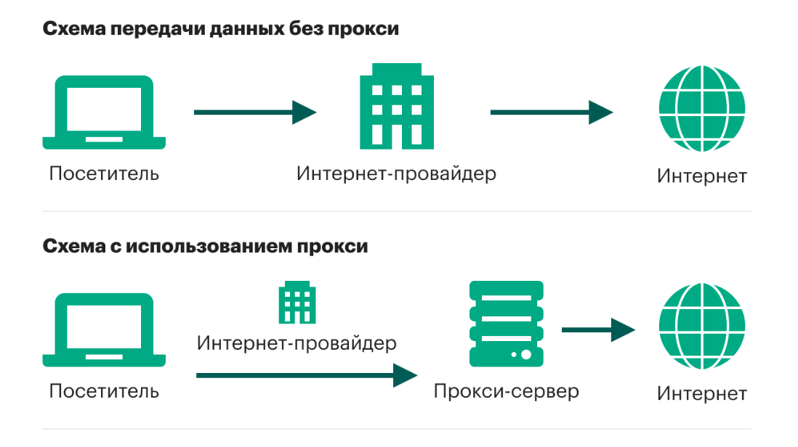
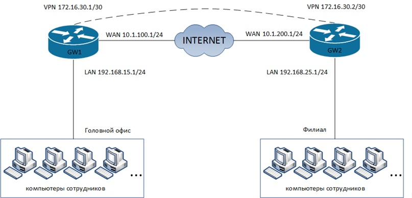

# Прокси и vpn сервер. Настройка и управление


## Установка и настройка прокси-сервера Squid. 



Прокси-сервер (Proxy-сервер) - это посредник между пользовательским устройством (клиентом) и интернетом. Он работает как промежуточное звено, перенаправляя запросы и отвечая на них от имени клиента. Прокси-серверы могут выполнять различные функции, включая кэширование контента, фильтрацию трафика, управление доступом, анонимизацию адресов и другие.

Вот некоторые основные функции и преимущества прокси-серверов:

1. Кэширование: Прокси-серверы могут кэшировать часто запрашиваемый контент, ускоряя загрузку страниц и снижая нагрузку на сеть и сервера.
   
2. Фильтрация: Прокси-серверы могут фильтровать трафик и блокировать доступ к определенным сайтам или контенту, обеспечивая безопасность и соблюдение правил сетевой политики.

3. Управление доступом: Прокси-серверы могут контролировать доступ к ресурсам сети, определяя, какие пользователи имеют доступ к каким ресурсам.

4. Анонимизация: Прокси-серверы могут скрывать реальные IP-адреса клиентов и предоставлять анонимный доступ к интернету.

5. Балансировка нагрузки: Прокси-серверы могут использоваться для распределения нагрузки между несколькими серверами, улучшая производительность и надежность системы.


**Публичный прокси**
Эти типы прокси известны как открытые прокси. Это бесплатные прокси, которыми одновременно пользуются много людей. Обычно их можно найти на сайтах, публикующих обновленные списки прокси-серверов. Очевидным преимуществом открытых прокси является то, что они бесплатны. Но недостатки перевешивают: эти прокси-серверы медленные, небезопасные и ненадежные.

**Приватный прокси**
Такие прокси более быстры и безопасны, чем предыдущие. Компании, предоставляющие частные прокси, могут предлагать и другие функции, услуги, такие как WAF (web application firewall), VPN и прочие, а также техподдержку клиентов. Частный прокси может быть выделенным и общим.

**Выделенный прокси**
Такой вид предоставляется через высокопроизводительные серверы с выделенными ресурсами. Эти прокси позволяют подключаться и отправлять запросы только одному клиенту, решая проблему «шумных соседей» или черного списка. Последнее актуально для бесплатных прокси, когда один из ранее использовавших его пользователей допустил попадание IP-адреса в блок-лист сайта.

**Прозрачный прокси**
Вид прокси-сервера, который позволяет подключаться к нему без дополнительных настроек. Принцип его работы заключается в том, что весь трафик с порта клиента перенаправляется на порт прокси-сервера, посредством статических маршрутов на самом устройстве или на маршрутизаторе. Но есть и более специфические разновидности прокси. 

**HTTP-прокси**
Это тип прокси-сервера, который действует как сервер-посредник между клиентом и веб-сервером. Если вы используете HTTP-прокси, то при отправке запроса на веб-сайт происходит следующее: запрос попадает не на сайт, а на прокси-сервер в виде обычного текста. После этого прокси-сервер анализирует его и посылает новый запрос на сайт, используя данные из запроса, но изменяя ваш IP-адрес (по желанию). Веб-сайт получает его и отправляет ответ на прокси-сервер, после чего сервер пересылает ответ пользователю.

**Прокси с использованием SSL**
При использовании SSL-прокси создается только одно TCP-соединение. Это отличает его от HTTP-прокси, который создает два соединения: одно от клиента к прокси, другое от прокси к веб-серверу. 

Когда пользователь инициирует веб-запрос, он посылает запрос CONNECT на веб-сервер и создает TCP-канал, по которому проходит запрос. Одним из преимуществ SSL-прокси перед HTTP-прокси является то, что их можно использовать для доступа к ресурсам как HTTPS-, так и HTTP-серверов. Этого нельзя сделать с HTTP-прокси, который можно использовать только для доступа к ресурсам HTTP-сайтов. Если пользователь попытается получить доступ к HTTPS-сайту с помощью HTTP-прокси, соединение с сайтом не будет считаться безопасным.

**CGI-прокси**
Прокси Common Gateway Interface (CGI) извлекает веб-контент из интернета от имени клиента. CGI-прокси используется через веб-браузер и выглядит как обычный веб-сайт. Чтобы воспользоваться им, достаточно ввести URL-адрес назначения, и CGI отобразит результаты, как если бы он был отправителем запроса. CGI-прокси работает через зашифрованную веб-форму, встроенную в другую веб-страницу с использованием SSL.

**SOCKS-прокси (SOCKets Secure)**
SOCKS — это еще один интернет-протокол. Он расшифровывается как SOCKet Secure и обычно используется для задач с интенсивным трафиком, таких как потоковая передача контента или обмен P2P. 

SOCKS использует соединение TCP, которое предназначено для отправки и получения пакетов данных через интернет, а также для гарантии успешной доставки ресурсов по сети. При использовании SOCKS-прокси интернет-трафик направляется через прокси-сервер по TCP-соединению от имени клиента. Как и большинство других типов прокси, SOCKS скрывают IP-адрес клиента, обеспечивая анонимность.

**Установка и настройка**

`sudo apt install squid`

`systemctl status squid`

`sudo cp /etc/squid/squid.conf{,.orginal}`

{,.original}: Это используемая в bash-скриптах функция подстановки. В данном случае {,.original} означает, что мы хотим скопировать файл squid.conf и создать новую копию с добавлением суффикса .original в конце имени файла. 

`sudo vim /etc/squid/squid.conf`

По умолчанию Squid прослушивает порт 3128 на всех сетевых интерфейсах

Откроем бранмауер squid

`sudo ufw allow 3128/tcp`

или

`sudo ufw allow 'Squid'`


Запуск Squid на всех интерфейсах и на порту по умолчанию должен подойти большинству пользователей.

Списки контроля доступа (ACL) позволяют контролировать, как клиенты могут получать доступ к веб-ресурсам. По умолчанию Squid разрешает доступ только с локального хоста.

Если все клиенты, которые будут использовать прокси, имеют статический IP-адрес, самым простым вариантом является создание ACL, который будет включать разрешенные IP-адреса.

Вместо добавления IP-адресов в основной файл конфигурации мы создадим новый включаемый файл, в котором будут храниться IP-адреса:

`sudo mkdir /etc/squid/rule`

`sudo vim /etc/squid/rule/allowed_ips.txt`

```bash
192.168.2.2-192.168.2.3
192.168.2.4-192.168.2.254
```

После этого откройте основной файл конфигурации и создайте новый ACL с именем allowed_ips (первая выделенная строка) и разрешите доступ к этому ACL с помощью директивы http_access (вторая выделенная строка):

sudo vim /etc/squid/squid.conf

```bash
acl allowed_ips src "/etc/squid/rule/allowed_ips.txt" # разрешенные хосты для подключения

acl SSL_ports port 443
acl Safe_ports port 80		# http
acl Safe_ports port 21		# ftp
acl Safe_ports port 443		# https
acl Safe_ports port 70		# gopher
acl Safe_ports port 210		# wais
# acl Safe_ports port 1025-65535	# unregistered ports
acl Safe_ports port 280		# http-mgmt
acl Safe_ports port 488		# gss-http
acl Safe_ports port 591		# filemaker
acl Safe_ports port 777		# multiling http
acl CONNECT method CONNECT
http_access deny !Safe_ports
http_access deny CONNECT !SSL_ports

#--------------------------------------------------------------------------
# Разрешающие правила
http_access allow localhost # Локальный хост
# http_access allow localnet # Локальная сеть
http_access allow allowed_ips # Правило разрешенных адресов

http_access deny all # Финальный запрет сайтов не разрешенных выше

#-------------------------------------------------------------------------
# дополнительные настройки
http_port 3128 # порт, на котором прокси-сервер Squid будет слушать входящие HTTP-запросы. 
```

Порядок правил http_access важен. Убедитесь, что вы добавили строку перед http_access deny all .
Директива http_access работает аналогично правилам межсетевого экрана. Squid читает правила сверху вниз, и когда правило соответствует приведенным ниже правилам, не обрабатываются.
Каждый раз, когда вы вносите изменения в файл конфигурации, вам необходимо перезапустить службу Squid, чтобы изменения вступили в силу:

Проверка на ошибки
`squid -k parse`
Пересчет конфига и принятие изменений
`squid -k reconfigure`

### Squid аутентификация

Squid может использовать разные серверные части, включая Samba, LDAP и базовую аутентификацию HTTP для аутентифицированных пользователей.

В этом примере мы настроим Squid на использование базовой аутентификации. Это простой метод аутентификации, встроенный в протокол HTTP.

Создадим пользователя с именем user_proxy и паролем 1234Qwer :

`sudo apt install apache2-utils`

`sudo touch /etc/squid/passwd`

`sudo htpasswd /etc/squid/passwd user_proxy`

Следующим шагом является включение базовой аутентификации HTTP. Откройте основную конфигурацию и добавьте следующее:

sudo vim /etc/squid/squid.conf
```bash
acl allowed_ips src "/etc/squid/rule/allowed_ips.txt" # разрешенные хосты для подключения

acl SSL_ports port 443
acl Safe_ports port 80		# http
acl Safe_ports port 21		# ftp
acl Safe_ports port 443		# https
acl Safe_ports port 70		# gopher
acl Safe_ports port 210		# wais
# acl Safe_ports port 1025-65535	# unregistered ports
acl Safe_ports port 280		# http-mgmt
acl Safe_ports port 488		# gss-http
acl Safe_ports port 591		# filemaker
acl Safe_ports port 777		# multiling http
acl CONNECT method CONNECT
http_access deny !Safe_ports
http_access deny CONNECT !SSL_ports

#--------------------------------------------------------------------------
# Парольная аутентификация
auth_param basic program /usr/lib/squid/basic_ncsa_auth /etc/squid/passwd
   acl ncsa_users proxy_auth REQUIRED
   http_access allow ncsa_users # авторизация по паролю
   
#--------------------------------------------------------------------------
# Разрешающие правила
http_access allow localhost # Локальный хост
http_access allow allowed_ips # разрешенные адреса
http_access deny all # Финальный запрет сайтов не разрешенных выше

#-------------------------------------------------------------------------
# дополнительные настройки
http_port 3128 # порт, на котором прокси-сервер Squid будет слушать входящие HTTP-запросы. 
```

1. auth_param basic program /usr/lib/squid/basic_ncsa_auth /etc/squid/passwd: В этой строке определяется программа basic_ncsa_auth в качестве механизма аутентификации. Параметр program указывает путь к исполняемому файлу basic_ncsa_auth, который использует файл /etc/squid/passwd для аутентификации пользователей. Этот файл содержит пары логин-пароль, используемые для проверки подлинности пользователей.

2. acl ncsa_users proxy_auth REQUIRED: Здесь создается ACL (Access Control List) с названием ncsa_users, который отображает пользователей, прошедших аутентификацию через прокси. ACL proxy_auth REQUIRED обозначает, что пользователь должен пройти аутентификацию для доступа через прокси-сервер.

3. http_access allow ncsa_users: Это правило разрешает доступ к ресурсам пользователям, попадающим в ACL ncsa_users. Таким образом, только пользователи, прошедшие аутентификацию (HTTP Basic Authentication) с использованием файла паролей, могут получить доступ через прокси-сервер.

`squid -k reconfigure`

### Ограничение доступа к веб ресурсам

Создаем файл разрешенных сайтов 

`sudo vim /etc/squid/rule/whitelist.txt`
```bash
.mail.ru
```
Создаем файл запрещенных сайтов 
`vim /etc/squid/rule/blacklist.txt`
```bash
.vk.ru 
.vk.com 
.ok.ru
.ok.com
```

Импортируем файлы в конфиг и разместим правила в верном порядке

sudo vim /etc/squid/squid.conf
```bash
acl allowed_ips src "/etc/squid/rule/allowed_ips.txt" # разрешенные хосты для подключения
acl whitelist dstdomain "/etc/squid/rule/whitelist.txt" # файлы со списками разрешенных сайтов
acl blacklist dstdomain "/etc/squid/rule/blacklist.txt" # файлы со списками запрещенных сайтов

acl SSL_ports port 443
acl Safe_ports port 80		# http
acl Safe_ports port 21		# ftp
acl Safe_ports port 443		# https
acl Safe_ports port 70		# gopher
acl Safe_ports port 210		# wais
# acl Safe_ports port 1025-65535	# unregistered ports
acl Safe_ports port 280		# http-mgmt
acl Safe_ports port 488		# gss-http
acl Safe_ports port 591		# filemaker
acl Safe_ports port 777		# multiling http
acl CONNECT method CONNECT
http_access deny !Safe_ports
http_access deny CONNECT !SSL_ports

#--------------------------------------------------------------------------
# Парольная аутентификация
auth_param basic program /usr/lib/squid/basic_ncsa_auth /etc/squid/passwd
   acl ncsa_users proxy_auth REQUIRED
http_access allow ncsa_users # авторизация по паролю

#-------------------------------------------------------------------------
# Белые и черные списки
http_access allow whitelist 
http_access deny blacklist

#--------------------------------------------------------------------------
# Разрешающие правила
http_access allow localhost # Локальный хост
http_access allow allowed_ips # разрешенные адреса
http_access deny all # Финальный запрет сайтов не разрешенных выше

#-------------------------------------------------------------------------
# дополнительные настройки
http_port 3128 # порт, на котором прокси-сервер Squid будет слушать входящие HTTP-запросы. 
```

Проверка на ошибки

`squid -k parse`


### Кеш веб страниц

директория для кеша
`mkdir /var/cache/squid`

`sudo chown proxy:proxy /var/cache/squid/`

```bash
acl allowed_ips src "/etc/squid/rule/allowed_ips.txt" # разрешенные хосты для подключения
acl whitelist dstdomain "/etc/squid/rule/whitelist.txt" # файлы со списками разрешенных сайтов
acl blacklist dstdomain "/etc/squid/rule/blacklist.txt" # файлы со списками запрещенных сайтов
acl manager proto cache_object
acl webserver src 127.0.0.1

acl SSL_ports port 443
acl Safe_ports port 80		# http
acl Safe_ports port 21		# ftp
acl Safe_ports port 443		# https
acl Safe_ports port 70		# gopher
acl Safe_ports port 210		# wais
# acl Safe_ports port 1025-65535	# unregistered ports
acl Safe_ports port 280		# http-mgmt
acl Safe_ports port 488		# gss-http
acl Safe_ports port 591		# filemaker
acl Safe_ports port 777		# multiling http
acl CONNECT method CONNECT
http_access deny !Safe_ports
http_access deny CONNECT !SSL_ports

#--------------------------------------------------------------------------
# Парольная аутентификация
auth_param basic program /usr/lib/squid/basic_ncsa_auth /etc/squid/passwd
   acl ncsa_users proxy_auth REQUIRED
http_access allow ncsa_users # авторизация по паролю

#-------------------------------------------------------------------------
# Белые и черные списки
http_access allow whitelist
http_access deny blacklist
# http_access deny !whitelist
#--------------------------------------------------------------------------
# Разрешающие правила
http_access allow localhost # Локальный хост
http_access allow allowed_ips # разрешенные адреса
http_access allow manager webserver
http_access deny all # Финальный запрет сайтов не разрешенных выше

#-------------------------------------------------------------------------
# дополнительные настройки
http_port 3128 # порт, на котором прокси-сервер Squid будет слушать входящие HTTP-запросы. 
# Настройки кэша в ОЗУ
cache_mem 1000 MB
maximum_object_size_in_memory 512 KB
memory_replacement_policy heap LRU
# Настройки дискового кэша
cache_replacement_policy heap LFUDA
cache_dir aufs /var/cache/squid 2000 16 256 # размер хранимого кеша в МБ
maximum_object_size 10 MB # максимальный размер кеша 
minimum_object_size 1 KB
# Очистка кэша при заполнении
cache_swap_low 90
cache_swap_high 95
# Размер докачки
quick_abort_min 16 KB
quick_abort_max 16 KB
quick_abort_pct 95


refresh_pattern ^ftp:		1440	20%	10080
refresh_pattern ^gopher:	1440	0%	1440
refresh_pattern -i (/cgi-bin/|\?) 0	0%	0
refresh_pattern .		0	20%	4320

refresh_pattern -i \.gif$ 2880 700% 8640
refresh_pattern -i \.png$ 2880 700% 8640
refresh_pattern -i \.jpg$ 2880 700% 8640
refresh_pattern -i \.jpeg$ 2880 700% 8640
refresh_pattern -i \.pdf$ 4320 1000% 8640
refresh_pattern -i \.zip$ 4320 1000% 8640
refresh_pattern -i \.tar$ 4320 1000% 8640
refresh_pattern -i \.gz$ 4320 1000% 8640
refresh_pattern -i \.tgz$ 4320 1000% 8640
refresh_pattern -i \.exe$ 4320 1000% 8640
refresh_pattern -i \.doc$ 4320 1000% 8640
refresh_pattern -i \.rtf$ 4320 1000% 8640
refresh_pattern -i \.xls$ 4320 1000% 8640
refresh_pattern -i \.prz$ 4320 1000% 8640
refresh_pattern -i \.ppt$ 4320 1000% 8640
refresh_pattern -i \.txt$ 4320 1000% 8640
refresh_pattern -i \.inf$ 4320 1000% 8640
refresh_pattern -i \.swf$ 8640 1000% 17280
refresh_pattern -i \.mid$ 17280 1000% 24660
refresh_pattern -i \.wav$ 17280 1000% 24660
refresh_pattern -i \.html$ 1440 90% 8640
refresh_pattern -i \.htm$ 1440 90% 8640
refresh_pattern -i \.shtml$ 1440 90% 8640
refresh_pattern -i \.css$ 1440 90% 8640
refresh_pattern -i \/$ 360 50% 8640

```

Где:
- ufs - используемый тип кэш-диска
- /var/squid/cache - путь к каталогу, где хранится кеш
- 4096 - новый размер кэша в мегабайтах
- 16 - количество первичных директорий
- 256 - количество вторичных директорий

1. refresh_pattern ^ftp: 1440 20% 10080
   - В данном случае, для FTP-запросов установлено следующее:
     - Объекты будут обновляться каждые 1440 минут (1 день)
     - 20% объектов будут обновляться даже если они не устарели
     - Максимальный срок жизни обновлений - 10080 минут (1 неделя)

2. refresh_pattern ^gopher: 1440 0% 1440
   - Для запросов к gopher-серверам:
     - Объекты будут обновляться каждые 1440 минут (1 день)
     - Не существует обязательной проверки устаревших объектов
     - Максимальный срок жизни обновлений - 1440 минут (1 день)

3. refresh_pattern -i (/cgi-bin/|?) 0 0% 0
   - В этом случае, для запросов, содержащих /cgi-bin/ или ?:
     - Отсутствует обновление объектов
     - 0% объектов будут обновляться даже если они не устарели
     - Максимальный срок жизни обновлений - 0 минут (немедленное обновление)

4. refresh_pattern . 0 20% 4320
    - Здесь все остальные запросы обновляются следующим образом:
     - Отсутствует обновление объектов
     - 20% объектов будут обновляться даже если они не устарели
     - Максимальный срок жизни обновлений - 4320 минут (3 дня)

`sudo chown proxy:proxy /var/cache/squid/`

Пересоздать каталоги
`squid -z`

Проверка на ошибки
`squid -k parse`

Пересчет конфига и принятие изменений
`squid -k reconfigure`

[хороший мануал]<http://www.bog.pp.ru/work/squid.html>

при ошибках перезаписать кеш
```bash
systemctl stop squid
rm -rf /var/spool/squid/*
squid -z
systemctl start squid
```


### Мониторинг squid

apt install nginx

apt install sarg

vim /etc/sarg/sarg.conf

cp /etc/nginx/nginx.conf /etc/nginx/nginx.conf.dist

vim /etc/nginx/nginx.conf
```bash
# Указываем пользователя и группу, от чьего имени запускается Nginx
user www-data www-data;

# Количество запускаемых рабочих процессов приравняем к количеству процессорных ядер на нашем сервере
worker_processes    2;

# Указываем месторасположение журнального файла сообщений об ошибках
error_log  /var/log/nginx/error.log;
pid        /var/run/nginx.pid;

events {
  worker_connections  1024;
}

http {
  # Подключаем описание типов файлов
  include             /etc/nginx/mime.types;

  # Месторасположение журнального файла событий доступа
  access_log  /var/log/nginx/access.log;

  sendfile            on;
  keepalive_timeout   65;
  tcp_nodelay         on;

  # Запрещаем сообщать версию Nginx в ответе клиенту
  server_tokens       off;

  # Подключаем файлы описания дополнительных конфигураций
  include /etc/nginx/conf.d/*.conf;
  include /etc/nginx/sites-enabled/*;
}
```

touch /etc/nginx/sites-available/d12-0
vim /etc/nginx/sites-available/d12-0
```bash
server {
  listen      *:80;
  server_name default;
  # Указываем кодировку отдаваемых страниц
  charset     utf-8;

  # Статическое наполнение у нас в полном объёме отдает сам Nginx
  root        /var/www/d12-0/;
  index       index.html;

  # Ограничиваем доступ к статистике всем, кроме явно обозначенных
  location  /  {
    allow   all;
    deny    all;
  }
}
```

`ln -s /etc/nginx/sites-available/d12-0 /etc/nginx/sites-enabled/d12-0`

`rm /etc/nginx/sites-enabled/default`

`/etc/init.d/nginx restart`

`vim /etc/sarg/sarg.conf`
```bash
output_dir /var/www/d12-0
```

`sudo sarg -x`

По завершению конфигурирования Nginx закрываем от постороннего взгляда директорию конфигурации:

`chown -R root:root /etc/nginx`

`chmod -R o-rwx /etc/nginx`

Открываем sarg
`http://localhost/`

Мониторим размер кэша
`du -sh /var/cache/squid/`


## Настройка VPN сервера

**VPN (Virtual Private Network)** - это технология, которая обеспечивает безопасное и защищенное соединение между вашим устройством (компьютером, смартфоном, планшетом) и интернетом. VPN используется для создания виртуальной сети, которая шифрует ваш трафик и маскирует ваш реальный IP-адрес, обеспечивая конфиденциальность, безопасность и анонимность во время использования интернета. 




**Настройка**

## Установка OpenVPN

Устанавливаем пакеты openvpn и easy-rsa. Выполняем следующую команду:

`apt install openvpn easy-rsa`

Для упрощения процедуры создания необходимых ключей и сертификатов традиционно используется утилита Easy-RSA, которая позволяет легко управлять локальным центром сертификации (CA) инфраструктуры открытых ключей (PKI)

Выходим из суперпользователя. Выполняем следующую команду:

`su lup`

Копируем файлы easy-rsa в домашний каталог. Выполняем следующую команду:

`cp -r /usr/share/easy-rsa .`

Переходим в каталог easy-rsa. Выполняем следующую команду:

`cd easy-rsa`

Выполняем инициализацию PKI. В каталоге EasyRSA есть скрипт easyrsa, который вызывается для выполнения задач, связанных с созданием и управлением CA. Запустите этот скрипт с параметром init-pki, чтобы инициировать инфраструктуру открытого ключа на сервере CA. Выполняем следующую команду:

`./easyrsa init-pki`

Генерируем сертификат корневого центра сертификации (CA). Выполняем следующую команду:

`./easyrsa build-ca nopass`

Вводим имя корневого центра сертификации (d12-0), нажимаем enter чтобы продолжить. 

Не забываем настроить интерфейс внутренней сети

`/etc/network/interfaces`

```bash
auto ens4
iface ens4 inet static
   address 192.168.101.5
   netmask 255.255.255.0
   gateway 192.168.101.1
   dns-nameservers 192.168.101.1
```

`sudo systemctl restart networking`

Создаем сертификат для сервера OpenVPN. Выполняем следующую команду

`./easyrsa build-server-full 192.168.101.5 nopass`

Создаем сертификат для клиента OpenVPN. Выполняем следующую команду, указываем произвольное имя для вашего клиента

`./easyrsa build-client-full lup-client nopass`

Так же генерируем список отозванных сертификатов. Выполняем следующую команду:

`./easyrsa gen-crl`

Генерируем ключ DH.

Протокол Ди́ффи — Хе́ллмана (англ. Diffie–Hellman, DH) — криптографический протокол, позволяющий двум и более сторонам получить общий секретный ключ, используя незащищенный от прослушивания канал связи. Полученный ключ используется для шифрования дальнейшего обмена с помощью алгоритмов симметричного шифрования.

Выполняем следующую команду:

`./easyrsa gen-dh`

После генерируем OpenVPN ta.key - подпись HMAC, чтобы усилить функции проверки целостности TLS.

Выполняем следующую команду:

`/usr/sbin/openvpn --genkey secret ta.key`

`su -`

Создаем каталог для хранения ключевой информации OpenVPN сервера. Выполняем следующую команду:

`mkdir /etc/openvpn/certs`

Копируем сертификат корневого центра сертификации. Выполняем следующую команду:

`cp /home/lup/easy-rsa/pki/ca.crt /etc/openvpn/certs`

Копируем сертификат OpenVPN сервера. Выполняем следующую команду:

`cp /home/lup/easy-rsa/pki/issued/192.168.101.5.crt /etc/openvpn/certs/`

Копируем закрытый ключ сертификата OpenVPN сервера. Выполняем следующую команду:

`cp /home/lup/easy-rsa/pki/private/192.168.101.5.key /etc/openvpn/certs`

Копируем ключ DH. Выполняем следующую команду:

`cp /home/lup/easy-rsa/pki/dh.pem /etc/openvpn/certs`

Копируем ключ ta. Выполняем следующую команду:

`cp /home/lup/easy-rsa/ta.key /etc/openvpn/certs`

Копируем список отозванных сертификатов. Выполняем следующую команду:

`cp /home/lup/easy-rsa/pki/crl.pem /etc/openvpn/certs`

Создаем файл конфигурации OpenVPN сервера. Выполняем следующую команду:

`touch /etc/openvpn/server/server.conf`

`vim /etc/openvpn/server/server.conf`

```bash
port 1194
proto udp
dev tun

ca /etc/openvpn/certs/ca.crt
cert /etc/openvpn/certs/192.168.101.5.crt
key /etc/openvpn/certs/192.168.101.5.key
crl-verify /etc/openvpn/certs/crl.pem
dh /etc/openvpn/certs/dh.pem
tls-auth /etc/openvpn/certs/ta.key 0

cipher AES-256-CBC

compress lz4-v2
push "compress lz4-v2"

persist-key
persist-tun

server 10.8.0.0 255.255.255.0

ifconfig-pool-persist ipp.txt

max-clients 10
keepalive 10 120
verb 3
explicit-exit-notify 1
```

Настройки UFW
Разрешите трафик через порт OpenVPN (в данном случае 1194/UDP):

`sudo ufw allow 1194/udp`

Разрешите трафик через установленный туннель:

`sudo ufw allow OpenSSH`

Разрешите трафик через туннель OpenVPN. Указать свой интерфейс (определим рабочий через `ip -s link`)

внутренний

`sudo ufw allow in on ens4 from 192.168.101.0/24`

Запускаем OpenVPN сервер. Выполняем следующую команду:
`systemctl start openvpn-server@server`

Проверяем работоспособность. Выполняем следующую команду:

`systemctl status openvpn-server@server`

Можно добавить в автозагрузку. Выполняем следующую команду:

`systemctl enable openvpn-server@server`

### Подключение клиентской машины на Linux

настроим сеть
`/etc/network/interfaces`
```bash
source /etc/network/interfaces.d/*
auto lo
iface lo inet loopback

allow-hotplug ens3
iface ens3 inet static
   address 192.168.101.10
   netmask 255.255.255.0
   gateway 192.168.101.1
   dns-nameservers 192.168.2.1
```

`nano /etc/resolv.conf`
```bash
nameserver 192.168.2.1
```

настроим репозиторий
`/etc/apt/sources.list`
```bash
deb http://deb.debian.org/debian/ bookworm main non-free-firmware
deb-src http://deb.debian.org/debian/ bookworm main non-free-firmware

deb http://security.debian.org/debian-security bookworm-security main non-free-firmware
deb-src http://security.debian.org/debian-security bookworm-security main non-free-firmware
deb http://deb.debian.org/debian/ bookworm-updates main non-free-firmware
deb-src http://deb.debian.org/debian/ bookworm-updates main non-free-firmware
```

`apt update`

`apt install sudo`

`nano /etc/group`

```bash
sudo:x:27:lup
```
`sudo reboot`

`su -`

`apt install openvpn`

Создаем каталог для хранения ключевой информации OpenVPN клиента. Выполняем следующую команду:

`sudo mkdir -p /etc/openvpn/certs`

_Подключаемся к серверу_

Далее нам необходимо перенести ключевую информацию, я использую scp (у меня сконфигурирован ssh). А именно файлы: ta.key, john.key, john.crt, ca.crt

Вместо сертификатов на клиента c CN john и его закрытого ключа может быть любой ваш, который вы генерировали (но не сертификат сервера)

`scp /home/lup/easy-rsa/ta.key lup@192.168.101.10:~`

`scp /home/lup/easy-rsa/pki/private/lup-client.key  lup@192.168.101.10:~`

`scp /home/lup/easy-rsa/pki/issued/lup-client.crt lup@192.168.101.10:~`

`scp /home/lup/easy-rsa/pki/ca.crt lup@192.168.101.10:~`

_Подключаемся к станции_

Переносим ключевую информацию в каталог /etc/openvpn/certs, используя команду mv

`mv /home/lup/ta.key /etc/openvpn/certs/`

`mv /home/lup/lup-client.key /etc/openvpn/certs/`

`mv /home/lup/lup-client.crt /etc/openvpn/certs/`

`mv /home/lup/ca.crt /etc/openvpn/certs/`

Создаем конфигурационный файл OpenVPN клиента. Выполняя следующую команду:

`touch /etc/openvpn/client/client.conf`

`nano /etc/openvpn/client/client.conf`

```bash
client

dev tun
proto udp

remote 192.168.101.5 1194

resolv-retry infinite

nobind

persist-key
persist-tun

ca /etc/openvpn/certs/ca.crt
cert /etc/openvpn/certs/lup-client.crt
key /etc/openvpn/certs/lup-client.key

remote-cert-tls server

tls-auth /etc/openvpn/certs/ta.key 1

cipher AES-256-CBC

verb 3

comp-lzo yes

dhcp-option DNS 192.168.2.1
```

Запускаем OpenVPN клиент. Используем следующую команду:

`systemctl start openvpn-client@client`

Проверим состояние OpenVPN клиента. Используем следующую команду:

`systemctl status openvpn-client@client`

Проверим связность внутри туннеля выполнив пинг

`ping 10.8.0.1 -c 4`


### Настройка доступа к интернету через OpenVPN туннель

_на сервере_

`vim /etc/sysctl.conf`

```bash
net.ipv4.ip_forward=1
```
Выходим из редактора и применяем параметры используя команду:

`sysctl -p`


#### Настраиваем NAT
Выполняем следующую команду, где enp2s0 это имя вашего интерфейса смотрящего в сеть:

`iptables -t nat -A POSTROUTING -o ens3 -j MASQUERADE`

`iptables-save > ~/ipt.save`

добавте в конец файла
`vim /etc/network/interfaces`

```bash
pre-up iptables-restore < /root/ipt.save
```

либо если вы используете ufw

`sudo ufw route allow in on ens3 out on ens4`

Данное правило позволит пакетам проходить через маршрутизатор между интерфейсом ens3 входящего трафика и интерфейсом ens3 исходящего трафика, что соответствует действию маскарадинга

`sudo ufw reload`


Редактируем конфиг OpenVPN 

`vim /etc/openvpn/server/server.conf`

добавляем перед строкой server ...

```bash
push "redirect-gateway def1 bypass-dhcp"
push "dhcp-option DNS 192.168.2.1"
```

`systemctl restart openvpn-server@server`


## Настройка pptp клиента для подключения к vpn сети организации

Установка необходимого программного обеспечения:

`sudo apt install pptp-linux`

Создание конфигурационного файла для подключения к VPN:

`vim /etc/ppp/peers/lap`

Внесение конфигурации в файл lap. В файле нужно добавить следующие параметры:

```bash
pty "pptp 79.175.2.26 --nolaunchpppd"
name vpn-lup
password 99h3367a!kQ|Ed
require-mppe-128
file /etc/ppp/options.pptp
ipparam vpn
```

- pty указывает команду для установки соединения PPTP, в данном случае, подключение к IP-адресу 79.175.2.26
- name и password это учетные данные для подключения к VPN-серверу
- require-mppe-128 требуется, если сервер использует шифрование MPPE с длиной ключа 128 бит
- file указывает файл с дополнительными опциями для PPTP
- ipparam параметр, который может быть использован для задания параметров IP-адресации


### Создание скрипта маршрутизации для VPN-соединения:

`vim /etc/ppp/ip-up.d/routevpn`

Внесение следующего содержимого в файл routevpn:

```bash
#!/bin/bash
ip route add 192.168.2.0/24 dev ppp0
```

Этот скрипт добавляет маршрут для подсети 192.168.2.0/24 через устройство ppp0 (которое соответствует вашему VPN-соединению).

Делаем скрипт исполняемым:

`chmod +x /etc/ppp/ip-up.d/routevpn`

Установка и настройка Uncomplicated Firewall (UFW):

`sudo apt install ufw`

Проверяем статус UFW:

`ufw status`

После выполнения этих шагов, у вас будет настроена маршрутизация для подсети 192.168.2.0/24 через ваше VPN-соединение и настроен файрвол с использованием UFW.

### Добавления правила в файрвол (UFW) для обеспечения доступа через протокол GRE и SSH

Редактирование файла настроек UFW before.rules:

`vim /etc/ufw/before.rules`

Добавление следующих строк перед COMMIT в файле before.rules:

```bash
# перед COMMIT
# gre
-A ufw-before-input -p 47 -j ACCEPT
-A ufw-before-output -p 47 -j ACCEPT
```

Эти строки добавляют правила для обеспечения доступа к протоколу GRE 

Разрешение доступа по SSH через UFW:

`sudo ufw allow ssh`

Эта команда добавляет правило в файрвол, позволяющее входящие подключения по протоколу SSH.

`ufw enable`

`ufw status`

### Подключение к pptp серверу

для подключения

`sudo pon lap `

для отключения

`sudo poff lap`


## Домашнее задание
**main**
1. Установить и прокси сервер squid, настроить белые и черные списки сайтов (скриншот)
3. Настроить OpenVpn сервер и подключить к нему клиента (скриншот)

***
**hard**
1. Настроить парольную аутентификацию сервера squid, настроить кеш, настроить систему анализа логов (скриншот)
2. Настроить pptp клиента для подключения к pptp серверу (скриншот)

***
**Для отчета:**
- создать в личном репозитории организаци github ветку lesson_3_7
- создать директорию lesson_3_7 и разместить там файл домашнего задания
- сделать push и pull request на сайте, в качестве рецензента добавить пользователя AndreyChuyan
