# Базы данных


## Сервер баз данных

Сервер баз данных (Database Server) - это выделенный компьютер или програмное обеспечение, предназначенное для хранения и управления базами данных. Сервер баз данных играет ключевую роль в организации и обеспечении доступа к данным, обрабатываемым и хранимым в базах данных.

Вот некоторые основные цели и назначения сервера баз данных:

1. Хранение данных: Основная задача сервера баз данных - это хранение больших объемов структурированных данных. Базы данных могут содержать информацию о клиентах, продуктах, заказах, транзакциях и других аспектах бизнеса.

2. Управление данными: Сервер баз данных обеспечивает достоверность, целостность и безопасность данных. Он контролирует доступ к данным, обеспечивает согласованность информации, а также обеспечивает резервное копирование и восстановление данных.

3. Предоставление доступа к данным: Сервер баз данных предоставляет возможность множеству пользователей одновременно получить доступ к данным, выполнять запросы и обновлять информацию. Это обеспечивает совместную работу и обмен информацией между сотрудниками и различными приложениями.

4. Обеспечение производительности: Сервер баз данных оптимизирует работу с данными для обеспечения высокой производительности при выполнении запросов, чтении и записи данных. Он может использовать различные техники индексирования, оптимизации запросов и кэширования данных.

5. Поддержка масштабируемости: Сервер баз данных позволяет масштабировать базу данных для работы с большим объемом данных и увеличения числа пользователей. Это особенно важно для крупных компаний или онлайн-сервисов с высокой посещаемостью.


**SQL** (Structured Query Language — «язык структурированных запросов») — декларативный язык программирования, применяемый для создания, модификации и управления данными в реляционной базе данных, управляемой соответствующей системой управления базами данных.


Императивные ЯП, заставляют вас четко описать "как" достичь нужного результата

В отличие от них декларативные ЯП (которых вам, наверное, встречалось всего два, зато они общеизвестны: HTML и SQL), позволяют просто описать "что" мы хотим получить.

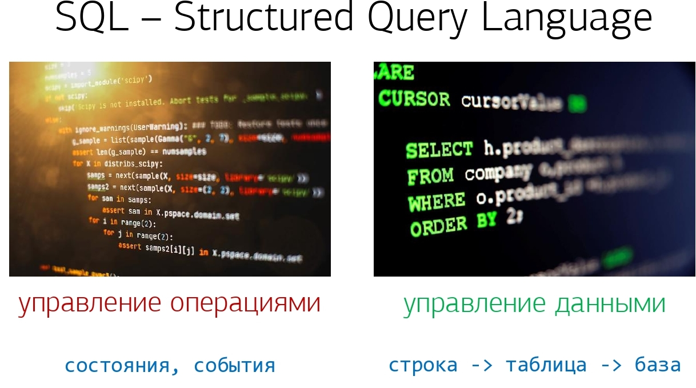

Слово "отношения" здесь ключевое, поскольку именно оно определяет, что ваша СУБД является реляционной - то есть в такой базе будут находиться связанные таблицы.

Потому что существуют достаточно много видов нереляционных СУБД, преимущество которых заключается в возможности, хоть и жертвуя универсальностью, под каждую конкретную прикладную задачу подобрать наиболее подходящий из них: Key-Value, документарные, графовые, поисковые ("заточенные" под полнотекстовый или фразовый поиск) или даже мультипарадигмальные, приближающиеся по возможностям к традиционным SQL-базам.

Все эти варианты нереляционных СУБД никак не заставляют нас конкретизировать структуру хранения данных в нашей базе, и прямо рядом с ключом-числом можно положить ключ-строку или вовсе динамически заменить скалярное значение на список.

В отличие от них, в реляционных базах, структура жестко задается на моменте разработки, и ее нельзя быстро "перетряхнуть" в динамике - это достаточно сложный процесс. Безусловным стандартом работы с ними сейчас является именно SQL, универсальный по своим возможностям, его поддерживают все ведущие enterprise-СУБД.

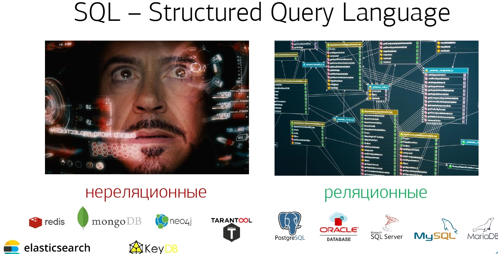

Большинство императивных языков программирования взаимодействуют с какими-то атомарными, "штучными" вещами: состояниями системы или событиями, которые в ней происходят.

В отличие от них, SQL работает с большими наборами данных - записей или "строк". Строки группируются в таблицы, которые, будучи связаны некоторыми отношениями между собой, образуют базу данных.

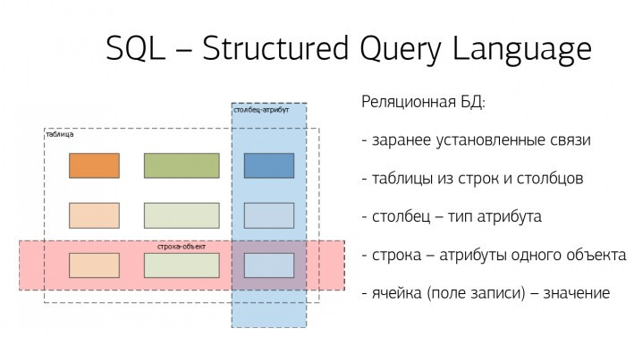

Поэтому все строки одной таблицы имеют один и тот же формат, в отличие от нереляционных баз.

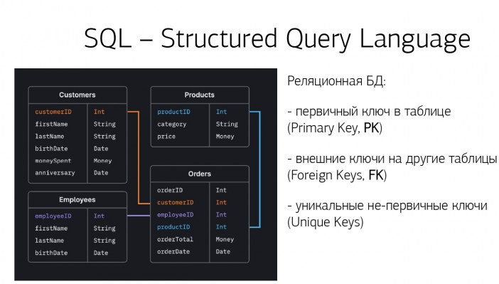

Между собой таблицы связываются какими-то отношениями, которые определяются ключами.

Как правило, у любой таблицы есть **первичный ключ** (Primary Key, PK), и он необходим, чтобы уникально идентифицировать любую из строк этой таблицы.

Потому что первичные ключи, классически, используются именно для того, чтобы иметь возможность сослаться на конкретную запись или провзаимодействовать с ней. А как раз чтобы "сослаться" со стороны подчиненной таблицы используются **внешние ключи** (Foreign Keys, FK) - они определяют по соответствию значений каких полей в дочерней и родительской таблице устанавливается связь.

В принципе, внешний ключ может ссылаться не обязательно на первичный, но и на любой **уникальный ключ** (Unique Key), которых на таблице, в отличие от первичного, у вас может быть несколько. 

[Документация Psql на русском языке](https://postgrespro.ru/docs/postgresql)

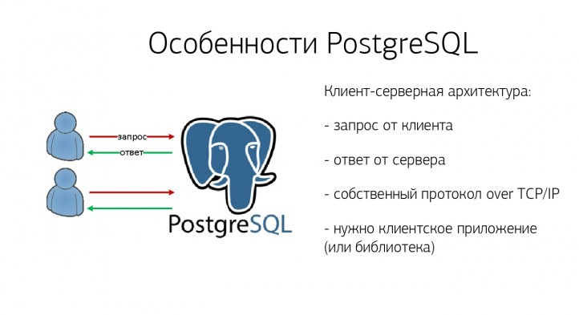

PostgreSQL исповедует клиент-серверную архитектуру.

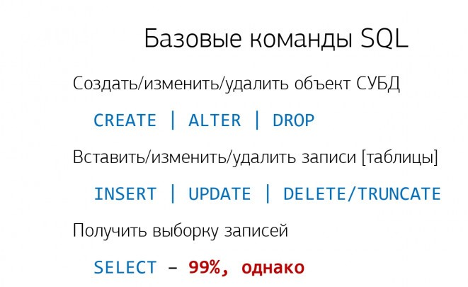


## Язык SQL. Введение

**Установим PSQL**

`sudo apt install postgresql postgresql-contrib`

`sudo systemctl status postgresql`

```sql
sudo -u postgres psql
ALTER USER postgres WITH PASSWORD '1234Qwer';
\du
```

1. sudo -u postgres psql: Эта команда выполняет psql (интерактивный терминал PostgreSQL) от имени пользователя postgres с привилегиями суперпользователя (через sudo). При этом открывается интерактивная оболочка PostgreSQL, в которой можно выполнять SQL-запросы и административные команды.

2. ALTER USER postgres WITH PASSWORD '1234Qwer';: Эта SQL-команда используется для изменения пароля пользователя postgres в базе данных PostgreSQL на 1234Qwer. После выполнения этой команды, пользователь postgres сможет входить в базу данных, используя новый пароль 1234Qwer.

3. du: Это метакоманда psql, которая выводит список всех ролей (пользователей) базы данных PostgreSQL, а также их атрибуты (например, суперпользователь, привилегии и т.п.).

Рассмотрим команды: CREATE DATABASE, чтобы создать базу, и CREATE TABLE, чтобы создать таблицу в ней:

```sql
CREATE DATABASE tst;

\c tst; -- Переключиться на базу данных tst

CREATE TABLE tbl(
  k         -- имя поля
    integer -- тип поля
, v
    text
);
```

При создании таблицы нам надо заранее определить имена и типы полей – то есть формат записей, которые там будут храниться – прямо в соответствии с определением реляционной базы данных

**Комментарии**

```sql
-- это однострочный комментарий
/* а это -
         - многострочный */

fld      -- это поле/столбец
Fld      -- это то же самое поле
FLD      -- ... и это – все оно же (приводится к lower case)

"Fld"    -- а вот это – тоже поле, но совсем другое (кавычки дают регистрозависимость)

'str'    -- это строка

'st''r'  -- это строка с одинарным апострофом
E'st\'r' -- ... и это – она же
$$st'r$$ -- ... и даже вот это
$abcd$st'r$abcd$
```

Все типы в PostgreSQL можно разделить на базовые (числовые, символьные, даты/времени и логический тип) и расширенные.

**Числовые типы**

Числовые типы в PostgreSQL определяются своей разрядностью: 2-, 4- и 8-байтные целочисленные, 4- и 8-байтовые с переменной точностью (с плавающей точкой) и numeric/decimal с указанной точностью (хранится посимвольно).

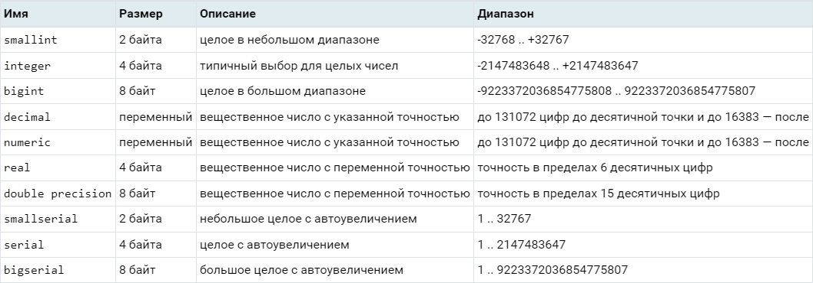

Выбор между целочисленными типами достаточно прост: если все ожидаемые значения в пределах сотни, то не надо резервировать под них 8-байтовый bigint. Как правило, стандартного 4-байтового integer достаточно для большинства задач.

numeric стоит использовать для различных "денежных" вещей, где недопустимо "потерять копейку на округлениях"

serial-псевдотипы (аналог AUTO_INCREMENT / IDENTITY из других СУБД), которые позволяют определить поля с автоматически формируемым возрастающим значением "по умолчанию": 1, 2, 3, ...

**Символьные типы**

Символьные/строковые типы представлены парой описанных в стандарте char/varchar и парой PostgreSQL-специфичных bpchar/text.

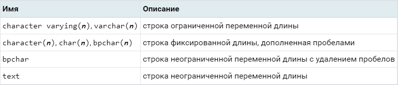

Если вы не предполагаете перенос вашего приложения на другую СУБД, то можете спокойно использовать тип text

**Типы даты/времени**

Дата и время в PostgreSQL, технически, хранятся как целочисленные, со значением от POSTGRES_EPOCH (01.01.2000) в соответствующих единицах (микросекундах или сутках):

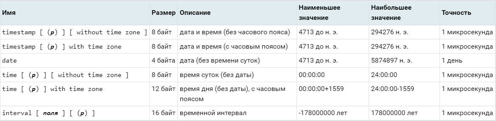

арифметические операции над ними тоже допустимы, в том числе преобразование к Unix time (время от 01.01.1970) :

```sql
SELECT '2024-01-01'::date - 1;
-- 2023-12-31 - за день до
SELECT '2024-01-01'::date - 8 * '1 hour'::interval;
-- 2023-12-31 16:00:00 - за 8 часов до
SELECT extract(epoch from '2024-01-01'::timestamp);
-- 1704067200 - превратили timestamp в double precision
SELECT '1970-01-01 00:00:00'::timestamp + 1704067200 * '1 second'::interval;
-- 2024-01-01 00:00:00 - ... и обратно
```

Опционально, во временном значении можно использовать часовой пояс (with time zone) или указывать сохраняемую точность (timestamp(0) означает хранение "до секунд").

**Логический тип**
Логические значения представлены типом boolean:

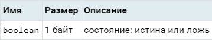

Он может принимать значения TRUE/FALSE и, с учетом SQL-специфики, значение NULL, равно как и любой другой тип.

## Конструкция языка. Написание SQL запросов

**INSERT**
За добавление данных, за их вставку в таблицу, в SQL отвечает команда INSERT:

```sql
INSERT INTO tbl(      -- куда будем вставлять данные
  k                   -- имена полей
, v
)
VALUES                -- перечисляем вставляемые строки
  (1, '1st string')
, (102, 'another string')
, (3, NULL);          -- вовсе не ''
```
Мы указываем, в какую таблицу и в какие поля должны быть добавлены данные, и, в простейшей форме INSERT … VALUES, прямо перечисляем те строки, которые хотим вставить. Значения в них позиционно соответствуют указанным полям таблицы.

**UPDATE**
Изменение данных

```bash
UPDATE
  tbl
SET
  k = k - 100      -- правила изменения значений полей
, v = '2nd string'
WHERE
  k = 102;         -- условие отбора строк
```

В данном случае мы для строки с k = 102 (обратите внимание на одинарное равенство при сравнении) хотим изменить строковое значение v на новое, а из значения k вычесть 100 (присвоение точно так же описывается одинарным символом равенства).


**DELETE**
А последняя строка, в которую у нас "просочился" NULL вместо текстовой строки, нам вообще не нужна. Давайте ее просто удалим - для этого есть команда DELETE:

```sql
DELETE FROM
  tbl
WHERE
  v IS NULL;
```

Обратите внимание, что с NULL-значениями нельзя пользоваться обычными операторами типа "равно"/"не равно", для них есть свои операторы IS. В данном случае мы используем IS NULL, чтобы проверить на совпадение с NULL-значением.

**NULL-логика**
Потому что базовые операторы (=, <>, NOT) выдают значение NULL, если его имеет хотя бы один из аргументов. А при приведении типов в условии оно превращается в "ложь", и ни одну запись вы не отберете.

Поэтому для сравнений NULL и с ним (в конкретном поле или для всей строки сразу) стоит использовать операторы IS/IS NOT или IS DISTINCT FROM/IS NOT DISTINCT FROM. 

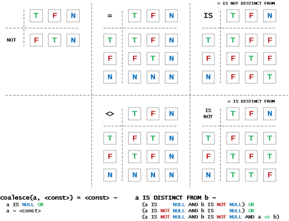

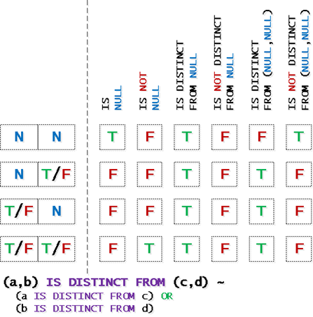

**... RETURNING**

Чтобы СУБД ответила нам не просто "я вставила/обновила/удалила две строки", а "я обработала две вот такие строки", необходимо воспользоваться ключевым словом RETURNING и перечислить те поля, которые мы хотим увидеть:

```sql
DELETE FROM
  tbl
WHERE
  v IS NULL
RETURNING *;
```


**SELECT**
Взять из нашей таблицы какие-то записи.

Для этого воспользуемся командой SELECT, про которую говорили ранее, опять же, указав "*" вместо списка полей:

```sql
SELECT
  *
FROM
  tbl;
```


Для выхода из оболочки

`quit`

Просмотреть таблицы

`\dt`

## Клиент-серверная модель работы с базами данных Psql

Разрешим серверу подключения за пределами localhost

`nano /etc/postgresql/15/main/postgresql.conf`
```bash
listen_addresses = '*'
```

`nano /etc/postgresql/15/main/pg_hba.conf`
```bash
host    all             all             192.168.101.10/24      md5
```

`sudo systemctl restart postgresql`

_На клиенте_

`sudo apt install postgresql-client`

`psql -h 192.168.101.5 -U postgres -W`

## Инструмент визуального проектирования баз данных pgAdmin

**pgAdmin** — это инструмент администрирования с открытым исходным кодом и платформа разработки для сервера базы данных PostgreSQL. pgAdmin поставляется как в настольной, так и в серверной версиях. Версию для настольного компьютера можно установить на локальный компьютер, а версию для сервера — веб-версию, которая будет запускаться под веб-сервером.

Выполните следующие шаги, чтобы установить и настроить pgAdmin4 вместе с сервером PostgreSQL в вашей системе Debian 12.

Добавьте репозиторий pgAdmin4 в свою систему с помощью команды ниже.

`sudo echo "deb [arch=amd64 signed-by=/usr/share/keyrings/pgadmin4.gpg] https://ftp.postgresql.org/pub/pgadmin/pgadmin4/apt/$(lsb_release -cs) pgadmin4 main" | sudo tee /etc/apt/sources.list.d/pgadmin4.list`

Затем выполните следующую команду, чтобы добавить ключ GPG репозитория pgAdmin4.

`apt install curl`

`curl -fsSL https://www.pgadmin.org/static/packages_pgadmin_org.pub | sudo gpg --dearmor -o /usr/share/keyrings/pgadmin4.gpg`

`sudo apt update`

`sudo apt install pgadmin4-web`

`/usr/pgadmin4/bin/setup-web.sh`

По умолчанию, pgAdmin 4 работает на порту 5050. Таким образом, когда вы заходите на http://127.0.0.1/pgadmin4/, pgAdmin 4 обычно доступен по адресу http://127.0.0.1:80/pgadmin4/.

Вход по имени почты

На панели управления pgAdmin щелкните меню «Добавить новый сервер» .
Теперь перейдите на вкладку «Соединение» и настройте следующее:
  Хост : IP-адрес сервера PostgreSQL. В этом примере — localhost.
  Порт : порт сервера PostgreSQL по умолчанию — 5432.
  Служебная база данных tst
  Имя пользователя : введите пользователя, которого вы будете использовать для входа на сервер PostgreSQL. postgres
  Пароль : Введите свой пароль. 1234Qwer
  Включите опцию Сохранить пароль.
  Нажмите «Сохранить» , чтобы применить изменения


## Домашнее задание
#### main
1. Установить сервер баз данных psql через скрипт (скриншот)
2. Создать базу данных students с таблицей std, со столбцами:
fio, telephone, pol, info и создать 5 записей:
Иванов Иван Иванович, 123456789, М, Студент 1
Петров Петр Петрович, 987654321, М, Студент 2
Сидорова Анна Петровна, 345678912, Ж, Студентка 1
Козлов Алексей Игоревич, 789123456, М, Студент 3
Иванова Екатерина Сергеевна, 234567891, Ж, Студентка 2
3. Создать SQL запрос, который выберет только мужские имена студентов из таблицы std.
***
#### hard
1. Подключить внешнего клиента к серверу баз данных (скриншот)
2. Напишите SQL запрос, который обновит информацию о студенте с именем "Сидорова Анна Петровна", изменив ее номер телефона на 555555555.
3. Напишите SQL запрос, который удалит информацию о студенте с именем "Козлов Алексей Игоревич" из таблицы std

***
Для отчета:
- создать в личном репозитории организации github ветку lesson_3_8
- создать директорию lesson_3_8 и разместить там файл домашнего задания
- сделать push и pull request на сайте, в качестве рецензента добавить пользователя AndreyChuyan
