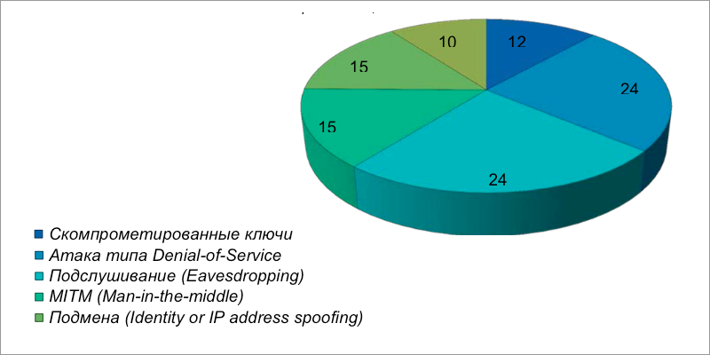
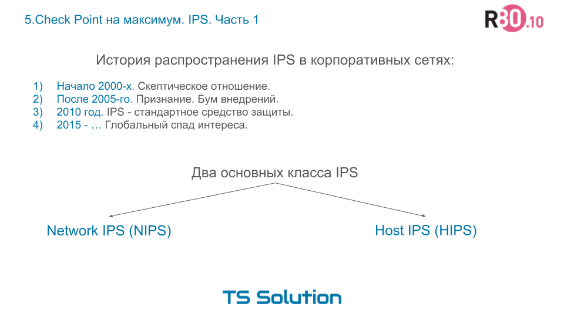
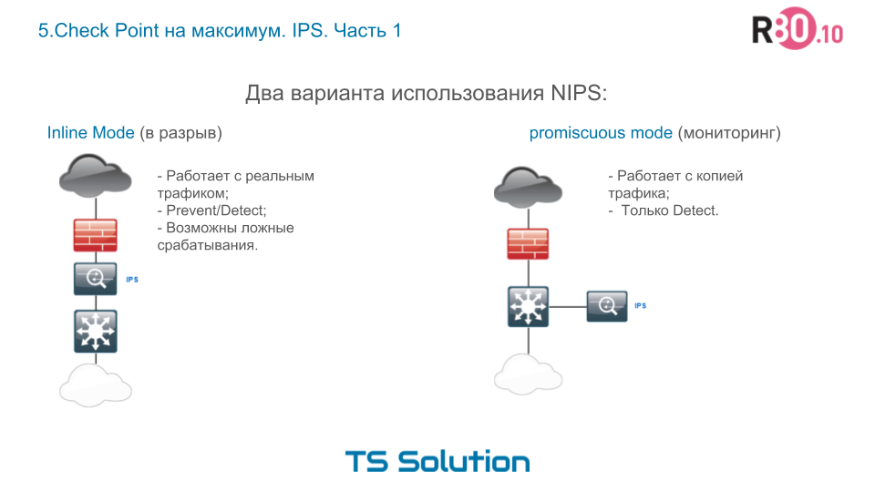
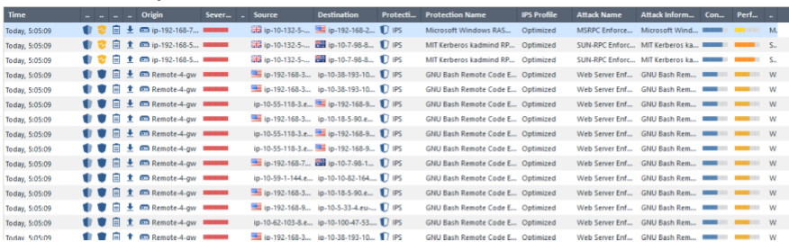
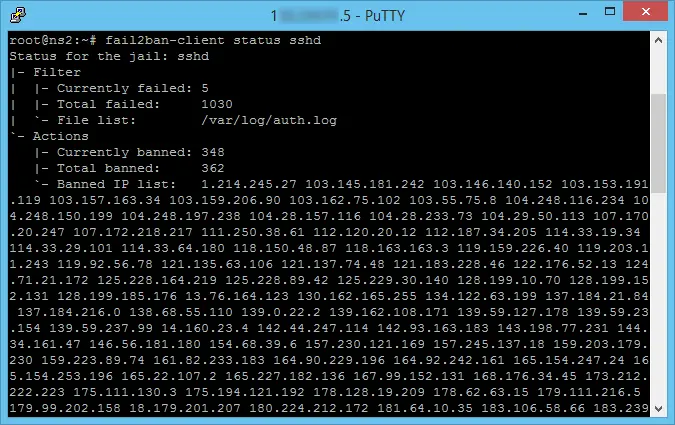

# Информационная безопасность


## Безопасность компьютерных сетей

Недавний опрос ИТ-специалистов, управляющих сетевой безопасностью, [проведенный Slashdotmedia] показал, что среди важных факторов при выборе сетевых решений безопасности почти половина опрошенных на первое место поставила надежность выбранного сетевого решения. 

Заданный вопрос: Какой тип сетевых атак больше всего беспокоит вашу ИТ организацию?



Сегодня хакеры используют разнообразные методы атаки на сети компаний. Исследование показало, что ИТ-специалисты наиболее обеспокоены двумя конкретными типами атак: атаки на отказ в обслуживании (DoS) и подслушивание (Eavesdropping) — эти атаки указаны как наиболее опасные и приоритетные примерно у 25% респондентов. И по 15% респондентов выбрали в качестве ключевых угроз атаки типа IP Spoofing и MITM (man-in-the-middle). Остальные типы угроз оказались приоритетны менее чем для 12% респондентов.

Поводя промежуточный итог вышесказанному, можно сделать следующий вывод: современные решения по обеспечению сетевой безопасности в числе прочего обязательно должны обладать следующими свойствами:

- уметь работать на седьмом уровне модели OSI (на уровне приложений); 
- уметь связывать конкретного пользователя с содержанием трафика;
- иметь интегрированную в решение систему защиты от сетевых атак (IPS) 
- поддерживать встроенную защиту от атак типа DoS и прослушивания; 
- в целом обладать высокой степенью надежности.

Законы, регламентирующие деятельность в областях, связанных с ИБ, предполагают серьезную ответственность за нарушение тех или иных положений, например: 

- по статье 137 УК РФ (незаконное собирание или распространение сведений о частной жизни лица) — лишение свободы на срок до четырех лет;
- по статье 140 УК РФ (неправомерный отказ в предоставлении собранных в установленном порядке документов и материалов) – штраф - или лишение права занимать определенные должности или заниматься определенной деятельностью на срок от 2 до 5 лет;
- по статье 272 УК РФ (неправомерный доступ к охраняемой законом компьютерной информации) — лишение свободы на срок до 5 лет.

**Как осуществляется атака на проникновение?**

Чаще всего тестирование на проникновение производится в 2 простых этапа. Первый — сбор максимально доступной информации о системе и второй — непосредственно атака. Если говорить при этом о сетевом взаимодействии, то здесь атакой можно считать и стандартный функционал, который может использоваться не по назначению.

Классификация выглядит следующим образом:

- поиск хостов, имеющих доступ во внешнюю сеть;
- поиск хостов, не имеющих доступ во внешнюю сеть;
- сканирование хостов;
- сниффинг (прослушивание трафика);
- атаки на локальную сеть;
- подмена трафика частично или отдельных пакетов данных.

**Поиск хостов, имеющих доступ во внешнюю сеть**
Для поиска живых хостов можно пользоваться протоколом ICMP.


Все исследования можно проводить с помощью 2 инструментов и их аналогов:

- masscan — только TCP;
- nmap — универсален, но может быть недостаточно быстрым.

`nmap -v -sn 192.168.2.0/24`


**Поиск хостов, не имеющих доступ во внешнюю сеть**

Вторая часть включает методы воздействия на сеть. Осуществляются они посредством использования протоколов:
- ARP — механизм запроса данных об IP адресах и MAC адресах хостов;
- NetBIOS — механизм, который называется Browser. В нем передается информация о названии операционной системы и ее версии;
- IPv6 — отправка мультикастовых запросов для получения данных о доступных хостах.

Все виды атак могут быть произведены инструментами:
- nmap
- bettercap
- responder

`nmap -sV 192.168.2.80`

**Cниффинг (прослушивание трафика)**
Атака, которая может быть успешна в случае, либо если неверно настроено сетевое оборудование, либо из-за особенности топологии сети. Применяется для изучения данных в трафике, а также для получения данных, которые могут быть использованы для повышения уровня доступа в сети или на отдельных системах, которые участвуют в сетевом взаимодействии. В большинстве случаев сбор данных можно производить из операционных систем хостов, хотя и с сетевых устройств те же самые действия так же возможны.

Подобные атаки могут быть осуществлены с помощью:
wireshark
tcpdump
bettercap

`apt install tshark`

Указать интерфейс, на котором хотите захватывать пакеты

`tshark -i ens4`

Прослушать только TCP трафик

`sudo tshark -i ens4 -f "tcp"`

`sudo tshark -i ens3 icmp`

`sudo tshark -i ens3 port 22`

Для поиска контроллера домена (Domain Controller). LDAP (Lightweight Directory Access Protocol) - протокол, который используется для доступа к каталогам и сервисам каталогов, включая доменные контроллеры

`sudo tshark -i ens3 -Y ldap`

Для поиска файловых шар (shared folders) 

`sudo tshark -i ens3 -Y smb`

**Атаки на локальную сеть**
Атаки, которые в большинстве случаев меняют топологию сети и заполняют сеть большим количество однотипных пакетов. Делается это для того, чтобы не происходило восстановления изначального состояния маршрутов сети.

TCP SYN flood – это один из наиболее распространенных видов DDoS-атак, целью которой является перегрузка целевого узла/сервера, путем отправки большого количества фальшивых TCP запросов на установление соединения (SYN) с целью исчерпания ресурсов сервера.

ARP spoofing - это вид атаки в компьютерных сетях, когда злоумышленник отправляет фальшивые ARP (Address Resolution Protocol) сообщения с целью изменить сопоставление IP адресов с физическими MAC адресами устройств в локальной сети. 

Dynamic Trunking. Так как чуть ли не единственным эффективным средством для борьбы с изменением топологии сети может являться использования стандарта 802.1Q VLAN, то естественно при его обнаружении нужно проверить возможность атак на его неверную конфигурацию. Этот вид атаки подразумевает, что при доступе хотя бы к одному VLAN можно перевести соединение в состояние, при котором будут видны все данные из других VLAN.

VLAN Hopper — атака, которая позволяет искать хосты в соседних VLAN и отправлять сообщения.

Double Tagging — атака, которая возможна, если атакующий знает номер VLAN, ip адрес системы жертвы. Атакующий в этом случае может запаковать сообщение для отправки в целевую систему. Недостатком атаки можно считать отсутствие обратной связи, так как целевая система не сможет отправлять ответы.

Основные инструменты для атак:
bettercap
yersinia — хоть и старый инструмент, но только в нем есть поддержка проприетарных для устройств Cisco протоколов.
frogger
scapy
nmap
responder — полезен для сред с операционной системой Windows.

### Для обнаружения атаки TCP SYN flood с помощью tshark, можно использовать следующую команду:

`tshark -i <interface> -f "tcp[tcpflags] & tcp-syn != 0 and tcp[tcpflags] & tcp-ack == 0"`

например 

`sudo tshark -i ens3 -f "tcp[tcpflags] & tcp-syn != 0 and tcp[tcpflags] & tcp-ack == 0"`

- -f "tcp[tcpflags] & tcp-syn != 0 and tcp[tcpflags] & tcp-ack == 0": Это фильтр, который определяет условия для отображения пакетов. Давайте разберем его подробнее:
- tcp[tcpflags] & tcp-syn != 0: Это условие фильтра, которое выбирает пакеты с установленным флагом SYN (начальная синхронизация).
- tcp[tcpflags] & tcp-ack == 0: Это условие фильтра, которое выбирает пакеты, у которых флаг ACK (подтверждение) установлен в ноль.

Этот фильтр tshark позволяет отобразить все входящие пакеты с установленным флагом SYN, но без флага ACK, что может указывать на атаку TCP SYN flood.

### Для обнаружения атаки ARP spoofing с помощью tshark, можно использовать следующую команду:
   
`sudo tshark -i <interface> arp[6:2] == 2`

например

`sudo tshark -i ens3 arp[6:2] == 2`

- arp[6:2] указывает на опкод ARP в пакете. В ARP заголовоке опкод начинается с 6-го байта и занимает 2 байта.
- == 2 это условие фильтра, которое выбирает только ARP запросы (опкод 2).


**Подмена трафика частично или отдельных пакетов данных**
Атаки этой группы подразумевают полный или частичный контроль над передаваемой информацией. Причем в некоторых случаях данные будут проходить через хост атакующего, а в некоторых — только первые пакеты.

Подмена DHCP сервера — применяется для того, чтобы контролировать выдачу адресов для участников в сети. Может быть использовано для кражи данных из приложений.

Подмена DNS сервера. Большое количество приложений, которые работают с сетью без должных проверок, могут излишне доверять серверу, который используется для реализации работы приложения. Может быть использовано для компрометации данных, которые отправляются на сервер, при проведении одновременной атаки на изменение стандартного маршрута внутри сети.

Подмена gateway — за счет механизмов динамической настройки маршрутов сети можно прослушивать всю информацию, которая пролетает через сеть.

Подмена сервисов ОС — использование несовершенства протоколов операционных систем и сетевых устройств. Наиболее популярна при воздействии на сеть, участниками которой являются машины под управлением ОС Windows.

Инструменты для проведения атак:
bettercap
nmap
responder

### Пример простейшего рекон скрипта для побора эксплойтов для эксплуатации уязвимостей

```bash
#!/usr/bin/bash

clear
echo "---Recon is in progress---"
echo "Gettig hostname"
host=$(hostname)
echo "Getting distro and kernel"
disinfo=$(uname -v)
echo "Getting users"
users=$(cat /etc/passwd)
echo "Getting processes"
proc=$(systemctl | grep running)
echo "Writing results"

mkdir recon
touch ./recon/info.txt
echo "$host" > ./recon/info.txt
echo "$disinfo" >> ./recon/info.txt
printf "%sn" "$users" >> ./recon/info.txt
printf "%s/n" "$proc" >> ./recon/info.txt
echo "Done"
```

### Антивирусная защита серверов и рабочих станций

Существует несколько хороших бесплатных антивирусных программ для Linux, которые могут помочь обеспечить безопасность вашей системы. Некоторые из них включают в себя:

1. ClamAV: ClamAV является одним из самых популярных антивирусов для Linux. Он обладает открытым исходным кодом и способен обнаруживать и удалять различные виды вредоносных программ.

2. Sophos Antivirus for Linux: Sophos предлагает бесплатную версию своего антивируса для Linux, который обеспечивает защиту от вирусов, троянов, червей и других угроз.

3. Comodo Antivirus for Linux: Comodo также предлагает бесплатный антивирус для Linux, который обеспечивает множество функций защиты, включая сканирование в реальном времени и автоматические обновления.

4. AVG Antivirus for Linux: AVG предлагает антивирус защиту для Linux, которая включает в себя сканирование файлов и электронной почты на наличие вредоносных программ.

5. Bitdefender Antivirus Scanner for Unices: Бесплатный сканер от Bitdefender предлагает возможность сканирования системы на предмет вирусов и других угроз.

**Задача**

Проверка антивирусом файлов, которые закачиваются на сервер пользователями.

Для теста был скачан файл с сигнатурой вируса

Установка

`apt install clamav clamav-daemon`

Это команда устанавливает файлы самого антивируса ClamAV. А также 2 демона. Первый clamav-freshclam – для автоматической закачки баз данных. Второй clamav-daemon - API.

<!-- Отключим автообновление баз (в России базы не загружаются по умолчанию) -->

<!-- `sed -i -e "s/^NotifyClamd/#NotifyClamd/g" /etc/clamav/freshclam.conf` -->

`systemctl status clamav-freshclam`

`systemctl status clamav-daemon`

`systemctl stop clamav-freshclam`

командой загружаем вручную

`freshclam`

для сканирования

`clamscan --infected --remove --recursive /home`

скачаем тестовый вирус

`wget http://www.eicar.org/download/eicar.com`

снова сканируем

`clamscan --infected --remove --recursive /root/`

Компания Cisco заблокировала доступ с российских IP-адресов к серверам clamav.net и database.clamav.net.
Чтобы продолжать получать обновления на установленный антивирус ClamAV, нужно использовать зеркало https://packages.microsoft.com/clamav/

`nano /etc/freshclam.conf`

```bash
DatabaseMirror https://packages.microsoft.com/clamav/
```

также создадим скрипт

`nano update_clamav.sh`

```bash
#!/bin/bash

systemctl stop clamav-freshclam
rm -rf /var/lib/clamav/*
wget https://packages.microsoft.com/clamav/main.cvd -O /var/lib/clamav/main.cvd 
wget https://packages.microsoft.com/clamav/daily.cvd -O /var/lib/clamav/daily.cvd 
wget https://packages.microsoft.com/clamav/bytecode.cvd -O /var/lib/clamav/bytecode.cvd
```

`chmod +x update_clamav.sh`

Добавьте задание в cron для еженедельного обновления:

`vim /etc/crontab`

```bash
0 0 * * 0 root /root/update_clamav.sh
```

Чтобы настроить конфигурацию антивируса ClamAV, нужно удалить конфигурацию по умолчанию в файле /etc/clam.d/scan.conf.

<!-- `sed -i -e "s/^Example/#Example/" /etc/clamd.d/scan.conf` -->

`sed -i -e "s/^Example/#Example/" /etc/clamav/clamd.con`

снова сканируем

`clamscan ./ -r`

ls

## Файерволы, IDS, IPS. Nat.

### IDS (Intrusion Detection System) 
это система обнаружения вторжений, которая контролирует сетевой трафик на предмет аномалий или признаков атаки. IDS анализирует данные, пакеты и события в сети, определяя потенциальные угрозы безопасности. IDS может предупреждать администратора о возможном нарушителе или атаке, но не может принимать активных мер по блокированию таких атак.

IDS пытается идентифицировать нарушения политики. Одной из особенностей IDS является то, что IDS обычно создает отчеты.

IDS (система обнаружения вторжений) и файервол (фаервол) - это два разных типа сетевых безопасностей, которые выполняют разные функции:

IDS (система обнаружения вторжений):
1. IDS работает на уровне анализа сетевого трафика и событий, чтобы обнаружить аномальное поведение или признаки вторжения.
2. IDS составляет профили обычного поведения сети и сравнивает их с текущим трафиком, чтобы определить потенциальные угрозы.
3. IDS предупреждает об атаках или инцидентах безопасности, отправляя уведомления администратору для принятия соответствующих мер.

Файервол (фаервол):
1. Файервол работает на уровне сетевых портов и правил доступа, чтобы контролировать и фильтровать сетевой трафик.
2. Файервол устанавливает правила доступа и блокирования, определяющие, какие типы трафика могут проходить через сеть.
3. Файервол обеспечивает защиту сети, блокируя вредоносный трафик и предотвращая несанкционированный доступ к сетевым ресурсам.

- IDS на основе статистических аномалий (Установление базового уровня того, что мы считаем хорошим, а затем, когда трафик не соответствует - этому базовому уровню, он становится аномальным, а затем предположение, что это плохо, и принятие соответствующих мер)
- Сетевые IDS (Система обнаружения вторжений в сеть, сокращенно называемая NIDS, является одной из наиболее распространенных реализаций)
- Хост-система обнаружения вторжений (DS, которая работает на отдельном хосте, а не сидит в сети перед разными устройствами).

Классы IDS 
- Мониторинг лог-файлов
- Изменения в реестре
- Проверка целостности файлов

Некоторые из популярных IDS (систем обнаружения вторжений) для Linux включают в себя:

1. Snort: Snort является одним из самых популярных и широко используемых IDS на Linux. Он предоставляет возможности для обнаружения вторжений в реальном времени и анализа сетевого трафика.

2. Suricata: Suricata также является мощным IDS и IPS (системой предотвращения вторжений) для Linux, которая обнаруживает и предотвращает вредоносные атаки в реальном времени.

3. OSSEC: OSSEC (Open Source Security) представляет собой бесплатное мультиплатформенное решение для обнаружения вторжений, беспрецедентноси и аудита безопасности.

4. Suricata: Suricata выполняет анализ трафика в реальном времени, поддерживает множество протоколов и обеспечивает детализированные отчеты по выявленным угрозам.

5. Bro IDS (теперь известен как Zeek): Zeek предоставляет возможности мониторинга и анализа сетевого трафика для обнаружения вторжений и потенциальных угроз.

### IPS (Intrusion Prevention System) 
это система предотвращения вторжений, которая, в отличие от IDS, способна не только обнаруживать, но и предотвращать атаки в реальном времени. IPS может автоматически блокировать или отклонять вредоносный трафик или действия атакующего, чтобы защитить сетевую инфраструктуру от потенциальных опасностей.



 два варианта использования сетевого IPS



1. Inline mode. По-русски мы это называем “в разрыв”. Т.е. реальный сетевой трафик проходит через IPS. IPS в данном случае работает как обычный бридж (т.е. на втором уровне модели OSI). Данный режим самый оптимальный с точки зрения защиты. В случае обнаружения атаки, IPS может сразу заблокировать сессию и компьютер атакующего. Есть конечно и негативные моменты в виде false positive срабатываний, ну т.е. ложных срабатываний, когда IPS блочит нормальный трафик. Но это отдельная тема, мы чуть позже ее обсудим.
2. Promiscuous mode. Опять же, по-русски — режим мониторинга. Как правило в таком режиме IPS “вешается” на SPAN-порт, который “зеркалирует” на устройство КОПИЮ! трафика. В этом варианте, IPS автоматически превращается в IDS, т.к. он работает уже не с реальном трафиком и у него нет возможности оперативно блокировать атаки. Т.е. это плохой вариант, когда требуется максимальная защищенность.

логи чекпоинта 




### NAT (Network Address Translation) 
это технология сетевого преобразования адресов, которая позволяет маршрутизатору или файрволу изменять IP-адреса в заголовках пакетов, проходящих через него. NAT используется для перевода общедоступных IP-адресов внешней сети на локальные IP-адреса внутренней сети компании или домашней сети. Это позволяет множеству устройств внутренней сети разделять один общедоступный IP-адрес для доступа в интернет и обеспечивает дополнительный уровень безопасности.

Входные данные:
ens3 - интерфейс внешней сети 
ens4 - интерфейс внутренней сети
192.168.101.0/24 - внутренняя сеть

1. Конфигурация ens4
`nano /etc/network/interfaces`
```bash
allow-hotplug ens4
iface ens4 inet static
   address 192.168.101.5
   netmask 255.255.255.0
```


2. Настройка NAT

`apt install iptables`

`modprobe iptable_nat`

`echo 1 > /proc/sys/net/ipv4/ip_forward`

`iptables -t nat -A POSTROUTING -o ens3 -j MASQUERADE`

`iptables -A FORWARD -i ens4 -j ACCEPT`

2.1 Настройка локального шлюза как DNS сервера
В нашем случае мы используем пересылку на DNS сервер 192.168.2.1
`iptables -t nat -A PREROUTING -p tcp --dport 53 -j DNAT --to 192.168.2.1:53`

`iptables -t nat -A PREROUTING -p udp  --dport 53 -j DNAT --to 192.168.2.1:53`

`iptables -t nat -A POSTROUTING -j MASQUERADE`

2.2 Сохраним настройки модулей

`nano /etc/modules`

```bash
iptable_nat
```

2.3 Сохраним настройки трафика

`nano /etc/sysctl.conf`

```bash
net.ipv4.ip_forward=1
```

2.4 Сохраним настройки iptables

`apt install iptables-persistent`

`iptables-save > /etc/iptables/rules.v4`

проверим с клиента:

`nano /etc/network/interfaces`

```bash
allow-hotplug ens3
iface ens3 inet static
  address 192.168.101.10
  netmask 255.255.255.0
  gateway 192.168.101.5
```

`ping google.com`


#### Поднимем dhcp сервер

`apt install isc-dhcp-server`

`nano /etc/default/isc-dhcp-server`

```bash
DHCPDv4_CONF=/etc/dhcp/dhcpd.conf
DHCPDv4_PID=/var/run/dhcpd.pid
INTERFACESv4="ens4"
```


`nano /etc/dhcp/dhcpd.conf`

```bash
#Опция динамического обновления для dns
ddns-update-style none;
#Домен и dns'ы
option domain-name "lup.sublocal";
option domain-name-servers 192.168.2.1;
#Время жизни адресов
default-lease-time 600;
max-lease-time 7200;
# # Для логирования в отдельный файл
log-facility local7;
#Подсеть из которой выдаются ip
 #диапазон
 #шлюз
 #brodcast
 #интерфейс на котором работает
subnet 192.168.101.0 netmask 255.255.255.0 {
 range 192.168.101.10 192.168.101.20;
 option routers 192.168.101.5;
 option broadcast-address 192.168.101.255;
}
```

Добавим правила в iptables

`iptables -A INPUT -p tcp --dport 67 -j ACCEPT`

`iptables-save > /etc/iptables/rules.v4`

- -p tcp: это флаг, указывающий на то, что правило будет применяться к пакетам TCP.
- --dport 67: это условие, означающее, что правило будет применяться к пакетам, направленным на порт 67. В данном случае, порт 67 обычно используется для DHCP сервера.
- -j ACCEPT: это действие, которое указывает на то, что пакеты, соответствующие условиям правила, будут приняты (разрешены) для дальнейшей обработки.

Запускаем демона:

`systemctl start isc-dhcp-server`


### Iptables 
это мощный инструмент управления сетью в Linux, который позволяет администраторам управлять входящими и исходящими пакетами данных. Это основной инструмент для настройки межсетевых экранов в системах Linux.

В Iptables есть четыре основные таблицы:
- Filter - это основная таблица, используемая для фильтрации пакетов.
- NAT - эта таблица используется для настройки NAT (Network Address Translation).
- Mangle - эта таблица используется для специальной обработки пакетов.
- Raw - эта таблица используется для обхода системы отслеживания состояний.

Каждая таблица состоит из набора цепочек. Цепочки - это последовательности правил, которые применяются к пакетам. В Iptables есть три встроенные цепочки:
- INPUT - эта цепочка применяется к пакетам, которые предназначены для самой системы.
- FORWARD - эта цепочка применяется к пакетам, которые проходят через систему.
- OUTPUT - эта цепочка применяется к пакетам, которые исходят из системы.

Базовые команды Iptables
1. Просмотр текущих правил
Чтобы просмотреть текущие правила, используйте команду 

`iptables -L`

 Это покажет все правила в таблице filter. Чтобы просмотреть правила в другой таблице, используйте флаг -t, например, iptables -t nat -L.

2. Добавление новых правил
Чтобы добавить новое правило, используйте команду iptables -A. Например, чтобы заблокировать весь входящий трафик от IP-адреса 192.168.0.100, вы можете использовать следующую команду:

`iptables -A INPUT -s 192.168.0.100 -j DROP`

В этой команде -A INPUT добавляет новое правило в цепочку INPUT, -s 192.168.0.100 определяет исходный IP-адрес, а -j DROP указывает, что все пакеты, соответствующие этому правилу, должны быть отброшены.

3. Удаление правил
Чтобы удалить правило, вам нужно знать его номер в цепочке. Вы можете узнать номера правил, используя команду iptables -L --line-numbers. Затем вы можете удалить правило, используя команду iptables -D и номер правила. Например, чтобы удалить первое правило в цепочке INPUT, вы можете использовать следующую команду:

`iptables -D INPUT 1`

4. Изменение дефолтного политики
Вы можете изменить дефолтную политику для цепочки, используя команду iptables -P. Например, чтобы отклонить все входящие пакеты по умолчанию, вы можете использовать следующую команду:

`iptables -P INPUT DROP`

5. Сохранение и восстановление правил
По умолчанию, правила iptables не сохраняются после перезагрузки системы. Чтобы сохранить текущие правила, вы можете использовать команду iptables-save. Это выведет текущие правила в формате, который можно использовать для восстановления с помощью команды iptables-restore.

`iptables-save > /path/to/iptables/rules`

Затем, чтобы восстановить правила, вы можете использовать следующую команду:

`iptables-restore < /path/to/iptables/rules`

***

Примеры использования Iptables

Блокировка IP-адреса

Чтобы заблокировать весь трафик от определенного IP-адреса, вы можете использовать следующую команду:

`iptables -A INPUT -s 192.168.0.100 -j DROP`

Открытие порта для входящего трафика
Чтобы открыть порт для входящего трафика, вы можете использовать следующую команду:

`iptables -A INPUT -p tcp --dport 80 -j ACCEPT` 

В этой команде -p tcp указывает на протокол (в данном случае TCP), --dport 80 указывает на порт (в данном случае 80), а -j ACCEPT указывает, что все пакеты, соответствующие этому правилу, должны быть приняты.

Настройка простого межсетевого экрана

Вы можете использовать iptables для настройки простого межсетевого экрана. Например, вы можете разрешить весь исходящий трафик, разрешить входящий трафик только на определенные порты и отклонить все остальные входящие пакеты.

`iptables -A OUTPUT -j ACCEPT iptables -A INPUT -p tcp --dport 22 -j ACCEPT iptables -A INPUT -p tcp --dport 80 -j ACCEPT iptables -A INPUT -p tcp --dport 443 -j ACCEPT iptables -P INPUT DROP`

В этом примере разрешен весь исходящий трафик, а входящий трафик разрешен только на порты 22 (SSH), 80 (HTTP) и 443 (HTTPS). Все остальные входящие пакеты отклоняются.

Расширенное использование Iptables

Логирование

Iptables предоставляет возможность логирования пакетов, что может быть полезно для отладки и мониторинга. Для включения логирования используйте цель LOG. Например, чтобы залогировать все отброшенные пакеты, можно использовать следующую команду:

`iptables -A INPUT -j LOG --log-prefix "Dropped Packet: " iptables -A INPUT -j DROP` 

Здесь --log-prefix "Dropped Packet: " добавляет указанный префикс к каждому лог-сообщению, что упрощает фильтрацию и анализ логов.

Создание пользовательских цепочек
Iptables позволяет создавать пользовательские цепочки для более гибкого управления правилами. Например, вы можете создать цепочку для обработки всего трафика от определенного IP-адреса:

`iptables -N MY_CHAIN iptables -A MY_CHAIN -s 192.168.0.100 -j DROP iptables -A INPUT -j MY_CHAIN `

В этом примере команда -N MY_CHAIN создает новую цепочку с именем MY_CHAIN. Затем добавляется правило, которое отбрасывает все пакеты от 192.168.0.100. Наконец, цепочка MY_CHAIN добавляется в цепочку INPUT, что означает, что все входящие пакеты будут также проходить через цепочку MY_CHAIN.

Использование состояний пакетов
Iptables может отслеживать состояние пакетов, что позволяет создавать более сложные правила. Например, вы можете разрешить только входящие пакеты, которые являются частью уже установленного соединения:

`iptables -A INPUT -m state --state ESTABLISHED,RELATED -j ACCEPT` 

В этом примере -m state указывает на использование модуля состояний, а --state ESTABLISHED,RELATED указывает, что правило применяется только к пакетам, которые являются частью уже установленного или связанного соединения.

Использование Iptables для ограничения скорости
Iptables также может быть использован для ограничения скорости сетевого трафика, что может быть полезно для управления пропускной способностью. Для этого можно использовать модуль "limit". Например, вы можете ограничить количество новых SSH-соединений до 3 в минуту следующим образом:

`iptables -A INPUT -p tcp --dport 22 -m state --state NEW -m limit --limit 3/min -j ACCEPT `

В этом примере -m limit --limit 3/min указывает на ограничение скорости, а остальная часть команды определяет, что она применяется к новым SSH-соединениям.


**UFW** (Uncomplicated Firewall) - это простой интерфейс командной строки для управления фаерволом iptables в Linux. UFW позволяет пользователям управлять правилами брандмауэра и фильтрацией сетевого трафика на компьютере или сервере с Linux, обеспечивая дополнительный уровень безопасности.

Некоторые основные причины использования UFW включают в себя:

1. Защита сетевой безопасности: UFW позволяет администратору определить правила для фильтрации сетевого трафика, обеспечивая защиту от несанкционированного доступа и потенциальных кибератак.

2. Блокировка определенных портов и протоколов: С помощью UFW можно закрыть нежелательные сетевые порты и протоколы, чтобы предотвратить атаки и доступ к ним.

3. Контроль и мониторинг сетевого трафика: UFW обеспечивает возможность просмотра и контроля сетевого трафика через различные правила и логи, что помогает выявить аномалии и потенциальные угрозы.

4. Простота использования: UFW предлагает простой и понятный интерфейс командной строки, что делает его доступным и удобным для новичков и опытных пользователей Linux.

`sudo apt install apt-transport-https lsb-release ca-certificates curl dirmngr gnupg`

Проверка наличия UFW

`sudo ufw status`

`apt install ufw`

`sudo ufw version`

`sudo ufw allow ssh`

`sudo ufw enable`

`sudo ufw reload`

`sudo ufw allow http`

`sudo ufw allow https`

Включение ведения журнала UFW для устранения различных неполадок

`sudo ufw logging on`

Список доступных профилей приложений.

`sudo ufw app list`

Пользовательские правила позволяют адаптировать UFW к вашим конкретным требованиям. Например, разрешить входящие соединения на порт 8080.

`sudo ufw allow 8080/tcp`

Данная команда запретит исходящий трафик на определенный IP адрес.

`sudo ufw deny out to 192.168.0.100`

UFW позволяет указать IP адреса источника и назначения для более тонкого контроля.

`sudo ufw allow from 192.168.0.100 to any port 22`

Если ваша система имеет несколько сетевых интерфейсов, вы можете настроить UFW соответствующим образом. Например, чтобы разрешить трафик на интерфейсе eth1.

`sudo ufw allow in on eth1 to any`


## DDOS-атака. Методы защиты

**DDoS-атака** (Distributed Denial of Service) - это вид кибератаки, при котором злоумышленники пытаются затопить целевой сервер или сеть, перегружая их большим количеством запросов с различных источников. Целью DDoS-атаки обычно является отказ в обслуживании, то есть невозможность доступа к ресурсам для легитимных пользователей из-за перегрузки системы запросами от злоумышленников.

DDoS-атаки могут быть запущены с помощью ботнетов (сетей зараженных устройств, управляемых злоумышленниками) или других подвергнутых компрометации устройств. Атаки могут быть направлены на веб-сайты, сервера, сети организаций, что приводит к сбоям, отказу в обслуживании, потере доходов и репутации.

Визуализация DDoS атаки


### Fail2ban 
Этот инструмент помогает защитить сервер, блокируя IP-адреса злоумышленников, которые слишком часто пытаются подключиться по SSH или другим сервисам. Fail2ban может быть настроен для автоматического блокирования IP-адресов после определенного числа неудачных попыток входа.

`apt install fail2ban`

`systemctl start fail2ban`

С настройками по-умолчанию fail2ban на 99% снимает проблему подбора паролей методом перебора. При условии что сам пароль сложный (строчные и прописные буквы, цифры, спецсимволы) и длинный (не менее 16 символов).

Ниже представлен пример лога fail2ban по отклоненным подключениям, в течение 10 дней (попытки подбора паролей извне)

Fail2bat заблокировал более 300 IP адресов с которых были попытки подключений



Чтобы усложнить жизнь хакерам и их ботам нужно изменить настройки по-умолчанию fail2ban. Для этого уменьшим пограничное количество ошибочных подключений и увеличим время блокировки IP адреса с которого производятся подключения.

`nano /etc/fail2ban/jail.conf`. Если он отсутствует, то создайте его.

Для защиты SSH:

```bash
[DEFAULT]
# "ignoreip" определяет список IP-адресов, которые будут игнорироваться (например, ваш собственный IP).
ignoreip = 127.0.0.1/8 ::1
# "bantime" задает время блокировки (например, 10 минут).
bantime = 10m
# "findtime" задает время, в течение которого должно произойти определенное количество неудачных попыток входа.
findtime = 10m
# "maxretry" задает максимальное количество попыток входа до блокировки.
maxretry = 5
# "backend" задает тип бэкенда для мониторинга журналов.
backend = auto

[sshd]
enabled = true
port    = ssh
filter  = sshd
maxretry = 5
findtime = 10m
bantime = 10m
```
где

bantime — это время в секундах на которое блокируется IP адрес с ошибочными подключениями. В моем примере — 7 дней.
maxretry — это количество неудачных попыток до попадания в стоп-лист
findtime — это временной интервал секундах определяющий количество неудачных попыток. В моем примере — 2 часа
banaction — это брандмауэр с помощью котрого будут блокировать IP адреса. В моем примере — это UFW.

При таких настройках если в течении 2-х часов с одного IP адреса будет 3 неудачных подключения, то такой IP адрес будет заблокирован на 7 дней с помощью брандмауэра UFW.


Перезагрузка службы Fail2ban:
После внесения изменений в конфигурацию Fail2ban, перезагрузите службу, чтобы применить новые настройки. Выполните команду:

`sudo systemctl restart fail2ban`

`sudo systemctl status fail2ban`

проверить настройки блокировок

`sudo fail2ban-client status`

проверить настройки конкретной блокировки (sshd)

`sudo fail2ban-client status sshd`

#### Удалить IP адрес из черного списка fail2ban

Если нужно снять блокировку с конкретного IP адреса выполните следующую команду. В этом примере удалим адрес из таблицы sshd:

`fail2ban-client set sshd unbanip XXX.YYY.ZZZ.AAA`


### Контроль устройств

udev - это система динамического создания устройств в Linux, которая отслеживает подключение и удаление устройств, обеспечивая им уникальные идентификаторы, и позволяет автоматически применять правила и выполнять определенные действия при подключении устройств.

Вот как работает udev:

1. Отслеживание событий устройства: udev непрерывно мониторит шину системы (например, USB) на предмет изменений, таких как подключение или отключение устройства.

2. Создание устройства: когда новое устройство подключается к системе, udev назначает ему уникальный идентификатор устройства (например, /dev/sda для жестких дисков) и создает соответствующие файлы в каталоге /dev.

3. Применение правил: udev применяет конфигурационные правила, определенные в файлах правил udev, чтобы определить, что делать с устройством. Правила могут определять, какие действия выполнять при подключении или отключении устройства, например, запускать скрипты, изменять права доступа к файлам или создавать символьные ссылки.

4. Выполнение действий: после применения правил udev может выполнять определенные действия, определенные в правилах. Например, это может быть автоматическое монтирование устройства, запуск специфических сервисов, изменение конфигурации системы и т. д.

для блокирования usb устройств:

`/etc/udev/rules.d/99-usb.rules`

```bash
ACTION!="add", GOTO="dont_remove_usb" 
    #вписываем серийные номера usb которые проеделяем
    # systemctl stop puppet
    # rm /etc/udev/rules.d/99-usb.rules
    # systemctl restart udev
    # подключаем usb
    # ls /sys/block/
    # udevadm info -a -p /sys/block/sdb | grep "ATTRS{serial}"
    # или udevadm info --query=property --name=/dev/sdb1 | grep "ATTRS{serial}"
    # systemctl restart puppet

    ## Для монтирования жетских дисков
    # vim /etc/fuse.conf
    # user_allow_other
    # sudo mount -o allow_other /dev/sdb1 /run/user/1000/media/by-uuid-26F1-AFEB/

    
    #флешка Петров
    ATTRS{serial}=="1310157420900802", GOTO="dont_remove_usb"
    #флешка Иванов
    ATTRS{serial}=="900085299B09A198", GOTO="dont_remove_usb"


      RUN+="/bin/sh -c '/usr/bin/remove_usb.sh $devpath'" 
LABEL="dont_remove_usb"
```

`/usr/bin/remove_usb.sh`

```bash
#!/bin/bash
var=$1 
var2=$(echo $1 | sed 's/.*usb[[:digit:]]//' | sed 's/[a-z].*//'| sed 's/[0-9]-[0-9].//') 
echo 0 > '/sys/bus/usb/devices'$var2'authorized'
```

# Домашнее задание
#### main
1. Настрить и обновить антивирус clamav
2. Установить Fail2ban для защиты от ssh подключений
***
#### hard
1. Настроить NAT и DHCP для внутренней сети (скриншоты конфигов)
2. Настроить iptables:
2.1 Разрешите входящий SSH-трафик (порт 22). Запретите все входящие соединения, кроме разрешенных.
2.2 Разрешите входящий HTTP-трафик (порт 80) и HTTPS-трафик (порт 443). Запретите входящие соединения к другим портам.
2.3 Разрешить доступ к SSH (порт 22) только с IP-адреса 192.168.1.100. Запретить SSH-доступ с других IP-адресов.
2.4 Логировать все заблокированные пакеты. Запретить все входящие соединения, кроме SSH (порт 22) и HTTP (порт 80)
2.5 Ограничьте количество новых входящих SSH-соединений до 10 в минуту с одного IP-адреса. Реализуйте правило для логирования избытка соединений.


***
Для отчета:
- создать в личном репозитории организации github ветку lesson_4_1
- создать директорию lesson_4_1 и разместить там файл домашнего задания
- сделать push и pull request на сайте, в качестве рецензента добавить пользователя AndreyChuyan

