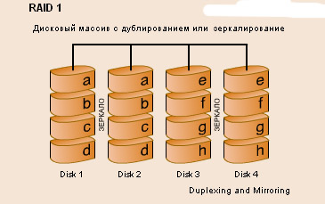
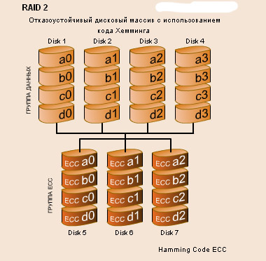

# Отказоустойчивость, работа с дисками и данными


## Работа с файловой системой, добавление жестких дисков

Linux позволяет установить отдельную ФС для каждого раздела. Выбранная система определяет, как быстро будет выполняться работа с файлами, запись и чтение информации. Как в оперативной памяти будет храниться информация (и будет ли она вообще храниться), каким образом можно вносить изменения в конфигурацию ядра ОС — это тоже зависит от ФС.

File system Linux — пространство раздела, состоящее из кратных размеру сектора блоков. Обмен данными производится через VFS или с помощью драйверов. VFS (virtual file system) — это слой абстракции, необходимый для взаимодействия между ядром и софтом. VFS позволяет не думать о специфике работы той или иной ФС. Драйверы ФС обеспечивают взаимодействие между оборудованием (железом) и приложениями.

File system Linux организована следующим образом


Основные файловые системы
Каждый дистрибутив Linux позволяет использовать одну из этих файловых систем, каждая из них имеет свои преимущества и недостатки. Все они включены в ядро и могут использоваться в качестве корневой файловой системы. Давайте рассмотрим каждую из них более подробно.

-  Ext2, Ext3, Ext4 или Extended Filesystem - это стандартная файловая система для Linux. Она была разработана еще для Minix. Она самая стабильная из всех существующих, кодовая база изменяется очень редко и эта файловая система содержит больше всего функций. Версия ext2 была разработана уже именно для Linux и получила много улучшений. В 2001 году вышла ext3, которая добавила еще больше стабильности благодаря использованию журналирования. В 2006 была выпущена версия ext4, которая используется во всех дистрибутивах Linux до сегодняшнего дня. В ней было внесено много улучшений, в том числе увеличен максимальный размер раздела до одного экзабайта.

- JFS или Journaled File System была разработана в IBM для AIX UNIX и использовалась в качестве альтернативы для файловых систем ext. Сейчас она используется там, где необходима высокая стабильность и минимальное потребление ресурсов. При разработке файловой системы ставилась цель создать максимально эффективную файловую систему для многопроцессорных компьютеров. Также как и ext, это журналируемая файловая система, но в журнале хранятся только метаданные, что может привести к использованию старых версий файлов после сбоев.
  
- ReiserFS - была разработана намного позже, в качестве альтернативы ext3 с улучшенной производительностью и расширенными возможностями. Она была разработана под руководством Ганса Райзера и поддерживает только Linux. Из особенностей можно отметить динамический размер блока, что позволяет упаковывать несколько небольших файлов в один блок, что предотвращает фрагментацию и улучшает работу с небольшими файлами. Еще одно преимущество - в возможности изменять размеры разделов на лету. Но минус в некоторой нестабильности и риске потери данных при отключении энергии. Раньше ReiserFS применялась по умолчанию в SUSE Linux, но сейчас разработчики перешли на Btrfs.
  
- XFS - это высокопроизводительная файловая система, разработанная в Silicon Graphics для собственной операционной системы еще в 2001 году. Она изначально была рассчитана на файлы большого размера, и поддерживала диски до 2 Терабайт. Из преимуществ файловой системы можно отметить высокую скорость работы с большими файлами, отложенное выделение места, увеличение разделов на лету и незначительный размер служебной информации.
  
- XFS - журналируемая файловая система, однако в отличие от ext, в журнал записываются только изменения метаданных. Она используется по умолчанию в дистрибутивах на основе Red Hat. Из недостатков - это невозможность уменьшения размера, сложность восстановления данных и риск потери файлов при записи, если будет неожиданное отключение питания, поскольку большинство данных находится в памяти.
  
- Btrfs или B-Tree File System - это совершенно новая файловая система, которая сосредоточена на отказоустойчивости, легкости администрирования и восстановления данных. Файловая система объединяет в себе очень много новых интересных возможностей, таких как размещение на нескольких разделах, поддержка подтомов, изменение размера не лету, создание мгновенных снимков, а также высокая производительность. Но многими пользователями файловая система Btrfs считается нестабильной. Тем не менее, она уже используется как файловая система по умолчанию в OpenSUSE и SUSE Linux.
  
### Структура файловой системы EXT
Структура файловой системы EXT такая же, как и большинства файловых систем UNIX. Схематически структуру файловой системы EXT можно отобразить так:


То есть в структуре EXT можно выделить несколько основных составляющих:

Суперблок – находится в самом начале файловой системы (обычно в первых 1024 байтах раздела). Система автоматически создает несколько копий суперблока, так как без него она не сможет функционировать. В суперблоке хранится базовая информация о файловой системе, а именно:
а) общее число блоков данных и inodes для всей файловой системы;
б) количество свободных inodes и блоков данных, в которые можно будет записать файлы;
в) размер inode и блока данных (эти данные указываются при создании файловой системы);
г) информация о файловой системе – время монтирования, последние изменения и т.д.

Сразу же после суперблока находится глобальная таблица дескрипторов группы блоков (Group Description Table). В ней описаны первый и последний блоки для каждой группы блоков, а также информация где именно в каждой группе начинается таблица inodes, начало блоков данных и т.д.

Битовая карта блока (Block Bitmap) – это специальная таблица, в которой указано какие блоки в группе использованы, а какие свободны. Эта информация используется во время распределения информации в блоке. 0 – означает что блок свободен, а 1 – что занят.

Битовая карта inodes (Inode Bitmap) – эта таблица аналогична битовой карте блока, только в ней отображается информация о свободных inodes, которые могут быть использованы для записи новых файлов.

Блоки данных – выделенные физические блоки памяти, в которых хранятся данные пользователя.

***

### Практика

Задача:
Подключить, отформатировать и монтировать жесткий диск в систему

Исходные данные:
К серверу подключен диск, который необходимо использовать для хранения данных


Ход выполнения:

Для поиска нового диска и его отформатирования в Debian 12, вы можете выполнить следующие шаги:

1. Поиск нового диска:
Для начала необходимо определить, какой новый диск был добавлен к вашей системе. Вы можете воспользоваться командой lsblk для списка всех блочных устройств, подключенных к вашей системе. Новый диск, который вы хотите отформатировать, должен быть там.

Запустите следующую команду:

`lsblk`

2. Отформатирование нового диска:
После того как вы определились с идентификатором нового диска, вы можете его отформатировать с помощью программы mkfs (make file system) для создания новой файловой системы на диске. Например, если ваш новый диск идентифицируется как /dev/sdb, вы можете использовать следующую команду для отформатирования его в ext4:

`sudo mkfs.ext4 /dev/sdb`

получите вывод, например

mke2fs 1.47.0 (5-Feb-2023)
Discarding device blocks: done                            
Creating filesystem with 1310720 4k blocks and 327680 inodes
Filesystem UUID: 2be389da-cb18-4d3b-b2a0-4e40088d2a80
Superblock backups stored on blocks: 
        32768, 98304, 163840, 229376, 294912, 819200, 884736

Allocating group tables: done                            
Writing inode tables: done                            
Creating journal (16384 blocks): done
Writing superblocks and filesystem accounting information: done

где

- mke2fs 1.47.0 (5-Feb-2023): Показывает информацию о версии программы mke2fs, которая используется для создания файловой системы типа ext4 на устройстве /dev/sdb.
- Discarding device blocks: done: Это сообщение означает, что процесс инициирования устройства /dev/sdb перед форматированием блоков устройства завершен.
- Creating filesystem with 1310720 4k blocks and 327680 inodes: Информация о том, что создается файловая система с указанным количеством блоков и инодов.
- Filesystem UUID: 2be389da-cb18-4d3b-b2a0-4e40088d2a80: Уникальный идентификатор файловой системы (UUID).
- Superblock backups stored on blocks: ...: Сообщение о том, где хранятся резервные копии суперблоков файловой системы.
- Allocating group tables: done: Процесс выделения таблиц групп завершен.
- Writing inode tables: done: Процесс записи таблиц инодов завершен.
- Creating journal (16384 blocks): done: Создание журнала файловой системы завершено.
- Writing superblocks and filesystem accounting information: done: Завершена запись суперблоков и сбора информации о файловой системе.

3. Создание новых разделов диска:

При необходимости вы можете создать раздел на новом диске:

`sudo fdisk /dev/sdb`

- Если у вас не созданы разделы на диске, утилита fdisk предложит вам создать новую таблицу разделов (Partition table). Нажмите `n`, чтобы создать новый раздел

- Укажите размер и начало раздела, а затем выберите тип раздела. Обычно для большинства случаев выбирают тип раздела Linux (код 83).

- После завершения настройки параметров нового раздела нажмите `w`, чтобы сохранить изменения и выйти

4. Создание точки монтирования и монтирование нового диска: 

После того как диск был отформатирован, создайте точку монтирования (например, /mnt/newdisk) и смонтируйте новый диск в эту точку монтирования:

`sudo mkdir /mnt/newdisk`

`sudo mount /dev/sdb /mnt/newdisk`

4. Постоянное монтирование при загрузке:
Чтобы новый диск автоматически монтировался при загрузке системы, добавьте запись в файл /etc/fstab. Откройте файл в редакторе (например, nano) :

`sudo nano /etc/fstab`

Добавьте следующую строку в конец файла, сохраните и закройте редактор:

```bash
/dev/sdb   /mnt/newdisk   ext4   defaults   0   2
```

НО! лучше использовать идентификатор диска, так как в этом случае вы избежите ошибок монтирования, так как имя диска может измениться

Чтобы узнать идентификатор

`sudo blkid /dev/sdb`

`sudo nano /etc/fstab`

```bash
UUID=f5d1a425-9592-4fe4-8add-1d887d18ab42   /mnt/newdisk   ext4   defaults   0   2
```

Выполнить перезагрузку системы, чтобы убедиться, что все настройки были корректно применены

`sudo df -h`

`sudo lsblk`

## Работа с менеджером логических томов LVM

LVM (Logical Volume Manager) – это система управления томами, которая позволяет администраторам гибко управлять пространством на дисках в Linux системах. С помощью LVM можно создавать логические тома из нескольких физических дисков и объединять их в единое пространство для хранения данных.

Основные компоненты LVM:
1. Physical Volumes (PV): Физические диски или разделы дисков, которые используются как источникы для создания логических томов.

2. Volume Groups (VG): Группы физических дисков (Physical Volumes), объединенных вместе и представляющих собой единое пространство хранения.

3. Logical Volumes (LV): Логические тома, которые создаются внутри Volume Groups и предоставляются операционной системе в качестве отдельных устройств для хранения данных.

Преимущества использования LVM:
- Гибкость: Можно легко изменять размеры логических томов, объединяя и разделяя их, без необходимости переноса данных.
- Управление отказоустойчивостью и безопасностью: LVM позволяет создавать зеркалированные или RAID массивы для обеспечения отказоустойчивости данных.
- Снятие снимков: LVM поддерживает создание и управление снимками данных для резервного копирования и восстановления.

Структура LVM


### Практика LVM 1

Задача:
Создать логический том и подключить к нему 2 диска, после чего примонтировать к системе

Исходные данные:
К серверу подключены диски, которые необходимо использовать для хранения данных с возможностью дальнейшего расширения

sdb - уже смонтированный диск
sdc - подключаемый диск для расширения

***

Ход выполнения:

0. Установка пакетов LVM:
Установите пакеты lvm2 и thin-provisioning-tools с помощью следующей команды:

`sudo apt install lvm2 thin-provisioning-tools`

1. Создание Physical Volume (PV):
Далее создайте Physical Volume (PV) на дополнительном диске. Предположим, что ваш дополнительный диск идентифицируется как /dev/sdc, выполните следующую команду:

`fdisk -l /dev/sdc`

`lsblk`

`sudo pvcreate /dev/sdc`

`sudo pvdisplay /dev/sdc`

3. Создание Volume Group (VG) с диском системы если не был создан:

`sudo vgcreate VG_LUP /dev/sdc`

3. Добавление Physical Volume в Volume Group (VG):
Добавьте созданный Physical Volume в существующую Volume Group (VG) с помощью команды vgextend. Например, если ваш Volume Group называется VG_LUP, выполните следующую команду:

`sudo vgextend VG_LUP /dev/sdc`

Просмотрим статус volume group

`sudo vgdisplay VG_LUP`

4. Расширение Logical Volume (LV):
Теперь расширьте Logical Volume (LV) вашей системы с помощью команды lvextend. Например, если ваш логический том называется root и его Volume Group VG_LUP, и вы хотите увеличить его на 5 Гб, выполните следующую команду:

Создадим logic volume (если еще не создано)

`sudo lvcreate -L 3G -n lv_lup VG_LUP`

Просмотрим свойства logic volume

`sudo lvdisplay /dev/VG_LUP/lv_lup`

для расширения logic volume используем

`sudo lvextend -L +1G /dev/VG_LUP/lv_lup`

5. подключим к логическому диску наш sdb

- отмонтируем его от файловой системы, удалив запись в fstab

`sudo nano /etc/fstab`

`umount /mnt/newdisk/`

`reboot`

6. Создание Physical Volume 2 (PV):

`fdisk -l /dev/sdb`

`sudo pvcreate /dev/sdb`

`sudo pvdisplay /dev/sdb`

7. Добавление Physical Volume 2 в Volume Group (VG) и расширим logic volume

`sudo vgextend VG_LUP /dev/sdb`

`sudo vgdisplay VG_LUP`

`sudo lvextend -L +4G /dev/VG_LUP/lv_lup`

`sudo lvdisplay /dev/VG_LUP/lv_lup`

8. Форматируем и монтируем созданный логический том к точку монтирования

`sudo mkfs.ext4 /dev/VG_LUP/lv_lup`

`sudo mount /dev/VG_LUP/lv_lup /mnt/newdisk`

`df -h`

`lsblk`

`sudo blkid | grep /dev/VG_LUP/lv_lup`

для fstab

```bash
/dev/VG_LUP/lv_lup /mnt/newdisk ext4 defaults 0 0
```

## Восстановление и гарантированное удаление данных

### Восстановление данных

#### Testdisk

TestDisk - это мощное утилита для восстановления данных, которая предназначена для восстановления потерянных разделов и восстановления удаленных файлов. Вот как он работает:

1. Восстановление потерянных разделов:
   - TestDisk может сканировать жесткий диск и обнаруживать потерянные или поврежденные разделы. Он может восстановить таблицу разделов и восстановить доступ к данным, хранящимся на этих разделах.
  
2. Восстановление удаленных файлов:
   - С помощью TestDisk можно искать удаленные файлы на носителе данных и восстанавливать их. Это особенно полезно в случае случайного удаления файлов или форматирования носителя.
  
3. Работа с различными типами файловых систем:
   - TestDisk поддерживает множество различных файловых систем, включая NTFS, FAT, exFAT, ext2/ext3/ext4 и др., что позволяет восстанавливать данные на различных носителях.
  
4. Интерфейс командной строки и графический интерфейс:
   - TestDisk имеет интерфейс командной строки, который позволяет более точно настраивать процесс восстановления данных, а также графический интерфейс для более удобного использования.

Начнем работу:

`sudo apt install testdisk`

1. Для запуска утилиты введите в консоли:

создать директорию и файл

`mkdir /mnt/newdisk/test`

`touch /mnt/newdisk/test/testfile.txt`

`echo "test message" > /mnt/newdisk/test/testfile1.txt`

`echo "test message" > /mnt/newdisk/test/testfile2.txt`

`echo "test message" > /mnt/newdisk/test/testfile3.txt`

`sudo rm -r /mnt/newdisk/test`


testdisk

2. Выберите параметры ведения лога (если надо)


3. Выберите диск


4. Выберите тип таблицы разделов. В большинстве случаев подойдет либо Intel, либо EFI GPT. Если не уверены на 100%, просто выберите тот вариант, который рекомендует программа (надпись внизу экрана)


5. Выберите Advanced


6. Кнопками вверх-вниз выберите раздел и кнопкой Enter нажмите на выбранную кнопку List


7. С помощью : выделите несколько файлов/каталогов для восстановления, или нажмите на a чтобы выделить все.

8. Нажмите C чтобы скопировать выбранные файлы, а c, чтобы скопировать только текущий файл.

9.  Выберите каталог и нажмите C.

#### PhotoRec

PhotoRec - еще один бесплатный инструмент восстановления данных, созданный теми же разработчиками TestDisk. Изначально он был разработан для восстановления удаленных фотографий. Но теперь она может восстановить все типы удаленных файлов.

`cp -r /etc/* /mnt/newdisk/`

`rm -r /mnt/newdisk/*`

Чтобы восстановить удаленные файлы в Linux с помощью PhotoRec, придерживайтесь следующих рекомендаций.

1. Установка PhotoRec в Linux

Выполните следующую команду для установки PhotoRec:

`sudo apt -y install testdisk`

После установки используйте следующую команду для загрузки и запуска утилиты Photorec:

`sudo photorec`

2. Запустите PhotoRec и начните поиск удаленных файлов

После запуска PhotoRec перейдите к жесткому диску, который вы хотите восстановить, и нажмите Enter. Вам будет предложено выбрать раздел, на котором вы хотите запустить процесс восстановления.

Прежде чем продолжить, выберите тип файла в меню параметров файла на экране выбора раздела. 

Выберите тип раздела, который в нашем случае ext4.

Выберите, будет ли утилита исследовать только свободные сектора или весь диск.

В каталоге /Desktop Directory, именно там команда начнет искать по умолчанию. Определившись с папкой, нажмите букву C, и программа начнет поиск файлов.

3. Восстановление файлов с помощью PhotoRec

В зависимости от того, сколько типов файлов вы выбрали, это может занять некоторое время.

Все восстановленные файлы будут восстановлены в папке recup_dir. Даже во время восстановления вы сможете получить доступ к файлам.


### гарантированное удаление данных

Задача:
Гарантированно затереть данные на диске

Исходные данные:
К серверу подключен диск с конфиденциальными данными, требующими гарантированного уничтожения

/dev/VG_LUP/lv_lup - смонтированный логический диск

***

Ход выполнения:

`cp -r /etc/X11/* /mnt/newdisk/`


Вариант 1. Утилита shred

Утилита shred в Linux предназначена для безопасного удаления файлов, перезаписывая их содержимое случайными данными. Это позволяет убедиться, что данные не могут быть восстановлены даже специализированными программами восстановления.

Установите утилиту shred, если ее нет на вашей системе:

`sudo apt-get install coreutils`

2. Затереть данные на диске:

Используйте команду shred, чтобы затереть данные на диске. Например, чтобы затереть данные на всем диске /dev/sdX, выполните:

`sudo shred -vzn 0 /dev/VG_LUP/lv_lup`

- -v - опция для вывода информации о процессе затирания данных.
- -z - опция для добавления нулей после завершения затирания, чтобы скрыть факт удаления данных.
- -n - опция для указания количества проходов затирания (в данном случае 0 проходов).

3. Подтвердите выполнение операции:

После ввода команды shred, вам будет предложено подтвердить выполнение операции. Убедитесь, что вы выбрали правильный диск перед продолжением процесса.

4. Удаление файла в директории:

`shred -u имя_файла`

5. Удаление всех файлов в директории и её поддиректориях:

`find /mnt/newdisk/ -type f -exec shred -uv {} ';'`

- find /путь/к/директории -type f: Эта часть команды использует утилиту find, чтобы рекурсивно пройти по указанной директории и найти все файлы (-type f). Флаг -type f указывает find искать только обычные файлы, исключая директории, символьные ссылки и прочие объекты файловой системы.

- -exec shred -u {} ;: После того как find нашел файлы, он передает их в shred -u {}, где {} представляет собой найденный файл. Утилита shred перезаписывает содержимое файла случайными данными, а флаг -u указывает shred на удаление файла после завершения перезаписи.

- ';': Это специальный символ, который указывает на конец выполнения одной команды внутри -exec. В данном случае он означает конец команды shred -u {}.


Вариант 2. Утилита dd

Вот как можно использовать dd для удаления данных на диске:

1. Найдите путь к диску:

Прежде всего, вам нужно найти путь к диску, который вы хотите удалить. Например, диск /dev/sdX.

2. Установите dd, если он еще не установлен:

Обычно утилита dd предустановлена в большинстве дистрибутивов Linux, но если она отсутствует, можно установить ее с помощью пакетного менеджера вашей системы.

3. Выполните команду dd для удаления данных:

Для затирания данных всего диска случайными данными выполните команду dd следующим образом:

`sudo dd if=/dev/urandom of=/dev/VG_LUP/lv_lup bs=4M status=progress`

- if=/dev/urandom - использует устройство /dev/urandom для генерации случайных данных.
- of=/dev/sdX - определяет путь к диску, который вы хотите удалить (замените sdX на свой реальный путь).
- bs=4M - задает размер блока в 4 мегабайта для повышения скорости операции.
- status=progress - показывает прогресс операции.

4. Подтвердите выполнение операции:

После ввода команды dd, вам будет предложено подтвердить выполнение операции. Убедитесь, что выбрали правильный диск перед продолжением процесса.


## Создание программного Raid массива

RAID 0


Дисковый массив повышенной производительности без отказоустойчивости
Striped Disk Array without Fault Tolerance
Массив RAID 0 наиболее производительный и наименее защищенный из всех RAID-ов. Данные разбиваются на блоки пропорционально количеству дисков, что приводит к более высокой пропускной способности. Высокая производительность данной структуры обеспечивается параллельной записью и отсутствием избыточного копирования. Отказ любого диска в массиве приводит к потере всех данных. Этот уровень называется striping.

Преимущества:
- · наивысшая производительность для приложений требующих интенсивной обработки запросов ввода/вывода и данных большого объема;
- · простота реализации;
- · низкая стоимость на единицу объема. 
Недостатки:
- · не отказоустойчивое решение;
- · отказ одного диска влечет за собой потерю всех данных массива.


RAID 1



Дисковый массив с дублированием или зеркалирование
Duplexing & Mirroring
RAID 1 - mirroring - зеркальное отражение двух дисков. Избыточность структуры данного массива обеспечивает его высокую отказоустойчивость. Массив отличается высокой себестоимостью и низкой производительностью.

Преимущества:
- · простота реализации;
- · простота восстановления массива в случае отказа (копирование);
- · достаточно высокое быстродействие для приложений с большой интенсивностью запросов.
Недостатки:
- · высокая стоимость на единицу объема - 100% избыточность;
- · невысокая скорость передачи данных.


RAID 2



Отказоустойчивый дисковый массив с использованием кода Хемминга
Hamming Code ECC
 RAID 2 - использует коды исправления ошибок Хемминга (Hamming Code ECC). Коды позволяют исправлять одиночные и обнаруживать двойные неисправности.

 Преимущества:
- · быстрая коррекция ошибок ("на лету");
- · очень высокая скорость передачи данных больших объемов;
- · при увеличении количества дисков, накладные расходы уменьшаются;
- · достаточно простая реализация. 
Недостатки:
- · высокая стоимость при малом количестве дисков;
- · низкая скорость обработки запросов (не подходит для систем ориентированных на обработку транзакций).

RAID 3


Отказоустойчивый массив с параллельной передачей данных и четностью
Parallel Transfer Disks with Parity
RAID 3 - данные хранятся по принципу striping на уровне байтов с контрольной суммой (КС) на одном из дисков. Массив не имеет проблему некоторой избыточности как в RAID 2-го уровня. Диски с контрольной суммой используемые в RAID 2, необходимы для определения ошибочного заряда. Однако большинство современных контроллеров способны определить, когда диск отказал при помощи спец сигналов или дополнительного кодирования информации, записанной на диск и используемой для исправления случайных сбоев.

Преимущества:
- · очень высокая скорость передачи данных;
- · отказ диска мало влияет на скорость работы массива;
- · малые накладные расходы для реализации избыточности. 
Недостатки:
- · непростая реализация;
- · низкая производительность при большой интенсивности запросов данных небольшого объема.

### Практика - создание программного raid-1 массива

Задача:
Создать программный рейд массив на 2 внешних дисках

Исходные данные:
К серверу подключены 2 диска одинакового размера

sdd - диск 1
sde - диск 2

***

Ход выполнения:

1. Установка пакета mdadm:
Установите пакет mdadm, если его еще нет, выполните следующую команду:

`sudo apt install mdadm`

2. Создание RAID массива:
Создадим RAID 1 массив из двух дисков /dev/sdb и /dev/sdc. Запустите следующую команду для создания рейда:

lsblk   # просмотрим диски

- Если диски использовались, их нужно очистить

`sudo mdadm --zero-superblock --force /dev/sd{d,e}`   # очистим суперблоки 

`sudo wipefs --all --force /dev/sd{d,e}`  # удаление метаданных и подписи на дисках

Создаем raid-1

`sudo mdadm --create --verbose /dev/md0 --level=1 --raid-devices=2 /dev/sdd /dev/sde`

--create - создать массив;
--verbose - выводить подробную информацию при работе утилиты mdadm;
/dev/md0 - имя блочного устройства RAID которое появится после сборки массива;
--level=1 - уровень RAID массива. В нашем случае это массив уровня 1;
--raid-devices=2 - количество дисков включаемых в массив;
/dev/sdb /dev/sdc - имена дисков включаемых в массив, которые мы определили выше, используя команду lsblk.

`lsblk`

3. Создание файла конфигурации mdadm:
Вызовите следующую команду для создания файла конфигурации mdadm.conf:

`sudo mdadm --detail --scan | sudo tee -a /etc/mdadm/mdadm.conf`

Внимание!!! Перед созданием файловой системы на разделе RAID ОБЯЗАТЕЛЬНО дождитесь полного окончания синхронизации дисков включенных в RAID массив
Проверяем статус синхронизации командой:

`cat /proc/mdstat`

Ждем вывода
```bash
root@d12-0:~# cat /proc/mdstat
Personalities : [raid1] 
md0 : active raid1 sde[1] sdd[0]
      5237760 blocks super 1.2 [2/2] [UU]
      
unused devices: <none>
```


- Personalities: Этот раздел указывает на доступные типы RAID-массивов. В вашем случае используется тип RAID1.

- md0: Эта строка показывает информацию о RAID-массиве с именем md0. Он находится в активном состоянии active, использует уровень RAID1 и содержит два устройства: sde[1] и sdd[0].

- 5237760 blocks: Это размер массива в блоках.

- super 1.2: Это версия метаданных RAID, которые использует массив.

- [2/2]: Это показывает количество устройств в массиве и количество работающих устройств. В данном случае, [2/2] означает, что из двух устройств, оба работают в массиве.

- [UU]: Это показывает статус каждого устройства в массиве. U указывает на то, что устройство активно и работает без ошибок.

- unused devices: Здесь указывается, что в данный момент не используется никаких дополнительных устройств для массива.

4. Создание файловой системы:
Теперь создайте файловую систему на вашем новом RAID массиве. Например, для создания ext4 файловой системы, выполните следующую команду:

`sudo mkfs.ext4 /dev/md0`

5. Монтирование RAID массива:
Создайте точку монтирования для вашего RAID массива и смонтируйте его. Например, создадим точку монтирования /mnt/raid и смонтируем RAID массив в нее:

`sudo mkdir /mnt/raid`

`sudo mount /dev/md0 /mnt/raid`

6. Автоматическое монтирование при загрузке:
Чтобы RAID массив монтировался автоматически при загрузке системы, добавьте запись в файл /etc/fstab. 

Для уточнения идентификатора диска:

`sudo blkid | grep md0`

`nano /etc/fstab`

```bash
UUID=5f2222b6-d113-49b8-bf08-41706c9b5817 /mnt/raid ext4 defaults 0   2
```

- /mnt/raid1 - директория куда монтируется наше блочное устройство;
- ext4 - тип файловой системы раздела созданного на блочном устройстве RAID /dev/md0;
- defaults - указывает на то, что при монтировании используются опции монтирования по - умолчанию, а именно: rw, suid, dev, exec, auto, nouser, async;
- 0 - указывает нужно ли делать резервную копию раздела. В данном случае нет.
- 2- указывает в какой очереди нужно проверять устройство на ошибки, 1 - в первую - очередь, 2 - вторую, 0 - не проверять;

Внимание!!! После того как вы добавите в конец файла /etc/fstab полученную вами строку, обязательно перед сохранением изменений в файл, переведите курсор на следующую строку 

Для того чтобы операционная система знала о массиве на раннем этапе загрузки, нужно обновить информацию для initramfs

`sudo update-initramfs -u`

Посмотреть краткое состояние RAID массива можно с помощью команды:

`cat /proc/mdstat`

## Создание локального зеркала репозиториев 


Зеркало репозитория Linux представляет собой копию основного репозитория, распределенную по различным серверам и расположенную в разных географических зонах. Зеркало репозитория имеет несколько целей и преимуществ:

1. Увеличение скорости загрузки: Использование зеркал репозиториев позволяет пользователям загружать пакеты и обновления с более быстрой скоростью, так как они могут выбирать ближайшее зеркало, что снижает задержки при загрузке.

2. Распределение нагрузки: Зеркала репозиториев помогают разгрузить основные серверы, распределяя нагрузку на несколько зеркал. Это помогает обеспечить стабильную доступность и скорость загрузки на всех уровнях нагрузки.

3. Отказоустойчивость: В случае сбоя или недоступности основного репозитория, пользователи могут переключиться на зеркала, чтобы продолжить загрузку пакетов и обновлений без прерываний.

4. Локальный доступ: Пользователям с ограниченным Интернет-соединением или изолированным сетям иногда удобнее использовать локальные зеркала для загрузки пакетов и обновлений, а затем обновлять свои системы без подключения к Интернету.

5. Безопасность: Использование зеркал позволяет снизить риск потенциальных атак или атак на серверы репозиториев, так как зеркала могут иметь дополнительные меры безопасности и защиты данных.

### Практика - создание локального зеркала репозиториев (применено на AstraLinux 1.6)

Задача:
Создать программное зеркало репозиториев для debian (astra linux), а также virtualbox

Исходные данные:
Сервер локальной вычислительной сети с ограниченными (отстутвующим интернет подключением)

***

Ход выполнения:


1. Установка apt-mirror:
Установите утилиту apt-mirror, если она еще не установлена. Выполните следующую команду в терминале:

`sudo apt install apt-mirror`

2. Настройка конфигурационного файла:
Отредактируйте конфигурационный файл apt-mirror:

`sudo nano /etc/apt/mirror.list`

```bash
############# config ##################
#
set base_path    /repos/d12/repo
set mirror_path  $base_path/mirror
set skel_path    $base_path/skel
set var_path     $base_path/var
# set cleanscript $var_path/clean.sh
# set defaultarch  <running host architecture>
# set postmirror_script $var_path/postmirror.sh
set run_postmirror 0
#set nthreads     20
#set _tilde 0
#
############# end config ##############

deb https://dl.astralinux.ru/astra/stable/1.6_x86-64/repository smolensk main contrib non-free
deb https://dl.astralinux.ru/astra/stable/1.6_x86-64/repository-update/ smolensk main contrib non-free
deb https://dl.astralinux.ru/astra/stable/1.6_x86-64/repository-dev/ smolensk main contrib non-free
deb https://dl.astralinux.ru/astra/stable/1.6_x86-64/repository-dev-update/ smolensk main contrib non-free
deb [arch=amd64] https://download.virtualbox.org/virtualbox/debian stretch contrib
deb [arch=amd64] https://archive.debian.org/debian/ stretch main

# Эта строчка сообщает apt-mirror, что более ненужные файлы из основного репозитория ubuntu
# (например, устаревшие версии пакетов, отсутствующие в индексах) можно удалить из локальной копии,
# тем самым освободив место.
clean https://dl.astralinux.ru/astra/stable/1.6_x86-64/repository
clean https://dl.astralinux.ru/astra/stable/1.6_x86-64/repository-update/
clean https://dl.astralinux.ru/astra/stable/1.6_x86-64/repository-dev/
clean https://dl.astralinux.ru/astra/stable/1.6_x86-64/repository-dev-update/
clean [arch=amd64] https://download.virtualbox.org/virtualbox/debian
clean [arch=amd64] https://archive.debian.org/debian/ stretch main
```

3. Запуск apt-mirror:
- Запустите apt-mirror для создания зеркала репозиториев. Выполните следующую команду:

`sudo apt-mirror`

- настроим запуск по расписанию

`crontab -e`

```bash
0 0 * * 0 apt-mirror
```

5. Настройка веб-сервера (необязательно):
Для доступа по протоколу HTTP 

`sudo apt install apache2 -y`

- Для AstraLinux дополнительно укажем
- 
`/etc/apache2/apache2.conf`

```bash
AstraMode Off
```

`sudo systemctl restart apache2`

`sudo systemctl enable apache2`

`sudo mkdir /var/www/html/repo/`

Создаем символьные ссылки

`sudo ln -s /repos/d12/repo/mirror/ /var/www/html/repo/`

`sudo vim /etc/apache2/sites-enabled/000-default.conf`

```bash
    ServerAdmin webmaster@localhost
    DocumentRoot /var/www/html/repo
    <Directory /var/www/html/repo>
        Options Indexes MultiViews FollowSymLinks
        AllowOverride None
        Order Deny,Allow
        Require all granted
    </Directory>
```

`sudo systemctl restart apache2`

5. Настройка источника репозиториев для клиентов (можно раздать через puppet/ansible)

`sudo nano /etc/apt/sources.list`

```bash
# Зеркало - Основной репозиторий (установочный диск)
deb http://192.168.2.101/mirror/dl.astralinux.ru/astra/stable/1.6ree_x86-64/repository smolensk main contrib non-f
# Зеркало -Актуальное оперативное обновление основного репозитория
deb http://192.168.2.101/mirror/dl.astralinux.ru/astra/stable/1.6_x86-64/repository-update/ smolensk main contrib non-free
# Зеркало -Диск со средствами разработки
deb http://192.168.2.101/mirror/dl.astralinux.ru/astra/stable/1.6_x86-64/repository-dev/ smolensk main contrib non-free
# Зеркало -Актуальное оперативное обновление диска со средствами разработки
deb http://192.168.2.101/mirror/dl.astralinux.ru/astra/stable/1.6_x86-64/repository-dev-update/ smolensk main contrib non-free
# Зеркало - репозитории virtual-box
deb http://192.168.2.101/mirror/download.virtualbox.org/virtualbox/debian/ stretch contrib
# Зеркало - репозитории Debian
deb http://192.168.2.101/mirror/archive.debian.org/debian/ stretch main
# Репозитории SN LSP
deb [trusted=yes] http://192.168.2.101/mirror/sn_lsp/repo/ ./
```

`sudo apt-get --allow-unauthenticated update`

6. Перенос зеркала в изолированную сеть через внешний диск

- Показываем информацию о дисках и их разделах с помощью lsblk.

`lsblk`

Создаем раздел /dev/sdb1 на диске /dev/sdb с помощью fdisk /dev/sdb.
Форматируем новый раздел в файловую систему ext4 с помощью mkfs -t ext4 /dev/sdb1.

`fdisk /dev/sdb`

`mkfs -t ext4 /dev/sdb1`

- Создаем директорию /repos с помощью sudo mkdir /repos.
- Монтируем раздел /dev/sdb1 в директорию /repos с помощью mount /dev/sdb1 /repos.

`sudo mkdir /repos`

`mount /dev/sdb1 /repos`

- Подтверждаем монтирование и просматриваем UUID раздела с использованием lsblk -f.

`lsblk -f`

- Редактируем файл /etc/fstab с помощью sudo vim /etc/fstab

`sudo nano /etc/fstab`

```bash
UUID=3d34a249-14b8-4bb8-801b-982bb70a6358   /repos   ext4   defaults  0   0
```

`sudo mount -a`

7. Сохраним репозиторий в iso если переносить на диске не удобно

`sudo apt-get install genisoimage`

`cd /repos`

`genisoimage -o /run/user/1000/media/by-id-ata-TOSHIBA_MQ01ABD050_33N3FHMTS-part1/repos.iso -R -J .`


# Домашнее задание
#### main

1. LVM
- Создать LVM логический диск на одном из физических дисков
- подключить второй физический диск, расширить логический диск 
2. Создать raid-1 массив из двух подключенных дисков, примонтировать его к серверу
3. Создать скриншоты вывода команд lsblk и df -h

***
#### hard

1. Настроить подключение логического диска lvm и raid массива при старте системы
2. Создать на логическом диске lvm 3 раздела
3. Скопировать а затем гарантированно затереть файлы на raid массиве
3. Создать скриншоты вывода команд lsblk и df -h, cat /etc/fstab

***
Для отчета:
- создать в личном репозитории организации github ветку lesson_4_2
- создать директорию lesson_4_2 и разместить там файл домашнего задания
- сделать push и pull request на сайте, в качестве рецензента добавить пользователя AndreyChuyan


