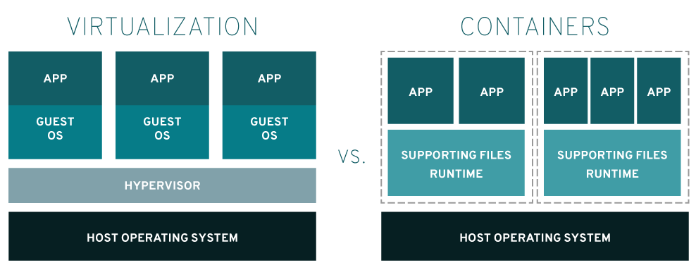
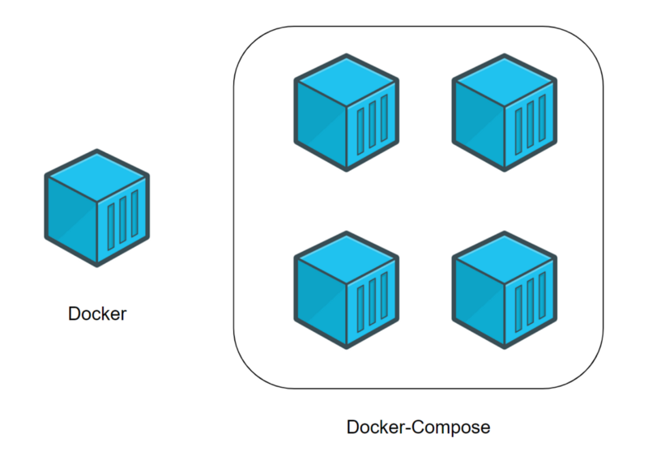

# Основы контейнеризации и виртуализации


## Основы контейнеризации, LXC, Docker.

- Виртуализация обеспечивает одновременную работу нескольких операционных систем на одном компьютере
- Контейнеры используют одно и то же ядро операционной системы и изолируют процессы приложения от остальной системы



Для одновременной работы нескольких операционных систем на одном гипервизоре (программе, которая реализует виртуализацию), требуется больше системных ресурсов, чем для аналогичной конфигурации на основе контейнеров. Ресурсы, как правило, не безграничны, поэтому, чем меньше «весят» ваши приложения, тем плотнее их можно разместить на серверах. Все Linux-контейнеры, работающие на компьютере, используют одну и ту же операционную систему, поэтому ваши приложений и сервисы остаются легковесными и работают в параллельном режиме, не тормозя друг друга.

### Этапы развития технологии контейнеризации

1. Механизм cgroups, действующего на уровне ядра Linux и ограничивающего использование системных ресурсов процессом или группой процессов, с системой инициализации systemd, отвечающей за создание пользовательского пространства и запуск процессов. Объединение этих механизмов, изначально созданных для того, чтобы повысить общую управляемость в Linux, позволило значительно лучше контролировать изолированные процессы и заложило основу для успешного разделения сред.

2. Развитие пространств имен пользователей (User namespaces), «позволяющих разделить присвоенные процессу идентификаторы пользователя и группы внутри и вне пространства имен. В контексте контейнеров это означает, что пользователи и группы могут иметь привилегии на выполнение определенных операций внутри контейнера, но не за его пределами».

3. Система виртуализации Linux Containers project (LXC), которая предложила ряд крайне востребованных инструментов, шаблонов, библиотек и средств языковой поддержки, резко упростив использование контейнеров на практике.

LXC - сокращение от LinuXContainers, мощная система управления контейнерами, использующая общее ядро Linux и механизмы разделения/ограничения пользовательского пространства (имен, ресурсов) для запуска служб и программ. Является свободным программным обеспечением.

Механизм LXC контейнеров построен на основе системы CGroups (Control Groups), которая содержится в ядре Linux и позволяет выделять для работы изолированные пространства имен, ограничивать ресурсы процессов и т.п.

4. Появление Docker

В 2008 на сцену вышла компания Docker (тогда она называлась dotCloud) с одноименной технологией, объединившей достижения LXC с продвинутыми инструментами для разработчиков и еще больше облегчившей использование контейнеров.

Linux-контейнеры – это очередной эволюционный шаг в развитии методов разработки, развертывания и сопровождения приложений. Обеспечивая переносимость и управление версиями, образ контейнера гарантирует, что если приложение работает на компьютере разработчика, то оно будет работать и в промышленной среде.

Требуя меньше системных ресурсов по сравнению с виртуальной машиной, Linux-контейнер почти не уступает ей в возможностях изоляции и значительно облегчает сопровождение составных многоуровневых приложений.

### Устройство и принцип работы Docker
Виртуализация в Docker реализуется на уровне ОС. Виртуальная среда запускается прямо из ядра основной операционной системы и использует её ресурсы.

В поставку Docker входят следующие компоненты:

- Docker host — это операционная система, на которую устанавливают - Docker и на которой он работает.
- Docker daemon — служба, которая управляет Docker-объектами: сетями, хранилищами, образами и контейнерами.
- Docker client — консольный клиент, при помощи которого пользователи взаимодействуют с Docker daemon и отправляют ему команды, создают контейнеры и управляют ими.
- Docker image — это неизменяемый образ, из которого разворачивается контейнер.
- Docker container — развёрнутое и запущенное приложение.
- Docker Registry — репозиторий, в котором хранятся образы.
- Dockerfile — файл-инструкция для сборки образа.
- Docker Compose — инструмент для управления несколькими контейнерами. Он позволяет создавать контейнеры и задавать их  конфигурацию.
- Docker Desktop — GUI-клиент, который распространяется по GPL.  Бесплатная версия работает на Windows, macOS, а с недавних пор и на  Linux. Это очень удобный клиент, который отображает все сущности Docker и позволяет запустить однонодовый Kubernetes для компьютера.


### Установка Docker

Удалим графический интерфейс

`apt remove -y --purge gnome* && apt autoclean -y && apt autoremove -y`

`reboot`

`sudo apt update`

установим утилиты

`sudo apt install ca-certificates curl gnupg lsb-release`

Добавим ключи, а также репозитории:

`curl -fsSL https://download.docker.com/linux/debian/gpg | sudo gpg --dearmor -o /usr/share/keyrings/docker-archive-keyring.gpg`

```c
echo \
  "deb [arch=$(dpkg --print-architecture) signed-by=/usr/share/keyrings/docker-archive-keyring.gpg] https://download.docker.com/linux/debian \
  $(lsb_release -cs) stable" | sudo tee /etc/apt/sources.list.d/docker.list > /dev/null
```

`sudo apt update`

`sudo apt install docker-ce docker-ce-cli containerd.io`


Команды управления Docker
- docker run: Запускает новый контейнер из образа.
- docker ps: Показывает список активных контейнеров.
- docker stop: Останавливает один или несколько работающих контейнеров.
- docker start: Запускает один или несколько остановленных контейнеров.
- docker restart: Перезапускает один или несколько работающих контейнеров.
- docker pause: Приостанавливает выполнение контейнера.
- docker unpause: Возобновляет выполнение приостановленного контейнера.
- docker kill: Принудительно останавливает контейнер.
- docker rm: Удаляет один или несколько контейнеров.
- docker rmi: Удаляет один или несколько образов контейнеров.
- docker exec: Запускает новый процесс внутри работающего контейнера.
- docker build: Создает новый образ на основе Dockerfile.
- docker push: Загружает образ в регистр (например, Docker Hub).
- docker pull: Загружает образ из регистра.
- docker images: Показывает список доступных образов.

Ссылка на официальные инструкции

`https://docs.docker.com/build/building/packaging/#dockerfile`

### Пропишем прокси для Docker

`nano /etc/docker/daemon.json`

```bash
{ "registry-mirrors" : [ "https://dockerhub.timeweb.cloud" ] }
```

systemctl reload docker


#### Практика 1 - создание Docker файла для запуска сайта

Задача:
Развернуть контейнер с веб сервером nginx и тестовым сайтом

Исходные данные:
d12-c - cервер с настроенным Docker Engine

***

Ход выполнения:

1. создаем директорию dockerfiles:

`mkdir -p ~/dockerfiles/nginx_site`

создаем директории для конфигов

`mkdir ~/dockerfiles/nginx_site/{configs,site}`

`cd ~/dockerfiles/nginx_site`

2. Создаем файл с именем "Dockerfile":

посмотрим список платформ:

`docker search debian`

`nano ./Dockerfile`

```dockerfile
#--------------------------------------------------------
# My Dockerfilе: build Docker Image Nginx v.1
# Chuyan_Andrey 24.05
#--------------------------------------------------------
# Базовая платформа для запуска Nginx
FROM ubuntu:18.04
 
# Стандартный апдейт репозитория
RUN apt-get -y update
# Установка Nginx
RUN apt-get install -y nginx
# Копируем файл конфигурации Nginx из локальной директории в контейнер
COPY configs/nginx.conf /etc/nginx/nginx.conf
# Копируем файлы сайта из лестницы внутрь контейнера
COPY site /usr/share/nginx/html
# Указываем Nginx запускаться на переднем плане (daemon off)
RUN echo "daemon off;" >> /etc/nginx/nginx.conf
# В индексном файле меняем первое вхождение nginx на docker-nginx
RUN sed -i "0,/nginx/s/nginx/docker-nginx/i" /usr/share/nginx/html/index.html
# Запускаем Nginx. CMD указывает, какую команду необходимо запустить, когда контейнер запущен.
CMD [ "nginx" ]
```

Краткая справка по основным полям:

FROM — указывает название образа (image), который будет взят за основу.
ENV — устанавливает переменную среды
RUN — запустить команду в контейнере (все команды исполняются с полными правами в пределах контейнера)
COPY - копирование файлов с хоста а контейнер
ADD — добавить файл в контейнер
VOLUME — указать монтируемые директории (их можно монтировать на хост машину или на другие контейнеры)
EXPOSE — указать транслируемые порты (их можно транслировать на хост машину или на другие контейнеры)
CMD — запустить процесс (это и будет процесс, вокруг которого построен контейнер)

3. создадим тестовую html страницу для контейнера

`nano ~/dockerfiles/nginx_site/site/index.html`

```html
<!DOCTYPE html>
<html lang="en" dir="ltr">
  <head>
    <meta charset="utf-8">
    <title>!!! LUP - Welcome to Docker !!!!</title>
  </head>
  <body>
    <h1>Nginx to docker container Lup</h1>
  </body>
</html>
```

4. создадим конфиг для Nginx контейнера

`nano ~/dockerfiles/nginx_site/configs/nginx.conf`

```bash
user www-data;
worker_processes auto;
pid /run/nginx.pid;
include /etc/nginx/modules-enabled/*.conf;

events {
    worker_connections 768;
}

http {
    sendfile on;
    tcp_nopush on;
    tcp_nodelay on;
    keepalive_timeout 65;
    types_hash_max_size 2048;
    include /etc/nginx/mime.types;
    default_type application/octet-stream;
    ssl_protocols TLSv1 TLSv1.1 TLSv1.2; # Dropping SSLv3, ref: POODLE
    ssl_prefer_server_ciphers on;
    access_log /var/log/nginx/access.log;
    error_log /var/log/nginx/error.log;
    gzip on;
    include /etc/nginx/conf.d/*.conf;
    include /etc/nginx/sites-enabled/*;


    server {
        listen 80;
        listen [::]:80;
    
        server_name localhost;
    
        location / {
            root /usr/share/nginx/html;
            index index.html;
        }
    }
}
```

4. создадим и запустим образ

`docker build -t site_image .`  создаем образ контейнера

`docker images` просмотрим созданные образы

`docker rmi db8a3a70981a `  удалить образ

`docker image prune -a` удалить все образы

5. запустим образ

`docker run -p 80:80 --name site_container site_image` запускаем контейнер

`docker start site_container`  запускаем контейнер если он остановлен

`docker ps -a` проверим запущенные контейнеры

`docker rm b4bd9e974504` удалить контейнер

`docker container prune` удалить все контейнеры

`docker logs b4bd9e974504`  просмотреть логи контейнера

`docker exec -it site_container bash` зайти в контейнер с использованием bash

`docker system prune -a` очистка кеша


В данной команде:
- docker run - запускает новый контейнер на основе указанного образа.
- -d - опция, которая позволяет запустить контейнер в фоновом режиме (detached mode).
- -p 81:80 - опция, которая пробрасывает порт из хост-системы на контейнер. В данном случае указывается, что порт 80 контейнера будет доступен на порту 81 хост-системы.
- --name site_container - опция, которая задает имя контейнера, в данном случае site_container.
- site_image - имя образа, на основе которого будет создан контейнер.


строковые скрипты

пересоздание образа и перезапуск контейнера

```bash
image_to_remove="site_image"; \
container_ids=$(docker ps -aq --filter ancestor=$image_to_remove);  \
for container_id in $container_ids; do docker stop $container_id; docker rm $container_id; done; \
docker rmi -f $image_to_remove; \
docker build -t site_image . ; \
# презапуск контейнера (удаление запущенного контейнера и запуск заново)
container_name=$(docker ps --format "{{.Names}}") ; \ 
docker rm $(docker ps -a -q -f name=$container_name) ; \
docker run -p 80:80 --name site_container site_image
```

### Многоэтапные сборки docker (multi-stage builds)

Docker начиная с версии 17.05 и выше стал поддерживать многоэтапные сборки (multi-stage builds)

Каждая инструкция FROM может использовать индивидуальный базовый образ и каждая из них начинает новую стадию сборки docker образа. Но основное преимущество, что вы можете копировать необходимые артефакты из одной стадии в другую


#### Практика 2 - создание multi-stage контейнера с запущенным приложением

Задача:
Развернуть multi-stage builds контейнер с запущенным приложением на java

Исходные данные:
d12-c - cервер с настроенным Docker Engine

***

Ход выполнения:

1. создаем директорию dockerfiles:

`mkdir -p ~/dockerfiles/app_java`

`cd ~/dockerfiles/app_java/`

2. Загрузим тестовое приложение с github

`apt install git`

`git clone https://github.com/AndreyChuyan/apps.git`

2. Создаем файл с именем "Dockerfile":

посмотрим список платформ:

`nano ./Dockerfile`

```dockerfile
#- Указываем базовый образ
FROM maven:3.8.6-openjdk-8-slim as builder
#- Создать папку в виртуалке
WORKDIR /app
#- Копировать файлы из каталога
COPY apps/apps/hello-world-app .
#- Запускаем артефакт
RUN mvn -DskipTests package

#- Запускаем на образе java
FROM openjdk:8u342-jre-slim as main
#- Создать папку в виртуалке
WORKDIR /app
#- Копировать файлы из предыдущего образа
COPY --from=builder /app/target/my-app-1.0-SNAPSHOT.jar .
#- Выполняем команду (запуск артефакта)
CMD java -jar my-app-1.0-SNAPSHOT.jar

```

`docker build -t app_image .`

`docker run --name app_container app_image`

### Управление несколькими контейнерами через docker-compose 
Docker Compose — это инструментальное средство, входящее в состав Docker. Оно предназначено для решения задач, связанных с развёртыванием проектов.
Если для обеспечения функционирования этого проекта используется несколько сервисов, то Docker Compose может вам пригодиться.




#### Практика 3 - создание через docker-compose  multi-stage контейнера с запущенным приложением java с веб сервером и базой данных

1. создаем директорию dockerfiles:

`mkdir -p ~/dockerfiles/app_webbook/`

`cd ~/dockerfiles/app_webbook/`

2. Загрузим тестовое приложение с github

`apt install git`

`git clone https://github.com/AndreyChuyan/apps.git`

2. Создаем файл с именем "Dockerfile":

`nano ./Dockerfile_app`


```dockerfile
# ---образ Webbooks на JDK17
# --------------------------
#- Запускаем на образе java
FROM openjdk:17 as main
#- Создать папку в виртуалке
WORKDIR /app
# Копируем .jar файлы из каталога target в контейнер
COPY apps/apps/webbook-java/*.jar /app/
#- Выполняем команду (запуск артефакта)
CMD java -Dspring.datasource.url=$DB_URL -jar *.jar
```


`nano ./Dockerfile_psql`

```dockerfile
# ---образ postgresql-12 для Webbooks
# --------------------------
# Указываем базовый образ
FROM postgres
# Устанавливаем переменную окружения для установки пароля для пользователя "postgres"
ENV POSTGRES_PASSWORD=password
# Определяем переменные для имени базы данных
ENV POSTGRES_DB=db_webbooks
# Копируем файл с данными в контейнер
COPY apps/apps/webbook-java/src/main/resources/data.sql /docker-entrypoint-initdb.d/
# Открываем порт 5433 для внешних соединений
# EXPOSE 5432
EXPOSE 5432
```

<!-- `docker build -t webbook_image -f Dockerfile_app .`

`docker build -t psql_image -f Dockerfile_psql .` -->

`nano docker-compose.yml`


создадим файл docker compose

`nano ./docker-compose.yml`

```yaml
version: "3.3"

services:
  webbooks-jdk:
    build: 
      context: .
      dockerfile: Dockerfile_app
    container_name: "app-webbooks-jdk"
    ports:
      - "8082:8080"
    environment:
      - DB_URL=jdbc:postgresql://app-webbooks-psql:5432/db_webbooks

  app-webbooks-psql:
    build:
      context: .
      dockerfile: Dockerfile_psql
    container_name: "app-webbooks-psql"
```

`docker-compose up` запустим файл


если docker-compose не найден, проверим, установлен ли он в системе

`find / -name docker-compose`

Чтобы использовать docker-compose без указания полного пути, вам нужно создать символическую ссылку или добавить путь /usr/libexec/docker/cli-plugins/ в переменную среды PATH.

Для создания символической ссылки выполните следующую команду:

`sudo ln -s /usr/libexec/docker/cli-plugins/docker-compose /usr/bin/docker-compose`

`docker-compose version`

если нет, установим новую версию 

`sudo apt-get install docker-compose-plugin`


## Установка и настройка сервера виртуализации KVM

QEMU (Quick Emulator) - это программное обеспечение для эмуляции аппаратных устройств и виртуализации. Он позволяет запускать гостевые операционные системы на хост-системе, независимо от аппаратного обеспечения на хосте.

KVM (Kernel-based Virtual Machine) - это модуль ядра Linux, который обеспечивает поддержку для виртуализации аппаратного уровня. KVM позволяет использовать аппаратные возможности процессора для обеспечения ускоренной работы виртуализированных гостевых операционных систем.

QEMU и KVM обычно используются вместе для обеспечения полной виртуализации на Linux-системах. KVM использует аппаратное ускорение процессора для обеспечения эффективной работы виртуальных машин, в то время как QEMU предоставляет эмуляцию аппаратного обеспечения и управление виртуальными машинами.

Взаимодействие между QEMU и KVM выглядит следующим образом:
1. KVM запускает виртуальные машины, используя аппаратное ускорение процессора и оптимизированные алгоритмы виртуализации.
2. QEMU предоставляет эмуляцию аппаратного обеспечения и управление виртуальными машинами, такие как создание, остановка, приостановка и миграция виртуальных машин.


`apt install install qemu-kvm libvirt-clients libvirt-daemon-system`

Для того, чтобы иметь возможность управлять виртуальными машинами (ВМ) от обычного пользователя, вы должны добавить этого пользователя в группы kvm и libvirt

`adduser <youruser> kvm`

`adduser <youruser> libvirt`

Теперь вы можете получить список всех своих доменов:

`virsh list --all`

Настройка сети
Настраивая сетевой мост через удаленное подключение, внимательно проверяйте вводимые данные. В случае ошибки соединение будет прервано
Устанавливаем пакет для работы с bridge:

`apt install bridge-utils`

Альтернативой мосту может быть использование программных NAT сетей через virt-manager


### Работа с виртуальными машинами KVM


#### Самый простой способ для создания и управления гостевыми ВМ это использовать графическое приложение Virtual Machine Manager

`apt install virt-manager xorg-x11-xauth libyeration-sans-fonts qemu-kvm`

Настройка дополнительных параметров SSH на хосте KVM
Открываем файл конфигурации sshd:

`nano /etc/ssh/sshd_config`

Найдите строки ниже и приведите их в этот вид:

```bash
X11Forwarding yes
X11DisplayOffset 10
X11UseLocalhost yes
```

Перезапустите sshd:

`systemctl restart sshd`

#### Работа через командную строку

##### Создание виртуальной машины
Смотрим доступные варианты гостевых операционных систем:

`osinfo-query os`

переносим iso образ через pscp например или загружаем из сети

Для создания первой виртуальной машины вводим следующую команду:
```bash
virt-install -n c7-03 \
--autostart \
--noautoconsole \
--network=bridge:virbr0 \
--ram 1024 --arch=x86_64 \
--vcpus=1 --cpu host --check-cpu \
--disk path=/kvm/images/c7-03.img,size=15 \
--cdrom /kvm/iso/CentOS-7.iso \
--cr  \
--os-type linux --os-variant=rhel7 --boot cdrom,hd,menu=on
```

Базовые команды управления ВМ
1. Получить список созданных машин:

`virsh list --all`

2. Включить / перезагрузить / выключить.
а) включить виртуальную машину можно командой:

`virsh start FirstTest`

* где FirstTest — имя созданной машины.
б) перезагрузить:

`virsh reboot FirstTest`

* посылает команду операционной системе на корректную перезагрузку.
в) выключить корректно:

`virsh shutdown FirstTest`

* посылает команду операционной системе на корректное выключение.
г) выключить принудительно:

`virsh destroy FirstTest`

* грубо выключает ВМ. Может привести к потере данных. Способ стоит применять при полном зависании виртуалки.
д) приостановить:

`virsh suspend FirstTest`

Для возобновления работы вводим команду:
virsh resume FirstTest
е) отправить команду всем гостевым операционным системам:

`for i in $(virsh list --name --state-shutoff); do virsh start $i; done`

`for i in $(virsh list --name --state-running); do virsh shutdown $i; done`

* первыя команда запустит все ВМ, вторая — отправит команду на выключение.

3. Автоматический запуск.
Разрешаем автостарт для созданной ВМ:

`virsh autostart FirstTest`

Отключить автозапуск можно командой:

`virsh autostart FirstTest --disable`

4. Удаление виртуальной машины:
Удаляем виртуальную машину:

`virsh undefine FirstTest`

Удаляем виртуальный жесткий диск:

`rm -f /kvm/images/FirstTest-disk1.img`

* где /kvm/images — папка, где хранится диск; FirstTest-disk1.img — имя виртуальног диска для удаленной машины.

5. Редактирование конфигурации виртуальной машины:
Открыть редактор для изменения конфигурации:

`virsh edit FirstTest`

Также можно менять параметры из командной строки. Приведем несколько примеров для работы с виртуальной машиной FirstTest.
а) изменить количество процессоров:

`virsh setvcpus FirstTest 2 --config --maximum`

`virsh setvcpus FirstTest 2 --config`

б) изменить объем оперативной памяти:

`virsh setmaxmem FirstTest 2G --config`

`virsh setmem FirstTest 2G --config`

6. Работа со снапшотами
а) Создать снимок виртуальной машины можно командой:

`virsh snapshot-create-as --domain FirstTest --name FirstTest_snapshot_2020-03-21`

* где FirstTest — название виртуальной машины; FirstTest_snapshot_2020-03-21 — название для снапшота.
б) Список снапшотов можно посмотреть командой:

`virsh snapshot-list --domain FirstTest`

* данной командой мы просмотрим список всех снапшотов для виртуальной машины FirstTest.
в) Для применения снапшота, сначала мы должны остановить виртуальную машину. Для этого можно либо выполнить выключение в операционной системе или ввести команду:

`virsh shutdown FirstTest`

После вводим:

`virsh snapshot-revert --domain FirstTest --snapshotname FirstTest_snapshot_2020-03-21 --running`

* где FirstTest — имя виртуальной машины; FirstTest_snapshot_2020-03-21 — имя созданного снапшота.
г) Удалить снапшот можно так:

`virsh snapshot-delete --domain FirstTest --snapshotname FirstTest_snapshot_2020-03-21`


## Домашнее задание
### main
1. Установить Docker, создать и запустить Dockerfile его для вывода сообщения "Hello LevelUP !" (код и скриншот вывода)
2. Сменить код и внести правки в тестовое приложение hello-world-app "Hello LevelUP <Фамилия> !" , собрать приложение и запустить его с помошью многоэтапной сборки docker (код и скриншот вывода)

***
### hard

1. Создать репозиторий для равертывания Веб сайта с вашим уникальным содержимым через Docker-Compose (код и скриншот вывода)
2. Развернуть тестовое веб приложение webbook на docker-compose (код и скриншот вывода)

***
Для отчета:
- создать в личном репозитории организации github ветку lesson_4_3
- создать директорию lesson_4_3 и разместить там файл файлы домашнего задания
- сделать push и pull request на сайте, в качестве рецензента добавить пользователя AndreyChuyan


