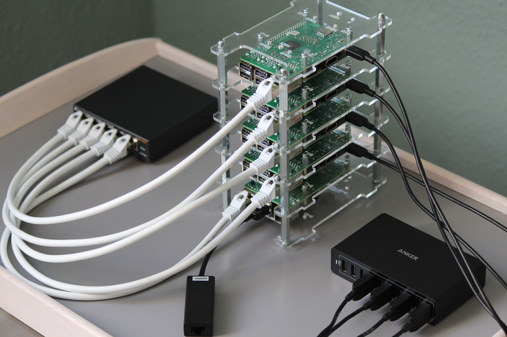
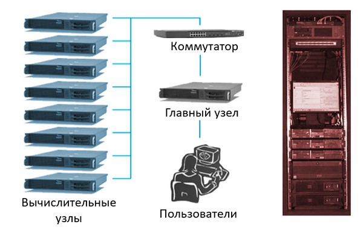
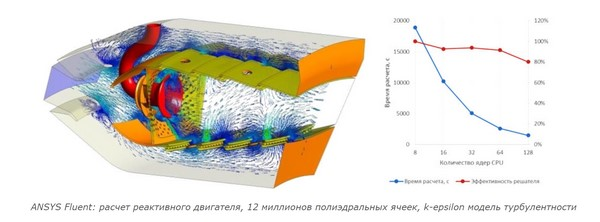
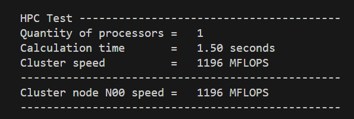
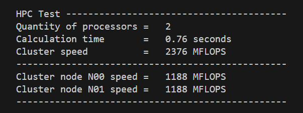
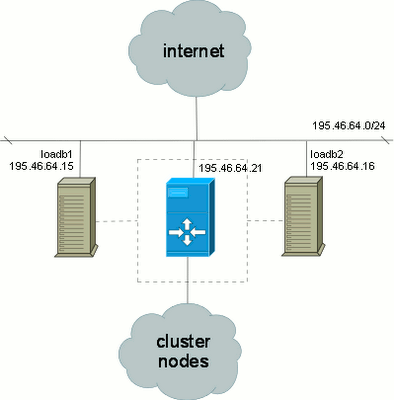
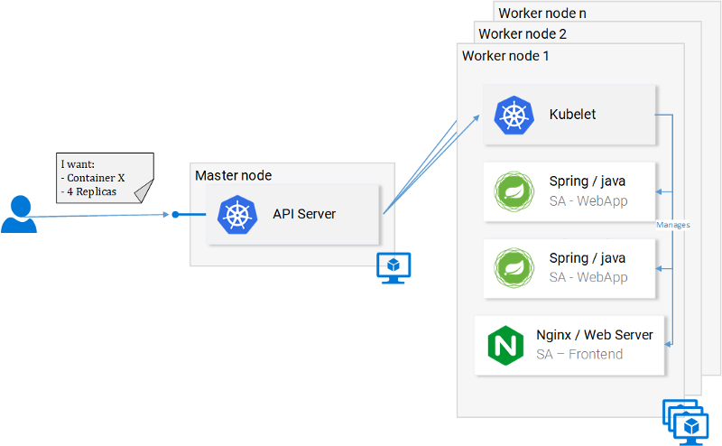
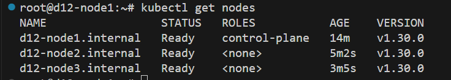

# Работа с кластерами


Кластер — группа компьютеров, серверов или процессоров, объединённых высокоскоростными каналами связи, представляющая с точки зрения пользователя единый аппаратный ресурс. Кластер — слабо связанная совокупность нескольких вычислительных систем, работающих совместно для выполнения общих приложений, и представляющихся пользователю единой системой. Один из первых архитекторов кластерной технологии Грегори Пфистер дал кластеру следующее определение: «Кластер — это разновидность параллельной или распределённой системы, которая:

- состоит из нескольких связанных между собой компьютеров;

- используется как единый, унифицированный компьютерный ресурс».




Обычно различают следующие основные виды кластеров:

- отказоустойчивые кластеры (High-availability clusters, HA, кластеры высокой доступности)

- кластеры с балансировкой нагрузки (Load balancing clusters)

- вычислительные кластеры (High performance computing clusters, HPC)

## Вычислительные кластеры
Такие кластеры используются в вычислительных целях, в частности в научных исследованиях. Для вычислительных кластеров существенными показателями являются высокая производительность процессора в операциях над числами с плавающей точкой (flops) и низкая латентность объединяющей сети, и менее существенными — скорость операций ввода-вывода, которая в большей степени важна для баз данных и web-сервисов. Вычислительные кластеры позволяют уменьшить время расчетов, по сравнению с одиночным компьютером, разбивая задание на параллельно выполняющиеся ветки, которые обмениваются данными по связывающей сети. Одна из типичных конфигураций — набор компьютеров, собранных из общедоступных компонентов, с установленной на них операционной системой Linux, и связанных сетью Ethernet, Myrinet, InfiniBand или другими относительно недорогими сетями.



Кластер OpenMPI (Open Message Passing Interface) используется для параллельных вычислений и распределенной обработки данных. OpenMPI предоставляет программистам среду для разработки параллельных приложений, которые могут выполняться на кластере компьютеров.

Некоторые примеры использования кластера OpenMPI включают:
1. Вычислительные задачи, которые могут быть разделены на части и выполняться параллельно на разных узлах кластера.
2. Моделирование и симуляция сложных систем, таких как погодные модели, физические или биологические процессы.
3. Обработка больших объемов данных, например, в области машинного обучения и анализа данных.



### Практика - создание вычислительного кластера OpenMPI

Задача:
Создать вычислительный кластер

Исходные данные:
d12-0 - консоль управления
d12c-0 - узел скластера
d12d-0 - узел скластера

***

Ход выполнения:

На всех узлах:

1. Обновите индексы пакетов: Запустите следующую команду для обновления индексов пакетов вашего менеджера пакетов:

`sudo apt update`

2. Установите пакет OpenMPI: Выполните следующую команду для установки пакета OpenMPI:

`sudo apt install openmpi-bin`

3. Установите дополнительные пакеты (по желанию): Если вам нужны дополнительные инструменты или библиотеки OpenMPI, вы можете установить их с помощью следующих команд:

- Установка пакета для разработки OpenMPI:

`sudo apt install libopenmpi-dev openmpi-doc openmpi-common make unzip`


4. Проверьте установку: После завершения установки вы можете проверить, что OpenMPI был успешно установлен, запустив команду:

`mpirun --version`

Это покажет версию OpenMPI, которая установлена на вашем компьютере.

5. Осуществим компиляцию программы flops.f с использованием openMPI на всех узлах

`mkdir /opt/cluster ;wget -P /tmp https://github.com/BelokrysFedotov/mpi_programs/archive/refs/heads/master.zip; unzip /tmp/master.zip -d /opt/cluster/`


приступаем к компиляции программы

`cd /opt/cluster/mpi_programs-master/Pi/; make`

6. Создаем беспарольный доступ к клиентам

разрешим для node ssh root

`ssh lup@192.168.101.10`

`sudo sed -i 's/#PermitRootLogin prohibit-password/PermitRootLogin yes/' /etc/ssh/sshd_config ;sudo systemctl restart sshd`

`ssh lup@192.168.101.10`

`sudo sed -i 's/#PermitRootLogin prohibit-password/PermitRootLogin yes/' /etc/ssh/sshd_config ;sudo systemctl restart sshd`

Заходим на консоль кластера и генерируем rsa-ключ командой

`cd; ssh-keygen -t rsa`

Копируем публичный ключ консоли (root/.ssh/id_rsa.pub) на все узлы кластера, в моем случае

`scp /root/.ssh/id_rsa.pub 192.168.101.10:/root/.ssh`

`scp /root/.ssh/id_rsa.pub 192.168.101.11:/root/.ssh`

На каждом узле кластера создаем файл доступа

`cat /root/.ssh/id_rsa.pub >> /root/.ssh/authorized_keys`

проверка беспарольного входа с консоли на узел

`ssh -i /.ssh/id_rsa root@192.168.101.10`

`ssh -i /.ssh/id_rsa root@192.168.101.11`

3. Формирование на консоли файла со списком узлов всех наших кластеров

Назовем его openmpi.host и положим его в папку с нашей тестовой программой расчета числа Pi

```bash
sudo tee /opt/cluster/mpi_programs-master/Pi/openmpi.host <<EOF
# список кластеров
# 192.168.101.5
192.168.101.10
192.168.101.11
EOF
```

Запускаем программу на 1 сервере, для этого на узле управления запускаем команду для проверки

`/opt/cluster/mpi_programs-master/Pi/flops`

Задействуем 1 узел кластера для вычислений

`mpirun --allow-run-as-root -hostfile /opt/cluster/mpi_programs-master/Pi/openmpi.host -np 1 /opt/cluster/mpi_programs-master/Pi/flops`



Задействуем 2 узла кластера для вычислений

`mpirun --allow-run-as-root -hostfile /opt/cluster/mpi_programs-master/Pi/openmpi.host -np 1 /opt/cluster/mpi_programs-master/Pi/flops`



Как мы видим производительность выросла и время вычислений сократилось существенно


## Кластеры распределения нагрузки
 (Network Load Balancing, NLB) Принцип их действия строится на распределении запросов через один или несколько входных узлов, которые перенаправляют их на обработку в остальные, вычислительные узлы. Первоначальная цель такого кластера — производительность, однако, в них часто используются также и методы, повышающие надёжность. Подобные конструкции называются серверными фермами. 



Пример такого балансировщика мы рассмотрим на примере кластера Kubernetes далее


## Кластеры высокой доступности
Обозначаются аббревиатурой HA (англ. High Availability — высокая доступность). Создаются для обеспечения высокой доступности сервиса, предоставляемого кластером. Избыточное число узлов, входящих в кластер, гарантирует предоставление сервиса в случае отказа одного или нескольких серверов. Типичное число узлов — два, это минимальное количество, приводящее к повышению доступности.

Kubernetes (от греч. κυβερνήτης - "губернатор" или "ведущий") - это популярная и мощная платформа для управления контейнеризированными приложениями. Он является открытым программным обеспечением, разработанным командой Google, и предоставляет средства для автоматизации развертывания, масштабирования и управления приложениями в контейнерах.

Некоторые ключевые особенности Kubernetes:

1. Оркестрация контейнеров: Kubernetes позволяет легко развертывать и управлять контейнеризированными приложениями на кластерах серверов.
   
2. Масштабирование: Kubernetes предоставляет возможности для автоматического масштабирования приложений в зависимости от нагрузки.

3. Самовосстановление: Kubernetes способен обнаруживать сбои в приложениях и автоматически восстанавливать их в работоспособное состояние.

4. Сетевое взаимодействие: Kubernetes управляет сетью контейнеров и обеспечивает взаимодействие между ними.

5. Декларативная конфигурация: Kubernetes позволяет описывать состояние желаемых приложений в виде конфигурационных файлов.





### Практика - создание высокодоступного кластера Kubernetes с балансирощиком для распределения нагрузки

Задача:
Создать высокодоступный кластер Kubernetes

Исходные данные:
d12-0 -  d12-node1.internal     Управляющий узел 
d12c-0 - d12-node2.internal     Рабочий узел 
d12d-0 - d12-node3.internal     Рабочий узел 

***

Ход выполнения:

Для начала удалим все лишнее со станции с графическим интерфейсом чтобы освободить порядка 2 гб 

`apt remove --purge gnome*`

`apt autoclean`

`apt autoremove`

`reboot`

#### Наcтройка d12-node1.internal

```bash
#<------ обновление и установка утилит
sudo apt update -y
#sudo apt upgrade -y
sudo apt install dnsutils -y

#<------ отключаем автообновление файла hosts (для облака)
# sudo sed -i '/update_etc_hosts/s/^/#/' /etc/cloud/cloud.cfg

#<------ меняем имя хоста
sudo hostnamectl set-hostname d12-node1.internal
#---меняем адреса в hosts
sudo cat > /etc/hosts <<EOF
#-ch- from ch-script 
127.0.0.1       localhost
127.0.1.1       d12-node1.internal d12-node1

# The following lines are desirable for IPv6 capable hosts
::1     localhost ip6-localhost ip6-loopback
ff02::1 ip6-allnodes
ff02::2 ip6-allrouters

# Cluster nodes

#--!!!!!!!!<------меняем ip node2 и node3
192.168.101.5 d12-node1.internal
192.168.101.10 d12-node2.internal
192.168.101.11 d12-node3.internal
EOF

sudo systemctl restart systemd-hostnamed

#<------ Обновим имя машины
sudo hostname d12-node1.internal


```

***


#### Наcтройка d12-node2.internal

```bash
#<------ обновление и установка утилит
sudo apt update -y
#sudo apt upgrade -y
sudo apt install dnsutils -y

#<------ отключаем автообновление файла hosts (для облака)
# sudo sed -i '/update_etc_hosts/s/^/#/' /etc/cloud/cloud.cfg

#<------ меняем имя хоста
sudo hostnamectl set-hostname d12-node2.internal
#---меняем адреса в hosts
sudo cat > /etc/hosts <<EOF
#-ch- from ch-script 
127.0.0.1       localhost
127.0.1.1       d12-node2.internal d12-node2

# The following lines are desirable for IPv6 capable hosts
::1     localhost ip6-localhost ip6-loopback
ff02::1 ip6-allnodes
ff02::2 ip6-allrouters

# Cluster nodes

#--!!!!!!!!<------меняем ip node2 и node3
192.168.101.5 d12-node1.internal
192.168.101.10 d12-node2.internal
192.168.101.11 d12-node3.internal
EOF

sudo systemctl restart systemd-hostnamed

#<------ Обновим имя машины
sudo service hostname restart


```

#### Наcтройка d12-node3.internal

```bash
#<------ обновление и установка утилит
sudo apt update -y
#sudo apt upgrade -y
sudo apt install dnsutils -y

#<------ отключаем автообновление файла hosts (для облака)
# sudo sed -i '/update_etc_hosts/s/^/#/' /etc/cloud/cloud.cfg

#<------ меняем имя хоста
sudo hostnamectl set-hostname d12-node3.internal
#---меняем адреса в hosts
sudo cat > /etc/hosts <<EOF
#-ch- from ch-script 
127.0.0.1       localhost
127.0.1.1       d12-node3.internal d12-node3

# The following lines are desirable for IPv6 capable hosts
::1     localhost ip6-localhost ip6-loopback
ff02::1 ip6-allnodes
ff02::2 ip6-allrouters

# Cluster nodes

#--!!!!!!!!<------меняем ip node2 и node3
192.168.101.5 d12-node1.internal
192.168.101.10 d12-node2.internal
192.168.101.11 d12-node3.internal
EOF

sudo systemctl restart systemd-hostnamed

#<------ Обновим имя машины
sudo service hostname restart


```

#### Настройка на всех узлах 

```bash
##################################################################################
#<---------------Настройка на всех нодах
##################################################################################
sudo apt install -y curl wget gnupg sudo iptables tmux keepalived haproxy

#<------ Настройка автозагрузки и запуск модуля ядра br_netfilter и overlay
sudo cat <<EOF | tee /etc/modules-load.d/k8s.conf
overlay
br_netfilter
EOF

sudo modprobe overlay
sudo modprobe br_netfilter

#<------- Разрешение маршрутизации IP-трафика
sudo echo -e "net.bridge.bridge-nf-call-ip6tables = 1\nnet.bridge.bridge-nf-call-iptables = 1\nnet.ipv4.ip_forward = 1" > /etc/sysctl.d/10-k8s.conf

sudo sysctl -f /etc/sysctl.d/10-k8s.conf

#<------- Отключение файла подкачки
sudo swapoff -a
sudo sed -i '/ swap / s/^/#/' /etc/fstab

#<------- Проверка
#Для проверки автоматической загрузки модулей br_netfilter и overlay
sudo lsmod | grep br_netfilter
sudo lsmod | grep overlay
## Ожидаемый результат:
# br_netfilter           32768  0
# bridge                258048  1 br_netfilter
# overlay               147456  0

#<------- Для проверки успешности изменения настроек в параметрах сетевого стека
sudo sysctl net.bridge.bridge-nf-call-iptables net.bridge.bridge-nf-call-ip6tables net.ipv4.ip_forward
# Ожидаемый результат:
# net.bridge.bridge-nf-call-iptables = 1
# net.bridge.bridge-nf-call-ip6tables = 1
# net.ipv4.ip_forward = 1

#<------- Для проверки отключения файла подкачки выполним команду:
sudo swapon -s
## Ожидаемый вывод команды – пустой. Она ничего не должна отобразить


##################################################################################
#<---------------Установка kubeadm и kubectl - установка Docker
##################################################################################
#<------- Настройка deb-репозитория Kubernetes
# загрузка ключа репозитория
# sudo curl -fsSLo /etc/apt/trusted.gpg.d/kubernetes-archive-keyring.gpg https://packages.cloud.google.com/apt/doc/apt-key.gpg

#<------- добавление репозитория

sudo apt-get update && sudo apt-get install -y apt-transport-https ca-certificates curl gpg
curl -fsSL https://pkgs.k8s.io/core:/stable:/v1.30/deb/Release.key | sudo gpg --dearmor -o /etc/apt/keyrings/kubernetes-apt-keyring.gpg
echo 'deb [signed-by=/etc/apt/keyrings/kubernetes-apt-keyring.gpg] https://pkgs.k8s.io/core:/stable:/v1.30/deb/ /' | sudo tee /etc/apt/sources.list.d/kubernetes.list
sudo apt-get update


#<------- Установка пакетов kubeadm и kubectl
# sudo apt install -y kubeadm kubectl
sudo apt-get install -y kubelet kubeadm kubectl

#<------- Установка Docker 
sudo curl -fsSL https://download.docker.com/linux/debian/gpg | gpg --dearmor -o /etc/apt/trusted.gpg.d/docker.gpg
sudo echo "deb [arch=$(dpkg --print-architecture) signed-by=/etc/apt/trusted.gpg.d/docker.gpg] https://download.docker.com/linux/debian $(lsb_release -cs) stable" | tee /etc/apt/sources.list.d/docker.list > /dev/null
sudo apt update
sudo apt install -y docker-ce docker-ce-cli containerd.io docker-compose-plugin

#<------- Установка Docker cri-dockerd
sudo wget https://github.com/Mirantis/cri-dockerd/releases/download/v0.3.1/cri-dockerd-0.3.1.amd64.tgz
sudo tar xvf cri-dockerd-0.3.1.amd64.tgz
sudo mv cri-dockerd/cri-dockerd /usr/local/bin/

sudo wget https://raw.githubusercontent.com/Mirantis/cri-dockerd/master/packaging/systemd/cri-docker.service
sudo wget https://raw.githubusercontent.com/Mirantis/cri-dockerd/master/packaging/systemd/cri-docker.socket

sudo mv cri-docker.socket cri-docker.service /etc/systemd/system/
sudo sed -i -e 's,/usr/bin/cri-dockerd,/usr/local/bin/cri-dockerd,' /etc/systemd/system/cri-docker.service

sudo systemctl daemon-reload
sudo systemctl enable cri-docker.service
sudo systemctl enable --now cri-docker.socket

#Проверка доступности сокета cri-dockerd
sudo crictl --runtime-endpoint unix:///var/run/cri-dockerd.sock version

## Ожидаемый результат:
# Version:  0.1.0
# RuntimeName:  docker
# RuntimeVersion:  23.0.1
# RuntimeApiVersion:  v1

#https://habr.com/ru/articles/725640/

##################################################################################
#<---------------Установка и настройка отказоустойчивого кластера Kubernetes
##################################################################################

#<------- Настройка демона keepalived (указать правильный интерфейс -  interface <имя интерфейса>)

# для d12-node1
sudo cat > /etc/keepalived/keepalived.conf <<EOF
#-ch- from ch-script 
global_defs {
    enable_script_security
    script_user nobody
}

vrrp_script check_apiserver {
  script "/etc/keepalived/check_apiserver.sh"
  interval 3
}

vrrp_instance VI_1 {
    state BACKUP
    interface ens4
    virtual_router_id 5
    priority 100
    advert_int 1
    nopreempt
    authentication {
        auth_type PASS
        auth_pass ZqSj#f1G
    }
    virtual_ipaddress {
        192.168.101.5
    }
    track_script {
        check_apiserver
    }
}
EOF

# для d12-node2 d12-node3
sudo cat > /etc/keepalived/keepalived.conf <<EOF
#-ch- from ch-script 
global_defs {
    enable_script_security
    script_user nobody
}

vrrp_script check_apiserver {
  script "/etc/keepalived/check_apiserver.sh"
  interval 3
}

vrrp_instance VI_1 {
    state BACKUP
    interface ens3
    virtual_router_id 5
    priority 100
    advert_int 1
    nopreempt
    authentication {
        auth_type PASS
        auth_pass ZqSj#f1G
    }
    virtual_ipaddress {
        192.168.101.5
    }
    track_script {
        check_apiserver
    }
}
EOF


#<------- Скрипт /etc/keepalived/check_apiserver.sh, предназначенный для проверки доступности серверов
sudo cat > /etc/keepalived/check_apiserver.sh <<EOF
#!/bin/sh
#-ch- from ch-script 
# File: /etc/keepalived/check_apiserver.sh
#-
APISERVER_VIP=192.168.101.5
APISERVER_DEST_PORT=8888
PROTO=http
#-
errorExit() {
    echo "*** $*" 1>&2
    exit 1
}
#-
curl --silent --max-time 2 --insecure ${PROTO}://localhost:${APISERVER_DEST_PORT}/ -o /dev/null || errorExit "Error GET ${PROTO}://localhost:${APISERVER_DEST_PORT}/"
if ip addr | grep -q ${APISERVER_VIP}; then
    curl --silent --max-time 2 --insecure ${PROTO}://${APISERVER_VIP}:${APISERVER_DEST_PORT}/ -o /dev/null || errorExit "Error GET ${PROTO}://${APISERVER_VIP}:${APISERVER_DEST_PORT}/"
fi
EOF

#<------- Установим атрибут, разрешающий исполнение скрипта, и запустим демона keepalived
sudo chmod +x /etc/keepalived/check_apiserver.sh
sudo systemctl enable keepalived
sudo systemctl start keepalived
#sudo systemctl status keepalived


#<------- Настройка демона haproxy
sudo cat > /etc/haproxy/haproxy.cfg <<EOF
#-ch- from ch-script 
# File: /etc/haproxy/haproxy.cfg
#---------------------------------------------------------------------
# Global settings
#---------------------------------------------------------------------
global
    log /dev/log local0
    log /dev/log local1 notice
    daemon

#---------------------------------------------------------------------
# common defaults that all the 'listen' and 'backend' sections will
# use if not designated in their block
#---------------------------------------------------------------------
defaults
    mode                    http
    log                     global
    option                  httplog
    option                  dontlognull
    option http-server-close
    option forwardfor       except 127.0.0.0/8
    option                  redispatch
    retries                 1
    timeout http-request    10s
    timeout queue           20s
    timeout connect         5s
    timeout client          20s
    timeout server          20s
    timeout http-keep-alive 10s
    timeout check           10s

#---------------------------------------------------------------------
# apiserver frontend which proxys to the control plane nodes
#---------------------------------------------------------------------
frontend apiserver
    bind *:8888
    mode tcp
    option tcplog
    default_backend apiserver

#---------------------------------------------------------------------
# round robin balancing for apiserver
#---------------------------------------------------------------------
backend apiserver
    option httpchk GET /healthz
    http-check expect status 200
    mode tcp
    option ssl-hello-chk
    balance     roundrobin

#--!!!!!!!!<------меняем ip node2 и node3
        server d12-node1 192.168.101.5:6443 check
        server d12-node2 192.168.101.10:6443 check
        server d12-node3 192.168.101.11:6443 check 
EOF

sudo systemctl enable haproxy
sudo systemctl restart haproxy
# проверить соединения
# sudo systemctl status haproxy

# echo "---------------------------------"
# echo "!!!<----------Итоговая диагностика"
# echo "!!!<----------Проверка доступности сокета cri-dockerd"
sudo crictl --runtime-endpoint unix:///var/run/cri-dockerd.sock version
## Ожидаемый результат:
# Version:  0.1.0
# RuntimeName:  docker
# RuntimeVersion:  23.0.1
# RuntimeApiVersion:  v1

# echo "Проверка автоматической загрузки модулей br_netfilter и overlay"
sudo lsmod | grep br_netfilter
sudo lsmod | grep overlay
## Ожидаемый результат:
# br_netfilter           32768  0
# bridge                258048  1 br_netfilter
# overlay               147456  0

# echo "Проверка успешности изменения настроек в параметрах сетевого стека"
sudo sysctl net.bridge.bridge-nf-call-iptables net.bridge.bridge-nf-call-ip6tables net.ipv4.ip_forward
# Ожидаемый результат:
# net.bridge.bridge-nf-call-iptables = 1
# net.bridge.bridge-nf-call-ip6tables = 1
# net.ipv4.ip_forward = 1

sudo systemctl status keepalived
sudo systemctl status haproxy
```

перезагрузим все узлы

`reboot`

#### Проверка и доступность кластера 

1. Проверка установленного докера

`docker run hello-world`

1. Запускаем на node1
```bash
kubeadm init \
               --cri-socket unix:///var/run/cri-dockerd.sock \
               --pod-network-cidr=10.244.0.0/16 \
               --control-plane-endpoint "192.168.101.5:8888" \
               --upload-certs
               
```

Если выдана ошибка [ERROR NumCPU]: the number of available CPUs 1 is less than the required 2
- значит нужно поднять число ядер до 2 

мы получим токен администратора

```python
kubeadm join 192.168.101.5:8888 --token a3hv0l.njby2zs65t59i7hm \
    --discovery-token-ca-cert-hash sha256:7d80da1635c1daba9a2a5311bb88d08248cdfdbf68c43e8e728b2e7b0fcfdce4 \
    --control-plane --certificate-key 4012cb8681b277ee1980fa040ece7e8daf059407e28d84b741b7601dacd782ad
```

а также токен рабочей ноды

```python
kubeadm join 192.168.101.5:8888 --token a3hv0l.njby2zs65t59i7hm \
        --discovery-token-ca-cert-hash sha256:7d80da1635c1daba9a2a5311bb88d08248cdfdbf68c43e8e728b2e7b0fcfdce4 
```


2. Запускаем на рабочих нодах (добавив --cri-socket unix:///var/run/cri-dockerd.sock)
```bash
kubeadm join 192.168.101.5:8888 --token 3sqyry.jdw9tlce17v6w73v \
        --discovery-token-ca-cert-hash sha256:21b6368486d0ad36545d15f0b89b018f1a975e3de0b06dca4b50a6758c761356 \
        --cri-socket unix:///var/run/cri-dockerd.sock
```

3. если потреяли токен
   
`kubeadm token create --print-join-command`


1. Устанавливаем переменные окружения kubeсtl

```bash
echo "export KUBECONFIG=/etc/kubernetes/admin.conf" > /etc/environment
export KUBECONFIG=/etc/kubernetes/admin.conf
echo "export KUBECONFIG=/etc/kubernetes/admin.conf" >> ~/.bashrc
source ~/.bashrc
```

1. Установка сетевого плагина
`kubectl apply -f https://raw.githubusercontent.com/coreos/flannel/master/Documentation/kube-flannel.yml`

1. Тест работы на административном ноде d12-node1:
---кластера Kubernetes
`kubectl get nodes`

ждем пару минут и если получаем



то я вас проздравляю! Вы развернули K8s кластер!


### Основные команды

---проверить состояние "подов"
`kubectl get pods -A`

---логи подов (после запуска подов) например
`kubectl logs nginx-app-5777b5f95-8z2fc`

---тестовые запуски "пода" busybox и вход в него (для выхода exit)
`kubectl run -i --tty busybox --image=busybox -- sh`

---переподключение к "поду" при выходе из интерактивного режима
`kubectl attach busybox -i`

---запуск nginx
```bash
kubectl create deployment nginx-app --image=nginx
kubectl expose deployment nginx-app --type=NodePort --port=80 --external-ip=10.10.10.10
sleep 15s
curl http://10.10.10.10
```
---подключение к поду (узнать имя через kubectl get pods -A)
`kubectl attach nginx-app-5777b5f95-wvnb4 -i`

7.Тесты сети и портов
---определить узел, на котором сейчас активен виртуальный IP-адрес:
`ip a`
---Для проверки открытия сетевых сокетов 
`ss -lt`
---проверка доступности API по виртуальному IP-адресу:
`curl --silent --max-time 2 --insecure https://192.168.101.5:8888/`


#### Запуск дашборда

Helm - это пакетный менеджер для Kubernetes, который облегчает управление приложениями и ресурсами в кластере Kubernetes. Он позволяет упаковывать приложения Kubernetes в удобные для установки и обновления пакеты, называемые "charts". 

Чарты Helm содержат описание приложения, его настройки, зависимости и другую полезную информацию, которая позволяет Helm автоматически установить и настроить приложения в вашем кластере Kubernetes.

Используя Helm, вы можете легко управлять развертыванием, обновлением и удалением приложений Kubernetes, а также обеспечить консистентность и повторяемость процессов управления приложениями.

Helm также интегрируется с репозиториями, где вы можете найти готовые чарты для различных приложений и сервисов Kubernetes, включая Kubernetes Dashboard, Prometheus, MySQL и многие другие.

Установите Helm на вашем сервере. Вам нужно загрузить и установить Helm с помощью следующих команд:

`curl https://raw.githubusercontent.com/helm/helm/master/scripts/get-helm-3 | bash`

добавить репозиторий Kubernetes Dashboard 

`helm repo add kubernetes-dashboard https://kubernetes.github.io/dashboard/`

просмотреть доступные версии пакетов, включенных в репозиторий Kubernetes Dashboard

`helm search repo kubernetes-dashboard`

Создайте пространство имён kubernetes-dashboard, в котором будет установлен Kubernetes Dashboard:
   
`kubectl create namespace kubernetes-dashboard`

Установите Kubernetes Dashboard из Helm-чарта с помощью следующей команды:
   
`helm install kubernetes-dashboard kubernetes-dashboard/kubernetes-dashboard --namespace kubernetes-dashboard`

сделайте форвадинг из инструкции

`kubectl -n kubernetes-dashboard port-forward svc/kubernetes-dashboard-kong-proxy 8443:443`

Проверьте успешность установки Kubernetes Dashboard, выполните команды:
   
`kubectl get pods -n kubernetes-dashboard`

нужно аодождать несколько минут для запуска дашборда

узнаем имя сервисного аккаунта

`kubectl get sa -n kubernetes-dashboard`

получить токен

`kubectl -n kubernetes-dashboard create token default`

дадим необходимые роли системному пользователю для работы с дашбордом

```bash
sudo cat > dashboard-adminuser.yaml <<EOF
#-ch- from ch-script 
apiVersion: rbac.authorization.k8s.io/v1
kind: ClusterRoleBinding
metadata:
  name: default
roleRef:
  apiGroup: rbac.authorization.k8s.io
  kind: ClusterRole
  name: cluster-admin
subjects:
- kind: ServiceAccount
  name: default
  namespace: kubernetes-dashboard
EOF
```

`kubectl apply -f dashboard-adminuser.yaml`


## Домашнее задание
### main
1. Настроить и запустить высокопроизводительный кластер (код и скриншот вывода вычислений)

***
### hard

1. Настроить и запустить кластер Kubernetus, а также его дашборд (вывод и скриншот дашборда)

***
Для отчета:
- создать в личном репозитории организации github ветку lesson_4_4
- создать директорию lesson_4_4 и разместить там файл файлы домашнего задания
- сделать push и pull request на сайте, в качестве рецензента добавить пользователя AndreyChuyan


Требования к дипломному проекту:

### 1. Презентация на 4-5 слайдах в которых должно быть:
- описание задачи, стоящей перед вашей организацией
- схема связи
- основные решения и их целесообразность (в том числе экономическая)

### 2. Рабочая схема на стенде, работу которой вы продемонстрируете в ходе защиты дипломного проекта

### 3. Решения должны зависеть от ваших текущих потребностей (то что вы бы хотели реализовать на текущем месте работы) и должны удовлетворять следующим требованиям:

- возможность масштабируемости и расширяемости
- иметь централизованное управление
- интеграцию с Windows AD в объеме, необходимом для решения поставленных перед вами задач
- иметь систему мониторинга 
- иметь требуемый уровень безопасности информации