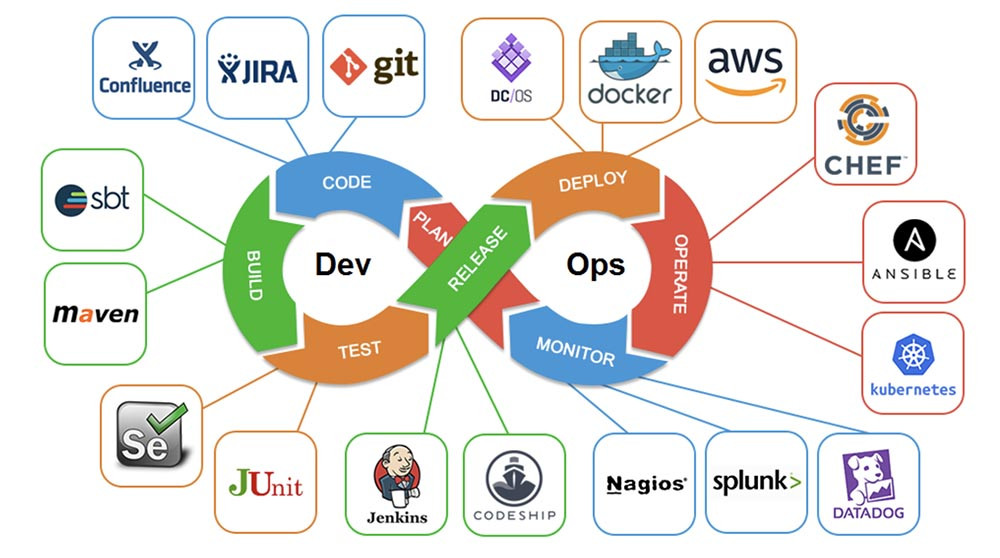
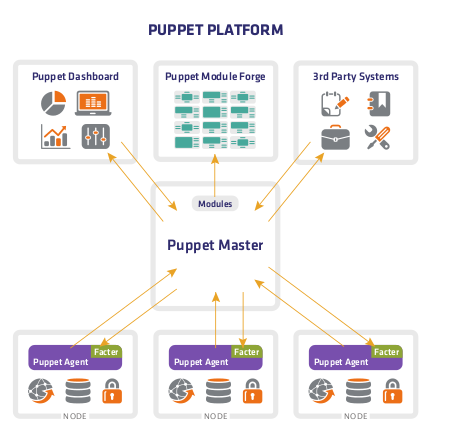
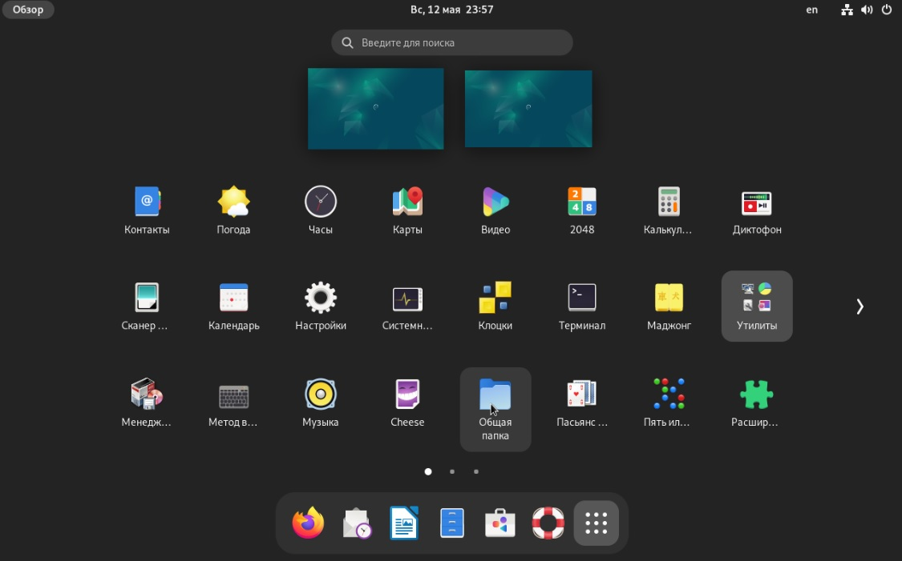
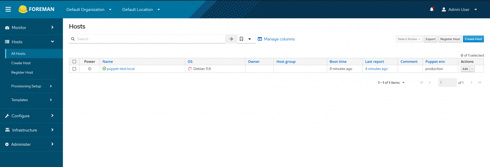

# Централизованное управление инфраструктурой (DevOps практики)


DevOps (Development and Operations) - это практика и культура совмещения процессов разработки программного обеспечения и операционной деятельности с целью улучшения качества и скорости поставки продукта на рынок. Ключевая концепция DevOps включает в себя совмещение и автоматизацию процессов разработки, тестирования, развертывания и управления инфраструктурой.

Основные принципы и цели DevOps включают:

1. Совместная работа команд: DevOps поощряет сотрудничество и обмен знаниями между разработчиками и операционными специалистами для улучшения коммуникации и повышения производительности.
   
2. Автоматизация процессов: DevOps ставит задачу автоматизации всех шагов разработки и операционной деятельности для сокращения времени на поставку продукта на рынок и снижения вероятности ошибок.
   
3. Непрерывная поставка и интеграция: DevOps поддерживает практику непрерывной поставки (Continuous Delivery) и интеграции (Continuous Integration), обеспечивая более частое и надежное обновление программного обеспечения.
   
4. Мониторинг и обратная связь: DevOps уделяет внимание мониторингу производительности и обратной связи от пользователей, чтобы быстро реагировать на изменения и улучшать качество продукта.

DevOps также включает использование инструментов и технологий, таких как системы управления конфигурацией (например, Ansible, Puppet), контейнеризация (например, Docker, Kubernetes), инструменты автоматизации сборки и развертывания (например, Jenkins, GitLab CI/CD), а также облачные решения.




### Ansible 


Ansible - это инструмент для управления конфигурациями, автоматизации задач и оркестрации приложений. Вот ключевые особенности программы Ansible:

1. Простота использования: Ansible разработан с упором на простоту использования и понимания. Он использует YAML для описания конфигураций и не требует высоких навыков программирования.

2. Декларативный подход: Аналогично Puppet, Ansible работает по декларативному подходу, что означает, что пользователь описывает желаемое состояние системы, а Ansible занимается выполнением необходимых действий для достижения этого состояния.

3. SSH протокол: Ansible использует SSH для управления удаленными системами. Это значит, что не требуется установка агентов на управляемые узлы – достаточно наличия SSH-соединения.

4. Инфраструктура как код: Ansible позволяет управлять инфраструктурой как кодом, что облегчает процесс развертывания и управления приложениями.

5. Модульность и плагины: Ansible обладает большим набором модулей и плагинов, которые позволяют расширить его функциональность и поддержать различные технологии и системы.

6. Оркестрация приложений: Ansible позволяет оркестрировать сложные приложения и сервисы, обеспечивая согласованность и эффективность процесса развертывания.
   

### Puppet



Puppet - это инструмент для автоматизации управления конфигурациями и развертывания программного обеспечения в компьютерных системах. Вот ключевые особенности программы Puppet:

1. Декларативный подход: Puppet использует декларативный подход к управлению конфигурациями, что означает, что пользователь описывает желаемое состояние системы, а не шаги, необходимые для достижения этого состояния. Puppet занимается выполнением необходимых действий для достижения описанного состояния.

2. Язык описания конфигурации: Puppet использует свой собственный язык описания конфигурации, называемый Puppet DSL (Domain-Specific Language), который позволяет описывать и управлять конфигурациями системы.

3. Модули и манифесты: В Puppet конфигурации задаются с использованием модулей и манифестов. Модули содержат набор файлов и каталогов, определяющих различные аспекты конфигурации, а манифесты содержат инструкции для Puppet о том, как применить конфигурацию.

4. Агент-серверная модель: Puppet работает в агент-серверной модели, где агенты (называемые Puppet agents) устанавливаются на управляемых узлах и регулярно обращаются к серверу Puppet (Puppet master) для получения инструкций о конфигурациях.

5. Кроссплатформенность: Puppet поддерживает различные операционные системы, включая различные дистрибутивы Linux, Windows, macOS и другие.

6. Масштабируемость и управление сложными средами: Puppet позволяет управлять конфигурациями сотен и тысяч узлов одновременно, что делает его идеальным решением для масштабируемых и сложных сред.

7. Отчеты и мониторинг: Puppet предоставляет возможности для мониторинга и отчетности о состоянии систем и изменениях конфигураций.

### Преимущества и недостатки

- Ansible обладает простым и интуитивным синтаксисом YML, что делает его легче для начала работы. Он также не требует установки агентов на хостах. Однако, Ansible может быть медленнее в сравнении с Puppet при обработке большого числа хостов.
  
- Puppet предоставляет более гранулированное управление и более продвинутые возможности, такие как проверка состояния. Однако, настройка Puppet может потребовать больше времени и усилий.

Использование Ansible и Puppet для централизованного управления Linux инфраструктурой позволит вам эффективно автоматизировать развертывание и управление серверами, повысив производительность и надежность вашей инфраструктуры.

## Работа с инструментом Ansible для настройки конфигурации серверной инфраструктуры.

Установка Ansible:

`sudo apt install ansible`

Проверка установки:

`ansible --version`

Нам необходимо создать структуру калогов
Пример структуры каталога проекта Ansible может выглядеть следующим образом:

```bash
ansible/
├── inventory/
│   └── hosts
├── roles/
│   ├── install_package/
├── playbooks/
│   ├── site.yml
├── vars/
│   ├── vars.yml
├── ansible.cfg
```

1. inventory/: В этой директории находится инвентарный файл hosts, который содержит информацию о хостах, на которых будет выполняться конфигурация с помощью Ansible. В файле hosts указываются адреса хостов, их параметры подключения, возможные группы и другие настройки. Инвентарный файл необходим для того, чтобы Ansible знал, на какие хосты применять конфигурацию.

2. roles/: В этой директории находятся роли Ansible, которые являются переиспользуемыми наборами задач и переменных. В данном случае есть роль install_package, которая, возможно, содержит задачи для установки пакетов на хосты. Каждая роль организуется в своей поддиректории и может содержать файлы с задачами, переменными, хендлерами и другими элементами конфигурации.

3. playbooks/: Здесь находится файл плейбука site.yml, который определяет набор задач и их порядок выполнения. Плейбуки – это файлы YAML, описывающие конфигурацию, которую необходимо применить к группе хостов. Плейбук может включать в себя вызов ролей, определение переменных, подключение инвентарного файла и другие действия.

4. vars/: В этой директории содержится файл vars.yml, в котором определяются переменные, используемые в плейбуках или ролях. Использование переменных позволяет сделать конфигурацию более гибкой и настраиваемой, а также упрощает поддержку и переиспользование кода.

5. ansible.cfg: Этот файл содержит конфигурацию Ansible для данного проекта. В нем могут быть определены параметры, такие как пути к инвентарному файлу, настройки соединения, дополнительные модули и другие настройки, которые будут применяться для выполнения конфигурации с помощью Ansible.


### Практика - установка набора утилит на группе удаленных машин

Задача:
- установить необходимые утилиты

Исходные данные:
d12-0 - консоль управления
d12c-0 - рабочая станция
d12d-0 - рабочая станция

***

Ход выполнения:


Создадим структуру каталогов

`mkdir -p ~/ansible/{inventory,roles,playbooks,vars}`

Создадим файл конфигурации

`nano ~/ansible/ansible.cfg`

```bash
[defaults]
inventory = inventory/hosts
roles_path = roles/
vars_files = vars/vars.yml

remote_user = lup
private_key_file = ~/.ssh/id_rsa
become_method = sudo
become_user = root
```

***

Инвентарный файл Ansible - это файл, в котором определяются все хосты, на которых Ansible будет выполнять свои операции.

`nano ~/ansible/inventory/hosts`

```bash
[buxgalters]
d12c-0 ansible_host=192.168.101.10 ansible_user=root ansible_password=1234Qwer
d12d-0 ansible_host=192.168.101.11 ansible_user=root ansible_password=1234Qwer
[localhost]
127.0.0.1 ansible_connection=local
```

установим утилиту для работы с паролями shh

`sudo apt install sshpass`

Ansible Vault - это инструмент для шифрования конфиденциальной информации, такой как пароли. Вы можете зашифровать пароли с помощью Ansible Vault и затем использовать их в своих плейбуках или инвентарных файлах.

Зашифруйте инвентарный файл с помощью Ansible Vault с помощью команды:

`ansible-vault encrypt ~/ansible/inventory/hosts`

Для редактирования зашифрованного файла выполните команду:

`ansible-vault edit ~/ansible/inventory/hosts`

Если вы хотите расшифровать файл, чтобы просмотреть его содержимое, выполните команду:

`ansible-vault decrypt ~/ansible/inventory/hosts`

Для диагностики связи Ansible с хостами (станциями) в вашем инвентаризационном файле, можно использовать модуль Ansible ping. Этот модуль проверит, доступны ли указанные хосты для управления через Ansible. Вот пример команды, которую вы можете использовать для проверки связи:


`ansible all -m ping`

***

Файл site.yml содержит вызов других плейбуков или ролей Ansible, которые должны быть выполнены в определенном порядке.

`nano ~/ansible/playbooks/programs.yml`

```bash
- name: Include install_packages role
  hosts: buxgalters
  roles:
    - install_package
```

***

Файл `vars/vars.yml` обычно используется для хранения переменных Ansible. В этом файле можно определять переменные, которые будут использоваться в ваших плейбуках или ролях для задания значений, которые могут изменяться в зависимости от среды или требований.

`nano ~/ansible/vars/vars.yml`

```bash
---
app_name: myapp
app_install_dir: /opt/{{ app_name }}
```

***


Роль в Ansible — набор задач или обработчик переменных, файлов и других артефактов, которые распространяются и подключаются как единое целое к плейбуку. Обычно она отвечает за высокоуровневые задачи: установку баз данных, веб-серверов и др. Но иногда может использоваться для автоматизации работы с каким-то низкоуровневым сервисом, который не встроен в Ansible.

`mkdir -p ~/ansible/roles/install_package; cd ~/ansible/roles/install_package`

В созданной директории my_role, создайте стандартную структуру для роли:

`mkdir tasks handlers templates files vars defaults meta`

`touch tasks/main.yml handlers/main.yml vars/main.yml defaults/main.yml meta/main.yml`

1. В файле tasks/main.yml вы можете определить задачи, которые должна выполнить роль.

Форматы задач можно посмотреть в документации Ansible

https://docs.ansible.com/ansible/latest/collections/ansible/builtin/apt_module.html

`nano tasks/main.yml`

```yaml
---
- name: Install package
  apt:
    name: "{{ your_package_name }}"
    state: present
  notify: Update apt cache
```

2. В файле vars/main.yml вы можете определить глобальные переменные, которые будут доступны для использования во всех задачах и шаблонах внутри вашей роли

`nano vars/main.yml`

```yaml
---
your_package_name: htop
```

3. В файле defaults/main.yml вы определяете значения по умолчанию для переменных. Если переменная не будет определена где-либо еще (например, в vars/main.yml или в вызываемом плейбуке), Ansible будет использовать значение по умолчанию из defaults/main.yml.

`nano defaults/main.yml`

```yaml
---
my_default_var: default_value
```

4. В файле handlers/main.yml в роли Ansible определяются обработчики (handlers) для выполнения действий в ответ на определенные события, такие как перезапуск сервисов после изменения конфигурации или выполнение других действий после завершения определенной задачи

`nano handlers/main.yml`

```yaml
---
- name: Update apt cache
  apt:
    update_cache: yes
  become: yes
```


Теперь запустим наш Ansible playbook командой

`ansible-playbook ./playbooks/programs.yml`

### Практика - подключение к сетевому хранилищу рабочих станций сприменением Ansible

Задача:
- установить необходимые утилиты
- создать точку монтирования
- создать службу для подключения к сетевой шаре
- создать на рабочем столе ярлык для доступа к общему сетевому хранилищу

Исходные данные:
d12-0 - консоль управления
d12c-0 - рабочая станция
d12d-0 - рабочая станция

***

Ход выполнения:

создадим новый плейбук

`nano ~/ansible/playbooks/shara.yml`

```bash
- name: Добавление сетевого хранилища
  hosts: buxgalters, localhost
  roles:
    - add_shara
```

создаем новую роль и структуру каталогов

`role=add_shara; mkdir -p ~/ansible/roles/$role; cd ~/ansible/roles/$role; mkdir tasks handlers templates files vars defaults meta; touch tasks/main.yml handlers/main.yml vars/main.yml defaults/main.yml meta/main.yml`

создадим обработчик для обновления кеша apt

`nano handlers/main.yml`

```yaml
---
- name: Обновление кеша apt
  apt:
    update_cache: yes
  become: yes

- name: Reload systemd
  systemd:
    daemon_reload: yes
```

определим переменные для роли

`nano vars/main.yml`

```yaml
---
user_win: user1
passw_user_win: 1234Qwer
smb_ser_addr: 192.168.2.100
```

создадим файл шаблона

`nano ./templates/mount_service.service.j2`

```bash
[Unit]
Description=Mount Network Share
After=network.target

[Service]
Type=oneshot
RemainAfterExit=yes
ExecStart=/bin/mount -t cifs -o username={{ user_win }},password={{ passw_user_win }} //{{ smb_ser_addr }}/share /mnt/share

[Install]
WantedBy=multi-user.target
```

`nano ./templates/share.desktop.j2`

```bash
[Desktop Entry]
Type=Application
Name=Общая папка
Exec=nautilus /mnt/share
Terminal=false
Icon=folder
Categories=FileManager;
```

***
определим задачи

`nano tasks/main.yml`

```yaml
---
- name: Установка утлиты для SMB cifs-utils
  apt:
    name: cifs-utils
    state: present
  notify: Обновление кеша apt

- name: Создание точки монтирования SMB
  become: yes
  file:
    path: /mnt/share
    state: directory

- name: Создание службы для монтирования шары
  template:
    src: mount_service.service.j2
    dest: /etc/systemd/system/mount_service.service
  notify: Reload systemd

- name: Запуск службы и включение автозапуска
  systemd:
    name: mount_service
    enabled: yes
    state: started
  notify: Reload systemd

- name: Создание ярлыка на рабочем столе пользователей
  template:
    src: share.desktop.j2
    dest: /usr/share/applications/share.desktop
  become: true
```

- установить необходимые утилиты
- создать точку монтирования
- создать службу для подключения к сетевой шаре
- создать на рабочем столе ярлык для доступа к общему сетевому хранилищу

Запустим playbook 

`ansible-playbook ./playbooks/shara.yml`


Теперь ярлык на общую папку будет доступен в приложениях для всех пользователей рабочих станций




## Работа с инструментом Puppet для периодически подключаемых агентов


1. Для подключения репозитория Puppet и установки программы на Debian


`wget https://apt.puppet.com/puppet7-release-focal.deb`

`sudo dpkg -i puppet7-release-focal.deb`

3. Обновите список доступных пакетов:
   
`sudo apt update`

1. Установите программу Puppet Agent
   
`sudo apt install puppet-agent puppet`

1. После установки вы можете настроить конфигурацию Puppet Agent в файле

если включен фаервол то разрешите порт 8140/tcp

`sudo ufw allow 8140/tcp`

пропишем в агенте имя сервера (добавим значения) (централизованно агентов лучше ставить скриптом)

<!-- `nano /etc/puppetlabs/puppet/puppet.conf`

```bash
[main]
certname = 192.168.101.5
server = 192.168.101.5
``` -->

1. Запустите и включите сервис Puppet Agent:

`sudo systemctl enable --now puppet`

`echo 'export PATH=$PATH:/opt/puppetlabs/bin' >> ~/.bashrc && source ~/.bashrc`

Добавить строку в /etc/hosts (или прописать в dns)

`sh -c 'echo "192.168.101.5 puppet" >> /etc/hosts'`

1. Установите программу Puppet Server:

`wget http://www.mirbsd.org/~tg/Debs/sources.txt/wtf-bookworm.sources`

`sudo mkdir -p /etc/apt/sources.list.d`

`sudo mv wtf-bookworm.sources /etc/apt/sources.list.d/`

`sudo apt update`

`sudo apt install openjdk-8-jdk`

`sudo apt install puppetserver`

внесем правки в файл /etc/hosts для определения свог узла срвером (добавляем puppet к адресу 127.0.1.1)

`nano /etc/hosts`

```bash
127.0.1.1	d12-0.lup.loc	d12-0 puppet
```


1. Запустите и включите сервис Puppet Server:

`sudo systemctl enable --now puppetserver`

Для проекта в Puppet, структура каталогов обычно выглядит следующим образом:

```bash
/etc/puppetlabs/code/environments/production
.
├── environment.conf
├── git_puppet
│   ├── hiera
│   ├── manifests
│   │   └── net.pp
│   ├── modules
│   │   └── add_file
│   │       ├── facts.d
│   │       ├── files
│   │       ├── lib
│   │       ├── manifests
│   │       │   └── init.pp
│   │       └── templates
│   └── Puppetfile
└── hiera.yaml
```


1. manifests/: Этот каталог содержит файлы манифеста, которые определяют конечное состояние всех узлов, на которых будет применяться конфигурация.

2. modules/: Этот каталог содержит все модули, которые используются для разделения и организации конфигурационного кода. Каждый модуль должен содержать каталог manifests/, где находится основной файл инициализации init.pp, а также подкаталоги для файлов, шаблонов, фактов и библиотек.

3. hiera/: Этот каталог содержит файлы Hiera, используемые для разделения данных от конфигурационного кода. Файлы с данными могут быть организованы по разным уровням иерархий для лучшей структурированности.

4. site/: Здесь могут быть размещены дополнительные файлы конфигурации и манифесты для различных уровней окружений или групп узлов.

5. Puppetfile: Файл Puppetfile содержит список зависимостей модулей, необходимых для проекта Puppet. Он используется для управления зависимостями и установки дополнительных модулей.

### создадим структуру каталогов для git_puppet

`cd /etc/puppetlabs/code/environments/production; mkdir -p git_puppet/{manifests,modules,hiera}; touch git_puppet/Puppetfile git_puppet/hiera/common.yaml`

дадим права на каталог puppet

`sudo chown -R puppet:puppet /etc/puppetlabs/code/environments/production/git_puppet`

`cd /etc/puppetlabs/code/environments/production/git_puppet`

изменим переменные environment.conf в корне проекта

`nano ../environment.conf`

```bash
modulepath = ./modules:$basemodulepath:./git_puppet/modules
manifest = ./git_puppet/manifests
```

убеждаемся что файл hiera.yaml на месте, если нет, дописываем его

`nano ../hiera.yaml`

```yaml
---
version: 5
defaults:
  # The default value for "datadir" is "data" under the same directory as the hiera.yaml
  # file (this file)
  # When specifying a datadir, make sure the directory exists.
  # See https://puppet.com/docs/puppet/latest/environments_about.html for further details on environments.
  # datadir: data
  # data_hash: yaml_data
hierarchy:
  - name: "Per-node data (yaml version)"
    path: "nodes/%{::trusted.certname}.yaml"
  - name: "Other YAML hierarchy levels"
    paths:
      - "common.yaml"
```

`systemctl restart puppetserver`

`echo 'export PATH=$PATH:/opt/puppetlabs/bin' >> ~/.bashrc && source ~/.bashrc`


#### Сертификтаты и добавление агентов

1. На сервере

`sudo /opt/puppetlabs/bin/puppetserver ca list --all`  # проверим сертификаты агентов

`puppetserver ca list --all`

`puppetserver ca sign --certname d12c-0 `  #подписать запросы сертификатов puppetserver ca

`puppetserver ca sign --all`    #подписать все сртификаты

`puppetserver ca clean --certname d12c-0`    #удалить сертификат

2. На агенте 
   
`sudo puppet agent --test --waitforcert 60`    #агент - отправить запрос на сертификат

`sudo /opt/puppetlabs/bin/puppet agent -t`     # принудительно запустить агента

`sudo /opt/puppetlabs/bin/puppet agent -t ` # запуск если переменные не прописаны

`rm -rf /var/lib/puppet/ssl`        # удалить сертификат на агента 

3. Диагностика 

`tail -f /var/log/puppetlabs/puppetserver/puppetserver.log` # проверить логи сервера (видимы ли модули)

`lsof -i`      # посмотреть прослушиваемые порты 

`puppet file find 'puppet:///modules/rule_usb/10-allowed-usb.rules'`    # проверка правильного расположения файла 


### Создание манифеста и модулей

Создадим манифест который будет применяться к группе узлов и применять к ним модули,

`nano manifests/net.pp`

```bash
# # вариант 1 - для всех хостов
# node default {
#   include add_file
# }

# вариант 2 - список хостов
$hosts = ['d12-0', 'd12c-0', 'd12d-0']
# $hosts = ['d12-0']

$hosts.each |$host| {
  notify { "Processing host ${host}": }
  include add_file
}
```


Создадим структуру каталогов для модуля add_file который добавляет файл из шаблона

`module=add_file; mkdir -p ./modules/$module/{manifests,files,templates,facts.d,lib}; touch ./modules/$module/manifests/init.pp`

`cd ./modules/add_file`

`nano ./manifests/init.pp`

```yaml
class add_file {
  file { '/tmp/example.txt':
    ensure  => file,         # Указываем, что это будет файл
    content => 'Hello, World!',  # Содержимое файла
    owner   => 'root',        # Владелец файла
    group   => 'root',        # Группа файла
    mode    => '0644',        # Права доступа к файлу
  }
} 
```

puppet agent -t


### Практика - централизованое управление станциями черерз Puppet

Задача:
Подключить рабочие станции к прокси серверу и  настроить станции для работы с локальным зеркалом репозиториев

Исходные данные:
d12-0 - сервер puppet
d12c-0 - агент puppet
d12d-0 - агент puppet

***

Ход выполнения:

Создадим структуру каталогов для модуля repo_proxy который добавляет файл из шаблона

`cd /etc/puppetlabs/code/environments/production/git_puppet`

добавим в существующй манифест

`nano manifests/net.pp`

```bash
# вариант 2 - список хостов
$hosts = ['d12-0', 'd12c-0', 'd12d-0']

$hosts.each |$host| {
  notify { "Processing host ${host}": }
  include add_file
  include repo_proxy
}
```


`module=repo_proxy; mkdir -p ./modules/$module/{manifests,files,templates,facts.d,lib}; touch ./modules/$module/manifests/init.pp`

`cd ./modules/repo_proxy`

`nano ./manifests/init.pp`

```yaml
class repo_proxy (
  $template_source = 'repo_proxy/environment.erb',
  $file_target = '/etc/environment',
  $template_source2 = 'repo_proxy/repo_mirror.erb',
  $file_target2 = '/etc/apt/sources.list.d/repo_mirror.list',  
)
# Добавление переменных для прокси
    {
    file { 'proxy':
        content => template($template_source),
        path    => $file_target,
    }
# Автозапуск агента
    service { 'puppet':
        ensure => running,
        enable => true,
    }
# Добавление зеркала репозиториев
    file { 'repo_mirror':
        content => template($template_source2),
        path    => $file_target2,
        notify => Exec['apt_update'],
    }
# Обновление списка пакетов
    exec { 'apt_update':
        command => '/usr/bin/apt update',
        refreshonly => true,
    }    
}

```

создадим шаблоны

`nano ./templates/repo_mirror.erb`

```bash
# Зеркало - Основной репозиторий (установочный диск)
deb http://192.168.2.101/mirror/dl.astralinux.ru/astra/stable/1.6ree_x86-64/repository smolensk main contrib non-f
# Зеркало -Актуальное оперативное обновление основного репозитория
deb http://192.168.2.101/mirror/dl.astralinux.ru/astra/stable/1.6_x86-64/repository-update/ smolensk main contrib non-free
# Зеркало -Диск со средствами разработки
deb http://192.168.2.101/mirror/dl.astralinux.ru/astra/stable/1.6_x86-64/repository-dev/ smolensk main contrib non-free
# Зеркало -Актуальное оперативное обновление диска со средствами разработки
deb http://192.168.2.101/mirror/dl.astralinux.ru/astra/stable/1.6_x86-64/repository-dev-update/ smolensk main contrib non-free
# Зеркало - репозитории virtual-box
deb http://192.168.2.101/mirror/download.virtualbox.org/virtualbox/debian/ stretch contrib
# Зеркало - репозитории Debian
deb http://192.168.2.101/mirror/archive.debian.org/debian/ stretch main
# Репозитории SN LSP
deb [trusted=yes] http://192.168.2.101/mirror/sn_lsp/repo/ ./
```


`nano ./templates/environment.erb`

```bash
HTTP_PROXY=http://192.168.101.5:8080
HTTPS_PROXY=http://192.168.101.5:8080
```

Для отслеживания состяния хостов и их конфигураций хорошей практикой является использование Foreman

Foreman - это открытое программное обеспечение для управления инфраструктурой и автоматизации операций в компьютерных сетях и центрах обработки данных. Он предоставляет широкий спектр функций, охватывающих управление хостами, управление конфигурациями, развертывание приложений, мониторинг, отслеживание изменений, отчетность и ряд других возможностей.

В частности, ключевые возможности и функции Foreman включают в себя:

1. Управление хостами: Foreman предоставляет централизованное управление хостами, их конфигурациями, сетевыми настройками и многое другое.

2. Управление конфигурациями: Foreman позволяет автоматизировать управление конфигурациями с использованием инструментов, таких как Puppet, Chef, Ansible.

3. Развертывание приложений: Foreman поддерживает развертывание приложений и образов операционных систем, что позволяет быстро развертывать новые серверы и сервисы.

4. Мониторинг и метрики: Foreman предоставляет инструменты для мониторинга и анализа состояния вашей инфраструктуры.

5. Отслеживание и аудит: Foreman позволяет отслеживать изменения в конфигурациях и аудитировать действия пользователей.





## Домашнее задание
### main
1. Подготовить окружение для Ansible и настроить хосты (подключить соевую папку к серверу) (скрин кода и вывода)
2. Настроить Puppet для создания полезной вам задачи (допускаются примеры из методички) (скрин кода и вывода)

***
### hard

1. Создать puppet/ansible код (на выбор) создания желаемой учетной записи на хостах и добавления ее в группу sudo, после чего разместить код на github для клонирования и запуска (скрин кода и вывода, ссылка на репозиторий)

***
Для отчета:
- создать в личном репозитории организации github ветку lesson_4_5
- создать директорию lesson_4_5 и разместить там файл файлы домашнего задания
- сделать push и pull request на сайте, в качестве рецензента добавить пользователя AndreyChuyan


Подготовить скрипт для автоматической установки агентов и настройке из на сервер Puppet