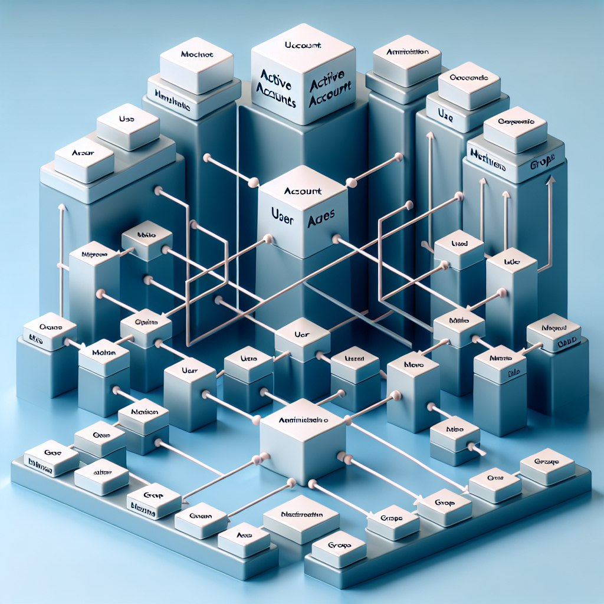
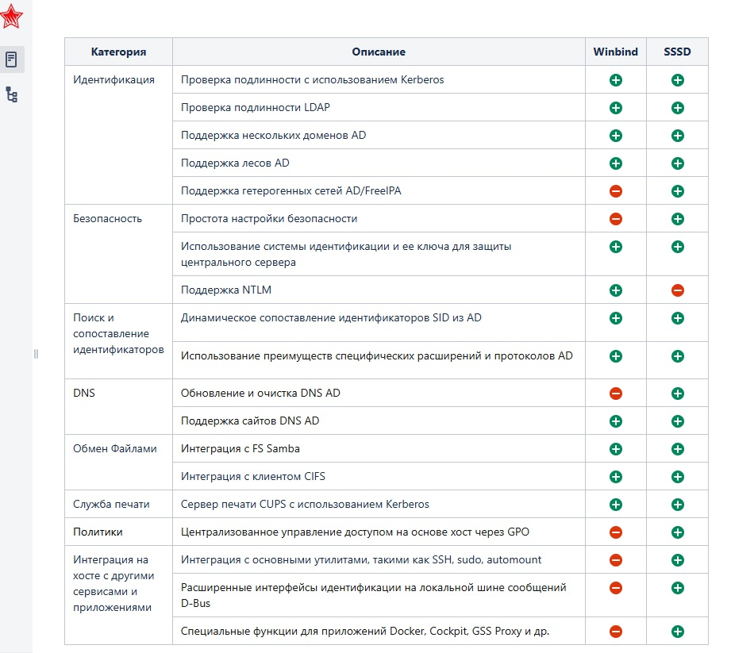
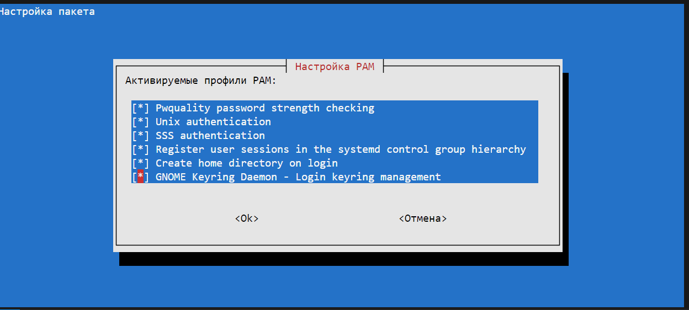

# Служба каталогов Free API 



<!-- Перед началом работы перевести клиентскую машину C и D в мостовую сеть
Хост C подключить к SSSD
Хост D подключить к FreeAPI -->

Служба каталогов в Linux (а также в других операционных системах) — это система, предназначенная для централизованного хранения, управления и обеспечения доступа к информации о пользователях, устройствах, сервисах и других ресурсах сети. Основная цель службы каталогов заключается в упрощении администрирования и повышения безопасности различных сетевых ресурсов.

Одной из наиболее часто используемых служб каталогов в Linux является LDAP (Lightweight Directory Access Protocol). LDAP представляет собой протокол для доступа и обслуживания информации в директивных службах.

Краткий обзор службы каталогов:

1. LDAP (Lightweight Directory Access Protocol):
   - Это протокол, который позволяет приложениям взаимодействовать с сервером каталогов для выполнения операций, таких как добавление, удаление, изменения и поиск записей.
   - Записи в службе каталога организованы в иерархическую структуру (например, иерархия дерева).
   - Широко используется для хранения и управления учетными данными пользователей и группами.

2. OpenLDAP:
   - Это бесплатная, открытая реализация LDAP протокола.
   - Позволяет хранить и управлять информацией о пользователях, группах и других ресурсах.
   - Поддерживает аутентификацию, авторизацию и другие формы управления доступом.

3. Microsoft Active Directory:
   - Хотя это продукт Microsoft, он также может взаимодействовать с Linux системами через различные механизмы интеграции.
   - Служит для управления доменами Windows, но с помощью протокола LDAP и других технологий может использоваться в смешанных окружениях.

4. Kerberos:
   - Это сетевой протокол аутентификации, который используется для обеспечения надежной проверки подлинности в клиент-серверных приложениях.
   - Часто используется в связке со службами каталогов для обеспечения единого входа (SSO).

### Основные функции службы каталогов:
1. Аутентификация: Подтверждение подлинности пользователя или ресурса.
2. Авторизация: Определение прав и доступов пользователей.
3. Централизованное управление учетными записями: Создание, изменение и удаление учетных записей пользователей и групп.
4. Интеграция с другими сервисами: Обеспечение взаимодействия с другими службами и протоколами.


## SSSD

SSSD (System Security Services Daemon) – это системный демон, который предоставляет доступ к различным источникам данных идентификации и аутентификации, таких как LDAP, Kerberos и Active Directory (AD). Он играет ключевую роль в интеграции Linux-систем с Active Directory, упрощая процесс аутентификации и управления идентичностями в смешанных средах.



### Основные функции SSSD:

1. Аутентификация:
   - SSSD поддерживает различные методы аутентификации, включая Kerberos и LDAP.
   - Обеспечивает безопасную аутентификацию пользователей, логин которых хранится на удаленных серверах, таких как AD.

2. Кэширование:
   - Быстрое кэширование учетных данных пользователей и групп, что позволяет системе работать даже в условиях временной недоступности сети или сервера LDAP/AD.
   - Значительно повышает производительность и снижает нагрузку на серверы аутентификации.

3. Преобразование имен:
   - Поддерживает множественные домены и методы преобразования имен.
   - Обеспечивает бесшовную интеграцию имен пользователей и групп между различными доменами.

4. Различные источники данных:
   - Поддерживает множество разных источников данных для идентификации и аутентификации, включая Active Directory, FreeIPA, LDAP и другие.

5. PAM и NSS:
   - Интегрируется с PAM (Pluggable Authentication Modules) и NSS (Name Service Switch), что позволяет использовать стандартизированные методы аутентификации и разрешения имён в Linux-системах.

### Интеграция с Active Directory (AD):

SSSD значительно упрощает интеграцию Linux-хостов с Active Directory, предоставляя следующие возможности:

1. Single Sign-On (SSO):
   - Поддержка Kerberos, что позволяет пользователям осуществлять единую аутентификацию и получать доступ к различным ресурсам без повторного ввода пароля.

2. Групповая политика:
   - Поддержка группов, определенных в AD, для назначения прав и обеспечения управления доступом.

3. Управление пользователями и группами:
   - Центральное управление учетными записями пользователей и группами через AD.
   - Синхронизация профилей и списков доступа между Linux и Windows средами.

### Преимущества использования SSSD для интеграции с AD:

- Упрощенная настройка и конфигурация: Использование SSSD минимизирует сложность настройки интеграции с AD по сравнению с ручной настройкой LDAP, Kerberos и других компонентов.
- Надежность и масштабируемость: Кэширование данных учетных записей и поддержка множества доменов делают систему более устойчивой и гибкой.
- Повышенная безопасность: Использование проверенного времени и стандартов для аутентификации и управления доступом.
- Удобство и унификация: Integrates with native Linux mechanisms such as NSS and PAM, making it easier for administrators to manage Linux systems alongside Windows systems.


https://4sysops.com/archives/connect-linux-to-active-directory-using-sssd/

Установим службу времени

`sudo apt install systemd-timesyncd`

`sudo systemctl start systemd-timesyncd && sudo systemctl enable systemd-timesyncd`

Поправим файл hosts для разрешения контроллера домена

`nano /etc/hosts`
```bash
192.168.2.100 dc1.lup.local dc1
```

`sudo systemctl restart NetworkManager`

`ping dc1.lup.local`

`apt install realmd sssd oddjob oddjob-mkhomedir adcli sssd-ad cifs-utils msktutil libnss-sss libpam-sss sssd-tools samba-common-bin krb5-user`

домен - lup.local
сервер kerberjs - dc1.lup.local

`nano /etc/krb5.conf`

```bash
[libdefaults]
default_realm = LUP.LOCAL

# The following krb5.conf variables are only for MIT Kerberos.
	kdc_timesync = 1
	ccache_type = 4
	forwardable = true
	proxiable = true
        rdns = false


# The following libdefaults parameters are only for Heimdal Kerberos.
	fcc-mit-ticketflags = true
udp_preference_limit = 0

[realms]
	LUP.LOCAL = {
		kdc = dc1.lup.local
		admin_server = dc1.lup.local
	}
	ATHENA.MIT.EDU = {
		kdc = kerberos.mit.edu
		kdc = kerberos-1.mit.edu
		kdc = kerberos-2.mit.edu:88
		admin_server = kerberos.mit.edu
		default_domain = mit.edu
	}
	ZONE.MIT.EDU = {
		kdc = casio.mit.edu
		kdc = seiko.mit.edu
		admin_server = casio.mit.edu
	}
	CSAIL.MIT.EDU = {
		admin_server = kerberos.csail.mit.edu
		default_domain = csail.mit.edu
	}
	IHTFP.ORG = {
		kdc = kerberos.ihtfp.org
		admin_server = kerberos.ihtfp.org
	}
	1TS.ORG = {
		kdc = kerberos.1ts.org
		admin_server = kerberos.1ts.org
	}
	ANDREW.CMU.EDU = {
		admin_server = kerberos.andrew.cmu.edu
		default_domain = andrew.cmu.edu
	}
        CS.CMU.EDU = {
                kdc = kerberos-1.srv.cs.cmu.edu
                kdc = kerberos-2.srv.cs.cmu.edu
                kdc = kerberos-3.srv.cs.cmu.edu
                admin_server = kerberos.cs.cmu.edu
        }
	DEMENTIA.ORG = {
		kdc = kerberos.dementix.org
		kdc = kerberos2.dementix.org
		admin_server = kerberos.dementix.org
	}
	stanford.edu = {
		kdc = krb5auth1.stanford.edu
		kdc = krb5auth2.stanford.edu
		kdc = krb5auth3.stanford.edu
		master_kdc = krb5auth1.stanford.edu
		admin_server = krb5-admin.stanford.edu
		default_domain = stanford.edu
	}
        UTORONTO.CA = {
                kdc = kerberos1.utoronto.ca
                kdc = kerberos2.utoronto.ca
                kdc = kerberos3.utoronto.ca
                admin_server = kerberos1.utoronto.ca
                default_domain = utoronto.ca
	}

[domain_realm]
	.mit.edu = ATHENA.MIT.EDU
	mit.edu = ATHENA.MIT.EDU
	.media.mit.edu = MEDIA-LAB.MIT.EDU
	media.mit.edu = MEDIA-LAB.MIT.EDU
	.csail.mit.edu = CSAIL.MIT.EDU
	csail.mit.edu = CSAIL.MIT.EDU
	.whoi.edu = ATHENA.MIT.EDU
	whoi.edu = ATHENA.MIT.EDU
	.stanford.edu = stanford.edu
	.slac.stanford.edu = SLAC.STANFORD.EDU
        .toronto.edu = UTORONTO.CA
        .utoronto.ca = UTORONTO.CA
```


Базовые пакеты для Realmd (используемые для настройки и управления службами сетевой аутентификации, связанными с Active Directory) и демона служб безопасности системы (SSSD — программный компонент, обычно используемый в системах Linux для обеспечения централизованной аутентификации)

Для привязки к Active Directory нам дополнительно требуется sssd-ad, плагин AD для SSSD, и adcli, инструмент для изменения записей AD. libnss-sss и libpam-sss содержат связующее звено между SSSD и архитектурой PAM / NSS , лежащей в основе всей аутентификации в Linux.

Oddjob-mkhomedir содержит крючки для автоматического создания домашних каталогов при входе в систему. Кроме того, cifs-utils и samba-common-bin содержат реализацию протокола SMB, а msktutil и krb5-user используются для получения и обновления билетов Kerberos для объектов компьютера и пользователя

`realm join -U admin dc1.lup.local`

Команда Realm list используется для получения списка доменов Active Directory или других поставщиков удостоверений, к которым подключена система Linux с помощью инструмента Realmd. Эта команда предоставляет информацию о настроенном в данный момент домене или доменах и отображает такие детали, как имя домена, тип домена (например, Active Directory) и состояние соединения. Для этой команды требуются записи Kerberos и ldap SRV в DNS

`realm list`

lup.local
  type: kerberos
  realm-name: LUP.LOCAL
  domain-name: lup.local
  configured: kerberos-member
  server-software: active-directory
  client-software: sssd
  required-package: sssd-tools
  required-package: sssd
  required-package: libnss-sss
  required-package: libpam-sss
  required-package: adcli
  required-package: samba-common-bin
  login-formats: %U@lup.local
  login-policy: allow-realm-logins

включите автоматическое создание домашнего каталога пользователя с помощью инструмента  pam-auth-update

`pam-auth-update`



Теперь вы сможете запрашивать своего пользователя, используя полное имя пользователя (FQUN). Обязательно избегайте знака @, поскольку некоторые оболочки интерпретируют определенные символы (расширение оболочки).

`id admin\@lup.local`


uid=88601105(admin@lup.local) gid=88600513(пользователи домена@lup.local) группы=88600513(пользователи домена@lup.local),88600519(администраторы предприятия@lup.local),88600512(администраторы домена@lup.local),88600572(группа с запрещением репликации паролей rodc@lup.local),88600526(администраторы основного уровня@lup.local),88600527(администраторы основного уровня предприятия@lup.local),88600518(администраторы схемы@lup.local)


Создайте резервную копию и отредактируйте файл конфигурации. Если у вас нет рабочего файла sssd.conf, не перезагружайтесь, поскольку ваша система не будет загружаться или входить в систему, когда SSSD сломан, и вам, возможно, придется использовать режим восстановления.

`cp /etc/sssd/sssd.conf /etc/sssd/sssd.back`

Настроим конфиг в соответствии с нашей средой

`nano /etc/sssd/sssd.conf`

```bash
[sssd]
#список доменов, которые будут использоваться SSSD
domains = lup.local
#версия файла конфигурации
config_file_version = 2
#перечень сервисов, которые будут использовать SSSD
services = nss, pam
#домен «по умолчанию», который люди будут использовать при входе в систему
default_domain_suffix = lup.local

[domain/lup.local]
#оболочка по умолчанию для пользователей
default_shell = /bin/bash
#адрес (имя) контроллера домена Active Directory
ad_server = dc1.lup.local
# пароль Kerberos будет сохраняться для оффлайн-доступа.
krb5_store_password_if_offline = True
# SSSD будет кэшировать учетные данные для оффлайн-доступа.
cache_credentials = True
#указывает Kerberos realm
krb5_realm = LUP.LOCAL
#метки, указывающие на то, как система была присоединена к домену и какие метки применимы
realmd_tags = manages-system joined-with-adcli
#поставщик идентификационных данных
id_provider = ad
ldap_sasl_authid = HOSTNAME$
#путь к домашним директориям
fallback_homedir = /home/%d/%u
ad_domain = lup.local
#пользователи будут авторизовываться с полностью квалифицированными именами, такими как user@domain
use_fully_qualified_names = True
# SSSD будет использовать алгоритм сопоставления идентификаторов LDAP
ldap_id_mapping = True
# провайдера для управления доступом
access_provider = ad
#отключение контроля доступа к GPO
ad_gpo_access_control = disabled 
enumerate = False
#игнорировать членство во вложенных группах
ignore_group_members = True   

[nss]
memcache_size_passwd = 200
memcache_size_group = 200
memcache_size_initgroups = 50
```

Однако, отключив GPO, по умолчанию никто не сможет войти в систему. Чтобы разрешить вход в систему любому, у кого есть активные учетные данные AD

`realm permit --all`

`systemctl restart sssd`

`systemctl status sssd`

`journalctl -u sssd`

при необходимости для отладки SSSD стоит зайти на оф сайт

[https://sssd.io/troubleshooting/basics.html](https://sssd.io/troubleshooting/basics.html)


## FreeIPA 

FreeIPA (Identity, Policy, Audit) – это комплексный, интегрированный продукт с открытым исходным кодом, предназначенный для управления идентичностями, политиками и системами аутентификации в корпоративных сетях. Проект FreeIPA основан на стандартах и включает в себя несколько ключевых компонентов, которые совместно обеспечивают централизованное управление пользователями и устройствами.

Основные компоненты и функции FreeIPA:

1. LDAP-сервер (389 Directory Server):
   - Используется для хранения данных о пользователях, группах, компьютерах и других объектах.
   - Позволяет централизованно управлять учетными записями пользователей и политиками.

2. Kerberos:
   - Обеспечивает безопасную аутентификацию пользователей и компьютеров.
   - Поддерживает механизм Single Sign-On (SSO), что позволяет пользователям входить в систему один раз и получать доступ к множеству сервисов без повторной аутентификации.

3. DNS (Domain Name System):
   - Встроенный DNS-сервер для управления именами доменов и служб.
   - Облегчает автоматическую регистрацию и разрешение имен устройств в сети.

4. Centrally Managed
   - Поддерживает управление политиками доступа к ресурсам через роли и привилегии.
   - Позволяет администратору создавать и применять политики безопасности.

5. NTP (Network Time Protocol):
   - Синхронизирует время на всех компьютерах в сети, что критично для правильной работы Kerberos и других протоколов безопасности.

Дополнительные возможности:

- Веб-интерфейс: Предоставляет удобный графический интерфейс для администрирования и настройки системы.
- CLI (Command Line Interface): Обеспечивает возможность управления системой через командную строку, что полезно для автоматизации задач.
- Поддержка сертификатов и PKI (Public Key Infrastructure): Включает функции управления сертификатами и их автоматическую выдачу.
- Интеграция с Active Directory: Позволяет организовать совместную работу с Microsoft Active Directory, упрощая управление смешанными средами.

Преимущества использования FreeIPA:

- Централизованное управление: Упростить управление учетными записями пользователей, групп, политиками и настройками безопасности.
- Безопасность: Повысить уровень безопасности за счет использования Kerberos для аутентификации и централизованного управления политиками.
- Масштабируемость: Подходит для организаций различных размеров, от небольших компаний до крупных корпораций с тысячами пользователей.
- Интеграция: Поддержка множества стандартов и возможность интеграции с другими системами и сервисами, такими как Active Directory, что делает его гибким и универсальным решением.
- Открытый исходный код: Возможность использовать, изменять и распространять продукт под лицензией открытого исходного кода.

Примеры использования:

1. Корпоративные среды: Центральное управление пользователями и устройствами, автоматические обновления политик и улучшенная безопасность.
2. Образовательные учреждения: Упрощение управления студенческими учетными записями и доступом к различным учебным ресурсам.
3. Правительственные учреждения: Обеспечение высокого уровня безопасности и соответствие стандартам управления идентичностями и аутентификацией.

### Установка и настройка FreeAPI сервера

Исходные данные:

IPA server IP address:     192.168.2.105       
IPA server hostname:       ipa.llup.local	     
IPA domain:                llup.local       
IPA NetBIOS:               LLUP               
IPA Kerberos realm         LLUP.LOCAL         


Cервер FreeIPA точно поддерживается в последних версиях следующих дистрибутивов:

CentOS 
Fedora
РедОС
Astra Linux
ALT Linux

Установим часовой пояс:

`yum update -y`

#### Время

Установим часовой пояс:

`timedatectl set-timezone Europe/Moscow`

Затем устанавливаем и запускаем утилиту для синхронизации времени chrony.

`yum install chrony`

`systemctl enable chronyd --now`

#### Имя сервера

Для корректной работы сервера, необходимо, задать ему полное доменное имя (FQDN). Выполняем команду:

`hostnamectl set-hostname ipa.llup.local`

#### Брандмауэр

Необходимо открыть несколько портов, которые используются службами FreeIPA:

`firewall-cmd --permanent --add-port=53/{tcp,udp} --add-port={80,443}/tcp --add-port={88,464}/{tcp,udp} --add-port=123/udp --add-port={389,636}/tcp --add-port=22/tcp`

   53 — запросы DNS. Не обязателен, если мы не планируем использовать наш сервер в качестве сервера DNS.
   80 и 443 — http и https для доступа к веб-интерфейсу управления.
   88 и 464 — kerberos и kpasswd.
   123 — синхронизация времени.
   389 и 636 — ldap и ldaps соответственно.

`firewall-cmd --reload`

`firewall-cmd --list-all`

#### SELinux

Отключаем SELinux командами:

`setenforce 0`

`sed -i 's/^SELINUX=.*/SELINUX=disabled/g' /etc/selinux/config`

Установка и запуск FreeIPA

`yum install ipa-server`

Если мы хотим использовать наш сервер еще и как DNS, то устанавливаем:

`yum install ipa-server-dns`

После выполняем конфигурирование сервиса:

`ipa-server-install`

Отвечаем на первый вопрос, хотим ли мы использовать и сконфигурировать DNS-сервер BIND

Для настройки DNS на первый запрос, хотим ли мы настроить перенаправления, отвечаем да

... также можно добавить дополнительные серверы:
Enter an IP address for a DNS forwarder, or press Enter to skip: 8.8.8.8

Также оставляем значение по умолчанию для попытки найти обратные зоны
Do you want to search for missing reverse zones? [yes]

При удачном завершении получим сообщения:

```bash
Setup complete

Next steps:
        1. You must make sure these network ports are open:
                TCP Ports:
                  * 80, 443: HTTP/HTTPS
                  * 389, 636: LDAP/LDAPS
                  * 88, 464: kerberos
                  * 53: bind
                UDP Ports:
                  * 88, 464: kerberos
                  * 53: bind
                  * 123: ntp

        2. You can now obtain a kerberos ticket using the command: 'kinit admin'
           This ticket will allow you to use the IPA tools (e.g., ipa user-add)
           and the web user interface.

Be sure to back up the CA certificates stored in /root/cacert.p12
These files are required to create replicas. The password for these
files is the Directory Manager password
```

#### Проверка Kerberos

проверим, что система может выдать билет

`kinit admin`

Проверяем, что билет получен:

`klist`

   Ticket cache: KEYRING:persistent:0:0
   Default principal: admin@LLUP.LOCAL

   Valid starting       Expires              Service principal
   05/30/2024 09:15:20  05/31/2024 09:15:11  krbtgt/LLUP.LOCAL@LLUP.LOCAL

Удалим полученный билет:

`kdestroy`

`reboot`

#### Настройка и подключение клиента

Клиентские компьютеры должны быть настроены на использование DNS-сервера, который мы сконфигурировали на сервере FreeIPA во время его установки. В сетевых настройках указываем использовать наш сервер ipa для разрешения имен

`nano /etc/resolv.conf` 
```bash
nameserver 192.168.2.105
nameserver 192.168.2.1
```


`nslookup ipa.llup.local`

`nano /etc/hosts`
```bash
# полное имя должно идти первым
192.168.2.101 d12-0.llup.local d12-0
127.0.0.1 localhost
192.168.2.105 ipa.llup.local ipa
```

укажем часовой пояс и настроим время:

`timedatectl set-timezone Europe/Moscow`

`apt install chrony`

`systemctl enable chrony`

`hostnamectl set-hostname d12-0.llup.local`

`apt install freeipa-client`

Серверы Kerberos для вашей области:                                                   
ipa.llup.local

Управляющий сервер вашей области Kerberos
ipa.llup.local

Выполним конфигурирование клиента:

`ipa-client-install --mkhomedir`

Система на основе данных из DNS попробует определить настройки и либо попросит ввести наш домен

   Discovery was successful!
   Do you want to configure chrony with NTP server or pool address? [no]: 
   Client hostname: d12-0.llup.local
   Realm: LLUP.LOCAL
   DNS Domain: llup.local
   IPA Server: ipa.llup.local
   BaseDN: dc=llup,dc=local

   Continue to configure the system with these values? [no]: yes

Система спросит, от какого пользователя производить настройку — вводим admin:

User authorized to enroll computers: `admin`
Password for admin@LLUP.LOCAL: 

проверим, что клиент может получать билет от сервера:

`kinit admin`

`klist`

   Ticket cache: KEYRING:persistent:0:0
   Default principal: admin@LLUP.LOCAL

   Valid starting       Expires              Service principal
   30.05.2024 10:07:22  31.05.2024 10:07:18  krbtgt/LLUP.LOCAL@LLUP.LOCAL


#### Работа с учетными записями

Создадим пользователя. Для этого рассмотрим пример использования командной строки и веб-интерфейса.

##### Работа с использования командной строки

Авторизуемся на FreeIPA:

`kinit admin`

`ipa user-add ipalup --first=Андрей --last=Чуян --password`

Приуспехе получим вывод

-------------------
Added user "ipalup"
-------------------
  User login: ipalup
  First name: Андрей
  Last name: Чуян
  Full name: Андрей Чуян
  Display name: Андрей Чуян
  Initials: АЧ
  Home directory: /home/ipalup
  GECOS: Андрей Чуян
  Login shell: /bin/sh
  Principal name: ipalup@LLUP.LOCAL
  Principal alias: ipalup@LLUP.LOCAL
  User password expiration: 20240530072805Z
  Email address: ipalup@llup.local
  UID: 311800001
  GID: 311800001
  Password: True
  Member of groups: ipausers
  Kerberos keys available: True

##### Работа с веб интерфейсом

Открываем браузер и переходим по адресу имени сервера — в нашем примере, https://ipa.llup.local. Закрываем всплывающее окно с запросом пароля. В появившейся странице авторизации вводим 

логин 
admin 

пароль
1234Qwer

##### Проверка

`kinit ipalup`

#### Примеры команд

##### Редактирование учетных записей

Редактирование учетной записи

ipa user-mod <имя записи> <опции>

`ipa user-mod ipalup --password`

Для удаления учетной записи:

ipa user-del <имя записи>

`ipa user-del ipalup`

Получить информацию мы можем о любой сущьности в LDAP с помощью командной строки.

Для пользователей:

`ipa user-find --all`

`ipa user-find ipalup --all`

Для групп:

`ipa group-find --all`

`ipa group-find admins --all`

Работа с группами
1. Создание группы безопасности:

`ipa group-add --desc='Group for managers departmen' managers`

* создаем группу безопасности managers.

2. Добавить пользователя в группу:

`ipa group-add-member managers --users=user1,user2,user3`

* добавим в группу managers пользователей user1, user2 и user3.

3. Переименовать группу:

ipa group-mod --rename=<новое имя> <старое имя>

Например:

`ipa group-mod --rename=managers2 managers`

##### Работа с компьютерами

Посмотреть подключенныекомпьютеры

`ipa host-find`

Вывод клиента из домена
Если необходимо вывести клиентский компьютер из домена, вводим команду:

`ipa-client-install --uninstall`


##### SSH аутентификация через FreeIPA

добавим в конец 

`nano /etc/pam.d/common-session`

```bash
session required    pam_mkhomedir.so skel=/etc/skel umask=0022
```

* данная настройка укажет на необходимость автоматического создания домашней директории для пользователя.

***


### Настройка доверительных отношений с AD Windows

Требованием для доверия является Windows Server 2008 R2 и выше

Исходные данные:

IPA server IP address:     192.168.2.105        
IPA server hostname:       ipa.llup.local	      
IPA domain:                llup.local         
IPA NetBIOS:               LLUP                 
IPA Kerberos realm         LLUP.LOCAL           

AD DC IP address:          192.168.2.100        
AD DC hostname:            dc1.lup.local         
AD domain:                 lup.local           
AD NetBIOS:                LUP                   
AD admins group SID:       S-1-5-21-3138841987-390572131-2631766823-512    PShell (Get-ADGroup -Identity "Администраторы домена" | Select-Object Name, SID)

ПРИМЕЧАНИЕ 
Домен AD и домен IPA должны быть разными. Это основное требование для любого межлесного доверия Active Directory.
NetBIOS-имена домена IPA и домена AD должны быть разными. 
Имена NetBIOS сервера IPA и сервера AD DC должны быть разными.

#### Проверка разрешения

Перед подключением FreeIPA и Active Directory (AD) к доверию необходимо убедиться, что серверы видят друг друга и правильно разрешают доменные имена. В этом сценарии описывается настройка DNS для разрешения доменных имен между:

1. основной сервер FreeIPA, использующий интегрированный сервер DNS и CA;
2. контроллер домена AD.
   
Для настройки DNS необходимо:

1. настроить зоны DNS на сервере FreeIPA;
2. настроить условную переадресацию DNS в AD;
3. проверить правильности конфигурации DNS.

####  Network Manager setup

`nmcli con show --active`

`nmcli connection modify eth0 ipv4.dns "192.168.2.1"`

`nmcli connection modify eth0 ipv4.dns "192.168.2.100"`

`nmcli connection modify eth0 ipv4.dns-search "llup.local"`

`nmcli connection down eth0 && nmcli connection up eth0`

`cat /etc/resolv.conf`

```bash
search llup.local
nameserver 192.168.2.100
nameserver 192.168.2.1
```

Создание зоны переадресации DNS для домена AD в командной строке (следует указать IP-адрес удаленного DNS-сервера с параметром --forwarder):

`kinit admin`

`ipa dnsforwardzone-add lup.local --forwarder=192.168.2.100 --forward-policy=first`

   Server will check DNS forwarder(s).
   This may take some time, please wait ...
   Zone name: lup.local.
   Active zone: TRUE
   Zone forwarders: 192.168.2.100
   Forward policy: first

`ipa dnszone-find`

`ipa dnsforwardzone-show lup.local`

Удостоверитесь, что форвардер (192.168.2.100) работает и правильно настроен.

`dig @192.168.2.100 dc1.lup.local +noall +answer`

; <<>> DiG 9.11.4-P2-RedHat-9.11.4-26.P2.el7_9.15 <<>> @192.168.2.100 dc1.lup.local +noall +answer
; (1 server found)
;; global options: +cmd
dc1.lup.local.          3600    IN      A       192.168.2.100
dc1.lup.local.          3600    IN      A       192.168.100.5


`dig dc1.lup.local +noall +answer`

; <<>> DiG 9.11.4-P2-RedHat-9.11.4-26.P2.el7_9.15 <<>> dc1.lup.local +noall +answer
;; global options: +cmd

<!-- https://www.altlinux.org/FreeIPA/%D0%98%D0%BD%D1%82%D0%B5%D0%B3%D1%80%D0%B0%D1%86%D0%B8%D1%8F_%D1%81_AD -->

#### Настройка переадресации DNS в AD

В командной строке:

CMD

`dnscmd 127.0.0.1 /ZoneAdd llup.local /Forwarder 192.168.2.105`

   DNS-сервер 127.0.0.1 создал зону llup.local:

   Команда успешно завершена.

проверка

`dnscmd 127.0.0.1 /ZoneInfo llup.local`

   Результат запроса зоны:

   Сведения о зоне:
         указатель                          = 000001A77C157AE0
         имя зоны                           = llup.local
         тип зоны                           = 4
         отключено                          = 0
         приостановлено                     = 0
         обновление                         = 0
         интеграция со службой каталогов    = 0
         зона только для чтения             = 0
         файл данных             = (null)
         использование WINS      = 0
         использование Nbstat    = 0
         очистка                 = 0
            интервал обновления   = 0
            без обновления        = 0
            очистка доступна      = 0
         Хозяева зоны
         Указатель    = 000001A77C155390
         MaxCount     = 1
         AddrCount    = 1
                  Основной сервер[0] => af=2, salen=16, [sub=0, flag=00000000] p=13568, addr=192.168.2.105

         Дополнительные для зоны         Массив IP-адресов со значением NULL.
         безопасные секции           = 3
         таймаут сервера пересылки  = 3
         ведомый сервера пересылки  = 0
   Команда успешно завершена.

#### Проверка конфигурации DNS

Перед настройкой доверия необходимо убедиться, что серверы FreeIPA и AD могут разрешать себя и друг друга.

##### На сервере FreeIPA

`kinit admin`

`klist`

`ipa dns-update-system-records`

Запись отвечающая за работу сервисов Kerberos через UDP и LDAP через TCP:

`dig +short -t SRV _kerberos._udp.llup.local`

0 100 88 ipa.llup.local.

`dig +short -t SRV _ldap._tcp.llup.local`

0 100 389 ipa.llup.local.

Запись отвечающая за имя Kerberos realm IPA домена:

`dig +short -t TXT _kerberos.llup.local`

"LLUP.LOCAL"

Наличие записей для работы сервисов AD на DNS-сервере IPA:

`dig +short -t SRV _kerberos._tcp.dc._msdcs.lup.local`

0 100 88 dc1.lup.local.

`dig +short -t SRV _ldap._tcp.dc._msdcs.lup.local`

0 100 389 dc1.lup.local.

##### На сервере AD

На сервере AD запустить утилиту nslookup.exe для поиска служебных записей:


Введите доменное имя для служебных записей Kerberos через UDP и LDAP через TCP:

`nslookup -type=SRV _kerberos._udp.llup.local`

   ╤хЁтхЁ:  localhost.0
   Address:  ::1

   Не заслуживающий доверия ответ:
   _kerberos._udp.llup.local       SRV service location:
            priority       = 0
            weight         = 100
            port           = 88
            svr hostname   = ipa.llup.local

   ipa.llup.local  internet address = 192.168.2.105

`nslookup -type=SRV _ldap._tcp.llup.local`

   ╤хЁтхЁ:  localhost.0
   Address:  ::1

   Не заслуживающий доверия ответ:
   _ldap._tcp.llup.local   SRV service location:
            priority       = 0
            weight         = 100
            port           = 389
            svr hostname   = ipa.llup.local

   ipa.llup.local  internet address = 192.168.2.105

Запись отвечающая за имя Kerberos realm IPA домена:

`nslookup -type=TXT _kerberos.llup.local`

   ╤хЁтхЁ:  localhost.0
   Address:  ::1

   Не заслуживающий доверия ответ:
   _kerberos.llup.local    text =

         "LLUP.LOCAL"

#### Подготовка сервера FreeIPA к доверию

Установить необходимые пакеты:

`yum install freeipa-server-trust-ad`

Прежде чем устанавливать доверительные отношения с AD, следует подготовить домен FreeIPA с помощью утилиты ipa-adtrust-install. Сконфигурировать сервер FreeIPA для доверительных отношений с AD

`ipa-adtrust-install`

The log file for this installation can be found in /var/log/ipaserver-install.log
==============================================================================
This program will setup components needed to establish trust to AD domains for
the IPA Server.

This includes:
  * Configure Samba
  * Add trust related objects to IPA LDAP server

To accept the default shown in brackets, press the Enter key.

Configuring cross-realm trusts for IPA server requires password for user 'admin'.
This user is a regular system account used for IPA server administration.

admin password: 

- Вводим пароль администратора

Далее скрипт сообщает, что файл /etc/samba/smb.conf уже существует и будет переписан, соглашаемся

Скрипт спросит необходимо ли конфигурировать slapi-nis плагин для поддержки работы старых клиентов (SSSD < 1.9) с пользователем из доверенного домена, соглашаемся

При появлении запроса NetBIOS введите имя NetBIOS для домена FreeIPA или нажмите Enter, чтобы принять предложенное имя

Далее будет предложено запустить задачу генерации SID, чтобы создать SID для всех существующих пользователей, соглашаемся

Done configuring CIFS.

=============================================================================
Setup complete

You must make sure these network ports are open:
        TCP Ports:
          * 135: epmap
          * 138: netbios-dgm
          * 139: netbios-ssn
          * 445: microsoft-ds
          * 1024..1300: epmap listener range
          * 3268: msft-gc
        UDP Ports:
          * 138: netbios-dgm
          * 139: netbios-ssn
          * 389: (C)LDAP
          * 445: microsoft-ds

See the ipa-adtrust-install(1) man page for more details

=============================================================================

- вывод означает что конфигурация прошла успешно, 
- 
- разрешим порты

```bash
# Открытие TCP-портов
sudo firewall-cmd --permanent --add-port=135/tcp
sudo firewall-cmd --permanent --add-port=138/tcp
sudo firewall-cmd --permanent --add-port=139/tcp
sudo firewall-cmd --permanent --add-port=445/tcp
sudo firewall-cmd --permanent --add-port=3268/tcp
sudo firewall-cmd --permanent --add-port=1024-1300/tcp

# Открытие UDP-портов
sudo firewall-cmd --permanent --add-port=138/udp
sudo firewall-cmd --permanent --add-port=139/udp
sudo firewall-cmd --permanent --add-port=389/udp
sudo firewall-cmd --permanent --add-port=445/udp

# Применение изменений
sudo firewall-cmd --reload

# Проверка текущих настроек
sudo firewall-cmd --list-all
```
  

- перезапускаем IPA

`ipactl restart`


Restarting Directory Service
Restarting krb5kdc Service
Restarting kadmin Service
Restarting named Service
Restarting httpd Service
Restarting ipa-custodia Service
Restarting ntpd Service
Restarting pki-tomcatd Service
Restarting ipa-otpd Service
Restarting ipa-dnskeysyncd Service
Starting smb Service
Starting winbind Service
ipa: INFO: The ipactl command was successful

- Используйте утилиту smbclient, чтобы убедиться, что Samba отвечает на аутентификацию Kerberos со стороны FreeIPA

`sudo yum install samba-client`

`smbclient -L ipa.llup.local -k`

lp_load_ex: changing to config backend registry

        Sharename       Type      Comment
        ---------       ----      -------
        IPC$            IPC       IPC Service (Samba 4.10.16)
Reconnecting with SMB1 for workgroup listing.

        Server               Comment
        ---------            -------

        Workgroup            Master
        ---------            -------

на виндеоткроем порты

`$tcpPorts = @("135", "138", "139", "445", "3268", "1024-1300"); $udpPorts = @("138", "139", "389", "445"); foreach ($port in $tcpPorts) { New-NetFirewallRule -DisplayName "Allow TCP Port $port" -Direction Inbound -Protocol TCP -LocalPort $port -Action Allow }; foreach ($port in $udpPorts) { New-NetFirewallRule -DisplayName "Allow UDP Port $port" -Direction Inbound -Protocol UDP -LocalPort $port -Action Allow }; $allPorts = $tcpPorts + $udpPorts; foreach ($port in $allPorts) { Get-NetFirewallRule | Where-Object { $_.LocalPort -eq $port } }`


#### Настройка доверия

Сервер FreeIPA позволяет настроить три типа соглашений о доверии:

1. одностороннее доверие — вариант по умолчанию. Одностороннее доверие позволяет пользователям и группам AD получать доступ к ресурсам в FreeIPA, но не наоборот. Домен FreeIPA доверяет лесу AD, но лес AD не доверяет домену FreeIPA;
2. двустороннее доверие — позволяет пользователям и группам AD получать доступ к ресурсам в FreeIPA. Обратите внимание, что эта функция двустороннего доверия не позволяет пользователям IdM входить в системы Windows, а двустороннее доверие в IdM не дает пользователям никаких дополнительных прав по сравнению с решением одностороннего доверия в AD. Чтобы создать двустороннее доверие в команду следует добавить параметр --two-way=true;
3. внешнее доверие — доверительные отношения между FreeIPA и доменом AD в разных лесах. В то время как доверие леса всегда требует установления доверия между FreeIPA и корневым доменом леса Active Directory, внешнее доверие может быть установлено от FreeIPA к домену в лесу. Рекомендуется только в том случае, если невозможно установить доверие леса между корневыми доменами леса по административным или организационным причинам. Чтобы создать внешнее доверие в команду следует добавить параметр --external=true.

- Добавление двунаправленных доверительных отношений леса (Forest Trust) с AD:


`kinit admin`

`ipa trust-add --type=ad lup.local --admin admin --password --two-way=true`


------------------------------------------
Re-established trust to domain "lup.local"
------------------------------------------
  Realm name: lup.local
  Domain NetBIOS name: LUP
  Domain Security Identifier: S-1-5-21-3138841987-390572131-2631766823
  Trust direction: Two-way trust
  Trust type: Active Directory domain
  Trust status: Established and verified

```bash
(для удаления
# ipa trust-del lup.local
Удалить объект доверия из конфигурации Active Directory.
Проверка удаления доверия:
# ipa trust-show lup.local)
```

Внимание! Учетная запись пользователя, используемая при создании доверия (аргумент опции --admin), должна быть членом группы Domain Admins эта группа должна быть выбрана основной. Имя учетной записи должно быть на английском языке.

ДИАГНОСТИКА ОШИБОК

- проверим порты

Linux

tail -f /var/log/httpd/error_log

tail -f /var/log/dirsrv/slapd-LLUP-LOCAL/errors

Windows

Get-EventLog -LogName Security -Newest 50


- Чтобы увидеть список всех доверенных доменов из леса используйте следующую команду:

`ipa trustdomain-find lup.local`

```bash
  Domain name: lup.local
  Domain NetBIOS name: LUP
  Domain Security Identifier: S-1-5-21-3138841987-390572131-2631766823
  Domain enabled: True
------------------------------
Количество вернутых значений 1
------------------------------
```

#### Проверка конфигурации Kerberos

Для проверки конфигурации Kerberos, следует проверить, возможно ли получить билет для пользователя FreeIPA и может ли пользователь FreeIPA запрашивать служебные билеты.


Очистка кэша SSSD 
`sss_cache -E`

Запросить билет для пользователя AD:

`kinit admin@lup.local`

Запросить службу билетов в домене FreeIPA:

`kvno -S host ipa.llup.local`

host/ipa.llup.local@LLUP.LOCAL: kvno = 2

Если билет службы AD предоставлен, в списке билетов будет отображаться билет на предоставление билетов между областями (TGT) — krbtgt/IPA.DOMAIN@AD.DOMAIN

`klist`

Ticket cache: KEYRING:persistent:0:krb_ccache_1dLgXUb
Default principal: admin@LUP.LOCAL

Valid starting       Expires              Service principal
31.05.2024 17:27:30  01.06.2024 03:26:49  host/ipa.llup.local@LLUP.LOCAL
        renew until 01.06.2024 17:26:45
31.05.2024 17:27:29  01.06.2024 03:26:49  krbtgt/LLUP.LOCAL@LUP.LOCAL
        renew until 01.06.2024 17:26:45
31.05.2024 17:26:49  01.06.2024 03:26:49  krbtgt/LUP.LOCAL@LUP.LOCAL
        renew until 01.06.2024 17:26:45


#### Проверка конфигурации доверия в FreeIPA

- Проверка наличия записей для работы сервисов IPA на DNS-сервере IPA:

1. Запись отвечающая за работу сервисов Kerberos через UDP и LDAP через TCP:

`dig +short -t SRV _kerberos._udp.dc._msdcs.llup.local`

0 100 88 ipa.llup.local.

`dig +short -t SRV _ldap._tcp.dc._msdcs.llup.local`

0 100 389 ipa.llup.local.

В выводе этих команд должны быть перечислены все серверы FreeIPA, на которых была выполнена ipa-adtrust-install

2. Запись отвечающая за имя Kerberos realm IPA домена:

`dig +short -t TXT _kerberos.llup.local`

"LLUP.LOCAL"

- Проверка наличия записей для работы сервисов AD на DNS-сервере IPA.

1. Запись отвечающая за работу сервисов Kerberos через UDP и LDAP через TCP:
   
`dig +short -t SRV _kerberos._tcp.dc._msdcs.lup.local.`

0 100 88 dc1.lup.local.

`dig +short -t SRV _ldap._tcp.dc._msdcs.lup.local`

0 100 389 dc1.lup.local.

#### Проверка конфигурации доверия в AD

Перезагрузим машину

Необходимо войти в систему с правами администратора

1. После выполнения команды ipa-adtrust-install должны появится записи отвечающие за работу сервисов MS DC Kerberos через UDP и LDAP через TCP

`nslookup.exe -type=SRV _kerberos._udp.dc._msdcs.llup.local.`

╤хЁтхЁ:  localhost.0
Address:  ::1

Не заслуживающий доверия ответ:
_kerberos._udp.dc._msdcs.llup.local     SRV service location:
          priority       = 0
          weight         = 100
          port           = 88
          svr hostname   = ipa.llup.local

ipa.llup.local  internet address = 192.168.2.105

`nslookup.exe -type=SRV _ldap._tcp.dc._msdcs.llup.local.`

╤хЁтхЁ:  localhost.0
Address:  ::1

Не заслуживающий доверия ответ:
_ldap._tcp.dc._msdcs.llup.local SRV service location:
          priority       = 0
          weight         = 100
          port           = 389
          svr hostname   = ipa.llup.local

ipa.llup.local  internet address = 192.168.2.105

2. Проверить наличие записей для работы сервисов AD на DNS-сервере AD. Запись отвечающая за работу сервисов Kerberos через UDP и LDAP через TCP:

`Resolve-DnsName -Type SRV _kerberos._udp.lup.local.`

Name                                     Type   TTL   Section    NameTarget                     Priority Weight Port
----                                     ----   ---   -------    ----------                     -------- ------ ----
_kerberos._udp.lup.local                 SRV    600   Answer     dc1.lup.local                  0        100    88

Name       : dc1.lup.local
QueryType  : A
TTL        : 3600
Section    : Additional
IP4Address : 192.168.2.100


Name       : dc1.lup.local
QueryType  : A
TTL        : 3600
Section    : Additional
IP4Address : 192.168.100.5

`Resolve-DnsName -Type SRV _ldap._tcp.lup.local.`

Name                                     Type   TTL   Section    NameTarget                     Priority Weight Port
----                                     ----   ---   -------    ----------                     -------- ------ ----
_ldap._tcp.lup.local                     SRV    600   Answer     dc1.lup.local                  0        100    389

Name       : dc1.lup.local
QueryType  : A
TTL        : 3600
Section    : Additional
IP4Address : 192.168.2.100


Name       : dc1.lup.local
QueryType  : A
TTL        : 3600
Section    : Additional
IP4Address : 192.168.100.5


#### Проверка пользователей доверенного домена
Необходимо проверить имеют ли рабочие станции FreeIPA доступ к пользователям из доверенного домена.

На рабочей станции FreeIPA выполнить команду

`getent passwd admin@lup.local`

admin@lup.local:*:88601105:88600512:Сидоров И.С.:/home/lup.local/admin:

Назначить оболочку входа для пользователей из доверенного домена можно добавив на сервере IPA а также путь к домашним директориям

`nano /etc/sssd/sssd.conf`

```bash
[domain/llup.local]
...
default_shell = /bin/bash
#путь к домашним директориям
fallback_homedir = /home/%d/%u
ad_domain = lup.local
# UTF-8 поддержка для русских имен
override_homedir = /home/%d/%u
...
```

`systemctl restart sssd`

`getent passwd admin@lup.local`

admin@lup.local:*:88601105:88600512:Сидоров И.С.:/home/lup.local/admin:/bin/bash


##### SSH аутентификация через FreeIPA

добавим в конец 

`nano /etc/pam.d/common-session`

```bash
session required    pam_mkhomedir.so skel=/etc/skel umask=0022
```

`sudo nano /etc/pam.d/system-auth`

```bash
...
session    optional     pam_mkhomedir.so skel=/etc/skel/ umask=0077
```

`sudo systemctl restart sshd`

`su - admin`

`getent passwd ok-dp@lup.local`

`su - ok-dp@lup.local`

`groups`


<!-- https://www.altlinux.org/FreeIPA/%D0%98%D0%BD%D1%82%D0%B5%D0%B3%D1%80%D0%B0%D1%86%D0%B8%D1%8F_%D1%81_AD -->


## Домашнее задание
### main/hard

1. Подготовить проект дипломной работы