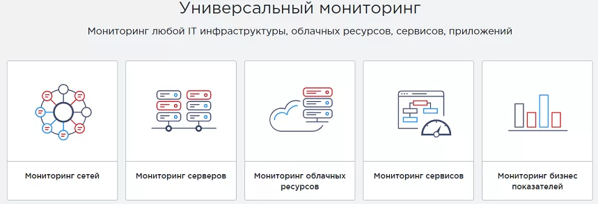
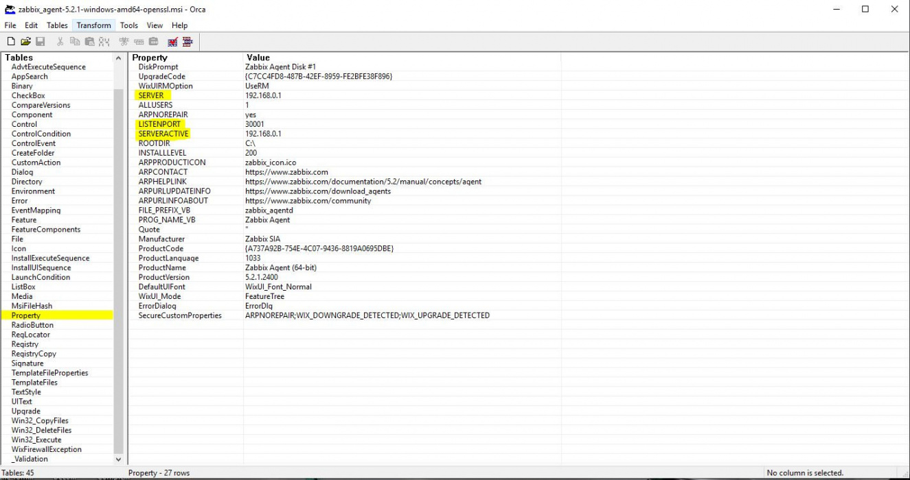
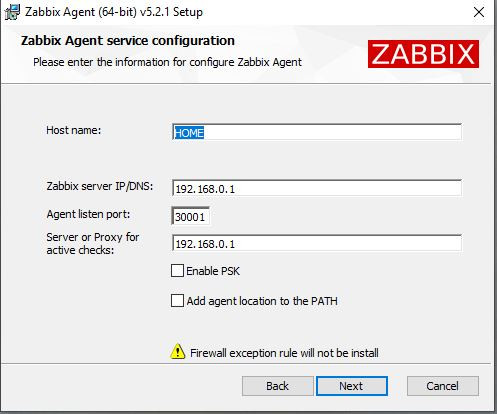

# Управление конфигурациями и мониторинг


### Цели и задачи Zabbix
Zabbix – одна из наиболее распространённых систем мониторинга ИТ-инфраструктуры. Её применяют для выявления и предотвращения потенциальных проблем с оборудованием или в работе сайта, домена приложений.

Ключевыми преимуществами программы считаются открытый исходный код, а также совместимость с несколькими видами операционных систем. Возможно осуществлять с помощью zabbix мониторинг служб windows, также он работает на Linux, FreeBSD, Mac OS X и других платформах.



Благодаря программе проводят мониторинг сети и различных устройств, анализируя большое количество данных. Например, она позволяет оценить работоспособность сервера, облачных ресурсов, базы данных и т.д.

Система характеризуется широким функционалом, поэтому используется для различных целей.

- Отслеживание бизнес-показателей.
- Контроль состояния устройств и сетевой активности.
- Пинг для проверки доступности узлов.
- Анализ логов и т.д.
  
Поскольку Zabbix обрабатывает внушительный объём информации, удаётся минимизировать риск возникновения технических проблем. Например, если каждую неделю времени запуска увеличивается на 1 секунду, это выраженная тенденция, которая, несомненно, приведёт к проблеме. Предприняв какие-либо действия, можно предотвратить сбои в работе оборудования или сервисов.

### Архитектура и возможности Zabbix
Система разделена на 5 компонентов, что позволяет одновременно отслеживать работу большого количества устройств, исключив перегрузки.


Основной сервер – собирает и обрабатывает информацию. Через него происходит дистанционное управлением сетевыми сервисами. В случае обнаружения проблем с оборудованием основной сервер направляет оповещения администратору.

В базах данных хранится собранная информация. Срок хранения назначает пользователь в соответствии со своими целями. Система совместима с несколькими наиболее востребованными базами, такими как MySQL, PostgreSQL, SQL Server, Oracle и другими.

Можно сказать про zabbix agent, что это программа, осуществляющая мониторинг и формирующая статистику работы локальных ресурсов. Она умеет самостоятельно получать данные автоматически или только по запросу от сервера. Этот элемент очень важен, однако его можно заменить другими инструментами, поэтому его использование носит лишь рекомендательный характер.

Прокси управляет агентами и выполняет предобработку данных, тем самым минимизируя нагрузку на Zabbix-сервер. Этот компонент тоже не обязательный и актуален только для организаций, которым необходимо контролировать одновременно большой комплекс устройств.

Веб-интерфейс нужен для понятного отображения информации.

### Как работает Zabbix
Данные о функционировании устройств направляется на Zabbix-сервер. Здесь они обрабатываются, после чего перенаправляются в базы данных.

Для каждого параметра задаётся периодичность сбора информации. Например, программа будет проверять температуру устройства, логи или другие показатели раз в 3 часа.

Чтобы видеть отклонения от нормы, в системе настраивают триггеры. Так называют условия, отображающие корректность работы устройства или системы. Например, процессор должен запускаться максимум за 8 секунд. Если время увеличивается хотя бы на секунду, это значит, что условия не соблюдаются. Триггер срабатывает, пользователь получает уведомление о сбое.

Оповещения возможно приостановить, при этом их всё равно можно будет посмотреть. Кроме того, допустима их отправка после завершения обслуживания, которая задаётся для узлов или группы.

Активировать мониторинг серверов zabbix можно с помощью веб-сценариев. Они формируются в формате шаблонов и применяются к различным узлам или группам. Существует стандартный комплект метрик и триггеров, которые упрощают использование программы.

### Как пользоваться Zabbix
Каждое устройство, предназначенное для проверки – это «узлы сети». Комплекс метрик, определяющих сбор данных с этих узлов, называют «элементами данных». В автоматическом режиме они настраиваются через подключение шаблона или вручную.

Заббикс мониторинг предполагает 17 способов сбора информации. Рассмотрим самые популярные из них.

- Zabbix-агент. Сервер подключается к агенту в соответствии с заданным интервалом и собирает информацию.
- Simple check (Простые проверки). Они актуальны для простых операций, таких как пинг. Их можно применять относительно локальных служб или работающих по внешнему tcp порту. Подключение агента в этом случае не требуется, процедура выполняется с помощью внутренних инструментов. Сервер сам начинает опрашивать указанный сервис и возвращать в зависимости от его значения доступности.
- Zabbix trapper. Трапперы можно представить в виде мостов, соединяющих подконтрольные сервисы с системой.
- Zabbix aggregate или Zabbix-комплекс. Так называется процесс, основанный на сборе совокупной информации из базы данных.
- SSH agent. Система подключается по SSH, а для предоставления интересующей информации нужно ввести соответствующие команды.
- Calculate (Вычисление). В данном случае сопоставляются уже собранные данные.

## Установка и настройка Zabbix. 

Удалим графический интерфейс

`apt remove -y --purge gnome* && apt autoclean -y && apt autoremove -y && reboot`

### Установка Zabbix

подключим репозиторий

`wget https://repo.zabbix.com/zabbix/6.4/debian/pool/main/z/zabbix-release/zabbix-release_6.4-1+debian12_all.deb`

`dpkg -i zabbix-release_6.4-1+debian12_all.deb`

`apt update`

установим утилиты

`apt install zabbix-server-pgsql zabbix-frontend-php php8.2-pgsql zabbix-apache-conf zabbix-sql-scripts zabbix-agent`

Создание исходной базы данных

`sudo apt install postgresql`

`systemctl enable postgresql`

`sudo -u postgres createuser --pwprompt zabbix`

`sudo -u postgres createdb -O zabbix zabbix`


На хосте сервера Zabbix импортируйте исходную схему и данные. Вам будет предложено ввести вновь созданный пароль.

`zcat /usr/share/zabbix-sql-scripts/postgresql/server.sql.gz | sudo -u zabbix psql zabbix`

Настроим базу данных

`nano /etc/zabbix/zabbix_server.conf`

```bash
DBPassword=1234Qwer
```

Запустим процессы Zabbix-сервера и агента.

`systemctl restart zabbix-server zabbix-agent apache2`

`systemctl enable zabbix-server zabbix-agent apache2`

Откроем веб интерфейс

curl http://192.168.2.101/zabbix

учетная запись: Admin

Пароль: zabbix

Оповещение - действие - действие авторегистрации

Имя
autoreg_linux

Условия 
1. Метаданные узлов сети содержит Linux

Операции
1. Добавить узел сети
2. Активировать узел сети
3. Отправить сообщение пользователям: Admin через все способы оповещения
4. Добавить в группы узлов сети: Linux servers
5. Присоединить к шаблонам: Linux by Zabbix agent

***

Имя
autoreg_win

Условия 
1. Метаданные узлов сети содержит Windows

Операции
1. Добавить узел сети
2. Активировать узел сети
3. Отправить сообщение пользователям: Admin через все способы оповещения
4. Добавить в группы узлов сети: Windows servers
5. Присоединить к шаблонам: Windows by Zabbix agent


## Установка и развертывание агентов на Linux

`nano install_agent_zabbix.sh`

```bash
#!/bin/bash

ZABBIX_SERVER="192.168.101.5"
HOSTNAME=$(hostname)

# Добавление репозитория и установка zabbix release
wget https://repo.zabbix.com/zabbix/6.4/debian/pool/main/z/zabbix-release/zabbix-release_6.4-1+debian12_all.deb

dpkg -i zabbix-release_6.4-1+debian12_all.deb

apt update

# Установка Zabbix агента
sudo apt install -y zabbix-agent

# Настройка zabbix_agentd.conf
sudo sed -i "s/Server=127.0.0.1/Server=$ZABBIX_SERVER/g" /etc/zabbix/zabbix_agentd.conf
sudo sed -i "s/ServerActive=127.0.0.1/ServerActive=$ZABBIX_SERVER/g" /etc/zabbix/zabbix_agentd.conf
sudo sed -i "s/Hostname=Zabbix server/Hostname=$HOSTNAME/g" /etc/zabbix/zabbix_agentd.conf

# Метаданные операционной системы
echo "HostMetadataItem=system.uname" | sudo tee -a "/etc/zabbix/zabbix_agentd.conf" > /dev/null

# Запуск и включение агента
sudo systemctl restart zabbix-agent
sudo systemctl enable zabbix-agent

echo "[ИНФО] - Настройка завершена"
```

`chmod +x ./install_agent_zabbix.sh`

`./install_agent_zabbix.sh`

ПРОВЕРКА С АГЕНТА

`sudo systemctl status zabbix-agent`

`telnet 192.168.101.5 10051`

`sudo tail -f /var/log/zabbix/zabbix_agentd.log`

ПРОВЕРКА С СЕРВЕРА

Получим черезз консоль команды с агента

`sudo apt install zabbix-get`

`zabbix_get -s 192.168.101.10 -p 10050 -k "system.uptime"`

`zabbix_get -s 192.168.101.10 -k "system.hostname"`

`zabbix_get -s 192.168.101.10 -k "system.users.num"`


## Установка и развертывание агентов на Windows

1. Качаем Orca https://www.technipages.com/download-orca-msi-editor

2. Открываем в ней msi-пакет zabbix-агента и вносим в таблицу Property нужные строки со значениями SERVER, SERVERACTIVE, LISTENPORT



3. Сохраняем и запускаем пакет



Добавялем в конфиг передачу метаданных

`Add-Content -Path "C:\Program Files\Zabbix Agent\zabbix_agentd.conf" -Value "HostMetadataItem=system.uname"`

добавляем скрипт в GPO выполняемый один раз

```ps1
# Путь к файлу конфигурации Zabbix агента
$configFilePath = "C:\Program Files\Zabbix Agent\zabbix_agentd.conf"
$parameter = "HostMetadataItem=system.uname"

# Проверка, существует ли файл конфигурации
if (Test-Path -Path $configFilePath) {
    # Чтение содержимого файла конфигурации
    $fileContent = Get-Content -Path $configFilePath
    
    # Проверка, существует ли уже параметр в файле конфигурации
    if ($fileContent -contains $parameter) {
        Write-Host "Parameter '$parameter' already exists in $configFilePath"
    } else {
        # Добавление параметра в конец файла конфигурации
        Add-Content -Path $configFilePath -Value $parameter
        Write-Host "Added '$parameter' to $configFilePath"
    }
} else {
    Write-Host "Configuration file $configFilePath not found"
    exit 1
}

# Перезапуск службы Zabbix агента
Restart-Service -Name "Zabbix Agent" -Force

Write-Host "Zabbix agent restarted"
```

Логи агента по адресу
C:\Program Files\Zabbix Agent\zabbix_agentd


## Prometheus: Это мощный инструмент для мониторинга и оповещения, который широко используется в DevOps сообществе. Он предоставляет возможности по сбору метрик из различных источников, запросам и визуализации данных.

`apt install wget tar chrony`

`systemctl enable chrony && systemctl start chrony`

На фаерволе, при его использовании, необходимо открыть порты: 

TCP 9090 — http для сервера прометеус.
TCP 9093 — http для алерт менеджера.
TCP и UDP 9094 — для алерт менеджера.
TCP 9100 — для node_exporter

`ufw allow 9090,9093,9094,9100/tcp`

`ufw allow 9094/udp`

`ufw reload`

Переходим на официальную страницу загрузки и копируем ссылку на пакет для Linux (желательно, использовать версию LTS):

https://prometheus.io/download/

`wget https://github.com/prometheus/prometheus/releases/download/v2.45.5/prometheus-2.45.5.linux-amd64.tar.gz`

```BASH
mkdir /etc/prometheus /var/lib/prometheus
tar -zxf prometheus-*.linux-amd64.tar.gz
cd prometheus-*.linux-amd64
cp prometheus promtool /usr/local/bin/
cp -r console_libraries consoles prometheus.yml /etc/prometheus
cd .. && rm -rf prometheus-*.linux-amd64/ && rm -f prometheus-*.linux-amd64.tar.gz
```

`useradd --no-create-home --shell /bin/false prometheus`

`chown -R prometheus:prometheus /etc/prometheus /var/lib/prometheus`

`chown prometheus:prometheus /usr/local/bin/{prometheus,promtool}`

`sudo -u prometheus /usr/local/bin/prometheus --config.file /etc/prometheus/prometheus.yml --storage.tsdb.path /var/lib/prometheus/ --web.console.templates=/etc/prometheus/consoles --web.console.libraries=/etc/prometheus/console_libraries`

Открываем веб-браузер и переходим по адресу http://<IP-адрес сервера>:9090 — загрузится консоль Prometheus

. Для настройки автоматического старта Prometheus мы создадим новый юнит в systemd.

`nano /etc/systemd/system/prometheus.service`
```bash
[Unit]
Description=Prometheus Service
Documentation=https://prometheus.io/docs/introduction/overview/
After=network.target

[Service]
User=prometheus
Group=prometheus
Type=simple
ExecStart=/usr/local/bin/prometheus \
 --config.file /etc/prometheus/prometheus.yml \
 --storage.tsdb.path /var/lib/prometheus/ \
 --web.console.templates=/etc/prometheus/consoles \
 --web.console.libraries=/etc/prometheus/console_libraries
ExecReload=/bin/kill -HUP $MAINPID
Restart=on-failure

[Install]
WantedBy=multi-user.target
```

`systemctl enable prometheus`

`systemctl start prometheus`

`systemctl status prometheus`


### Alertmanager
Alertmanager нужен для сортировки и группировки событий. Он устанавливается по такому же принципу, что и prometheus.

https://prometheus.io/download/#alertmanager


`cd; wget https://github.com/prometheus/alertmanager/releases/download/v0.27.0/alertmanager-0.27.0.linux-amd64.tar.gz`

`mkdir -p /etc/alertmanager /var/lib/prometheus/alertmanager`

`tar -zxf alertmanager-*.linux-amd64.tar.gz`

`cd alertmanager-*.linux-amd64`

`cp alertmanager amtool /usr/local/bin/`

`cp alertmanager.yml /etc/alertmanager`

`cd .. && rm -rf alertmanager-*.linux-amd64/`

Назначение прав

`useradd --no-create-home --shell /bin/false alertmanager`

`chown -R alertmanager:alertmanager /etc/alertmanager /var/lib/prometheus/alertmanager`

`chown alertmanager:alertmanager /usr/local/bin/{alertmanager,amtool}`

Автозапуск

`nano /etc/systemd/system/alertmanager.service`

```bash
[Unit]
Description=Alertmanager Service
After=network.target

[Service]
EnvironmentFile=-/etc/default/alertmanager
User=alertmanager
Group=alertmanager
Type=simple
ExecStart=/usr/local/bin/alertmanager \
          --config.file=/etc/alertmanager/alertmanager.yml \
          --storage.path=/var/lib/prometheus/alertmanager \
          --cluster.advertise-address=0.0.0.0:9093 \
          $ALERTMANAGER_OPTS
ExecReload=/bin/kill -HUP $MAINPID
Restart=on-failure

[Install]
WantedBy=multi-user.target
```

`systemctl enable alertmanager`

`systemctl start alertmanager`

`systemctl status alertmanager`

Открываем веб-браузер и переходим по адресу http://<IP-адрес сервера>:9093 — загрузится консоль alertmanager:

### node_exporter

Для получения метрик от операционной системы, установим и настроим node_exporter на тот же сервер прометеуса (и на все клиентские компьютеры)

открыть tcp-порт 9100

`ufw allow 9100/tcp`

https://prometheus.io/download/#node_exporter

`cd; wget https://github.com/prometheus/node_exporter/releases/download/v1.8.1/node_exporter-1.8.1.linux-amd64.tar.gz`

`tar -zxf node_exporter-*.linux-amd64.tar.gz`

`cd node_exporter-*.linux-amd64`

`cp node_exporter /usr/local/bin/`

`cd .. && rm -rf node_exporter-*.linux-amd64/ && rm -f node_exporter-*.linux-amd64.tar.gz`

Назначение прав

`useradd --no-create-home --shell /bin/false nodeusr`

`chown -R nodeusr:nodeusr /usr/local/bin/node_exporter`

Автозапуск

```bash
cat <<EOF > /etc/systemd/system/node_exporter.service
[Unit]
Description=Node Exporter Service
After=network.target

[Service]
User=nodeusr
Group=nodeusr
Type=simple
ExecStart=/usr/local/bin/node_exporter
ExecReload=/bin/kill -HUP \$MAINPID
Restart=on-failure

[Install]
WantedBy=multi-user.target
EOF
```

`systemctl enable node_exporter; systemctl start node_exporter`

`systemctl status node_exporter`

Открываем веб-браузер и переходим по адресу http://<IP-адрес сервера или клиента>:9100/metrics — мы увидим метрики, собранные node_exporter

Примеры части метрик:

1. CPU метрики:
   - node_cpu_seconds_total: общее количество времени CPU, потраченное на различные режимы работы.
   - node_cpu_seconds: количество секунд, потраченных на каждый тип режима работы CPU.

2. Память метрики:
   - node_memory_MemTotal_bytes: общий объем памяти на хосте.
   - node_memory_MemFree_bytes: доступное количество свободной памяти.

3. Дисковые метрики:
   - node_disk_read_bytes_total: общее количество байт, прочитанных с диска.
   - node_disk_written_bytes_total: общее количество байт, записанных на диск.

4. Сетевые метрики:
   - node_network_receive_bytes_total: общее количество байт, полученных по сети.
   - node_network_transmit_bytes_total: общее количество байт, переданных по сети.

## Отображение метрик с node_exporter в консоли prometheus

`nano /etc/prometheus/prometheus.yml`

в разделе scrape_configs 

```yml
# клиенты с IP-адресом 192.168.2.101 и 192.168.2.102 группа клиентов node_exporter_clients
  - job_name: 'node_exporter_clients'
    scrape_interval: 5s
    static_configs:
      - targets:
          - 192.168.2.101:9100
          - 192.168.2.102:9100
```

`systemctl restart prometheus; systemctl status prometheus`

http://localhost:9090 — консоль Prometheus

раздел targets

### Отображение тревог

Создадим простое правило, реагирующее на недоступность клиента.

Создаем файл с правилом:

```bash
cat <<EOF > /etc/prometheus/alert.rules.yml
groups:
- name: alert.rules
  rules:
  - alert: InstanceDown
    expr: up == 0
    for: 1m
    labels:
      severity: critical
    annotations:
      description: '{{ \$labels.instance }} of job {{ \$labels.job }} has been down
        for more than 1 minute.'
      summary: Instance {{ \$labels.instance }} down
EOF
```

Теперь подключим наше правило в конфигурационном файле prometheus:

`nano /etc/prometheus/prometheus.yml`

в раздел rule_files:

```yaml
  - "alert.rules.yml"
```

systemctl restart prometheus; systemctl status prometheus

http://localhost:9090

переходим в раздел Alerts.

### Отправка уведомлений

`nano /etc/alertmanager/alertmanager.yml`

В секцию global добавим

```yaml
global:
  smtp_from: oksigen_07@bk.ru
```

Приведем секцию route к виду
```yaml
route:
  group_by: ['alertname', 'instance', 'severity']
  group_wait: 10s
  group_interval: 1m
  repeat_interval: 1h
  receiver: 'web.hook'
# маршрут отлавливает событие InstanceDown и запускает ресивер send_email
  routes:
    - receiver: send_email
      match:
        alertname: InstanceDown
```


* при отсутствии секции global необходимо ее добавить.


добавим еще один ресивер в секцию receivers:

```yaml
- name: send_email
  email_configs:
  - to: alert@dmosk.ru
    smarthost: localhost:25
    require_tls: false
```

для отправки почты наружу у нас должен быть корректно настроенный почтовый сервер (в противном случае, почта может попадать в СПАМ)

`systemctl restart alertmanager; systemctl status alertmanager`

Теперь настроим связку prometheus с alertmanager — открываем конфигурационный файл сервера мониторинга:

`nano /etc/prometheus/prometheus.yml`

```yaml
alerting:
  alertmanagers:
  - static_configs:
    - targets:
      - 192.168.2.101:9093
```

* где 192.168.2.101 — IP-адрес сервера, на котором у нас стоит alertmanager.

`systemctl restart prometheus; systemctl status prometheus`

http://localhost:9090

Немного ждем и заходим на веб интерфейс алерт менеджера — мы должны увидеть тревогу

... а на почтовый ящик должно прийти письмо с тревогой.

### Мониторинг служб Linux

systemctl list-units --type=service

Для мониторинга сервисов с помощью Prometheus мы настроим сбор метрик и отображение тревог.

Сбор метрие с помощью node_exporter

Открываем сервис, созданный для node_exporter:

`nano /etc/systemd/system/node_exporter.service`

 добавим к ExecStart:

```bash
ExecStart=/usr/local/bin/node_exporter --collector.systemd
```

* данная опция указывает экспортеру мониторить состояние каждой службы.

При необходимости, мы можем либо мониторить отдельные службы, добавив опцию collector.systemd.unit-whitelist:

```bash
ExecStart=/usr/local/bin/node_exporter --collector.systemd --collector.systemd.unit-whitelist="(chronyd|mariadb|nginx).service"
```

либо наоборот — мониторить все службы, кроме отдельно взятых:

```bash
ExecStart=/usr/local/bin/node_exporter --collector.systemd --collector.systemd.unit-blacklist="(auditd|dbus|kdump).service"
```

`systemctl daemon-reload; systemctl restart node_exporter; systemctl status node_exporter`


### Отображение тревог служб

`apt install nginx; systemctl start nginx`

Настроим мониторинг для службы NGINX.

Создаем файл с правилом:

```bash
cat <<EOF > /etc/prometheus/services.rules.yml
groups:
- name: services.rules
  rules:
    - alert: nginx_service
      expr: node_systemd_unit_state{name="nginx.service",state="active"} == 0
      for: 1s
      annotations:
        summary: "Instance {{ \$labels.instance }} is down"
        description: "{{ \$labels.instance }} of job {{ \$labels.job }} is down."
EOF
```

Подключим файл с описанием правил в конфигурационном файле prometheus:

`nano /etc/prometheus/prometheus.yml`

...
rule_files:

  - "alert.rules.yml"
  - "services.rules.yml"
...

`systemctl restart prometheus; systemctl status prometheus`

`systemctl stop nginx`

В консоли Prometheus в разделе Alerts мы должны увидеть тревогу

##  Grafana 

Grafana - это инструмент для визуализации данных и построения графиков, который часто используется в сочетании с Prometheus или другими мониторинговыми решениями. Он позволяет создавать красочные дашборды для отображения метрик и статистики инфраструктуры

`sudo apt-get install -y apt-transport-https software-properties-common wget`

`wget https://dl.grafana.com/oss/release/grafana_8.4.2_amd64.deb`

`dpkg -i grafana_8.4.2_amd64.deb`

`systemctl enable grafana-server; systemctl start grafana-server`

`apt --fix-broken install`

`ufw allow 3000/tcp`

http://localhost:3000

Логи и пароль по умолчанию в Grafana: admin : admin

В консоли Grafana переходим в Configuration - Data sources.

И нажимаем "Add data source"

В появившемся окне выбираем Prometheus

И в настройках указываем URL сервера Prometheus, если расположен локально указываем http://localhost:9090

После чего нажимаем "Save & Test"

Переходим по Create - Dashboard для создания новой панели

Выбираем Add Query

В качестве источника данных выбираем созданный ранее Prometheus

### Импорт готовых Dashboard

Dashboard

Переходим в Configuration - Data Sources


## Домашнее задание
### main/hard

1. Реализовать систему мониторинга в дипломном проекте